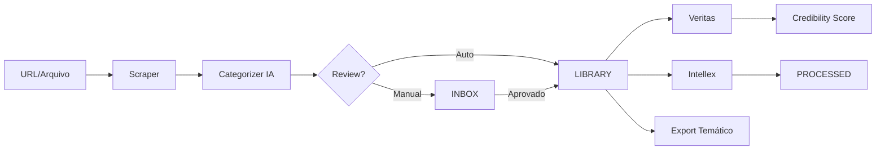

# 🗄️ Projeto Codex - Guia Completo

> **Repositório Inteligente de Conhecimento**  
> Capture, organize e processe todo o conhecimento que você encontra

---

## 📖 O Que é o Codex?

O **Projeto Codex** é um sistema centralizado de gestão de conhecimento que funciona como sua **segunda memória digital**. Ele permite capturar qualquer conteúdo da web (artigos, PDFs, vídeos), categorizá-lo automaticamente com IA, e integrá-lo com outros agentes do exímIA.OS para processamento profundo.

### 🎯 Conceito Central

**"Cola o link → Salva categorizado"**

O Codex elimina o caos de bookmarks, notas espalhadas e arquivos perdidos ao centralizar todo seu conhecimento em um único repositório estruturado com:

- ✅ **Scraper Automático** - Extrai conteúdo limpo de qualquer URL
- ✅ **Categorização IA** - Gemini analisa e sugere tags, autores, temas
- ✅ **Busca Inteligente** - Full-text search + filtros de metadata
- ✅ **Integrações Poderosas** - Veritas valida, Intellex processa profundamente
- ✅ **Export Temático** - Agrupa conhecimento por tema para estudo

---

## 🏗️ Arquitetura

### Estrutura de Diretórios

```
🗄️ Codex/
├── eximia_data/              # Armazenamento de dados
│   ├── 00_INBOX/            # 📥 Staging area (review manual)
│   │   └── pending_*.md     # Conteúdos aguardando aprovação
│   │
│   ├── 01_LIBRARY/          # 📚 Biblioteca organizada
│   │   ├── books/           # Livros (PDF, EPUB)
│   │   ├── articles/        # Artigos web
│   │   ├── research_papers/ # Papers científicos
│   │   ├── podcasts/        # Transcrições de podcasts
│   │   ├── videos/          # Transcrições de vídeos
│   │   └── web_pages/       # Páginas web gerais
│   │
│   ├── 02_PROCESSED/        # ⚙️ Outputs do Intellex
│   │   ├── summaries/       # Sumários LX
│   │   ├── frameworks/      # Frameworks extraídos
│   │   └── knowledge_bases/ # KBs gerados
│   │
│   ├── 03_EXPORTS/          # 📦 Pacotes temáticos
│   │   └── {tema}/          # Exportações por tema
│   │       ├── sources.md   # Lista de fontes
│   │       ├── content/     # Conteúdos agrupados
│   │       └── bibliography.md
│   │
│   └── vault.db             # 🗃️ SQLite database
│
└── scripts/                  # 🐍 Scripts Python
    ├── db_schema.sql        # Schema do banco
    ├── init_db.py           # Inicialização
    ├── database.py          # Operações CRUD
    ├── scraper.py           # Web scraping
    ├── categorizer.py       # Categorização IA
    └── vault_cli.py         # Interface CLI
```

### Database Schema (SQLite)

**Tabelas principais:**

1. **`contents`** - Metadata de todos os conteúdos
   - `id`, `title`, `type`, `source_url`, `author`, `date_added`
   - `status`, `credibility_score`, `file_path`, `notes`

2. **`tags`** - Sistema de tags (many-to-many)
   - `content_id`, `tag_name`, `confidence`

3. **`relationships`** - Conexões entre conteúdos
   - `source_id`, `target_id`, `relationship_type`

4. **`processing_history`** - Histórico de processamento
   - `content_id`, `agent`, `timestamp`, `output_path`

5. **`contents_fts`** - Full-text search (FTS5)
   - Índice para busca rápida em título + conteúdo

### Fluxo de Dados



---

## 🎮 Comandos Completos

### 📥 Ingestão de Conteúdo

#### `/codex-add <url>`
Adicionar conteúdo com review manual.

**O que faz:**
1. Scraper extrai o conteúdo da URL
2. Categorizer sugere metadata (tipo, tags, autor)
3. Salva no INBOX
4. Apresenta preview para aprovação

**Exemplo:**
```
/codex-add https://paulgraham.com/wealth.html
```

**Output:**
- ✅ Arquivo markdown limpo em `00_INBOX/`
- ✅ Preview com metadata sugerida
- ⏳ Aguardando sua aprovação

---

#### `/codex-add-auto <url>`
Adicionar conteúdo com aprovação automática.

**O que faz:**
1. Scraper + Categorizer
2. **Pula o INBOX** → direto para LIBRARY
3. Registra no database

**Quando usar:** URLs confiáveis (blogs que você já conhece, fontes primárias)

**Exemplo:**
```
/codex-add-auto https://a16z.com/ai-canon/
```

---

#### `/codex-upload <file>`
Upload de arquivo local (PDF, EPUB, TXT).

**O que faz:**
1. Copia arquivo para `00_INBOX/`
2. Extrai texto (se PDF/EPUB)
3. Categoriza
4. Aguarda review

---

#### `/codex-review`
Revisar conteúdos pendentes no INBOX.

**O que faz:**
1. Lista todos os arquivos em `00_INBOX/`
2. Para cada um:
   - Mostra preview + metadata
   - Opções: ✅ Aprovar | ✏️ Editar metadata | ❌ Rejeitar
3. Conteúdos aprovados → movidos para LIBRARY

---

### 🔍 Busca & Navegação

#### `/codex-list`
Listar todos os conteúdos da biblioteca.

**Output:**
```
ID          | Título                     | Tipo     | Autor         | Status  | Tags
------------|----------------------------|----------|---------------|---------|------------------
art_2026_001| How to Make Wealth         | article  | Paul Graham   | library | business, startups
book_2026_001| The Almanack of Naval...  | book     | Eric Jorgenson| library | philosophy, wealth
```

**Filtros opcionais:**
- `--type articles` - Apenas artigos
- `--author "Nome"` - Por autor
- `--status inbox` - Apenas pendentes

---

#### `/codex-search "query"`
Busca full-text no conteúdo.

**O que faz:**
- Busca usando SQLite FTS5 (extremamente rápido)
- Procura em: título, autor, tags, conteúdo completo
- Retorna matches ranqueados por relevância

**Exemplo:**
```
/codex-search "product market fit"
```

**Output:**
```
🔍 Encontrados 3 resultados:

1. [art_2026_003] "Guide to Product-Market Fit" - Marc Andreessen
   Match: "...achieving product-market fit is the #1 goal..."

2. [art_2026_007] "The Only Thing That Matters" - Marc Andreessen  
   Match: "...before product/market fit, nothing else matters..."

3. [book_2026_002] "The Lean Startup"
   Match: "...validate product-market fit through MVPs..."
```

---

#### `/codex-find --author "Nome"`
Buscar por metadata específica.

**Filtros disponíveis:**
- `--author "Nome"` - Por autor
- `--type articles` - Por tipo
- `--tag startup` - Por tag
- `--date-from 2026-01-01` - Data inicial
- `--credibility-min 7.0` - Score mínimo do Veritas

**Exemplo:**
```
/codex-find --author "Paul Graham" --type article
```

---

#### `/codex-related <content_id>`
Mostrar conteúdos relacionados.

**O que faz:**
1. Analisa tags em comum
2. Mostra relacionamentos manuais (`relationships` table)
3. Sugere conteúdos similares baseado em embeddings (futuro)

**Exemplo:**
```
/codex-related art_2026_001
```

**Output:**
```
📚 Relacionados com "How to Make Wealth":

Mesmo autor:
- art_2026_005: "What You Can't Say" - Paul Graham
- art_2026_012: "The 18 Mistakes That Kill Startups" - Paul Graham

Tags em comum (startups, business):
- art_2026_003: "Guide to PMF" - Marc Andreessen
- book_2026_001: "Zero to One" - Peter Thiel
```

---

### ⚙️ Processamento

#### `/codex-process <content_id>`
Processar conteúdo com Intellex.

**O que faz:**
1. Envia conteúdo para Intellex
2. Gera LX package completo:
   - Deep Summary
   - Knowledge Bases
   - Framework extraction
3. Salva em `02_PROCESSED/{content_id}/`
4. Atualiza `processing_history`

**Exemplo:**
```
/codex-process book_2026_001
```

**Output:**
```
⚙️ Processando "The Almanack of Naval Ravikant" com Intellex...

✅ Criado: 02_PROCESSED/book_2026_001/
   ├── LX_SUMMARY.md
   ├── KB_01_core_philosophy.md
   ├── KB_02_wealth_creation.md
   ├── KB_03_happiness.md
   └── FRAMEWORKS_EXTRACTED.md

🕐 Tempo: 3m 42s
```

---

#### `/codex-validate <content_id>`
Validar credibilidade com Veritas.

**O que faz:**
1. Envia fonte para The_Veritas
2. Recebe credibility score (0-10)
3. Atualiza campo `credibility_score` no database
4. Adiciona nota com justificativa

**Exemplo:**
```
/codex-validate art_2026_015
```

**Output:**
```
🔍 Validando credibilidade...

Fonte: "Study on AI Alignment" - blog.exemplo.com
Autor: Desconhecido

✅ Credibility Score: 4.2/10

Justificativa:
- ❌ Autor não identificado
- ⚠️ Blog sem reputação estabelecida
- ✅ Referências a papers legítimos
- ⚠️ Algumas claims não verificáveis

Recomendação: Usar apenas como ponto de partida, validar com fontes primárias.
```

---

#### `/codex-tag <content_id>`
Re-categorizar manualmente.

**O que faz:**
1. Mostra metadata atual
2. Permite editar: tipo, tags, autor, título
3. Opcionalmente, re-rodar categorizer IA
4. Atualiza database

---

### 🧠 Intelligence

#### `/codex-recommend "tema"`
Recomendações baseadas em gaps de conhecimento.

**O que faz:**
1. Analisa sua biblioteca atual sobre o tema
2. Identifica subtópicos faltando
3. Sugere leituras complementares (busca externa)

**Exemplo:**
```
/codex-recommend "AI Alignment"
```

**Output:**
```
📊 Análise da sua biblioteca sobre "AI Alignment":

✅ Você tem:
- 7 artigos sobre alignment problem
- 2 papers sobre RLHF
- 1 livro: "Superintelligence" (Bostrom)

⚠️ Gaps identificados:
- Nenhum conteúdo sobre: Constitutional AI
- Poucos materiais sobre: Interpretability
- Faltam perspectivas de: Eliezer Yudkowsky

💡 Recomendações:
1. "Constitutional AI: Harmlessness from AI Feedback" (Anthropic)
2. "Mechanistic Interpretability" (Neel Nanda)
3. "AGI Ruin: A List of Lethalities" (Eliezer Yudkowsky)
```

---

#### `/codex-export "tema"`
Exportar pacote temático.

**O que faz:**
1. Busca todos os conteúdos com tag relacionada ao tema
2. Cria pasta em `03_EXPORTS/{tema}/`
3. Copia arquivos relevantes
4. Gera `sources.md` com lista anotada
5. Cria `bibliography.md` formatada

**Exemplo:**
```
/codex-export "Startups"
```

**Output:**
```
📦 Criando pacote temático "Startups"...

✅ Encontrados 23 conteúdos relevantes:
   - 15 artigos
   - 5 livros
   - 3 research papers

✅ Exportado para: 03_EXPORTS/Startups/
   ├── sources.md (lista anotada com scores)
   ├── content/
   │   ├── articles/ (15 arquivos)
   │   ├── books/ (5 arquivos)
   │   └── papers/ (3 arquivos)
   └── bibliography.md (formatação acadêmica)

💾 Tamanho total: 47.3 MB
```

---

#### `/codex-stats`
Estatísticas e métricas do Codex.

**Output:**
```
📊 Estatísticas do Codex

📚 Biblioteca:
   Total: 147 itens
   ├── Artigos: 89
   ├── Livros: 23
   ├── Papers: 18
   ├── Podcasts: 12
   └── Vídeos: 5

📥 Inbox: 3 pendentes

📈 Crescimento:
   Esta semana: +12 itens
   Este mês: +47 itens

🏷️ Top Tags:
   1. AI/ML (34 itens)
   2. Startups (28 itens)
   3. Philosophy (19 itens)
   4. Business (17 itens)
   5. Psychology (14 itens)

✍️ Top Autores:
   1. Paul Graham (12 artigos)
   2. Tim Ferriss (8 podcasts)
   3. Naval Ravikant (7 itens)

⚙️ Processamento:
   Processados com Intellex: 34
   Validados com Veritas: 56
   
💾 Storage: 2.4 GB
```

---

### 📚 Documentação

#### `/codex-commands`
Ver lista completa de comandos.

**Output:** Exibe esta seção de comandos de forma resumida.

---

## 🎓 Casos de Uso

### Caso 1: Curadoria Diária de Artigos

**Situação:** Você lê 5-10 artigos por dia e quer salvá-los organizados.

**Workflow:**
```bash
# Manhã: salvando artigos rapidamente
/codex-add-auto https://paulgraham.com/do.html
/codex-add-auto https://waitbutwhy.com/2015/01/artificial-intelligence.html

# Tarde: review de conteúdos mais complexos
/codex-add https://arxiv.org/abs/2203.02155
# → Review metadata → Aprovar

# Fim do dia: ver estatísticas
/codex-stats
```

**Resultado:** Biblioteca organizada, buscável, sem esforço.

---

### Caso 2: Pesquisa Profunda sobre um Tema

**Situação:** Você está estudando "Product-Market Fit" e quer consolidar conhecimento.

**Workflow:**
```bash
# 1. Buscar o que você já tem
/codex-search "product market fit"

# 2. Adicionar novas fontes
/codex-add https://a16z.com/pmf-guide
/codex-add https://firstround.com/review/how-superhuman-built-an-engine-to-find-product-market-fit/

# 3. Validar credibilidade
/codex-validate art_2026_023

# 4. Processar com Intellex
/codex-process art_2026_023

# 5. Exportar pacote completo
/codex-export "Product-Market Fit"
```

**Resultado:** Pacote temático completo com fontes validadas, processadas e exportadas.

---

### Caso 3: Construindo Clone Digital

**Situação:** Você vai criar um clone de um autor e precisa alimentar a Clone Factory.

**Workflow:**
```bash
# 1. Adicionar todas as fontes primárias
/codex-add https://nav.al/podcast-1
/codex-add https://nav.al/podcast-2
# ... 20 podcasts

# 2. Adicionar fontes secundárias
/codex-add https://twitter.com/naval (via scraper)
/codex-add-auto https://nav.al/almanack

# 3. Processar em lote com Intellex
/codex-process book_2026_001
/codex-process pod_2026_001
# ...

# 4. Exportar para Clone Factory
/codex-export "Naval Ravikant - Sources"
# → Usar pasta exportada como input para Clone Factory
```

**Resultado:** Dataset completo, validado e pré-processado para alimentar o pipeline de clones.

---

## 🔗 Integrações

### The_Veritas (Validação de Credibilidade)

**O que faz:**
- Analisa a fonte (reputação do domínio, autor)
- Verifica claims factuais com busca grounded
- Atribui score de 0-10
- Justifica o score

**Como integrar:**
```bash
/codex-validate <content_id>
```

**Benefício:** Filtra fontes duvidosas antes de processar profundamente.

---

### Intellex (Processamento Profundo)

**O que faz:**
- Gera LX Multi-Pass summary
- Extrai Knowledge Bases estruturados
- Identifica frameworks e modelos mentais
- Cria bibliografia grounded

**Como integrar:**
```bash
/codex-process <content_id>
```

**Benefício:** Transforma conteúdo bruto em conhecimento estruturado e aplicável.

---

### Clone Factory (Fonte de Dados)

**O que faz:**
- Usa o Codex como repositório de fontes primárias/secundárias
- Exportações temáticas alimentam pipelines C1, C2, C3

**Como integrar:**
```bash
/codex-export "Autor Nome - Sources"
# → Copiar pasta para Clone_Factory/inputs/
```

**Benefício:** Dataset centralizado e pré-processado para criação de clones.

---

### The_Maestro (Workflows em Lote)

**O que faz:**
- Orquestra processamento em lote de múltiplos conteúdos
- Coordena Codex → Veritas → Intellex em pipeline automatizado

**Exemplo de tarefa:**
> "Processar todos os artigos de Paul Graham: validar com Veritas, processar com Intellex, exportar pacote."

**Benefício:** Automação de workflows complexos com múltiplos agentes.

---

## 🔮 Roadmap

### Em Desenvolvimento
- [ ] **Scraper Web** (`scraper.py`) - Finalizar extração de artigos
- [ ] **Categorizer IA** (`categorizer.py`) - Integração Gemini
- [ ] **CLI** (`vault_cli.py`) - Interface de linha de comando

### Próximos Passos
- [ ] **Busca Semântica** - Embeddings + vector search
- [ ] **Knowledge Graphs** - Visualização de conexões entre conteúdos
- [ ] **Migração Supabase** - Acesso multi-dispositivo (cloud)
- [ ] **Scraper de PDFs** - Extração automática de livros/papers
- [ ] **Transcrição A/V** - Podcasts e vídeos automaticamente transcritos
- [ ] **Reading List Intelligence** - IA sugere próximas leituras
- [ ] **Export Packages Pro** - Bibliografia formatada (APA, Chicago, etc.)

### Visão de Longo Prazo
- [ ] **Web App** - Interface visual para gestão do Codex
- [ ] **Mobile Companion** - Salvar conteúdos via mobile
- [ ] **API Pública** - Integração com ferramentas externas (Notion, Obsidian, etc.)
- [ ] **Collaborative Mode** - Compartilhar bibliotecas com equipe

---

## 🛠️ Requisitos Técnicos

### Software
- **Python** 3.8+
- **SQLite** (built-in no Python)

### Bibliotecas Python
```bash
pip install beautifulsoup4 requests markdownify trafilatura
```

### Inicialização
```bash
python "c:\Users\hugoc\OneDrive\Área de Trabalho\exímIA Ventures\eximIA.OS\🗄️ Codex\scripts\init_db.py"
```

---

## 📝 Notas Técnicas

### Por que SQLite?

✅ **Zero configuração** - Sem servidor, sem setup complexo  
✅ **Performance** - Milhares de documentos sem problemas  
✅ **Portabilidade** - 1 arquivo = backup completo  
✅ **Migração fácil** - Schema compatível com PostgreSQL/Supabase

### Migração Futura para Supabase

O código está preparado para migração:
- Schema SQL padrão (compatível PostgreSQL)
- Interface unificada em `database.py`
- Queries portáveis

**Quando migrar:** Quando precisar de:
- Acesso multi-dispositivo
- Colaboração em tempo real
- Backups automáticos na nuvem

---

## 💡 FAQs

**P: O Codex funciona offline?**  
R: Sim! SQLite é local. Apenas scraping e categorização IA exigem internet.

**P: Posso importar bookmarks do Chrome?**  
R: Em breve! Planejado para próxima versão.

**P: Como fazer backup?**  
R: Copie `eximia_data/vault.db` e a pasta `eximia_data/01_LIBRARY/`. É só isso.

**P: Suporta conteúdo em português?**  
R: Sim, totalmente! SQLite FTS5 suporta Unicode.

**P: Limite de armazenamento?**  
R: SQLite suporta até ~280 TB. Você está seguro! 😄

---

**Criado por:** exímIA.OS  
**Status:** MVP em desenvolvimento  
**Versão:** 1.0.0  
**Licença:** Uso interno exímIA Ventures

#galaxy-codex