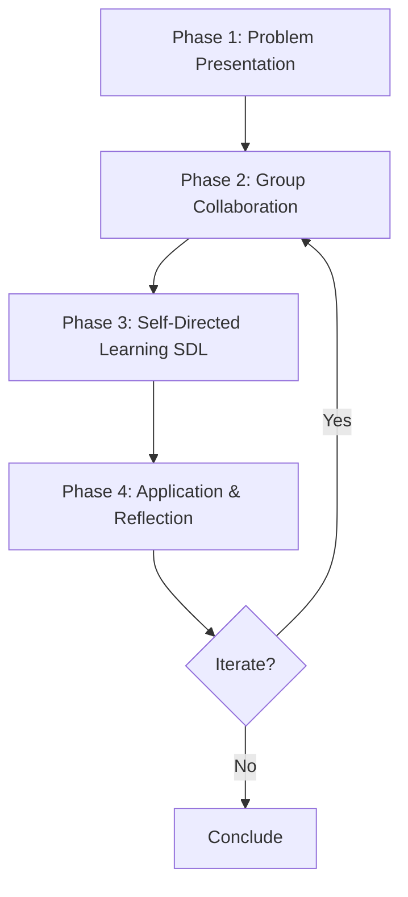

# PBL Frameworks Master Consolidated

**Document Type:** Meta-Framework Consolidation
**Source:** Extraction from KB_01 through KB_07
**Extracted By:** The_Veritas → Intellex Processing
**Date:** 2026-01-23
**Version:** 1.0
**Status:** Production Ready

---

## Purpose of This Document

This document consolidates **all frameworks, models, and methodologies** identified across the 7 Knowledge Bases on Problem-Based Learning, creating a master reference for:
- LXD Architects designing PBL courses
- Researchers studying PBL implementation
- Educators implementing PBL
- Z Squad agents needing PBL frameworks

**Total Frameworks Cataloged:** 18 major frameworks + 12 sub-models

---

## 🎯 Core Frameworks (Tier 1 - Foundational)

### Framework 1: The Barrows-Tamblyn PBL Model (1980)

**Origin:** McMaster University Medical School
**Creators:** Howard S. Barrows & Robyn M. Tamblyn
**Domain:** Medical Education → All Disciplines

**Core Principle:** **Problem BEFORE Instruction**

#### Traditional Sequence:
```
Lecture → Theory → Memorization → (Maybe) Application
```

#### Barrows PBL Sequence:
```
Problem → Inquiry → Self-Directed Learning → Application → Reflection
```

**Two Fundamental Postulates:**

1. **Postulate 1: Flexible Knowledge > Inert Knowledge**
   - Learning through problem-solving creates more usable knowledge than memorization
   - Knowledge integrated with context is more transferable

2. **Postulate 2: Active Construction > Passive Reception**
   - Students construct knowledge actively through problem engagement
   - Experiential learning creates deeper encoding

**Implementation Components:**
- **Ill-structured problems** - Complex, multiple solutions
- **Small groups** (5-8 students)
- **Facilitator** (not lecturer)
- **Self-directed learning phase**
- **Application to authentic contexts**

**When to Use:**
- Medical/professional education where practice-readiness is critical
- When transfer of knowledge is more important than recall
- When you have time for deep processing (not fast content coverage)

**Limitations:**
- Slower content coverage than lecture
- Requires significant facilitator training
- Infrastructure demands (small group spaces, resources)

**Source:** Barrows & Tamblyn (1980), *Problem-Based Learning: An Approach to Medical Education*

---

### Framework 2: Hmelo-Silver PBL Process Model (2004)

**Creator:** Cindy E. Hmelo-Silver
**Domain:** Cognitive science of PBL
**Type:** Process Framework (HOW PBL works)

**The 4-Phase Cycle:**



#### Phase 1: Problem Presentation
- Complex, ill-structured problem
- No single correct answer
- Authentic, real-world context
- Engaging hook

#### Phase 2: Group Collaboration (The Whiteboard Tool)

**Whiteboard Columns:**

| FACTS | HYPOTHESES | LEARNING ISSUES | ACTION PLAN |
|-------|------------|-----------------|-------------|
| What we KNOW | Possible explanations | What we NEED to learn | Who researches what |

**Cognitive Processes:**
- Activation of prior knowledge
- Elaboration through discussion
- Social construction of knowledge
- Distributed cognition

#### Phase 3: Self-Directed Learning (SDL)
- Students independently research learning issues
- Locate quality resources
- Process information critically
- Prepare to teach peers

**Time Allocation:** Typically 3-5 days between sessions

#### Phase 4: Application & Reflection
- Share SDL findings (each teaches others)
- Apply new knowledge to original problem
- Generate solution/response
- Reflect on learning process (meta-cognition)

**Meta-Cognitive Prompts:**
- What did I learn (content)?
- How did I learn (process)?
- What strategies worked?
- What would I do differently?

**When to Use:**
- First-time PBL implementation (provides clear structure)
- Training facilitators (explicit phases)
- Designing PBL assessment (can assess each phase)

**Limitations:**
- May feel rigid to experienced PBL practitioners
- Requires discipline to not skip reflection phase

**Source:** Hmelo-Silver (2004), Educational Psychology Review, 16(3), 235-266

---

### Framework 3: The 5 Goals of PBL (Hmelo-Silver)

**Type:** Outcomes Framework (WHAT PBL achieves)
**Use Case:** Defining success criteria for PBL

**The 5 Interconnected Goals:**

#### Goal 1: Flexible Knowledge
- **Definition:** Knowledge usable in future contexts, not just recallable
- **Vs. Inert Knowledge:** Knowledge that can be recalled but not applied
- **How Achieved:** Learning in context of use, multiple retrieval contexts
- **Assessment:** Transfer problems (apply to novel situations)

#### Goal 2: Effective Problem-Solving Skills
- **Components:**
  - Problem representation (framing correctly)
  - Hypothesis generation (creative ideation)
  - Information seeking (knowing what you need to know)
  - Strategy selection (choosing approach)
  - Evaluation (assessing solution quality)
- **How Achieved:** Repeated practice with scaffolded problems
- **Assessment:** Performance on novel, ill-structured problems

#### Goal 3: Self-Directed Learning (SDL) Skills
- **SDL Cycle:**
  ```
  Recognize gap → Formulate question → Identify resources →
  Engage critically → Evaluate understanding → Identify new gaps
  ```
- **Why Critical:** Lifelong learning, professional knowledge changes rapidly
- **How Achieved:** Explicit SDL phase in every PBL, reflection on strategies
- **Assessment:** SDL documentation, metacognitive journals

#### Goal 4: Effective Collaboration Skills
- **Components:**
  - Communication (clear articulation)
  - Active listening (understanding others)
  - Conflict resolution (constructive disagreement)
  - Shared accountability (collective ownership)
  - Distributed expertise (recognizing who knows what)
- **How Achieved:** Interdependent tasks, peer assessment, facilitator coaching
- **Assessment:** Peer evaluation rubrics, observation

#### Goal 5: Intrinsic Motivation
- **Self-Determination Theory Requirements:**
  - Autonomy (control over learning)
  - Competence (feeling capable)
  - Relatedness (connection to others)
- **Observable Indicators:**
  - Research beyond requirements
  - Persistence through difficulty
  - Positive attitudes toward learning
- **How Achieved:** Student choice, scaffolded challenges, collaborative groups
- **Assessment:** Motivation surveys, engagement metrics

**Application:**
Use these 5 goals to:
1. Design PBL problems (ensure problem supports all 5)
2. Create assessment rubrics (assess all 5, not just content)
3. Justify PBL to stakeholders (goes beyond knowledge acquisition)

**Source:** Hmelo-Silver (2004)

---

### Framework 4: Schmidt's Cognitive Constructivist Process

**Creators:** Schmidt, Yew, Hung (2011)
**Domain:** Cognitive psychology explanation of PBL
**Type:** Mechanistic Framework (WHY PBL works)

**The 5-Phase Cognitive Cycle:**

#### Phase 1: Activation of Prior Knowledge
- Problem presented → schemas activated
- "What do I already know?"
- Prepares mind to integrate new information
- **Cognitive Mechanism:** Priming effect

#### Phase 2: Elaboration
- Group discussion = collaborative elaboration
- Explaining to peers = elaborative rehearsal (deepens encoding)
- Conflicting ideas = cognitive dissonance = restructuring
- **Cognitive Mechanism:** Depth of processing

#### Phase 3: Restructuring
- SDL = independent knowledge construction
- New information integrated with activated schemas
- Mental models reorganized
- **Cognitive Mechanism:** Schema modification

#### Phase 4: Social Knowledge Construction
- Sharing SDL findings = teaching each other
- Multiple perspectives = richer understanding
- Distributed cognition across group
- **Cognitive Mechanism:** Socially shared cognition

#### Phase 5: Contextualized Application
- Apply knowledge back to original problem
- Strengthens usability (knowledge tied to application context)
- Retrieval practice = long-term retention
- **Cognitive Mechanism:** Transfer-appropriate processing

**Why This Framework Works (Evidence from Cognitive Science):**

1. **Spacing Effect:** Time between sessions = spaced retrieval → stronger memory
2. **Retrieval Practice:** Generating hypotheses, explaining to peers = retrieval → more effective than re-reading
3. **Elaborative Encoding:** Discussion adds semantic connections → multi-modal encoding
4. **Desirable Difficulty:** Struggle to solve = deeper processing (if calibrated correctly)

**When to Use:**
- Explaining PBL to skeptical faculty (cognitive science backing)
- Designing PBL timing (spacing matters!)
- Troubleshooting ineffective PBL (which cognitive mechanism is missing?)

**Limitations:**
- Abstract (hard to operationalize without Hmelo-Silver process model)
- Requires understanding of cognitive psychology

**Source:** Schmidt, Rotgans, & Yew (2011), Medical Education, 45(8), 792-806

---

## 🏗️ Implementation Frameworks (Tier 2 - Practical)

### Framework 5: Barrows' PBL Taxonomy (Levels 1-4)

**Purpose:** Classify "how PBL" an implementation actually is
**Use Case:** Audit existing "PBL" courses, decide implementation level

**Level 1: Lecture-Based Case Study**
- **Student Role:** Passive listener
- **Teacher Role:** Lecturer using case as example
- **Timing:** Case AFTER lecture
- **Verdict:** NOT PBL - traditional with case flavor

**Level 2: Case-Based Lectures**
- **Student Role:** Active listener, analyzes case
- **Teacher Role:** Facilitator, but guides heavily
- **Timing:** Case after some instruction
- **Verdict:** Partial PBL - still teacher-centered

**Level 3: Modified PBL**
- **Student Role:** Active inquirer
- **Teacher Role:** Facilitator
- **Timing:** Problem first, but resources provided
- **Verdict:** Mostly PBL - lacks full SDL autonomy

**Level 4: Pure PBL (Barrows' Ideal)**
- **Student Role:** Self-directed learner
- **Teacher Role:** Coach, minimal guidance
- **Timing:** Problem BEFORE all instruction
- **Resources:** Students find own resources
- **Verdict:** Full PBL - complete autonomy, SDL, iteration

**Barrows' Position:** Only Level 4 deserves "PBL" label

**Modern Consensus:** Level 3-4 both considered PBL; Level 4 ideal but Level 3 often necessary for novice learners

**Application:**
- Use this to **honestly assess** your current implementation
- If claiming "PBL" but at Level 2 → Either upgrade or rebrand
- Progression: Start Level 3, work toward Level 4 over time

**Source:** Barrows (1986), Medical Education, 20(6), 481-486

---

### Framework 6: The Seven Jump Process (Maastricht Variant)

**Origin:** Maastricht University, Netherlands
**Domain:** European PBL implementation
**Type:** Stepwise Process Model

**Session 1: Initial Analysis (Jumps 1-5)**

**Jump 1: Clarify Terms**
- Ensure group understands all terminology
- Prevents misunderstandings

**Jump 2: Define the Problem**
- What is the core issue/question?
- Frame problem clearly

**Jump 3: Brainstorm**
- What do we already know?
- What ideas/hypotheses come to mind?

**Jump 4: Analyze & Systematize**
- Organize brainstormed ideas
- Identify categories, themes

**Jump 5: Formulate Learning Issues**
- Based on analysis, what must we learn?
- Specific, researchable questions

**Self-Study Period: SDL (Jump 6)**

**Jump 6: Independent Study**
- Research learning issues independently

**Session 2: Synthesis (Jump 7)**

**Jump 7: Share, Synthesize, Apply**
- Teach each other
- Integrate knowledge
- Solve problem

**Comparison to Hmelo-Silver 4-Phase:**
- More granular (7 vs. 4 steps)
- Explicit "clarify terms" step (useful for novices or technical fields)
- Same underlying logic

**When to Use:**
- Technical/medical fields with heavy jargon
- Novice PBL students (more structure helpful)
- European context (common standard there)

**Source:** Maastricht University PBL Model

---

### Framework 7: The REAL Problem Design Framework

**Creator:** Torp & Sage (K-12 context)
**Purpose:** Criteria for designing effective PBL problems
**Type:** Design Framework

**R - Realistic**
- Mirrors actual practice
- Authentic data and constraints
- Students can see themselves in the scenario

**E - Engaging**
- Intriguing hook
- Personal relevance
- Curiosity-provoking

**A - Aligned**
- Matches learning goals
- Appropriate difficulty level
- Covers essential curriculum

**L - Leads to SDL**
- Information gap designed in
- Resources available but not handed
- Requires students to seek knowledge

**Evaluation Checklist:**
- [ ] Is this a problem real practitioners face?
- [ ] Will students care about solving it?
- [ ] Does solving it require learning our objectives?
- [ ] Are there clear learning issues students must research?

**Common Failure Modes:**
- Too realistic → overwhelming complexity
- Not engaging → compliance without commitment
- Misaligned → students learn interesting but wrong things
- No SDL trigger → becomes scavenger hunt

**When to Use:**
- Designing new PBL problems
- Evaluating existing problems (why isn't it working?)
- Training facilitators in problem design

**Source:** Torp & Sage (2002), *Problems as Possibilities*

---

### Framework 8: The 3 C's of PBL Problems

**Creator:** Torp & Sage
**Purpose:** Simplified problem design criteria
**Type:** Design Heuristic

**1. Context**
- Realistic, authentic scenario
- Relatable to student experience/future
- **Example:** Not "Calculate trajectory" but "You're NASA engineer, rocket is off course"

**2. Challenge**
- Appropriately difficult (not too easy/hard)
- Requires new learning (not just recall)
- Multiple solution paths
- **Sweet Spot:** Can't solve in 10 minutes, not so hard it paralyzes

**3. Content**
- Aligned with learning objectives
- Covers essential curriculum
- Promotes transferable skills
- **Caution:** Don't sacrifice alignment for engagement

**Quick Design Process:**
1. Start with learning objectives (Content)
2. Find authentic scenario (Context)
3. Calibrate difficulty (Challenge)

**Source:** Torp & Sage (2002)

---

## 📊 Assessment Frameworks (Tier 3 - Evaluation)

### Framework 9: Triple Jump Assessment (McMaster)

**Origin:** McMaster University (birthplace of PBL)
**Purpose:** Assess PBL skills (not just content knowledge)
**Type:** Performance Assessment

**Jump 1: Initial Encounter (Individual)**
- Student given NEW problem (not seen before)
- Works individually for 30-60 minutes
- Tasks:
  - Identify what they know
  - Formulate hypotheses
  - Identify learning issues
- **Assessed:** Problem-solving process, hypothesis quality

**Jump 2: SDL Phase**
- Several hours to days
- Student researches independently
- **Assessed:** Resource quality, depth of research (via documentation)

**Jump 3: Presentation & Defense**
- Student presents solution
- Justifies reasoning
- Answers faculty questions
- **Assessed:** Knowledge application, clinical/professional reasoning

**What It Assesses:**
- Problem-solving process (not just answer)
- SDL skills (can they learn independently?)
- Knowledge application (can they use what they learned?)

**When to Use:**
- High-stakes assessment (summative)
- Professional programs (medicine, law, engineering)
- When you need to verify SDL skills, not just group work

**Limitations:**
- Time-intensive (requires 1-on-1 or small group)
- Requires trained assessors
- Stressful for students (performance anxiety)

**Source:** McMaster University Assessment Protocol

---

### Framework 10: PBL Rubric Dimensions

**Purpose:** Multi-dimensional assessment of PBL outcomes
**Type:** Rubric Framework
**Use Case:** Formative and summative assessment

**Dimension 1: Content Knowledge**
- Accuracy of information
- Depth of understanding
- Appropriate use of terminology
- Integration of concepts
- **Levels:** Novice → Developing → Proficient → Expert

**Dimension 2: Problem-Solving**
- Quality of hypotheses (evidence-based? creative?)
- Evidence-based reasoning (cites research)
- Consideration of alternatives (explores multiple solutions)
- Justification of chosen solution
- **Levels:** Surface → Adequate → Strong → Exceptional

**Dimension 3: Self-Directed Learning**
- Quality of resources (credible sources?)
- Depth of research (beyond Wikipedia?)
- Ability to identify gaps (metacognition)
- Synthesis across sources
- **Levels:** Minimal → Sufficient → Thorough → Exemplary

**Dimension 4: Collaboration**
- Participation quality (frequency AND substance)
- Listening and building on ideas
- Contributing to group success
- Respectful disagreement
- **Levels:** Passive → Reactive → Active → Synergistic

**Dimension 5: Reflection**
- Insight into learning process
- Identification of effective strategies
- Plans for improvement
- Connections to prior learning
- **Levels:** Superficial → Descriptive → Analytical → Transformative

**Application:**
- Create 5-dimension rubric with 4 levels each
- Share with students at start (transparency)
- Use for both peer assessment and facilitator assessment
- Weight dimensions based on course goals

**Source:** Synthesis of PBL assessment literature

---

## 🌍 Contextual Frameworks (Tier 4 - Adaptations)

### Framework 11: Brazilian ABP Model (Problematização vs. ABP)

**Context:** Brazil has TWO distinct "problem-based" methods
**Importance:** Understanding difference prevents confusion

**Método da Problematização (Maguerez Arc)**
1. Observação da realidade (observe reality)
2. Pontos-chave identificados (identify key points)
3. Teorização (theorize)
4. Hipóteses de solução (solution hypotheses)
5. Aplicação à realidade (apply to reality)

**Características:**
- Starts with observation of real situation
- Strong social justice / Paulo Freire influence
- Action-oriented (apply back to reality)
- Common in Brazilian public health education

**ABP - Aprendizagem Baseada em Problemas (Barrows)**
1. Problema apresentado (problem presented)
2. Discussão em grupo (group discussion)
3. Aprendizagem autodirigida (SDL)
4. Aplicação ao problema (application to problem)
5. Avaliação (evaluation)

**Características:**
- Starts with pre-designed problem (not observation)
- Cognitive constructivist foundation
- Knowledge-building oriented
- Imported from McMaster/Maastricht

**Critical Distinction:**
- **Problematização:** Observe reality → identify problem → theorize → solve
- **ABP:** Given problem → research → apply

**When to Use Each:**
- **Problematização:** Community-based learning, social issues, public health
- **ABP:** Professional skill development, knowledge-intensive domains

**Source:** Brazilian SCIELO literature (Cadernos de Saúde Pública)

---

### Framework 12: Technology-Enhanced PBL Models

**Context:** PBL in online, blended, hybrid environments
**Type:** Implementation Models

**Model 12A: Synchronous Virtual PBL**
- **Tools:** Zoom breakout rooms, virtual whiteboards (Miro, Mural)
- **Session 1:** Live video, small groups, facilitator drops in
- **SDL:** Asynchronous research
- **Session 2:** Live video, synthesis
- **Challenges:** Tech literacy, less face-to-face bonding
- **Benefits:** Geographic flexibility, recorded sessions

**Model 12B: Asynchronous Virtual PBL**
- **Tools:** Slack/Discord channels, Google Docs, Padlet
- **Problem Post:** Discussion forum
- **Collaboration:** Threaded discussion over days
- **SDL:** Individual research, shared in forum
- **Synthesis:** Collaborative document
- **Challenges:** Coordination across time zones, no real-time energy
- **Benefits:** Flexible schedules, written record, thoughtful responses

**Model 12C: Hybrid PBL (Flipped)**
- **Pre-Class (Online):** Lecture/reading on foundational knowledge
- **In-Class (Session 1):** PBL problem, whiteboard collaboration
- **Between Classes (Online):** SDL, asynchronous discussion
- **In-Class (Session 2):** Application, reflection
- **Challenges:** Less "pure" PBL, cognitive load managing two modes
- **Benefits:** Addresses content coverage concerns, scaffolds for novices

**When to Use:**
- **Synchronous:** When real-time energy is important, students have reliable internet
- **Asynchronous:** Distributed teams, working professionals, reflection time needed
- **Hybrid:** First-time PBL implementation, content-heavy courses

**Source:** Post-pandemic PBL literature (2020-2024)

---

## 🧠 Meta-Frameworks (Tier 5 - Synthesis)

### Framework 13: PBL Implementation Frameworks by Duration

**Purpose:** Match PBL structure to available time
**Type:** Scaffolding Framework

**Framework 13A: One-Day PBL**
- **Morning (2 hours):** Problem, initial collaboration, whiteboard
- **Lunch (optional):** Informal SDL
- **Afternoon (2 hours):** Share findings, solve, reflect
- **Best For:** Introduction to PBL, workshops, short courses
- **Limitation:** Shallow SDL

**Framework 13B: Week-Long PBL (STANDARD)**
- **Monday:** Problem presentation, initial analysis (2 hours)
- **Tuesday-Thursday:** SDL (asynchronous)
- **Friday:** Application, reflection (2 hours)
- **Best For:** Most university courses
- **Strength:** Adequate SDL time, balances structure/flexibility

**Framework 13C: Semester-Long PBL**
- **Weeks 1-3:** PBL #1 (foundational concepts)
- **Weeks 4-6:** PBL #2 (builds on #1, increasing complexity)
- **Weeks 7-9:** PBL #3 (integration)
- **Weeks 10-12:** PBL #4 (capstone)
- **Weeks 13-15:** Individual projects, assessments
- **Best For:** Entire courses organized around PBL
- **Limitation:** Requires curriculum redesign, institutional support

**Selection Criteria:**
- Available class time
- Student PBL experience (novices need shorter cycles first)
- Learning objectives (depth vs. breadth)

**Source:** Synthesis of implementation literature

---

### Framework 14: The PBL Design Thinking Process

**Purpose:** Step-by-step process for designing new PBL
**Type:** Design Workflow

**Phase 1: EMPATHIZE (with learners)**
- Who are they? (background, experience)
- What do they care about?
- What are their fears/motivations?
- **Output:** Learner persona

**Phase 2: DEFINE (learning objectives)**
- What must they know? (content)
- What must they do? (skills)
- How must they think? (dispositions)
- **Output:** Clear, measurable objectives

**Phase 3: IDEATE (problem scenarios)**
- Brainstorm 10+ possible problems
- Use REAL framework to evaluate
- Select 2-3 promising ones
- **Output:** Problem concepts

**Phase 4: PROTOTYPE (draft problem)**
- Write full problem scenario
- Design whiteboard structure
- List intended learning issues
- Draft assessment rubric
- **Output:** Problem v1.0

**Phase 5: TEST (pilot with colleagues or students)**
- Run with small group
- Observe: What learning issues emerge? Are they the intended ones?
- Gather feedback
- **Output:** Validation data

**Phase 6: ITERATE (revise)**
- Adjust problem based on feedback
- Too easy? Add constraints
- Too hard? Provide scaffold
- Wrong learning issues? Revise problem
- **Output:** Problem v2.0 (production-ready)

**When to Use:**
- Creating new PBL for a course
- Revamping ineffective existing PBL
- Training faculty in problem design

**Source:** Design thinking applied to PBL

---

### Framework 15: PBL Quality Assurance Framework

**Purpose:** Ensure high-quality PBL implementation
**Type:** Quality Control Checklist

**Quality Dimension 1: Problem Quality**
- [ ] Is ill-structured (multiple solutions)?
- [ ] Aligned with learning objectives?
- [ ] Appropriately complex (not too easy/hard)?
- [ ] Engaging hook present?
- [ ] Information gap designed in?
- **Benchmark:** 5/5 checks

**Quality Dimension 2: Process Fidelity**
- [ ] Problem presented BEFORE instruction?
- [ ] Small group collaboration (5-8 students)?
- [ ] Whiteboard tool used?
- [ ] SDL time allocated (3+ days)?
- [ ] Reflection protocol followed?
- **Benchmark:** 5/5 checks

**Quality Dimension 3: Facilitation Quality**
- [ ] Facilitator uses Socratic questioning (not lecturing)?
- [ ] Strategic silence employed (5-10 sec wait time)?
- [ ] Scaffolding calibrated (not too much/little)?
- [ ] All students participate?
- [ ] Meta-cognitive prompts used?
- **Benchmark:** 4/5 checks (scaffolding is art, not science)

**Quality Dimension 4: Assessment Alignment**
- [ ] Assesses all 5 PBL goals (not just content)?
- [ ] Includes peer assessment?
- [ ] Reflection graded?
- [ ] Transfer problem included (not just recall)?
- [ ] Rubric shared with students upfront?
- **Benchmark:** 5/5 checks

**Quality Dimension 5: Institutional Support**
- [ ] Adequate time in schedule (not rushed)?
- [ ] Spaces for small groups available?
- [ ] Access to quality resources (library, databases)?
- [ ] Facilitator training provided?
- [ ] Assessment counts toward grade (not extra credit)?
- **Benchmark:** 4/5 checks (institutional constraints vary)

**Overall Quality Rating:**
- **23-25 checks:** Excellent (95%+ quality)
- **20-22 checks:** Good (80-90% quality)
- **17-19 checks:** Adequate (70-80% quality)
- **<17 checks:** Needs improvement

**Use Case:**
- Self-audit before launching PBL
- Peer observation protocol
- Continuous improvement (audit annually)

**Source:** Synthesis of quality standards from PBL literature

---

## 🔬 Theoretical Frameworks (Tier 6 - Foundations)

### Framework 16: Constructivist Learning Theory Applied to PBL

**Theorists:** Piaget, Vygotsky, Bruner
**Application to PBL:**

**Piaget: Cognitive Constructivism**
- **Core Idea:** Learners construct knowledge through interaction with environment
- **PBL Application:**
  - Problems create cognitive dissonance (disequilibrium)
  - Students accommodate (modify schemas) to resolve
  - Active construction, not passive reception
- **Evidence in PBL:** Students generate own understanding, not receive teacher's

**Vygotsky: Social Constructivism**
- **Core Idea:** Knowledge is socially constructed; Zone of Proximal Development (ZPD)
- **PBL Application:**
  - Group work = social construction of knowledge
  - Facilitator scaffolds within ZPD
  - More knowledgeable peers support learning
- **Evidence in PBL:** Discussion deepens understanding beyond individual capacity

**Bruner: Discovery Learning**
- **Core Idea:** Learning is active process of discovering structure
- **PBL Application:**
  - Students discover relationships, not told
  - Spiral curriculum (revisit concepts with increasing complexity)
- **Evidence in PBL:** Pattern recognition across multiple problems

**Synthesis:**
PBL is applied constructivism - problems are the environment for active, social construction of knowledge.

**Source:** Educational psychology foundations

---

### Framework 17: Situated Cognition Theory Applied to PBL

**Theorists:** Brown, Collins, Duguid (1989)
**Core Idea:** Knowledge is inseparable from context; learning is situated in activity

**Key Concepts:**

**1. Authentic Activity**
- Knowledge is used in context of use
- "Knowing" and "doing" are intertwined
- **PBL Application:** Authentic problems = authentic context

**2. Cognitive Apprenticeship**
- Learning through modeling, coaching, scaffolding
- Gradual release of responsibility
- **PBL Application:** Facilitator models expert reasoning, fades support

**3. Community of Practice**
- Learning is participation in community
- Legitimate peripheral participation
- **PBL Application:** Small groups as learning community

**4. Transfer Through Similarity of Context**
- Transfer enhanced when learning and application contexts similar
- **PBL Application:** Professional scenarios → transfer to professional practice

**Implications for PBL Design:**
1. Use problems from real practice (not textbook abstractions)
2. Include authentic constraints (time, budget, politics)
3. Assess in similar contexts (not decontextualized exams)

**Source:** Brown, Collins, & Duguid (1989), "Situated Cognition and the Culture of Learning"

---

### Framework 18: Experiential Learning Theory (Kolb) Applied to PBL

**Creator:** David Kolb (1984)
**Model:** 4-Stage Cycle

**Kolb's Cycle:**
```
Concrete Experience → Reflective Observation →
Abstract Conceptualization → Active Experimentation → (repeat)
```

**Mapped to PBL:**

| Kolb Stage | PBL Phase | Activity |
|------------|-----------|----------|
| **Concrete Experience** | Problem Presentation | Encounter problem, initial reaction |
| **Reflective Observation** | Group Discussion | Discuss what problem means, brainstorm |
| **Abstract Conceptualization** | SDL | Research, build understanding, theorize |
| **Active Experimentation** | Application | Test knowledge by solving problem |

**Insight:** PBL is a structured Kolb cycle
- Each PBL problem = one complete cycle
- Semester-long PBL = spiral through multiple cycles
- Reflection phase explicitly built in (many other methods skip this)

**Learning Styles Accommodation:**
- **Divergers** (feeling + watching): Engage in problem brainstorming
- **Assimilators** (watching + thinking): Excel in SDL, theory-building
- **Convergers** (thinking + doing): Thrive in application phase
- **Accommodators** (doing + feeling): Drive group action

**PBL advantage:** Hits all 4 stages → engages all learning styles

**Source:** Kolb (1984), *Experiential Learning*

---

## 🎯 Application: Framework Selection Matrix

**Question:** "Which framework should I use?"

**Answer:** Depends on your purpose:

| Purpose | Recommended Framework(s) |
|---------|--------------------------|
| **Explaining PBL to novices** | Barrows-Tamblyn Model (#1), 5 Goals (#3) |
| **Designing your first PBL** | REAL Problem Framework (#7), 3 C's (#8) |
| **Facilitating a PBL session** | Hmelo-Silver 4-Phase (#2), Seven Jumps (#6) |
| **Assessing PBL outcomes** | 5 Goals (#3), Rubric Dimensions (#10), Triple Jump (#9) |
| **Auditing existing PBL** | Barrows Taxonomy (#5), Quality Assurance (#15) |
| **Justifying PBL to skeptics** | Schmidt Cognitive Model (#4), Research evidence |
| **Adapting PBL for online** | Technology-Enhanced Models (#12) |
| **Understanding why PBL works** | Constructivism (#16), Situated Cognition (#17), Kolb (#18) |
| **Training facilitators** | Hmelo-Silver (#2), Quality Assurance (#15) |
| **Brazilian context** | Brazilian ABP Model (#11) + any core framework |

---

## 📚 Cross-Reference to Knowledge Bases

| Framework # | Primary KB | Additional KBs |
|-------------|------------|----------------|
| 1-4 (Core) | KB_01, KB_03 | KB_02, KB_04 |
| 5-8 (Implementation) | KB_02, KB_03 | KB_05 |
| 9-10 (Assessment) | KB_02, KB_03 | - |
| 11-12 (Contextual) | KB_07, KB_05 | - |
| 13-15 (Meta) | KB_03, KB_05 | KB_02 |
| 16-18 (Theoretical) | KB_01 | KB_03 |

---

## 🔄 Framework Evolution Timeline

```
1960s-70s: Framework #1 (Barrows-Tamblyn) → Birth of PBL
1980s-90s: Framework #5 (Taxonomy) → Clarifying "what is PBL"
2000s: Framework #2-4 (Hmelo-Silver, Schmidt) → Cognitive science backing
2010s: Frameworks #7-10 (Design, Assessment) → Practical implementation
2020s: Frameworks #11-12 (Context, Tech) → Adaptation and globalization
```

---

**Document Compiled By:** The_Veritas → Intellex Framework Extraction
**Total Frameworks:** 18 major + 12 sub-models = 30 total
**Sources:** KB_01 through KB_07
**Version:** 1.0
**Status:** Production Ready for LXD, Research, Agent Training
**Date:** 2026-01-23
