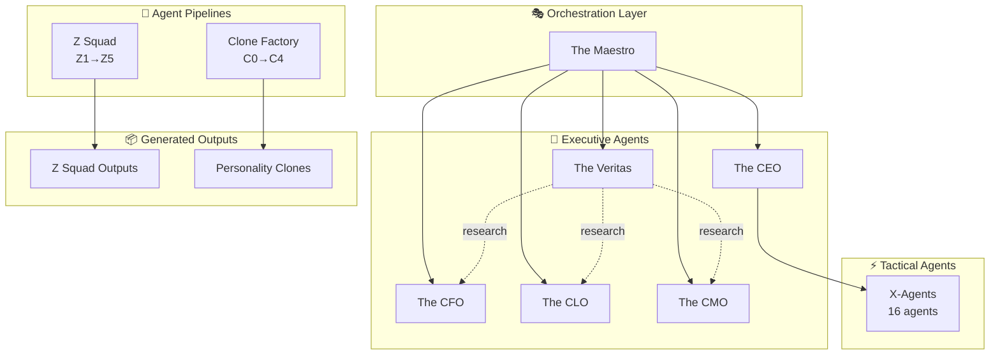

<!-- OPENSPEC:START -->
# OpenSpec Instructions

These instructions are for AI assistants working in this project.

Always open `@/openspec/AGENTS.md` when the request:
- Mentions planning or proposals (words like proposal, spec, change, plan)
- Introduces new capabilities, breaking changes, architecture shifts, or big performance/security work
- Sounds ambiguous and you need the authoritative spec before coding

Use `@/openspec/AGENTS.md` to learn:
- How to create and apply change proposals
- Spec format and conventions
- Project structure and guidelines

Keep this managed block so 'openspec update' can refresh the instructions.

<!-- OPENSPEC:END -->

---

# ExímIA.OS — Ecossistema de Agentes

Central de documentação e governança do Multi-Agent System.

## 📊 Visão Geral



## 📁 Registries e Configuração

| Arquivo | Propósito |
|:---|:---|
| [`agent_registry.yaml`](file:///agent_registry.yaml) | **Registry central de todos os agentes** |
| [`.metrics/`](file:///.metrics/) | Métricas, benchmarks e KPIs |
| [`.agent/templates/`](file:///.agent/templates/) | Templates (CHANGELOG, etc.) |

## 🎭 The Maestro — Supreme Orchestrator

O Maestro é o cérebro central que coordena todos os agentes.

**Arquivos chave:**
| Arquivo | Função |
|:---|:---|
| [`routing_rules.yaml`](file:///The_Maestro/routing_rules.yaml) | Regras de quando acionar cada agente |
| [`agent_health.md`](file:///The_Maestro/agent_health.md) | Status operacional dos agentes |
| [`fallback_chains.yaml`](file:///The_Maestro/fallback_chains.yaml) | Recovery chains em caso de falha |

**Protocolos:**
- **Veritas First**: Toda informação factual passa por The_Veritas primeiro
- **Conflict Resolution**: Legal > Finance > Tech > Marketing

## 👔 Executive Agents

| Agent | Domínio | Tier | Status |
|:---|:---|:---:|:---:|
| [The_CEO](file:///The_CEO/) | Executive Management | 2 | 🟢 |
| [The_CFO](file:///The_CFO/) | Corporate Finance | 3 | 🟢 |
| [The_CLO](file:///The_CLO/) | Legal & Compliance | 3 | 🟢 |
| [The_CMO](file:///The_CMO/) | Marketing & Growth | 3 | 🟢 |
| [The_Veritas](file:///The_Veritas/) | Research Engine | 3 | 🟢 |

## ⚡ X-Agents (Tactical)

16 agentes organizados em 4 squads:

| Squad | Agentes |
|:---|:---|
| **Decision** | X01-Decision Killer, X02-TradeOff, X03-Second Order |
| **Execution** | X04-Time Compression, X06-SOP Builder |
| **Knowledge** | X07-Concept Translator, X08-Mental Models, X09-Learning Loop |
| **Business** | X10-ICP Sniper, X11-Narrative, X12-Negotiation |

## 🔧 Pipelines

### Z Squad — Agent Creation
```
Z1 Architect → Z2 Profiler → Z3 Engineer → Z4 Auditor → Z5 Evolver
```

### Clone Factory — Personality Cloning
```
C0 Validator → C1 Hunter → C2 Extractor → C3 Creator → C4 Auditor
```

## 📦 Outputs Validados

| Output | Score | Tier |
|:---|:---:|:---:|
| CFO Agent | 9.6 | 2 |
| LXD Architect | 9.2 | 3 |
| David Goggins v4.1 | 9.4 | Clone |

## 🚨 Deprecated

| Agent | Data | Razão |
|:---|:---|:---|
| The_Cloner | 2026-01-08 | Migrado para Clone_Factory |

## 📚 Documentação Adicional

- [openspec/project.md](file:///openspec/project.md) — Contexto do projeto
- [BENCHMARK_CFO_COMPARATIVE.md](file:///BENCHMARK_CFO_COMPARATIVE.md) — Benchmark CFO
- [.metrics/agent_dashboard.md](file:///.metrics/agent_dashboard.md) — KPIs