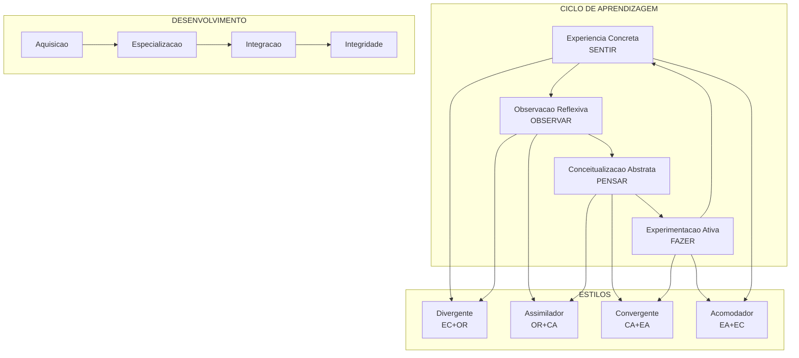

# Experiential Learning: Experience as the Source of Learning and Development
## Deep Synthesis (L4)

*por David A. Kolb | Segunda Edicao, 2015*

---

> **Nota:** Este resumo foi produzido pelo modulo **A Refinaria Book_Processor** com processamento de nivel LX (Author Intelligence Package).

---

## Visao Geral

"Experiential Learning: Experience as the Source of Learning and Development" e a obra seminal de David A. Kolb que estabeleceu as bases teoricas para o campo da aprendizagem experiencial. Publicado originalmente em 1984 e revisado em 2015, o livro representa 50 anos de pesquisa academica dedicada a compreender como seres humanos aprendem atraves da experiencia.

Kolb nao criou a teoria da aprendizagem experiencial do zero — ele a descobriu sintetizando as obras de pensadores seminais do seculo XX que colocaram a experiencia no centro de suas teorias de aprendizagem e desenvolvimento humano: John Dewey, Kurt Lewin, Jean Piaget, Lev Vygotsky, William James, Carl Jung, Paulo Freire, Carl Rogers e Mary Parker Follett.

O livro se destaca por oferecer nao apenas uma teoria abstrata, mas um **framework aplicavel** que conecta educacao, trabalho e desenvolvimento pessoal em um modelo coerente e empiricamente testavel.

---

## O Problema que o Livro Resolve

A sociedade moderna enfrenta um dilema educacional fundamental:

1. **Behaviorismo dominante** — Durante a primeira metade do seculo XX, a psicologia reduziu a experiencia objetiva a reforcos, negando qualquer papel para a experiencia subjetiva consciente na aprendizagem.

2. **Fragmentacao teoria-pratica** — O sistema educacional tradicional separou artificialmente o conhecimento academico da aplicacao pratica, criando graduados "despreparados" para a realidade do trabalho.

3. **Obsolescencia do modelo "front-loaded"** — A estrategia de "carregar" toda a educacao no inicio da vida se tornou obsoleta em um mundo de mudancas exponenciais onde a aprendizagem ao longo da vida e essencial.

4. **Vieses da experiencia** — Aprender diretamente da experiencia e arriscado — os vieses cognitivos (heuristica da disponibilidade, correlacoes enganosas, supersticoes) frequentemente levam a conclusoes incorretas.

Kolb resolve esses problemas oferecendo uma **teoria integrativa** que explica como a experiencia e transformada em conhecimento confiavel atraves de um processo ciclico deliberado.

---

## Tese Central

> **"A aprendizagem e o processo pelo qual o conhecimento e criado atraves da transformacao da experiencia."**

A tese de Kolb se desdobra em proposicoes interconectadas:

1. **Aprendizagem e processo, nao resultado** — Nao se trata de acumular conteudos fixos, mas de um ciclo continuo de transformacao.

2. **Experiencia e materia-prima** — Toda aprendizagem comeca e termina na experiencia, mas a experiencia bruta deve ser processada.

3. **Transformacao requer multiplos modos** — A experiencia deve ser "apreendida" (grasped) e "transformada" atraves de reflexao e acao.

4. **Individuos tem estilos diferentes** — Pessoas preferem diferentes combinacoes dos modos de aprendizagem, resultando em estilos distintos.

5. **Desenvolvimento e especializacao seguida de integracao** — O crescimento passa por fases de especializar-se em um estilo e depois integrar os demais.

---

## PARTE I: EXPERIENCIA E APRENDIZAGEM

### Framework 1: Os Fundamentos da Aprendizagem Experiencial — A Trindade Fundacional

Kolb identifica tres pensadores como pilares fundamentais:

| Pensador | Contribuicao Principal | Dominio |
|----------|----------------------|---------|
| **John Dewey** | Filosofia pragmatista da educacao | Educacao Superior |
| **Kurt Lewin** | Metodo de laboratorio e pesquisa-acao | Desenvolvimento Organizacional |
| **Jean Piaget** | Desenvolvimento cognitivo | Psicologia do Desenvolvimento |

#### John Dewey e a Educacao Progressista

Dewey articulou os principios guia para programas de aprendizagem experiencial:
- **Expressao vs. imposicao** — Cultivar a individualidade em vez de impor conteudo
- **Atividade livre vs. disciplina externa** — Aprendizagem autodirecionada
- **Aprendizagem pela experiencia vs. textos/professores** — Contato direto com a realidade
- **Habilidades como meios vs. fins** — Aquisicao com proposito, nao drill mecanico
- **Presente vs. futuro remoto** — Aproveitar oportunidades da vida atual
- **Mundo em mudanca vs. objetivos estaticos** — Adaptabilidade continua

> **"Ha uma relacao intima e necessaria entre os processos da experiencia real e a educacao."** — Dewey, 1938

#### Kurt Lewin e o Metodo de Laboratorio

Lewin criou o T-Group (Training Group) no National Training Laboratory em Bethel, Maine, onde Kolb teve sua experiencia transformadora em 1966:

- **Ciclo de aprendizagem baseado em experiencias compartilhadas**
- **Reflexao sobre significados**
- **Conceitualizacao de implicacoes**
- **Acao para criar o que se deseja**

> **"Nao ha nada tao pratico quanto uma boa teoria."** — Kurt Lewin

#### Jean Piaget e o Desenvolvimento Cognitivo

Piaget contribuiu com a compreensao de como as estruturas cognitivas se desenvolvem:
- **Assimilacao** — Integrar novas experiencias em esquemas existentes
- **Acomodacao** — Modificar esquemas para incorporar novas experiencias
- **Equilibracao** — Movimento dinamico entre os dois processos

---

### Framework 2: O Ciclo de Aprendizagem Experiencial (ELC)

O modelo central de Kolb consiste em um ciclo de quatro estagios:

```
                    EXPERIENCIA CONCRETA (EC)
                         Sentir/Experienciar
                              |
                              v
    EXPERIMENTACAO      <----[CICLO]---->     OBSERVACAO
       ATIVA (EA)                           REFLEXIVA (OR)
    Fazer/Agir                              Observar/Refletir
                              ^
                              |
                    CONCEITUALIZACAO ABSTRATA (CA)
                         Pensar/Analisar
```

#### Os Quatro Modos de Aprendizagem

| Modo | Foco | Processo | Questao |
|------|------|----------|---------|
| **Experiencia Concreta (EC)** | Sentir | Envolvimento pessoal | "O que estou experienciando?" |
| **Observacao Reflexiva (OR)** | Observar | Reflexao cuidadosa | "O que isso significa?" |
| **Conceitualizacao Abstrata (CA)** | Pensar | Criacao de teorias | "Como isso funciona?" |
| **Experimentacao Ativa (EA)** | Fazer | Teste de hipoteses | "O que acontece se eu fizer...?" |

#### A Espiral de Aprendizagem

O ciclo nao e fechado — e uma **espiral ascendente** onde cada volta aprofunda e expande a compreensao:

> **"Aprendemos ao longo da vida, e cada ciclo atraves da espiral aprofunda e expande nossas visoes sobre aprendizagem e desenvolvimento."**

---

### Framework 3: As Duas Dimensoes Estruturais

Kolb identifica duas dimensoes fundamentais no processo de aprendizagem:

#### Dimensao de Preensao (Grasping)

**Como apreendemos a experiencia?**

| Polo | Descricao | Metodo |
|------|-----------|--------|
| **Apreensao** | Experiencia imediata, concreta, tangivel | Sentidos, intuicao |
| **Compreensao** | Representacao simbolica, conceitual, abstrata | Pensamento, linguagem |

#### Dimensao de Transformacao

**Como transformamos a experiencia apreendida?**

| Polo | Descricao | Processo |
|------|-----------|----------|
| **Intencao** | Reflexao interna, contemplacao | Observacao reflexiva |
| **Extensao** | Acao externa, manipulacao ativa | Experimentacao ativa |

Esta estrutura bidimensional gera um espaco quadrante onde os quatro modos de aprendizagem se posicionam.

---

## PARTE II: A ESTRUTURA DA APRENDIZAGEM E DO CONHECIMENTO

### Framework 4: Estilos de Aprendizagem — O Kolb Learning Style Inventory (LSI)

A partir das duas dimensoes, Kolb deriva quatro estilos de aprendizagem:

| Estilo | Combina | Caracteristicas | Profissoes Tipicas |
|--------|---------|-----------------|-------------------|
| **Divergente** | EC + OR | Imaginativo, emocional, artístico | Artes, humanidades, aconselhamento |
| **Assimilador** | OR + CA | Logico, preciso, teorico | Ciencias, planejamento, pesquisa |
| **Convergente** | CA + EA | Pratico, tecnico, orientado a solucoes | Engenharia, tecnologia, medicina |
| **Acomodador** | EA + EC | Adaptavel, intuitivo, orientado a acao | Vendas, marketing, empreendedorismo |

#### LSI 4.0: Nove Estilos de Aprendizagem

Na versao mais recente do inventario (LSI 4.0), Kolb expandiu para nove estilos, adicionando posicoes intermediarias:

```
           Norte (EC)
              |
    Experienciando
              |
   Imaginando-|-Iniciando
              |
Oeste (OR)----+----Leste (EA)
              |
   Analisando-|-Equilibrando-|-Atuando
              |
   Pensando-|-Decidindo
              |
           Sul (CA)
```

O estilo **Equilibrando** no centro representa alta flexibilidade de aprendizagem — a capacidade de usar todos os modos conforme a situacao demanda.

---

### Framework 5: Estruturas de Conhecimento Social — As Quatro Hipoteses Mundiais

Baseando-se na obra de Stephen Pepper, Kolb relaciona estilos de aprendizagem com diferentes estruturas de conhecimento:

| Hipotese | Metafora Raiz | Disciplinas | Estilo Relacionado |
|----------|--------------|-------------|-------------------|
| **Formismo** | Similaridade | Classificacao, taxonomia | Divergente |
| **Contextualismo** | Evento historico | Historia, antropologia | Divergente-Acomodador |
| **Mecanicismo** | Maquina | Fisica, engenharia | Convergente-Assimilador |
| **Organicismo** | Organismo vivo | Biologia, sistemas | Assimilador-Divergente |

> **"Diferentes campos de estudo criam diferentes espacos de aprendizagem disciplinar."**

---

### Framework 6: Conhecimento Tacito e a Espiral de Criacao de Conhecimento

Kolb integra o trabalho de Nonaka e Takeuchi sobre conhecimento tacito:

```
                    SOCIALIZACAO              EXTERNALIZACAO
                 (Tacito -> Tacito)        (Tacito -> Explicito)
                         |                         |
                   Empatia,                  Metaforas,
                   Aprendizagem              Analogias,
                   observacional             Conceitos
                         |                         |
                         v                         v
    +------------------[ESPIRAL DE CONHECIMENTO]------------------+
                         ^                         ^
                         |                         |
                   Internalizacao             Combinacao
                   atraves da pratica         de conhecimentos
                         |                         |
                INTERNALIZACAO              COMBINACAO
             (Explicito -> Tacito)       (Explicito -> Explicito)
```

---

## PARTE III: APRENDIZAGEM E DESENVOLVIMENTO

### Framework 7: Teoria do Desenvolvimento da Aprendizagem Experiencial

Kolb propoe tres estagios de desenvolvimento ao longo da vida:

| Estagio | Foco | Periodo Tipico | Processo |
|---------|------|----------------|----------|
| **Aquisicao** | Habilidades basicas | Nascimento - adolescencia | Identificacao, imitacao |
| **Especializacao** | Competencia profissional | Juventude - meia-idade | Accentuacao do estilo preferido |
| **Integracao** | Realizacao pessoal | Meia-idade em diante | Integrar modos nao-dominantes |

#### O Processo de Acentuacao

Na educacao superior e profissional, ocorre **acentuacao**: o estilo de aprendizagem inicial se torna mais pronunciado atraves da imersao em campos que recompensam esse estilo.

> **"Matches e mismatches entre estilos de estudantes e campos de estudo tem consequencias significativas para o desempenho academico e adaptacao de carreira."**

---

### Framework 8: Flexibilidade Adaptativa e Desenvolvimento Integrativo

A maturidade nao e dominar um estilo, mas desenvolver **flexibilidade adaptativa**:

| Conceito | Definicao | Implicacao |
|----------|-----------|------------|
| **Especializacao** | Dominio profundo de um estilo | Competencia tecnica |
| **Integracao** | Capacidade de usar multiplos estilos | Sabedoria, lideranca |
| **Flexibilidade** | Adaptacao do estilo a situacao | Eficacia contextual |
| **Integridade** | Alinhamento entre valores e acao | Desenvolvimento pleno |

> **"Integridade e posta como o pinaculo do desenvolvimento, concebida como a mais alta forma de aprendizagem."**

---

### Framework 9: Espacos de Aprendizagem e Papeis do Educador

Kolb e sua esposa Alice desenvolveram o conceito de **espacos de aprendizagem** que apoiam diferentes modos:

| Modo | Espaco | Papel do Educador |
|------|--------|-------------------|
| **Experiencia Concreta** | Afetivo, experiencial | Facilitador, coach |
| **Observacao Reflexiva** | Perceptivo, imaginativo | Mentor, guia |
| **Conceitualizacao Abstrata** | Simbolico, analitico | Especialista, autoridade |
| **Experimentacao Ativa** | Comportamental, aplicado | Avaliador, treinador |

---

### Framework 10: A Aprendizagem Experiencial e o Cerebro

Na edicao revisada, Kolb incorpora pesquisa em neurociencia, particularmente o trabalho de James Zull:

| Modo de Aprendizagem | Regiao Cerebral | Funcao |
|---------------------|-----------------|--------|
| Experiencia Concreta | Cortex sensorial | Processamento sensorial |
| Observacao Reflexiva | Lobo temporal | Memoria, integracao |
| Conceitualizacao Abstrata | Cortex pre-frontal | Planejamento, raciocinio |
| Experimentacao Ativa | Cortex motor | Acao, movimento |

> **"A estrutura do ciclo de aprendizagem experiencial corresponde a organizacao funcional do cerebro."**

---

## Analise Critica

### Pontos Fortes

1. **Sintese Magistral** — Kolb integra decadas de pesquisa de multiplos campos em um framework coerente.

2. **Aplicabilidade Universal** — O modelo se aplica a educacao formal, desenvolvimento organizacional, coaching individual e autodesenvolvimento.

3. **Empiricamente Testavel** — O LSI permite medicao e pesquisa quantitativa sobre estilos de aprendizagem.

4. **Ponte Teoria-Pratica** — Resolve a falsa dicotomia entre conhecimento academico e experiencia pratica.

5. **Respeito a Diversidade** — Valida diferentes formas de aprender como igualmente legitimas.

### Limitacoes

1. **Criticas ao LSI** — O inventario recebeu criticas quanto a validade psicomectrica e estabilidade temporal dos estilos.

2. **Simplificacao dos Estilos** — Quatro (ou nove) categorias podem nao capturar a complexidade da individualidade humana.

3. **Contexto Ocidental** — A teoria foi desenvolvida principalmente em contextos educacionais americanos e europeus.

4. **Subestimacao do Social** — Embora mencione Vygotsky, a teoria foca mais no processo individual do que na mediacao social.

5. **Tensao Prescritividade** — O modelo pode ser usado de forma rigida e prescritiva, rotulando pessoas em vez de empodera-las.

---

## Comparacao com Obras Relacionadas

| Obra | Autor | Similaridade | Diferenca |
|------|-------|--------------|-----------|
| **How We Think** | John Dewey | Reflexao como chave para aprendizagem | Kolb sistematiza em ciclo |
| **Mindset** | Carol Dweck | Crescimento atraves de esforco | Kolb foca em modalidades |
| **Multiple Intelligences** | Howard Gardner | Diversidade de capacidades | Gardner e mais sobre talentos |
| **Thinking, Fast and Slow** | Daniel Kahneman | Dois sistemas de pensamento | Kolb tem quatro modos |
| **The Fifth Discipline** | Peter Senge | Aprendizagem organizacional | Senge e mais sistemico |
| **Pedagogy of the Oppressed** | Paulo Freire | Experiencia como libertacao | Freire e mais politico |

---

## Plano de Aplicacao Pratica

### Semana 1-2: Autodiagnostico

- [ ] Complete o Kolb Learning Style Inventory (LSI 4.0)
- [ ] Identifique seu estilo dominante
- [ ] Reflita sobre como isso explica sucessos e dificuldades passadas
- [ ] Mapeie situacoes onde outros estilos seriam mais eficazes

### Mes 1: Experimentacao Deliberada

- [ ] Escolha uma area de aprendizagem atual
- [ ] Planeje atividades em todos os quatro modos:
  - EC: Experiencia direta, imersao
  - OR: Journaling, reflexao, mentoria
  - CA: Leitura teorica, modelos mentais
  - EA: Projetos praticos, experimentos
- [ ] Observe qual modo sente mais desconforto
- [ ] Deliberadamente pratique o modo mais fraco

### Mes 2-3: Desenvolvimento de Flexibilidade

- [ ] Identifique educadores/mentores que representam cada estilo
- [ ] Aprenda com pessoas de estilos opostos ao seu
- [ ] Crie espacos de aprendizagem que apoiem todos os modos
- [ ] Pratique "mudanca de estilo" deliberada em situacoes diferentes

### Mes 4-6: Integracao

- [ ] Avalie progresso em flexibilidade
- [ ] Identifique areas onde a integracao e mais necessaria
- [ ] Desenvolva praticas regulares de ciclo completo
- [ ] Ensine o modelo a outros para consolidar

---

## Citacoes Memoraveis

> "A aprendizagem e o processo pelo qual o conhecimento e criado atraves da transformacao da experiencia."

> "Nao ha nada tao pratico quanto uma boa teoria." — Kurt Lewin

> "A verdade nao e manifesta na experiencia; ela deve ser inferida por um processo de aprendizagem que questiona preconceitos da experiencia direta."

> "Ha uma relacao intima e necessaria entre os processos da experiencia real e a educacao." — John Dewey

> "Prazer e o estado de ser trazido pelo que voce aprende. Aprendizagem e o processo de entrar na experiencia desse tipo de prazer. Sem prazer, nao ha aprendizagem. Sem aprendizagem, nao ha prazer." — Wang Ken

> "A experiencia ja esta sobrecarregada e saturada com os produtos da reflexao de geracoes passadas."

> "Integridade e posta como o pinaculo do desenvolvimento, concebida como a mais alta forma de aprendizagem."

> "Aprendizagem ao longo da vida e a norma, nao a excecao, em um mundo em mudanca."

> "Nos lancamos nossa sorte com a aprendizagem, e a aprendizagem nos levara adiante."

> "Podemos apenas avancar neste caminho — o experimento 'humano' da natureza em sobrevivencia."

---

## Resumo Visual



---

## Veredicto Final

**Para quem e este livro:**
- Educadores buscando fundamentacao teorica solida
- Designers instrucionais e profissionais de T&D
- Coaches e mentores
- Lideres interessados em desenvolvimento de equipes
- Qualquer pessoa buscando compreender como aprende melhor

**Para quem NAO e:**
- Quem busca receitas rapidas e simplistas
- Quem espera um livro de autoajuda leve
- Quem nao tem interesse em fundamentacao teorica
- Quem prefere abordagens puramente quantitativas

**Nota:** (5/5)

"Experiential Learning" e uma obra fundamental que transformou como entendemos a aprendizagem. Cinquenta anos apos o inicio da pesquisa de Kolb, o livro continua relevante — talvez mais do que nunca em um mundo onde a aprendizagem ao longo da vida deixou de ser opcao para se tornar necessidade de sobrevivencia. E um livro para estudar, nao apenas ler, e para revisitar ao longo dos anos conforme nossa propria experiencia se aprofunda.

---

*Deep Synthesis L4 gerado com A Refinaria — LX Author Intelligence Package*
*~4.500 palavras*
