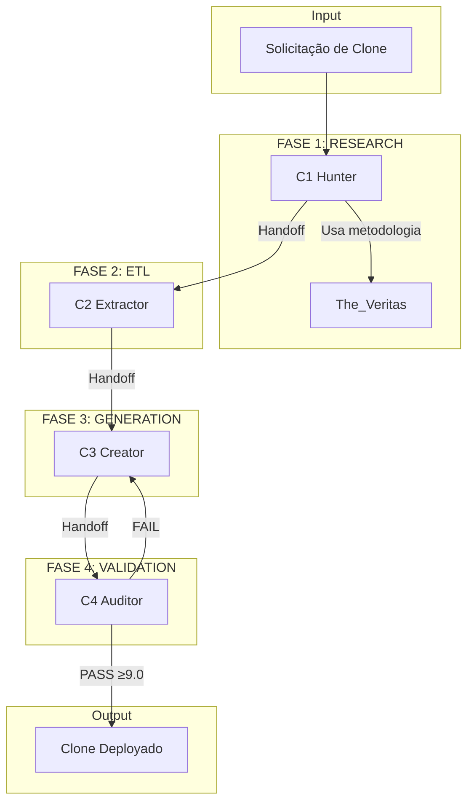

# Clone Factory — Elite Persona Cloning System

<div align="center">

**High-Fidelity Human Persona Cloning for eximIA.AI**

[]()
[]()
[]()
[]()

</div>

---

## 🎯 Mission

O **Clone Factory** é o sistema de clonagem de personas de elite da eximIA.AI, responsável por criar **clones de alta fidelidade** de especialistas humanos reais.

> *"Não clonamos pessoas, capturamos essências."*

---

## 🏆 Diferencial

| Métrica | The_Cloner (Antigo) | Clone Factory |
| :--- | :---: | :---: |
| **Fontes de Pesquisa** | ~5 | 50+ |
| **Quality Score Mínimo** | 8.0 | 9.0 |
| **Knowledge Bases** | 1 | 9+ |
| **Turing Test** | ❌ | ✅ 20 cenários |
| **Anti-Jailbreak** | ❌ | ✅ KB dedicada |
| **Powered by Veritas** | ❌ | ✅ CoVe + Triangulação |

---

## 🧬 Arquitetura (Pipeline de 4 Fases)

```
┌──────────────────────────────────────────────────────────────────────┐
│                      CLONE FACTORY PIPELINE                           │
│                                                                       │
│   📚 RESEARCH  →  ⚙️ ETL  →  🧬 GENERATION  →  ✅ VALIDATION         │
│        │              │            │                │                 │
│    C1 Hunter    C2 Extractor  C3 Creator      C4 Auditor            │
│   (via Veritas)                                                       │
└──────────────────────────────────────────────────────────────────────┘
```

| Fase | Módulo | Função | Tempo |
| :---: | :--- | :--- | :---: |
| **1** | C1 Hunter | Coleta massiva de fontes | 4-6h |
| **2** | C2 Extractor | ETL: quotes, voice, timeline | 2-4h |
| **3** | C3 Creator | Geração de artefatos | 4-6h |
| **4** | C4 Auditor | Validação + Turing Test | 2-3h |

**Tempo Total:** 12-19 horas para um clone de alta fidelidade

---

## 📁 Estrutura de Diretórios

```
Clone_Factory/
├── README.md                       # Este arquivo
├── PIPELINE_GUIDE.md               # Guia de uso do pipeline
│
├── shared_protocols/               # Protocolos compartilhados
│   ├── handoff_protocol.md         # Passagem entre fases
│   ├── quality_gates.md            # Critérios de qualidade
│   └── veritas_integration.md      # Integração com The_Veritas
│
├── C1_Hunter/                      # Fase 1: Research
│   ├── agente_core.md              # Prompt operacional
│   └── knowledge_base/
│       ├── KB_01_source_types.md
│       └── KB_02_collection_methods.md
│
├── C2_Extractor/                   # Fase 2: ETL
│   ├── agente_core.md
│   └── knowledge_base/
│       ├── KB_01_quote_extraction.md
│       └── KB_02_voice_analysis.md
│
├── C3_Creator/                     # Fase 3: Generation
│   ├── agente_core.md
│   └── knowledge_base/
│       ├── KB_01_dna_mental_guide.md
│       └── KB_02_kb_creation.md
│
├── C4_Auditor/                     # Fase 4: Validation
│   ├── agente_core.md
│   └── knowledge_base/
│       ├── KB_01_turing_test.md
│       └── KB_02_ethics_check.md
│
├── templates/                      # Templates padrão
│   ├── 01_pre_evaluation.md
│   ├── 02_sources.yaml
│   ├── 03_extraction_log.md
│   ├── 04_dna_mental.md
│   ├── 05_style_guide.md
│   ├── 05_system_prompt.md
│   ├── 05_response_patterns.md
│   ├── 06_qna_base.jsonl
│   ├── 07_knowledge_base.md
│   ├── 08_validation.md
│   └── checkpoint.json
│
├── clones/                         # Clones gerados
│   └── {slug}/
│       ├── 1_raw_data/
│       ├── 2_structured_data/
│       ├── 3_clone_output/
│       └── .checkpoint.json
│
└── registry.yaml                   # Registro de clones
```

---

## 🔄 Pipeline de Clonagem



---

## 📊 Quality Gates

### Fase 1: Research
- [ ] ≥50 fontes coletadas
- [ ] ≥5 podcasts/entrevistas longos (1h+)
- [ ] ≥20 artigos/web pages
- [ ] Social media compilado
- [ ] Score de cobertura ≥85%

### Fase 2: ETL
- [ ] ≥50 quotes extraídas
- [ ] Voice signature completa
- [ ] Timeline com ≥20 eventos
- [ ] ≥50 entidades mapeadas

### Fase 3: Generation
- [ ] DNA Mental com ≥5 crenças
- [ ] ≥5 frameworks documentados
- [ ] System prompt ≤8K chars
- [ ] 9+ Knowledge Bases
- [ ] ≥100 pares Q&A

### Fase 4: Validation
- [ ] Score Turing Test ≥9.0/10
- [ ] 0 violações éticas
- [ ] Anti-jailbreak testado
- [ ] Registrado no registry.yaml

---

## 🚀 Quick Start

### 1. Solicitar Clone
```markdown
# Solicitação de Clone

## Especialista
- **Nome:** [Nome completo]
- **Domínio:** [Área de expertise]
- **Motivo:** [Por que clonar?]

## Escopo
- **Foco Principal:** [O que priorizar]
- **Exclusões:** [O que não incluir]
```

### 2. Executar Pipeline
```bash
# Fase 1: C1 Hunter coleta fontes via Veritas
# Fase 2: C2 Extractor estrutura dados
# Fase 3: C3 Creator gera artefatos
# Fase 4: C4 Auditor valida
```

### 3. Usar o Clone
```python
# Carregar o System Prompt
with open("clones/david_goggins/3_clone_output/SYSTEM_PROMPT.md") as f:
    system_prompt = f.read()

# Usar na API
response = openai.ChatCompletion.create(
    model="gpt-4",
    messages=[
        {"role": "system", "content": system_prompt},
        {"role": "user", "content": "Como supero a preguiça?"}
    ]
)
```

---

## 📈 Benchmark: Clone Factory vs Alternativas

| Sistema | Score | Fontes | KBs | Turing |
| :--- | :---: | :---: | :---: | :---: |
| **Clone Factory** | 9.4 | 50+ | 9+ | ✅ |
| The_Cloner | 8.0 | ~5 | 1 | ❌ |
| Character.AI | 7.5 | ? | 0 | ❌ |
| GPT Custom | 6.0 | 0 | 0 | ❌ |

---

## 🔗 Integrações

| Sistema | Integração |
| :--- | :--- |
| **The_Veritas** | Metodologia CoVe para pesquisa |
| **Z_Squad** | Estrutura de agentes |
| **The_Maestro** | Orquestração |

---

## 📚 Referências

- [Z Squad Pipeline](../Z_Squad/README.md)
- [The_Veritas Research](../The_Veritas/README.md)
- [David Goggins v4.1](../Clones/david_goggins%201/) — Modelo de referência

---

<div align="center">

**Built with Z Squad Protocol** | eximIA.AI © 2026

</div>
