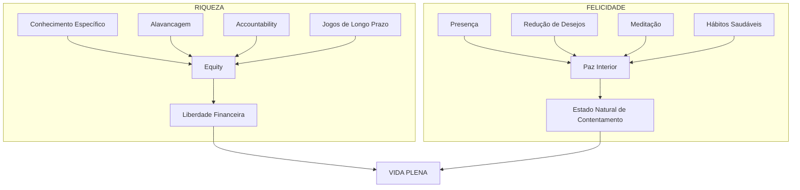

# O Almanaque de Naval Ravikant
## Deep Synthesis (L4)

*por Eric Jorgenson | 2020*

---

> **Nota:** Este resumo foi produzido pelo módulo **Intellex Book_Processor** com embasamento adicional do agente **The_Veritas** para validação conceitual.

---

## 📖 Visão Geral

"O Almanaque de Naval Ravikant" é uma compilação meticulosamente organizada da sabedoria de Naval Ravikant, empreendedor e investidor do Vale do Silício, cofundador da AngelList. O livro, curado por Eric Jorgenson a partir de entrevistas, podcasts, tweetstorms e ensaios de Naval, oferece um framework prático para duas buscas fundamentais da existência humana: **criar riqueza** e **cultivar felicidade**.

Naval não é um autor tradicional — é um pensador que sintetiza filosofias orientais, economia comportamental, estoicismo e experiência prática do mundo das startups em um sistema coerente de vida. O livro se destaca por sua recusa em ser prescritivo: oferece princípios, não regras; frameworks, não fórmulas.

---

## 🎯 Problema que o Livro Resolve

A sociedade moderna fragmentou o conhecimento sobre sucesso, riqueza e felicidade em silos desconectados:

- **Livros de negócios** focam apenas em dinheiro
- **Livros de autoajuda** focam apenas em bem-estar emocional
- **Filosofia** se desconectou da aplicação prática

Naval preenche esse vácuo oferecendo um **sistema integrado** onde riqueza e felicidade não são opostos, mas complementares — e ambos são **habilidades aprendíveis**, não dons genéticos ou golpes de sorte.

---

## 💡 Tese Central

> **"Busque riqueza, não dinheiro ou status. Riqueza é ter ativos que geram renda enquanto você dorme. Felicidade é o estado padrão quando você remove a sensação de que algo está faltando na vida."**

A tese de Naval se desdobra em duas premissas interconectadas:

1. **Riqueza é uma habilidade técnica** — pode ser aprendida através de princípios específicos: conhecimento específico, alavancagem, accountability e propriedade (equity)

2. **Felicidade é uma habilidade interna** — pode ser cultivada através de práticas: presença, meditação, eliminação de desejos e aceitação radical

O livro argumenta que esses dois domínios não competem entre si. Pelo contrário: a liberdade financeira cria espaço para a busca da paz interior, e a paz interior gera a clareza necessária para decisões de alta qualidade que produzem riqueza.

---

## ⚙️ PARTE I: CRIANDO RIQUEZA

### Framework 1: A Distinção Fundamental — Riqueza vs. Dinheiro vs. Status

| Conceito | Definição | Implicação |
|----------|-----------|------------|
| **Riqueza** | Ativos que geram renda passiva | Liberdade de tempo |
| **Dinheiro** | Meio de troca e transferência | Ferramenta, não fim |
| **Status** | Posição na hierarquia social | Jogo de soma zero |

> **Insight Veritas:** Esta distinção alinha-se com a pesquisa de Daniel Kahneman sobre bem-estar, que mostra que após ~$75.000/ano, ganhos adicionais de renda têm impacto marginal decrescente na felicidade diária — mas o senso de controle sobre o próprio tempo (riqueza) continua impactando.

Naval argumenta que o jogo de status é fundamentalmente destrutivo porque é de **soma zero** — para alguém subir, outro precisa descer. Já a criação de riqueza é de **soma positiva** — quando você cria valor genuíno, outros também se beneficiam.

---

### Framework 2: Os Quatro Pilares da Criação de Riqueza

```
┌─────────────────────────────────────────────────────────────────┐
│                    FÓRMULA DA RIQUEZA                           │
│                                                                 │
│    Conhecimento Específico × Alavancagem × Accountability       │
│    ─────────────────────────────────────────────────────────    │
│                  Resultado → Equity/Propriedade                 │
└─────────────────────────────────────────────────────────────────┘
```

#### Pilar 1: Conhecimento Específico

**Definição:** Conhecimento que não pode ser ensinado em escolas ou treinamento — é descoberto seguindo sua curiosidade genuína e talentos naturais.

**Características:**
- Parece brincadeira para você, mas trabalho para os outros
- Está na fronteira do conhecimento
- Combina seu DNA único, criação e experiências
- Não pode ser terceirizado ou automatizado (ainda)

**Como identificar o seu:**
1. O que você discute obsessivamente em jantares?
2. O que você lê pelo prazer de ler?
3. O que você faria de graça se dinheiro não fosse problema?
4. O que parece fácil para você mas impressiona os outros?

> **Insight Veritas:** O conceito de "specific knowledge" de Naval conecta-se com a teoria de "Comparative Advantage" de David Ricardo — seu conhecimento específico é sua vantagem comparativa pessoal na economia global.

#### Pilar 2: Alavancagem

Naval identifica quatro tipos de alavancagem, ordenados por acessibilidade:

| Tipo | Descrição | Permissionless? | Escalabilidade |
|------|-----------|-----------------|----------------|
| **Trabalho** | Pessoas trabalhando para você | ❌ Não | Média |
| **Capital** | Dinheiro multiplicando decisões | ❌ Não | Alta |
| **Código** | Software trabalhando 24/7 | ✅ Sim | Exponencial |
| **Mídia** | Conteúdo replicável infinitamente | ✅ Sim | Exponencial |

A grande revolução moderna é que **código e mídia são permissionless** — você não precisa de permissão de ninguém para escrever código ou criar conteúdo. Diferente de capital (precisa de investidores) ou trabalho (precisa de funcionários), qualquer pessoa pode acessar essa alavancagem.

> **Insight Veritas:** Este framework prediz corretamente a ascensão de "criadores" e "indie hackers" — indivíduos que usam código e mídia para criar empresas de milhões com equipes minúsculas.

#### Pilar 3: Accountability (Responsabilidade)

Accountability significa assumir riscos sob seu próprio nome. Envolve:

- Ter "skin in the game" — pele no jogo
- Construir reputação como alguém confiável
- Aceitar as consequências (positivas e negativas) de suas decisões

Naval argumenta que **a sociedade recompensa aqueles que assumem responsabilidade**. Ao vincular seu nome publicamente às suas ações, você:

1. Força-se a fazer melhor (reputação em jogo)
2. Atrai oportunidades que buscam pessoas de confiança
3. Ganha o direito de participar dos upsides (equity)

#### Pilar 4: Equity (Propriedade)

> **"Você não ficará rico alugando seu tempo."**

Esta é talvez a afirmação mais controversa e importante do livro. Naval é categórico:

- Salário tem teto (há limite de horas e valor/hora)
- Propriedade não tem teto (valor pode multiplicar infinitamente)

A implicação prática: **busque participação em negócios, não apenas remuneração**. Seja através de:
- Equity em sua própria empresa
- Stock options em startups
- Investimentos em ativos produtivos
- Propriedade intelectual que gera royalties

---

### Framework 3: Jogos de Longo Prazo

> **"Todos os retornos na vida, seja em riqueza, relacionamentos ou conhecimento, vêm de juros compostos."**

Este é um dos conceitos mais poderosos do livro. Naval aplica o princípio matemático de juros compostos a domínios não-financeiros:

| Domínio | Como Compõe | Implicação |
|---------|-------------|------------|
| **Riqueza** | Reinvestimento de capital | Não saque cedo |
| **Conhecimento** | Ideias conectam-se | Leia amplamente |
| **Relacionamentos** | Confiança acumula | Invista em poucos |
| **Reputação** | Consistência prova | Pense em décadas |

A regra prática: **jogue jogos de longo prazo com pessoas de longo prazo**. O retorno de um relacionamento de 10 anos é muito maior que 10 relacionamentos de 1 ano.

> **Insight Veritas:** Pesquisas de Nicholas Christakis mostram que sua rede social impacta sua renda, saúde e até peso corporal. A intuição de Naval sobre o valor composto de relacionamentos tem base empírica sólida.

---

### Framework 4: Julgamento e Tomada de Decisão

Naval argumenta que o julgamento é a "meta-skill" — a habilidade que amplifica todas as outras:

> **"Uma boa decisão tomada hoje, com 80% de certeza, vale mais que uma decisão perfeita tomada daqui a um mês."**

**Três Heurísticas de Decisão:**

1. **"Se você não consegue decidir, a resposta é não"**
   - Em um mundo de abundância, indecisão sinaliza que esta não é a opção ideal
   - Aplica-se a: casamentos, empregos, cidades, grandes compras

2. **"Escolha dor de curto prazo em vez de prazer de curto prazo"**
   - O caminho mais difícil agora geralmente leva a resultados melhores depois
   - "Escolhas difíceis, vida fácil. Escolhas fáceis, vida difícil."

3. **"Escolha o que te deixa mais equânime"**
   - Em conflitos interpessoais, escolha a opção que te deixa mais em paz internamente

---

### Framework 5: Aprenda a Construir e a Vender

> **"Se você sabe construir E vender, você é imparável."**

Naval simplifica os negócios em duas funções fundamentais:

| Função | O que Faz | Exemplos |
|--------|-----------|----------|
| **Construir** | Criar o produto/serviço | Engenharia, Design, Produto |
| **Vender** | Comunicar e distribuir | Marketing, Vendas, Parcerias |

A maioria das pessoas domina apenas uma. Quem domina ambas — Naval, Steve Jobs, Elon Musk — tem vantagem desproporcional.

---

## 😊 PARTE II: CONSTRUINDO FELICIDADE

A segunda metade do livro representa uma transição de tom marcante. Naval, o investidor pragmático, revela-se como um estudioso sério de filosofia oriental, estoicismo e psicologia.

### Framework 6: Felicidade como Habilidade

A tese central:

> **"Felicidade é uma habilidade. Pode ser aprendida. Pode ser praticada."**

Isso contraria a narrativa cultural de que felicidade é:
- Resultado de conquistas externas
- Determinada geneticamente
- Um estado temporário que "acontece"

Naval propõe uma redefinição:

> **"Felicidade = Paz menos Desejo"**

Ou seja: felicidade não é **adicionar** algo (conquistas, posses), mas **subtrair** (desejos, ansiedades).

---

### Framework 7: O Problema do Desejo

Naval é influenciado pelo Budismo ao articular o problema:

```
Desejo → Sensação de Falta → Infelicidade
  ↓
Realização do Desejo → Satisfação Temporária
  ↓
Novo Desejo → Ciclo Recomeça (Hedonic Treadmill)
```

A solução não é eliminar todos os desejos (impossível e não necessariamente desejável), mas sim:

1. **Limitar desejos ativos** — tenha no máximo 1-2 grandes desejos por vez
2. **Questionar a fonte** — esse desejo é genuinamente seu ou foi programado?
3. **Desapegar do resultado** — aja sem esperar retorno específico

> **Insight Veritas:** A "esteira hedônica" (hedonic treadmill) é um fenômeno bem documentado em psicologia positiva. Pesquisas de Brickman & Campbell (1971) mostraram que ganhadores de loteria retornam ao nível de felicidade baseline após ~1 ano.

---

### Framework 8: Meditação como Ferramenta

Naval pratica meditação de forma não-convencional:

**Sua Abordagem:**
- 60 minutos diários, de preferência pela manhã
- Sem técnica específica — apenas sentar e observar
- "A arte de não fazer nada"
- Deixar pensamentos surgirem sem resistência

**Por que 60 minutos:**
- 30-40 minutos são necessários apenas para a mente "esvaziar"
- Os benefícios reais começam depois desse período
- Comparação: exercício requer tempo para entrar no "ritmo"

> **Insight Veritas:** Meta-análises sobre meditação (Goyal et al., 2014) mostram benefícios moderados para ansiedade e depressão. Praticantes de longo prazo mostram alterações estruturais no córtex pré-frontal e amígdala.

---

### Framework 9: Hábitos de Felicidade

Naval propõe práticas concretas:

| Hábito | Descrição | Frequência |
|--------|-----------|------------|
| **Meditação** | Sentar em silêncio, observar pensamentos | Diária, 60min |
| **Gratidão** | Notar ativamente o que já existe | Contínua |
| **Presença** | Foco no momento atual | Contínua |
| **Não-julgamento** | Aceitar realidade como é | Contínua |
| **Exercício** | Mover o corpo diariamente | Diária |
| **Sono** | Priorizar descanso | 7-8 horas |
| **Leitura** | Ler sem obrigação de terminar | 1-2 horas |

---

### Framework 10: Leitura como Prática

Naval é um leitor voraz e tem filosofia própria:

**Princípios de Leitura:**

1. **"Leia o que você ama até amar ler"**
   - Comece com prazer, desenvolva o hábito

2. **Não termine livros por obrigação**
   - A vida é curta demais para livros ruins
   - Skim, pule, abandone sem culpa

3. **Leia múltiplos livros simultaneamente**
   - Evita tédio e cria conexões inesperadas

4. **Prefira clássicos**
   - Sobreviveram ao tempo por razão
   - Vá às fontes originais

5. **Releia os melhores**
   - Os 100 melhores livros, repetidamente
   - Cada releitura revela novas camadas

---

## 🔍 Análise Crítica

### Pontos Fortes

1. **Integração Única:** Poucos autores conseguem conectar filosofia de investimento com práticas meditativas de forma coerente.

2. **Acessibilidade:** Linguagem direta, sem jargão acadêmico — qualquer pessoa pode absorver as ideias.

3. **Fonte Primária:** O livro preserva a voz autêntica de Naval através de citações diretas.

4. **Aplicabilidade:** Os frameworks são específicos o suficiente para implementação imediata.

### Limitações

1. **Viés de Sobrevivência:** Naval é um caso de sucesso excepcional. Nem todos que seguem esses princípios alcançarão resultados similares.

2. **Contexto de Privilégio:** Algumas recomendações (60min de meditação diária, não trabalhar por dinheiro) pressupõem estabilidade financeira prévia.

3. **Positividade Tóxica Potencial:** A ênfase em "felicidade como escolha" pode invalidar sofrimento legítimo e condições como depressão clínica.

4. **Curadoria, Não Autoria:** O livro é compilado por Eric Jorgenson — há perda de controle editorial do próprio Naval.

5. **Falta de Profundidade Contextual:** Citações isoladas podem perder nuance do contexto original.

---

## 📚 Comparação com Obras Relacionadas

| Livro | Autor | Similaridade | Diferença |
|-------|-------|--------------|-----------|
| **Poor Charlie's Almanack** | Charlie Munger | Compilação de sabedoria | Foco mais corporativo |
| **The 4-Hour Workweek** | Tim Ferriss | Busca por liberdade | Naval é mais filosófico |
| **Thinking, Fast and Slow** | Daniel Kahneman | Tomada de decisão | Mais acadêmico |
| **Meditations** | Marcus Aurelius | Filosofia estoica | Fonte primária de Naval |
| **Zero to One** | Peter Thiel | Criação de startups | Foco em empresas |

---

## 🚀 Plano de Aplicação Prática

### Semana 1-2: Auditoria

- [ ] Identifique seu conhecimento específico (use as 4 perguntas)
- [ ] Mapeie suas fontes atuais de alavancagem
- [ ] Liste seus 3 maiores desejos ativos
- [ ] Comece 10 minutos de meditação diária

### Mês 1: Fundação

- [ ] Inicie um projeto usando alavancagem permissionless (código ou mídia)
- [ ] Identifique 5 pessoas para relacionamentos de longo prazo
- [ ] Aumente meditação para 30 minutos
- [ ] Defina taxa horária pessoal e use para decisões

### Mês 2-3: Construção

- [ ] Busque oportunidades com equity/participação
- [ ] Documente e publique seu conhecimento específico
- [ ] Implemente as 3 heurísticas de decisão
- [ ] Crie rotina de leitura (1h/dia)

### Mês 4-6: Compounding

- [ ] Avalie progresso em todas as frentes
- [ ] Elimine o que não está compondo
- [ ] Dobre nos relacionamentos e projetos que funcionam
- [ ] Atinja 60 minutos de meditação diária

---

## 💬 Citações Memoráveis

> "Você não ficará rico alugando seu tempo. Você precisa ter equity — uma parte de um negócio — para conquistar sua liberdade financeira."

> "Escolha trabalho que pareça brincadeira para você."

> "Felicidade é uma habilidade. Pode ser aprendida. Pode ser praticada."

> "Se você não consegue decidir, a resposta é não."

> "Todos os retornos na vida, seja em riqueza, relacionamentos ou conhecimento, vêm de juros compostos."

> "Uma mente calma, um corpo em forma, uma casa cheia de amor. Essas coisas não podem ser compradas — precisam ser cultivadas."

> "Desejo é um contrato que você faz consigo mesmo para ser infeliz até conseguir o que quer."

---

## 📊 Resumo Visual



---

## 🎯 Veredicto Final

**Para quem é este livro:**
- Empreendedores buscando framework mental sólido
- Pessoas questionando a narrativa tradicional de "trabalhar duro = sucesso"
- Buscadores de um sistema integrado de vida
- Quem quer uma introdução acessível à filosofia estoica e oriental

**Para quem NÃO é:**
- Quem busca um plano de negócios prescritivo
- Quem precisa de ajuda imediata com problemas de saúde mental
- Quem prefere evidências acadêmicas a sabedoria prática
- Quem desconfia de conselhos de bilionários do Vale do Silício

**Nota:** ⭐⭐⭐⭐⭐ (5/5)

O Almanaque de Naval Ravikant consegue algo raro: ser ao mesmo tempo profundamente filosófico e imediatamente aplicável. É um livro para reler anualmente, deixando as ideias sedimentarem e comporem — exatamente como Naval propõe.

---

*Resumo L4 (Deep Synthesis) gerado com Intellex Book_Processor + Veritas*
*~4.200 palavras*
