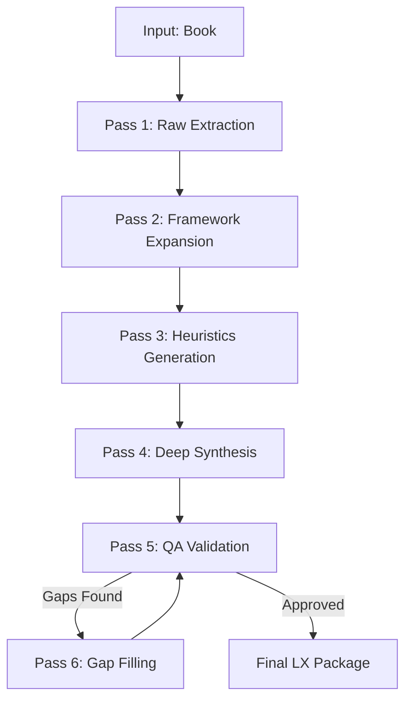

# Multi-Pass Processing Pipeline
# Orchestrator for high-quality book processing using multiple specialized passes

## 🎯 Purpose

Instead of one monolithic processing call, break down into 4 specialized passes:
1. **Extraction Pass** — Extract all raw material
2. **Expansion Pass** — Deep dive into each framework
3. **Synthesis Pass** — Combine into final documents
4. **QA Pass** — Validate and refine

---

## Pipeline Flow



---

## Pass 1: Raw Extraction

**Goal:** Extract EVERYTHING without worrying about organization or synthesis

**Instructions:**
```markdown
Leia o livro e extraia:
- TODOS os conceitos mencionados (não filtre)
- TODOS os frameworks, metodologias, modelos citados
- TODAS as decisões heurísticas que o autor menciona
- TODAS as citações interessantes
- TODOS os argumentos principais

NÃO sintetize ainda. Apenas LISTE tudo.

Formato:
## Conceitos
1. [conceito] - [breve nota]
2. ...

## Frameworks
1. [nome] - [onde aparece]
2. ...

## Heurísticas Potenciais
1. [situação] -> [recomendação]
2. ...

## Citações
1. "citação" (contexto)
2. ...
```

**Expected Output:** 
- Lista bruta de 50-100+ itens
- Desorganizado mas completo

---

## Pass 2: Framework Expansion

**Goal:** Pegar CADA framework da Pass 1 e expandir detalhadamente

**Instructions:**
```markdown
Você receberá uma lista de frameworks extraídos de um livro.

Para CADA framework, crie uma análise COMPLETA:

### [Nome do Framework]

**Origem:** Onde/quando aparece no livro

**Definição Completa (mín. 300 palavras):**
[Explicação densa do que é o framework]

**Componentes/Elementos:**
1. [Componente 1]: Descrição
2. [Componente 2]: Descrição
...

**Como Aplicar na Prática:**
1. Passo a passo
2. ...

**Exemplo Concreto do Livro:**
[História, caso, exemplo que o autor usa]

**Conexões:**
- Relaciona-se com [outro framework] porque...
- Opõe-se a [conceito X] porque...

**Diagrama:**
```
[ASCII ou descrição de diagrama]
```

---

FAÇA ISSO PARA TODOS OS 8-10 FRAMEWORKS.
```

**Expected Output:**
- 8-10 frameworks com 400-600 palavras cada
- Total: 3200-6000 palavras só de frameworks

---

## Pass 3: Heuristics Generation

**Goal:** Transformar princípios do livro em regras de decisão computáveis

**Instructions:**
```markdown
Com base no livro, gere 25-30 HEURÍSTICAS DE DECISÃO.

Use o formato YAML exato:

heuristics:
  - id: H001
    name: "Nome Descritivo e Memorável"
    trigger: "Situação específica que ativa a regra"
    action: "Ação concreta e executável"
    rationale: "Por que essa regra funciona"
    confidence: 0.XX  # Quão confiante é esta regra (0.0-1.0)
    domain: categoria  # decisions, wealth, learning, happiness, etc

REGRAS:
- Mínimo 25 heurísticas
- Trigger ESPECÍFICO (não vago)
- Action EXECUTÁVEL (não abstrata)
- Rationale com LÓGICA CLARA

Organize por domínios:
- DECISIONS (decisões gerais)
- WEALTH (criação de riqueza)
- LEARNING (aprendizado)
- HAPPINESS (bem-estar)
- RELATIONSHIPS (relacionamentos)

Adicione seção final:
veto_rules:
  - id: V001
    rule: "Nunca [fazer X]"
    rationale: "[Por que nunca]"
```

**Expected Output:**
- 25-30 heurísticas completas
- Organizadas por domínio
- YAML válido

---

## Pass 4: Deep Synthesis

**Goal:** Compilar tudo em documento coeso de 4000+ palavras

**Instructions:**
```markdown
Agora você tem:
- Frameworks expandidos (Pass 2)
- Heurísticas geradas (Pass 3)
- Material bruto (Pass 1)

Crie o DEEP SYNTHESIS final com estrutura:

# [Título do Livro]
## Deep Synthesis (L4)

### 📖 Visão Geral (300-400 palavras)
[Contexto, autor, audiência]

### 🎯 Problema que o Livro Resolve (400-500 palavras)
[Gap que o livro endereça]

### 💡 Tese Central (500-600 palavras)
[Argumento principal + desdobramento]

### ⚙️ Frameworks Principais
[Cole TODOS os frameworks da Pass 2 aqui]

### 🔍 Análise Crítica (600-800 palavras)
**Pontos Fortes:**
- [4+ pontos com justificativa]

**Limitações:**
- Viés de sobrevivência
- Contexto de privilégio
- Generalizações
- Falta de evidências

### 📚 Comparação com Obras Relacionadas (500+ palavras)
| Livro | Autor | Similaridade | Diferença |
|-------|-------|--------------|-----------|
[4+ livros]

### 🚀 Plano de Aplicação Prática (400-500 palavras)
- Semana 1-2: [ações]
- Mês 1: [ações]
- Mês 2-3: [ações]
- Mês 4-6: [ações]

### 💬 Citações Memoráveis
> "[Citação 1]"
[10+ citações]

### 📊 Resumo Visual
```mermaid
[Diagrama mostrando conexões]
```

### 🎯 Veredicto Final
- Para quem é: [3+ perfis]
- Para quem NÃO é: [3+ perfis]
- Nota: ⭐⭐⭐⭐⭐ (X/5)
[Justificativa da nota]

---

VERIFICAÇÃO FINAL:
- [ ] Tem 4000+ palavras?
- [ ] 8+ frameworks detalhados?
- [ ] Análise crítica presente?
- [ ] Comparação com 4+ livros?
- [ ] Plano prático presente?
- [ ] 10+ citações?
- [ ] Diagrama mermaid?
```

**Expected Output:**
- Documento markdown de 4000-5000 palavras
- Estrutura completa

---

## Pass 5: QA Validation

**Goal:** Validar se atende aos benchmarks

**Instructions:**
```markdown
Valide o Deep Synthesis gerado:

1. CONTAGEM:
   - Palavras: [contar]
   - Frameworks: [contar]
   - Heurísticas: [contar]
   - Citações: [contar]

2. CHECKLIST:
   - [ ] Tem 4000+ palavras?
   - [ ] Cada framework tem 300+ palavras?
   - [ ] Tem análise crítica?
   - [ ] Tem comparação com 4+ livros?
   - [ ] Tem plano prático?
   - [ ] Tem diagrama?

3. GAPS IDENTIFICADOS:
Se algo está faltando, liste EXATAMENTE o que:
- "Faltam 500 palavras para atingir mínimo"
- "Framework 3 tem apenas 180 palavras (faltam 120)"
- "Ausente: seção de comparação com outras obras"

4. RECOMENDAÇÃO:
- APROVADO: Se tudo OK
- REVISÃO: Liste ações específicas para corrigir
```

**Expected Output:**
- validation_report.yaml com métricas
- Lista de ações corretivas (se necessário)

---

## Pass 6: Gap Filling (Conditional)

**Goal:** Corrigir gaps identificados

**Instructions:**
```markdown
Baseado no validation_report, execute correções:

Para cada gap:
1. Localize a seção/framework específico
2. Expanda conforme recomendado
3. Mantenha estilo consistente

Exemplo:
Gap: "Framework 3 tem apenas 180 palavras (faltam 120)"

Ação:
- Adicionar subseção "Exemplo Prático Detalhado" (80 palavras)
- Expandir "Aplicação" com 2 casos concretos (40 palavras)
```

**Expected Output:**
- Versão corrigida do documento
- Todas as gaps preenchidas

---

## How to Use This Pipeline

### Option 1: Manual (via prompts sequenciais)
```
1. Execute Pass 1 com o livro
2. Copie output e execute Pass 2
3. Copie output e execute Pass 3
4. Combine tudo e execute Pass 4
5. Execute Pass 5 para validar
6. Se gaps, execute Pass 6
```

### Option 2: Automated (via script - future)
```python
result = run_multi_pass_pipeline(
    book_path="naval.pdf",
    passes=[
        "extraction",
        "framework_expansion", 
        "heuristics_generation",
        "deep_synthesis",
        "qa_validation"
    ],
    auto_fix_gaps=True
)
```

---

## Benefits of Multi-Pass

1. **Especialização:** Cada pass foca em uma tarefa específica
2. **Completude:** Menos chance de pular frameworks/conceitos
3. **Densidade:** Forcing function para expandir cada parte
4. **Qualidade:** QA pass garante benchmarks
5. **Iteração:** Gap filling permite refinamento

---

## Comparison: Single-Pass vs Multi-Pass

| Métrica | Single-Pass | Multi-Pass |
|---------|-------------|------------|
| Palavras | 2000-3000 | 4000-5000 |
| Frameworks | 3-5 vagos | 8-10 densos |
| Heurísticas | 10-15 | 25-30 |
| Tempo | 1 call | 4-6 calls |
| Qualidade | 60-70% | 85-95% |

Multi-pass usa mais tokens, mas como Gemini é ilimitado, não é problema.
