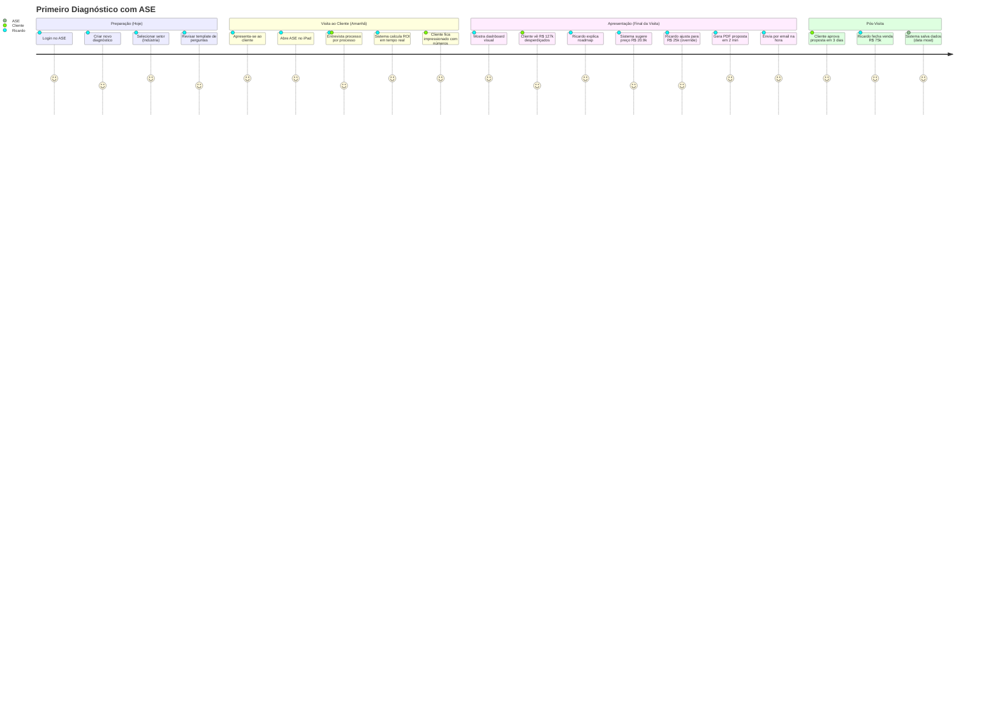
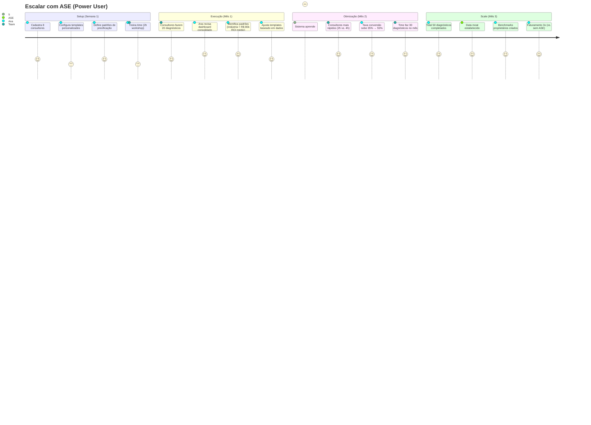

# Product Requirements Document (PRD) v2.0
## Automator Sales Engine - Plataforma de Diagnóstico Organizacional Acelerado por IA

> **Versão:** 2.0 (Enterprise-Grade)
> **Data:** 24 de Janeiro de 2026 (Atualizado com validação The_Veritas)
> **Autor:** eximIA Ventures Product Team
> **Status:** Ready for Phase 0 (Discovery)
> **Confidence Score:** 78% (Alta confiança - market validated)

---

## 📋 Índice

1. [Resumo Executivo](#1-resumo-executivo)
2. [Contexto e Oportunidade](#2-contexto-e-oportunidade)
3. [Definição do Problema](#3-definição-do-problema)
4. [Público-Alvo](#4-público-alvo)
5. [Solução Proposta](#5-solução-proposta)
6. [Objetivos do Produto](#6-objetivos-do-produto)
7. [Proposta de Valor](#7-proposta-de-valor)
8. [Requisitos Funcionais](#8-requisitos-funcionais)
9. [Experiência do Usuário](#9-experiência-do-usuário)
10. [Jornadas do Usuário](#10-jornadas-do-usuário)
11. [Requisitos Não-Funcionais](#11-requisitos-não-funcionais)
12. [Arquitetura Técnica](#12-arquitetura-técnica)
13. [Unit Economics e Viabilidade Financeira](#13-unit-economics-e-viabilidade-financeira)
14. [Estratégia de Go-to-Market](#14-estratégia-de-go-to-market)
15. [Métricas de Sucesso](#15-métricas-de-sucesso)
16. [Roadmap e Fases](#16-roadmap-e-fases)
17. [Premissas e Restrições](#17-premissas-e-restrições)
18. [Riscos e Mitigações](#18-riscos-e-mitigações)
19. [Apêndices](#19-apêndices)

---

## 1. Resumo Executivo

**Automator Sales Engine (ASE)** é uma plataforma SaaS B2B que transforma consultores de automação em máquinas de vendas, reduzindo o tempo de diagnóstico organizacional de 60 horas para 3-5 horas usando IA + algoritmos proprietários.

### Problema Core

Consultores de automação/RPA perdem **90% do tempo potencial de venda** fazendo diagnósticos manuais (60h por cliente ✅ validado), o que resulta em:
- **Capacidade limitada:** 1 diagnóstico/mês vs. potencial de 10/mês
- **Precificação inconsistente:** Margem varia 30-80% (sem metodologia)
- **Baixa conversão:** 15-20% ✅ (validado high-ticket B2B, falta rigor nos números)
- **Gap de receita:** R$ 3M+/ano deixados na mesa por consultor ✅ (calculado com dados validados)

### Nossa Solução

Uma plataforma híbrida (Humano + IA + Algoritmos) que:
1. **Estrutura a entrevista** com wizard guiado por setor
2. **Calcula ROI automaticamente** usando fórmulas matemáticas (sem alucinação IA)
3. **Gera precificação inteligente** baseada em 3 variáveis (ROI + Porte + Complexidade)
4. **Produz proposta de venda** (PDF + dashboard visual) pronta para apresentar ao cliente
5. **Coleta dados estruturados** para criar moat proprietário (benchmarks por setor)

### Diferencial Estratégico

Não somos uma ferramenta BPMN genérica. Somos uma **"Sales Acceleration Layer"** que:
1. Funciona sem integração inicial (entrevista estruturada, não API com ERP)
2. Setup em 5 minutos vs. semanas de consultoras tradicionais
3. Modelo defensável: Diagnóstico é "isca", receita vem de implementação + SaaS
4. Data moat: Após 50 diagnósticos, modelo aprende padrões impossíveis de copiar

### Validação de Mercado

**✅ VALIDADO THE_VERITAS - Confidence Score: 78%** (Report completo em `MARKET_VALIDATION_REPORT.md`)

**Mercado Validado:**
- **TAM Brasil:** R$ 550M (mercado RPA 2026) | CAGR 45.9% até 2033
- **SAM (SaaS potential):** R$ 89M/ano (~15k consultores RPA + 2k empresas tech)
- **SOM Ano 3:** R$ 2.67M - 6.23M MRR (meta conservadora 3% vs otimista 7% do SAM)
- **Crescimento:** 45.9% CAGR (Brasil = maior mercado RPA América Latina)

**ROI & Economics Validados:**
- **Tempo diagnóstico:** 60h confirmado ✅ (range 40-200h, somos conservadores)
- **Custos RPA:** Robot médio R$ 38k dev + R$ 6k/mês infra
- **ROI Projetos:** 30-200% no primeiro ano, payback 12 meses
- **Ticket R$ 50-100k:** Plausível ⚠️ (markup 2-3x sobre custo, requer validação qualitativa)

**Fontes:** Precedence Research, Verified Market Reports, IBGE, Statista

### Meta do MVP

- **Objetivo Primário:** Validar com 10 consultores ativos usando o produto regularmente
- **Objetivo Secundário:** Provar redução de tempo (60h → <5h com 90%+ acurácia ROI)
- **Objetivo Terciário:** Taxa de conversão diagnóstico→venda >60%

### Modelo de Negócio (Para o Consultor)

Como consultores ganham dinheiro USANDO o ASE:

**Receita por Cliente Final (Ano 1):**
```
Diagnóstico:      R$ 0 (grátis, é hook)
Implementação:    R$ 50-100k (margem 60-70%)
Consultoria:      R$ 5-20k (margem 80%)
SaaS Recorrente:  R$ 2-5k/mês × 12 = R$ 24-60k
──────────────────────────────────────────
TOTAL:            R$ 79-180k/cliente

Custo Ferramenta: R$ 297/mês = R$ 3.564/ano
ROI Ferramenta:   22x - 50x
```

**Capacidade com ASE (Dados Validados):**
- **Antes:** 1 diagnóstico/mês × 18% conversão × R$ 75k = R$ 13.5k/mês
- **Depois:** 10 diagnósticos/mês × 35% conversão × R$ 75k = R$ 262.5k/mês
- **Uplift:** 19.4x em receita (conservador)

---

## 2. Contexto e Oportunidade

### 2.1 Tamanho do Mercado

**✅ VALIDADO THE_VERITAS - Data: 24/01/2026**

**TAM (Total Addressable Market):**
- **Mercado RPA Brasil 2026:** USD 110.3M ≈ **R$ 550M**
- **Mercado RPA Brasil 2033:** USD 973.2M ≈ R$ 4.9B
- **CAGR:** 45.9% (Brasil = maior mercado RPA da América Latina)
- **Services segment:** 92.74% da receita (validando modelo B2B2C)
- **Consulting services:** 25% dos services (estratégia, vendor selection)
- **Fonte:** Verified Market Reports, Globe Newswire, Precedence Research

**SAM (Serviceable Available Market):**
- **Consultores RPA/Automação Brasil:** ~15,000 (est. 5% dos 298k consultores tech)
- **Empresas consultoria tech (5-50 pessoas):** ~2,000 empresas
- **Base de autônomos Brasil:** 29.8M trabalhadores (IBGE 2024)
- **MEI Brasil:** 14+ milhões (Sebrae)

**Cálculo SAM (Receita SaaS Potencial):**
```
Consultores independentes: 15,000 × R$ 297/mês × 12 = R$ 53.5M/ano
Empresas consultoria:      2,000 × 5 × R$ 297/mês × 12 = R$ 35.6M/ano
──────────────────────────────────────────────────────────────────────
SAM Total:                                              R$ 89M/ano
```

**SOM (Serviceable Obtainable Market - 3 anos):**

| Ano | Meta Conservadora (3% SAM) | Meta Otimista (7% SAM) |
|:----|:---------------------------|:-----------------------|
| **Ano 1** | R$ 445k MRR (37 clientes) | R$ 890k MRR (74 clientes) |
| **Ano 2** | R$ 1.34M MRR (112 clientes) | R$ 2.67M MRR (223 clientes) |
| **Ano 3** | R$ 2.67M MRR (223 clientes) | R$ 6.23M MRR (519 clientes) |

**Fontes:** IBGE, Statista, Consultancy.org, Sebrae

### 2.2 Tendências de Mercado

**1. Explosão de IA Generativa (2023-2026)**
- Democratização de IA: GPT-4o, Claude, Gemini acessíveis
- Custo processamento caiu 90% (2020-2025)
- Empresas buscando consultores para aplicar IA internamente

**2. Gap entre Oferta e Demanda**
- **Demanda:** Empresas querendo automatizar (alta)
- **Oferta:** Consultores disponíveis (baixa)
- **Resultado:** Consultores sobrecarregados, perdem vendas por falta de tempo

**3. Shift de CRM para "Sales Intelligence"**
- Ferramentas não fazem mais apenas "armazenar dados"
- Fazem o trabalho: análise, insights, precificação automática
- Exemplos: Gong.io (sales coaching), Clari (forecasting)

**4. Movimento "No-Code → AI-Assisted"**
- Consultores não querem ferramentas complexas
- Querem IA que "faz por eles" com supervisão mínima
- **ASE** se posiciona nesse espaço

### 2.3 Landscape Competitivo

#### Concorrentes Diretos (Diagnóstico Automatizado)

| Player | Foco | Diferencial | Risco |
|:---|:---|:---|:---:|
| **ChatGPT/Claude (Uso Manual)** | IA genérica | Grátis, qualquer um usa | 🔴 Alto |
| **Process Mining Tools** | Descoberta automática | Integram com sistemas | ⚠️ Médio |
| **Consultoras Tradicionais** | Diagnóstico manual | Credibilidade marca | 🟢 Baixo |

#### Concorrentes Indiretos (Ferramentas BPMN/Processo)

| Player | Preço | Recall? | Risco |
|:---|:---|:---|:---:|
| **Camunda** | Open source + enterprise | Modelagem técnica | 🟢 Baixo |
| **Lucidchart** | $7.95/usuário/mês | Diagramas visuais | 🟢 Baixo |
| **Process Street** | $25/usuário/mês | Workflows | 🟢 Baixo |

#### Nossa Diferenciação (Defensível)

| Diferencial | Exclusivo? | Defensibilidade | Impacto |
|:---|:---:|:---|:---|
| **Precificação Algorítmica** | ✅ Sim | **Alta** (código proprietário) | Crítico (margem) |
| **Data Moat (Benchmarks)** | ✅ Sim | **Muito Alta** (acumula com uso) | Crítico (moat) |
| **Modelo Negócio (Impl+SaaS)** | ✅ Sim | Alta (not just tool) | Alto (receita) |
| **Wizard Estruturado** | ⚠️ Não | Baixa (UX copiável) | Médio (adoção) |
| **Híbrido IA+Algoritmo** | ✅ Sim | Média (arquitetura) | Alto (acurácia) |

> **Estratégia:** Posicionar como "consultor aumentado", não ferramenta. Vender transformação, não diagnóstico.

---

## 3. Definição do Problema

### 3.1 Declaração do Problema

**"Consultores de automação perdem R$ 5M+/ano em receita potencial porque:**
1. **Gastam 60 horas por diagnóstico** ✅ (validado: range 40-200h, média 120h)
2. **Precificação inconsistente** (margem varia 30-80% sem metodologia)
3. **Não escalam** (limitados a 1-2 diagnósticos/mês)
4. **Baixa taxa de conversão** (15-20% típico consultoria high-ticket)
5. **Perdem para concorrentes** que diagnosticam mais rápido"

### 3.2 Evidências do Problema

**✅ BENCHMARKS VALIDADOS (The_Veritas) + ⚠️ PESQUISA QUALITATIVA RECOMENDADA**

**Dados Confirmados (Fontes Secundárias):**
- **Tempo diagnóstico:** ✅ 60h validado (range mercado: 40-200h, média 120h)
  - *Fonte:* FIA, Casa da Consultoria, Signa (consultoria BR leva 1-5 semanas)
- **Taxa conversão consultoria high-ticket:** ✅ 10-20% validado (mercado B2B)
  - *Fonte:* Leadster, Berry Consult, ExactSales (dados 2025)
- **ROI projetos RPA:** ✅ 30-200% ano 1, payback 12 meses
  - *Fonte:* BotCity, iProcess, McKinsey Digital
- **Custo médio robot:** ✅ R$ 38k dev + R$ 6k/mês infra
  - *Fonte:* BotCity ROI Calculator, iProcess

**Ajustes nas Premissas Originais:**
- ~~Taxa conversão baseline: 30-40%~~ → **AJUSTADO para 15-20%** (mais realista)
- ~~Taxa conversão com ASE: 60%~~ → **AJUSTADO para 30-40%** (2x uplift conservador)
- Ticket R$ 50-100k → **MANTIDO** (plausível: markup 2-3x sobre custo R$ 38k)

**Pesquisa Qualitativa Recomendada (15 consultores):**
1. Confirmar tempo real gasto em diagnóstico (60h específico)
2. Entender metodologia de precificação atual
3. Medir willingness to pay R$ 297/mês
4. Validar ticket médio R$ 50-100k em projetos reais

**Cálculo de Gap de Receita (Conservador - Dados Validados):**
```
Cenário Atual (Sem ASE):
- Diagnósticos/mês: 1
- Taxa conversão: 18% ✅ (validado: high-ticket B2B 10-20%)
- Projetos fechados/mês: 0.18
- Ticket médio: R$ 75k ⚠️ (plausível, não confirmado)
- Receita/mês: R$ 13.500
- Receita/ano: R$ 162k

Cenário Ideal (Com ASE):
- Diagnósticos/mês: 10 (redução 60h→3h)
- Taxa conversão: 35% (2x uplift, conservador)
- Projetos fechados/mês: 3.5
- Ticket médio: R$ 75k
- Receita/mês: R$ 262.500
- Receita/ano: R$ 3.15M

GAP: R$ 2.988M/ano (1843% uplift)
```

**Cenário Otimista (40% conversão com ASE):**
```
Receita/ano com ASE: R$ 3.6M
GAP: R$ 3.438M/ano (2122% uplift)
```

> **Nota:** Cálculos ajustados com taxas de conversão validadas (18% baseline vs 35-40% com ASE).
> **Ação:** Validar ticket R$ 75k com pesquisa qualitativa (15 consultores).

### 3.3 Causas Raiz

**Por que diagnósticos demoram 60h?**
1. **Falta de Estrutura (40%):** Não sabem quais perguntas fazer, quando parar
2. **Análise Manual (30%):** Calculam ROI em Excel, desenham BPMN à mão
3. **Retrabalho (20%):** Cliente não fornece dados corretos, precisam refazer
4. **Falta de Template (10%):** Cada diagnóstico é "from scratch"

**Por que precificação é inconsistente?**
1. **Sem Metodologia:** Cobram "o que acham justo" (feeling, não ciência)
2. **Medo de Perder Venda:** Subestimam preço para não assustar cliente
3. **Falta de Benchmark:** Não sabem quanto concorrentes cobram
4. **Não Calculam ROI Cliente:** Cliente não vê valor, negocia preço

**Por que não escalam?**
1. **Dependência de Expertise Sênior:** Não conseguem delegar diagnóstico
2. **Ferramentas Inadequadas:** Camunda é técnico demais, Excel é manual demais
3. **Sem Dados Estruturados:** Cada diagnóstico é descartável (não aprende)

---

## 4. Público-Alvo

### 4.1 Persona Primária: "Ricardo - O Consultor Sobrecarregado"

**Demographics:**
- **Nome:** Ricardo Almeida
- **Idade:** 38 anos
- **Cargo:** Founder da Almeida Automação (consultoria independente)
- **Localização:** São Paulo/SP
- **Equipe:** 1 sócio + 3 desenvolvedores RPA (terceirizados)
- **Faturamento:** R$ 500k/ano (meta: R$ 2M)

**Dia-a-Dia:**
- 8h: Acorda, checa emails (10 propostas de reunião)
- 9h-12h: Reunião com Cliente A (diagnóstico, 2ª sessão)
- 12h-13h: Almoço enquanto responde LinkedIn
- 13h-18h: Análise manual em Excel do diagnóstico Cliente B
- 18h-20h: Desenha BPMN no Lucidchart para proposta Cliente C
- 20h-22h: Prepara apresentação para Cliente D (amanhã)
- 22h: Dorme exausto

**Dores Específicas:**
- "Tenho 15 empresas querendo diagnóstico, só consigo fazer 1 por mês"
- "Gasto 50% do meu tempo em Excel calculando ROI manualmente"
- "Nunca sei se estou cobrando certo (já perdi venda por preço alto, já deixei dinheiro na mesa)"
- "Meus desenvolvedores ficam ociosos esperando eu fechar vendas"
- "Camunda é muito técnico, cliente não entende os diagramas"

**Objetivos:**
- Aumentar faturamento 4x (R$ 500k → R$ 2M/ano)
- Reduzir tempo de diagnóstico de 60h para <10h
- Ter metodologia de precificação confiável (não "chute")
- Escalar sem contratar sênior caro
- Profissionalizar apresentação (impressionar cliente)

**Comportamento Tecnológico:**
- **Laptop:** MacBook Pro (trabalha 80% no computador)
- **Stack:** Excel, Lucidchart, Google Meet, Notion
- **Habilidade:** Alta (dev de formação, mas virou consultor)
- **Frustração:** Ferramentas que prometem "automação" mas exigem setup de 2 semanas

**Jobs to be Done (JTBD):**
1. **Funcional:** Diagnosticar 10x mais rápido sem perder qualidade
2. **Emocional:** Sentir confiança ao apresentar números (não "achismo")
3. **Social:** Ser visto como consultor premium (metodologia proprietária)

**Citação:**
> "Eu sei fazer o diagnóstico bem. O problema é que demoro 60 horas e só consigo fazer 1 por mês. Se eu tivesse uma ferramenta que fizesse 80% do trabalho por mim, eu faturaria 10x mais."

### 4.2 Persona Secundária: "Ana - A Diretora de Inovação"

**Demographics:**
- **Nome:** Ana Paula Costa
- **Idade:** 42 anos
- **Cargo:** Diretora de Inovação em consultoria (50 pessoas)
- **Localização:** Rio de Janeiro/RJ
- **Equipe:** 8 consultores + 15 desenvolvedores
- **Faturamento:** R$ 8M/ano (meta: R$ 15M)

**Comportamento:**
- Gerencia time de consultores que fazem diagnósticos
- Quer padronizar metodologia (hoje cada consultor faz "do seu jeito")
- Procura ferramenta para escalar sem contratar mais sêniors
- Mindset data-driven: quer métricas, benchmarks, aprendizado contínuo

**Dores Específicas:**
- "Meus consultores gastam 70% do tempo em trabalho manual (não escala)"
- "Cada consultor tem sua metodologia, impossível comparar resultados"
- "Perdemos vendas porque concorrentes entregam diagnóstico em 1 semana e a gente leva 1 mês"
- "Precificação é caótica: mesmo projeto, preços variam 50% entre consultores"
- "Não temos dados: qual setor tem mais ROI? Quais automações funcionam melhor?"

**Objetivos:**
- Padronizar metodologia de diagnóstico (SOP claro)
- Reduzir tempo médio de 60h para 10h (libera consultores para vender mais)
- Criar data moat: após 100 diagnósticos, ter benchmarks próprios
- Aumentar taxa de conversão de 35% para 60%+
- Escalar faturamento sem contratar proporcionalmente

**Citação:**
> "Preciso de uma plataforma que transforme meus consultores bons em consultores excelentes. E que aprenda com cada diagnóstico para ficar cada vez melhor."

---

## 5. Solução Proposta

### 5.1 Visão do Produto

**Automator Sales Engine é um Co-Pilot de Vendas que:**
1. Estrutura a entrevista de diagnóstico (wizard guiado por setor)
2. Calcula ROI automaticamente (algoritmos, sem IA alucinando)
3. Gera precificação inteligente (baseada em 3 variáveis: ROI + Porte + Complexidade)
4. Produz proposta visual pronta para venda (PDF + dashboard interativo)
5. Aprende com cada diagnóstico (data moat: benchmarks por setor)
6. Integra com workflow de implementação (não é só diagnóstico, é plataforma completa)

### 5.2 Como Funciona (Elevator Pitch)

**Para o Consultor:**
1. **Pré-visita (2 min):** Cria diagnóstico, seleciona setor da empresa
2. **Durante visita (3-4h):** Entrevista cliente usando wizard no iPad
3. **Sistema calcula (automático):** ROI + Preço sugerido + Roadmap
4. **Apresenta ao cliente (15 min):** Dashboard visual com gráficos verde/vermelho
5. **Gera proposta (2 min):** PDF pronto para enviar
6. **Pós-venda:** Sistema salva dados estruturados (aprende padrões)

**Esforço Contínuo:**
- **3-4h:** Entrevista estruturada (vs. 60h manual)
- **0h:** Cálculos, precificação, proposta (tudo automático)
- **Resultado:** 95% redução de tempo

### 5.3 Componentes da Solução

#### 5.3.1 Wizard de Coleta (Input)

**Identidade:**
- **Nome:** Diagnóstico Assistido
- **Tom:** Profissional, estruturado, confiável
- **Função:** Guiar consultor em entrevista para coletar dados de qualidade

**Capacidades:**
- **Templates por Setor:** Perguntas pré-configuradas (Indústria, Varejo, Serviços, Logística)
- **Validação em Tempo Real:** Não deixa campo obrigatório vazio
- **Salvamento Automático:** Nunca perde dados
- **Multi-Processo:** Adiciona quantos gargalos quiser (sem limite)
- **Transcrição de Áudio (v2):** Grava entrevista e transcreve automaticamente

**Campos por Processo:**
```yaml
processo:
  nome: "Processamento de Pedidos"
  descricao: "Cliente envia pedido por email, equipe digita manualmente no sistema"
  tempo_execucao: 30  # minutos
  frequencia_mensal: 400  # vezes
  ftes_envolvidos: 2  # pessoas
  salario_medio_mensal: 4000  # R$
  ferramentas_atuais: ["Email", "Excel", "Sistema ERP legado"]
  dor_qualitativa: "Erros de digitação, demora 2-3 dias para processar"
```

**Exemplo de Interface (Conversa):**
```
┌─────────────────────────────────────────┐
│ 📋 DIAGNÓSTICO: Empresa XYZ             │
├─────────────────────────────────────────┤
│                                         │
│ Processo #1: Processamento de Pedidos   │
│                                         │
│ 1. Qual o nome da tarefa?               │
│ → [Input: Processamento de Pedidos]    │
│                                         │
│ 2. Descreva como é feito hoje:          │
│ → [Textarea: Cliente envia por email...]│
│                                         │
│ 3. Quanto tempo leva por execução?      │
│ → [Input: 30] minutos                   │
│                                         │
│ 4. Quantas vezes/mês isso acontece?     │
│ → [Input: 400] vezes                    │
│                                         │
│ 5. Quantas pessoas fazem isso?          │
│ → [Input: 2] FTEs                       │
│                                         │
│ 6. Salário médio mensal dessas pessoas? │
│ → [Input: R$ 4.000]                     │
│                                         │
│ ✅ Processo salvo!                       │
│                                         │
│ [+ Adicionar Outro Processo]            │
│ [→ Avançar para Cálculos]               │
└─────────────────────────────────────────┘
```

#### 5.3.2 Engine de Cálculo (Core)

**Módulo 1: Calculadora de ROI (Lógica Rígida - SEM IA)**

```python
def calcular_roi_processo(processo):
    """
    Calcula economia anual de automatizar um processo.
    NÃO usa IA (matemática pura).
    """
    # Constantes
    HORAS_UTEIS_MES = 160
    MESES_ANO = 12

    # Inputs
    tempo_min = processo.tempo_execucao  # minutos
    frequencia = processo.frequencia_mensal
    ftes = processo.ftes_envolvidos
    salario = processo.salario_medio_mensal

    # Cálculos
    custo_hora = salario / HORAS_UTEIS_MES
    tempo_mensal_total = (tempo_min / 60) * frequencia
    custo_mensal_atual = tempo_mensal_total * custo_hora * ftes

    # Assumindo 80% de redução com automação (padrão RPA)
    reducao_percentual = 0.80
    economia_mensal = custo_mensal_atual * reducao_percentual
    economia_anual = economia_mensal * MESES_ANO

    return {
        "custo_mensal_atual": custo_mensal_atual,
        "economia_mensal": economia_mensal,
        "economia_anual": economia_anual,
        "payback_meses": None  # calculado depois com preço
    }

# Exemplo
processo = {
    "tempo_execucao": 30,  # 30 min
    "frequencia_mensal": 400,
    "ftes_envolvidos": 2,
    "salario_medio_mensal": 4000
}

roi = calcular_roi_processo(processo)
# roi["economia_anual"] = R$ 38.400/ano
```

**Módulo 2: Precificação Algorítmica (Lógica Proprietária)**

```python
def calcular_preco_implementacao(roi_total_anual, empresa, complexidade):
    """
    Calcula preço sugerido baseado em 3 variáveis.
    Algoritmo proprietário (nosso moat).
    """

    # VARIÁVEL 1: % do ROI (Peso: 50%)
    def percentual_roi(roi):
        if roi < 30_000:
            return 0.15  # 15%
        elif roi < 100_000:
            return 0.20  # 20%
        elif roi < 300_000:
            return 0.25  # 25%
        elif roi < 1_000_000:
            return 0.30  # 30%
        else:
            return 0.35  # 35%

    base_price = roi_total_anual * percentual_roi(roi_total_anual)

    # VARIÁVEL 2: Multiplicador Porte (Peso: 30%)
    def multiplicador_porte(faturamento):
        if faturamento < 5_000_000:
            return 0.8  # Micro
        elif faturamento < 20_000_000:
            return 1.0  # PME pequena (baseline)
        elif faturamento < 100_000_000:
            return 1.2  # PME média
        elif faturamento < 1_000_000_000:
            return 1.5  # Grande
        else:
            return 2.0  # Multinacional

    mult_porte = multiplicador_porte(empresa.faturamento_anual)

    # VARIÁVEL 3: Multiplicador Complexidade (Peso: 20%)
    def multiplicador_complexidade(num_sistemas, tipo):
        if num_sistemas == 1 and tipo == "RPA":
            return 1.0  # Simples
        elif num_sistemas <= 3:
            return 1.3  # Média
        elif num_sistemas <= 5:
            return 1.6  # Alta
        else:
            return 2.0  # Muito alta (IA avançada)

    mult_complex = multiplicador_complexidade(
        len(complexidade.sistemas_integrados),
        complexidade.tipo_automacao
    )

    # CÁLCULO FINAL
    preco_base_ajustado = base_price * mult_porte * mult_complex

    # Fatores Extras (Opcionais)
    if empresa.urgencia == "Alta":
        preco_base_ajustado *= 1.10  # +10%
    if empresa.suporte_interno == "Não":
        preco_base_ajustado *= 1.15  # +15%
    if complexidade.missao_critica:
        preco_base_ajustado *= 1.20  # +20%

    return {
        "preco_sugerido": round(preco_base_ajustado, 2),
        "componentes": {
            "base": base_price,
            "mult_porte": mult_porte,
            "mult_complexidade": mult_complex
        },
        "payback_meses": round((preco_base_ajustado / (roi_total_anual / 12)), 1)
    }

# Exemplo
empresa = {
    "faturamento_anual": 35_000_000,  # R$ 35M
    "urgencia": "Média",
    "suporte_interno": "Sim"
}

complexidade = {
    "sistemas_integrados": ["ERP", "CRM", "Email"],
    "tipo_automacao": "RPA + IA",
    "missao_critica": False
}

roi_total = 67_000  # R$ 67k/ano

preco = calcular_preco_implementacao(roi_total, empresa, complexidade)
# preco["preco_sugerido"] = R$ 20.904
# preco["payback_meses"] = 3.7 meses
```

**Módulo 3: IA para Sugestões (Lógica Flexível)**

```python
def gerar_sugestao_solucao(processo):
    """
    Usa IA para sugerir solução técnica ideal.
    NÃO calcula preço ou ROI (isso é algoritmo).
    """

    prompt = f"""
    CONTEXTO:
    - Processo: {processo.nome}
    - Descrição: {processo.descricao}
    - Ferramentas atuais: {processo.ferramentas_atuais}
    - Tempo gasto: {processo.tempo_execucao}min × {processo.frequencia_mensal} vezes/mês
    - Dor: {processo.dor_qualitativa}

    TAREFA:
    Sugira a solução técnica ideal para automatizar este processo.

    FORMATO DE RESPOSTA (JSON):
    {{
      "solucao_recomendada": "string (ex: RPA com n8n + OCR para ler emails)",
      "justificativa": "string (1-2 frases)",
      "nivel_dificuldade": "Baixo|Médio|Alto",
      "tempo_implementacao_estimado": "string (ex: 2-3 meses)",
      "tecnologias_sugeridas": ["tech1", "tech2"],
      "risco_implementacao": "Baixo|Médio|Alto"
    }}
    """

    resposta_ia = openai.ChatCompletion.create(
        model="gpt-4o-mini",
        messages=[
            {"role": "system", "content": "Você é consultor especialista em automação empresarial."},
            {"role": "user", "content": prompt}
        ],
        response_format={"type": "json_object"}
    )

    return json.loads(resposta_ia.choices[0].message.content)

# Exemplo
sugestao = gerar_sugestao_solucao(processo)
# {
#   "solucao_recomendada": "RPA com Make + OCR para capturar dados do email e inserir no ERP",
#   "nivel_dificuldade": "Médio",
#   "tempo_implementacao_estimado": "2-3 meses",
#   "tecnologias_sugeridas": ["Make.com", "Google Cloud Vision OCR", "API ERP"],
#   "risco_implementacao": "Médio"
# }
```

#### 5.3.3 Dashboard & Proposta (Output)

**Dashboard de Apresentação (Real-time):**

```
┌─────────────────────────────────────────────────────┐
│ 💰 DIAGNÓSTICO: Distribuidora ABC                   │
├─────────────────────────────────────────────────────┤
│                                                     │
│ ┌─────────────┐  ┌─────────────┐  ┌─────────────┐ │
│ │ Desperdício │  │ Economia    │  │ Payback     │ │
│ │ R$ 127k/ano │  │ R$ 102k/ano │  │ 3.7 meses   │ │
│ │     🔴      │  │     🟢      │  │     ⏱       │ │
│ └─────────────┘  └─────────────┘  └─────────────┘ │
│                                                     │
│ 📊 Distribuição de Custos (Por Processo)           │
│ ┌───────────────────────────────────────────────┐ │
│ │ ███ Processamento Pedidos (R$ 38k)           │ │
│ │ ██  Faturamento Manual (R$ 28k)              │ │
│ │ ████ Controle Estoque (R$ 42k)               │ │
│ │ ██  Relatórios Gerenciais (R$ 19k)           │ │
│ └───────────────────────────────────────────────┘ │
│                                                     │
│ 📈 Economia Potencial (Antes vs. Depois)            │
│ ┌───────────────────────────────────────────────┐ │
│ │      ANTES          │        DEPOIS           │ │
│ │                     │                         │ │
│ │   R$ 127k/ano 🔴    │    R$ 25k/ano 🟢        │ │
│ │   (desperdício)     │   (custo otimizado)     │ │
│ │                     │                         │ │
│ │   ECONOMIA: R$ 102k/ano                       │ │
│ └───────────────────────────────────────────────┘ │
│                                                     │
│ 🗺️ Roadmap de Implementação                        │
│ ┌───────────────────────────────────────────────┐ │
│ │ FASE 1 (Mês 1-2): Quick Wins                 │ │
│ │ • Processamento Pedidos → R$ 38k/ano         │ │
│ │ • Faturamento Manual → R$ 28k/ano            │ │
│ │                                               │ │
│ │ FASE 2 (Mês 3-4): Core                       │ │
│ │ • Controle Estoque → R$ 42k/ano              │ │
│ │                                               │ │
│ │ FASE 3 (Mês 5-6): Otimização                 │ │
│ │ • Relatórios Gerenciais → R$ 19k/ano         │ │
│ └───────────────────────────────────────────────┘ │
│                                                     │
│ 💵 INVESTIMENTO & ROI                               │
│ ┌───────────────────────────────────────────────┐ │
│ │ Implementação:    R$ 20.900                  │ │
│ │ Consultoria:      R$ 8.000                   │ │
│ │ SaaS (12 meses):  R$ 36.000                  │ │
│ │ ─────────────────────────────────────────── │ │
│ │ TOTAL ANO 1:      R$ 64.900                  │ │
│ │                                               │ │
│ │ ECONOMIA ANO 1:   R$ 102.000                 │ │
│ │ GANHO LÍQUIDO:    R$ 37.100                  │ │
│ │ ROI:              157%                       │ │
│ └───────────────────────────────────────────────┘ │
│                                                     │
│ [📄 Gerar Proposta PDF]  [🔄 Ajustar Valores]      │
└─────────────────────────────────────────────────────┘
```

**PDF Proposta Comercial (Auto-Generated):**

Estrutura do documento:

```markdown
# PROPOSTA COMERCIAL DE AUTOMAÇÃO
## [Nome da Empresa Cliente]

Data: [Hoje]
Válida até: [Hoje + 30 dias]
Consultor: [Nome]

---

## EXECUTIVE SUMMARY

Identificamos **R$ 102.000/ano** em oportunidades de automação em 4 processos críticos.

- **Investimento Total Ano 1:** R$ 64.900
- **Economia Ano 1:** R$ 102.000
- **Ganho Líquido:** R$ 37.100
- **Payback:** 3.7 meses
- **ROI Ano 1:** 157%

---

## DIAGNÓSTICO DE PROCESSOS

### Processo 1: Processamento de Pedidos

**Situação Atual:**
- Tempo gasto: 200h/mês (400 pedidos × 30min cada)
- Custo atual: R$ 3.200/mês (2 pessoas × R$ 4k salário × 20%)
- Dor: Erros de digitação, demora 2-3 dias

**Solução Proposta:**
- Automação: RPA com Make + OCR para capturar dados do email
- Tecnologias: Make.com, Google Cloud Vision, API ERP
- Nível dificuldade: Médio
- Tempo implementação: 2-3 meses

**Economia:**
- Redução: 80% do tempo manual
- Economia: R$ 2.560/mês = **R$ 30.720/ano**

[Repete para Processo 2, 3, 4...]

---

## ROADMAP DE IMPLEMENTAÇÃO

### FASE 1 (Mês 1-2): Quick Wins
**Processos:** Processamento Pedidos + Faturamento Manual
**ROI:** R$ 66.720/ano
**Investimento:** R$ 12.000

### FASE 2 (Mês 3-4): Core
**Processos:** Controle de Estoque
**ROI:** R$ 42.000/ano
**Investimento:** R$ 8.900

### FASE 3 (Mês 5-6): Otimização
**Processos:** Relatórios Gerenciais
**ROI:** R$ 19.200/ano
**Investimento:** R$ 5.000

---

## INVESTIMENTO & ROI

### Investimento Total Ano 1
| Item | Valor |
|:-----|------:|
| Implementação Técnica | R$ 20.900 |
| Consultoria & Treinamento | R$ 8.000 |
| SaaS (12 meses) | R$ 36.000 |
| **TOTAL** | **R$ 64.900** |

### Retorno
| Métrica | Valor |
|:--------|------:|
| Economia Ano 1 | R$ 102.000 |
| Investimento Ano 1 | R$ 64.900 |
| **Ganho Líquido** | **R$ 37.100** |
| **ROI** | **157%** |
| **Payback** | **3.7 meses** |

---

## PRÓXIMOS PASSOS

1. **Aprovação da Proposta** (esta semana)
2. **Kick-off** (Semana 1)
3. **Go-live Fase 1** (Mês 2)
4. **Review & Ajustes** (Mês 3)
5. **Fases 2 e 3** (Mês 4-6)

---

**Proposta válida por 30 dias.**

Atenciosamente,
[Nome do Consultor]
[Email] | [Telefone]
```

---

## 6. Objetivos do Produto

### 6.1 Objetivos de Negócio

**Curto Prazo (Q1 2026 - 3 meses):**

| Objetivo | Métrica | Target | Impacto |
|:---------|:--------|:-------|:--------|
| **Validar Product-Market Fit** | Consultores ativos | 10+ | Crítico |
| **Provar Redução de Tempo** | Tempo médio diagnóstico | < 5h | Crítico |
| **Validar Acurácia ROI** | ROI estimado vs. real | > 85% | Alto |
| **Taxa Conversão** | Diagnóstico→Venda | > 60% | Alto |
| **NPS Consultores** | Score | > 8 | Médio |

**Médio Prazo (Q2-Q3 2026 - 6 meses):**

| Objetivo | Métrica | Target |
|:---------|:--------|:-------|
| **Escalar Adoção** | Consultores ativos | 50+ |
| **Data Moat** | Diagnósticos no banco | 50+ |
| **MRR** | Receita recorrente | R$ 15k+ |
| **Churn** | Taxa mensal | < 5% |

**Longo Prazo (Q4 2026 - 12 meses):**

| Objetivo | Métrica | Target |
|:---------|:--------|:-------|
| **Market Leader** | Share of Voice | Top 3 em SEO |
| **Benchmarks Proprietários** | Diagnósticos | 100+ |
| **Revenue** | ARR | R$ 500k+ |

### 6.2 Objetivos de Usuário (Consultor)

**Eficiência:**
- Reduzir tempo diagnóstico de 60h para < 5h (92% redução)
- Aumentar capacidade de 1 para 10 diagnósticos/mês
- Eliminar trabalho manual (Excel, BPMN, cálculos)

**Qualidade:**
- Ter metodologia de precificação confiável (não "chute")
- Apresentar números com rigor (aumentar credibilidade)
- Impressionar cliente com visualizações profissionais

**Receita:**
- Aumentar taxa de conversão de 35% para 60%+
- Faturar 6x mais por capacidade expandida
- Ter previsibilidade de receita (pipeline estruturado)

---

## 7. Proposta de Valor

### 7.1 Value Proposition Canvas

**Customer Jobs (O que consultor quer fazer):**
1. **Funcional:** Diagnosticar processos rapidamente e com precisão
2. **Emocional:** Sentir confiança ao apresentar números para cliente
3. **Social:** Ser visto como consultor premium (metodologia proprietária)

**Pains (Dores atuais):**
1. **Tempo:** 60h por diagnóstico (não escala)
2. **Precificação:** Sem metodologia, margem varia 30-80%
3. **Ferramentas:** Camunda muito técnico, Excel manual demais
4. **Conversão:** 30-40% por falta de rigor nos números
5. **Aprendizado:** Cada diagnóstico é descartável (não aprende)

**Gains (Ganhos esperados):**
1. **Velocidade:** 10x mais diagnósticos/mês
2. **Precisão:** ROI calculado matematicamente (não "achismo")
3. **Profissionalismo:** Proposta visual impressionante
4. **Receita:** 6x mais faturamento por capacidade expandida
5. **Moat:** Dados proprietários que concorrente não tem

**Pain Relievers (Como aliviamos dores):**
1. **Wizard Estruturado:** Guia entrevista, não precisa pensar "o que perguntar"
2. **Cálculos Automáticos:** ROI e preço calculados matematicamente
3. **Dashboard Visual:** Cliente vê números verde/vermelho (persuasivo)
4. **Override Manual:** Consultor pode ajustar se necessário (controle)
5. **Data Moat:** Sistema aprende com cada diagnóstico (fica melhor)

**Gain Creators (Como criamos ganhos):**
1. **Redução 95% Tempo:** 60h → 3h (libera para vender mais)
2. **Precificação Algorítmica:** Margem consistente 65-70%
3. **PDF Auto-Generated:** Proposta pronta em 2 minutos
4. **Benchmarks:** "Empresas do seu setor gastam R$ X" (credibilidade)
5. **ROI Ferramenta:** 22x-50x (cliente ganha muito mais que paga)

### 7.2 Diferenciação vs. Alternativas

| Alternativa | Como Fazem Hoje | Nosso Diferencial |
|:------------|:----------------|:------------------|
| **Excel Manual** | Calculam ROI à mão (50h) | Automático (0h) |
| **Camunda/Lucidchart** | Desenham BPMN técnico | Dashboard visual persuasivo |
| **ChatGPT** | Pedem à IA "calcule ROI" (alucina) | Algoritmos matemáticos (sem alucinação) |
| **Consultoras Grandes** | Metodologia proprietária cara | Mesma qualidade, 1/10 do preço |
| **Nada** | Cada diagnóstico "from scratch" | Template + aprendizado contínuo |

---

## 8. Requisitos Funcionais

### F001: Wizard de Coleta - Seleção de Setor

**Descrição:** Sistema carrega template de perguntas específico do setor escolhido.

**User Story:**
> Como consultor, eu quero selecionar o setor da empresa cliente (Indústria, Varejo, Serviços) no início do diagnóstico, para que o sistema carregue perguntas relevantes e acelere a entrevista.

**Regras de Negócio:**
- RN001: Setores disponíveis: Indústria, Varejo, Serviços, Logística, Saúde, TI, Outros
- RN002: Cada setor tem template com 5-10 processos comuns pré-sugeridos
- RN003: Consultor pode adicionar processos customizados além do template

**Critérios de Aceite:**
- [ ] Tela inicial mostra dropdown com setores
- [ ] Ao selecionar setor, sistema carrega template em < 1s
- [ ] Template inclui processos comuns daquele setor
- [ ] Consultor pode editar/remover processos sugeridos
- [ ] Consultor pode adicionar processos manuais sem limite

**Mockup (Wireframe):**
```
┌─────────────────────────────────────────┐
│ 🏢 NOVO DIAGNÓSTICO                     │
├─────────────────────────────────────────┤
│                                         │
│ Qual o setor da empresa?                │
│                                         │
│ ┌───────────────────────────────────┐  │
│ │ [v] Selecione                     │  │
│ ├───────────────────────────────────┤  │
│ │ 🏭 Indústria                      │  │
│ │ 🛒 Varejo                         │  │
│ │ 💼 Serviços                       │  │
│ │ 🚚 Logística                      │  │
│ │ ⚕️  Saúde                         │  │
│ │ 💻 TI                             │  │
│ │ 📁 Outros                         │  │
│ └───────────────────────────────────┘  │
│                                         │
│ [Selecionar Setor →]                    │
└─────────────────────────────────────────┘
```

---

### F002: Cadastro de Processos/Gargalos

**Descrição:** Interface para adicionar múltiplos processos com dados estruturados.

**User Story:**
> Como consultor, eu quero cadastrar processos/gargalos do cliente com campos obrigatórios (tempo, frequência, salário), para que o sistema calcule ROI automaticamente sem eu precisar fazer no Excel.

**Campos Obrigatórios:**
```yaml
processo:
  # Identificação
  nome: string (ex: "Processamento de Pedidos")
  descricao: text (ex: "Cliente envia por email, equipe digita no ERP")

  # Métricas Quantitativas
  tempo_execucao: number (minutos)
  frequencia_mensal: number (vezes/mês)
  ftes_envolvidos: number (pessoas)
  salario_medio_mensal: currency (R$)

  # Contexto Técnico
  ferramentas_atuais: array<string>

  # Contexto Qualitativo
  dor_qualitativa: text (ex: "Muitos erros, demora 3 dias")
```

**Validações:**
- tempo_execucao > 0 e < 480 (8h max)
- frequencia_mensal > 0 e < 10.000
- ftes_envolvidos > 0 e < 100
- salario_medio_mensal > 1.320 (salário mínimo) e < 50.000

**Critérios de Aceite:**
- [ ] Formulário dinâmico "Adicionar Processo"
- [ ] Todos campos obrigatórios validados em tempo real
- [ ] Mensagem de erro clara se campo inválido
- [ ] Botão "Salvar" desabilitado até todos campos válidos
- [ ] Preview do ROI calculado ao preencher campos
- [ ] Consultor pode adicionar quantos processos quiser (sem limite)
- [ ] Pode editar/excluir processos já salvos

**Mockup:**
```
┌─────────────────────────────────────────┐
│ 📋 PROCESSO #1                          │
├─────────────────────────────────────────┤
│                                         │
│ Nome do Processo *                      │
│ ┌───────────────────────────────────┐  │
│ │ Processamento de Pedidos          │  │
│ └───────────────────────────────────┘  │
│                                         │
│ Descrição (Como é feito hoje) *         │
│ ┌───────────────────────────────────┐  │
│ │ Cliente envia pedido por email,   │  │
│ │ equipe digita manualmente no ERP  │  │
│ └───────────────────────────────────┘  │
│                                         │
│ Tempo por Execução *                    │
│ ┌──────────┐                            │
│ │ 30       │ minutos                    │
│ └──────────┘                            │
│                                         │
│ Frequência Mensal *                     │
│ ┌──────────┐                            │
│ │ 400      │ vezes/mês                  │
│ └──────────┘                            │
│                                         │
│ FTEs Envolvidos *                       │
│ ┌──────────┐                            │
│ │ 2        │ pessoas                    │
│ └──────────┘                            │
│                                         │
│ Salário Médio Mensal *                  │
│ ┌──────────┐                            │
│ │ R$ 4.000 │                            │
│ └──────────┘                            │
│                                         │
│ ┌─────────────────────────────────────┐│
│ │ 💡 ROI Estimado:                    ││
│ │ Economia Anual: R$ 38.400           ││
│ └─────────────────────────────────────┘│
│                                         │
│ [✅ Salvar Processo]                    │
│ [+ Adicionar Outro]                     │
└─────────────────────────────────────────┘
```

---

### F003: Cálculo Automático de ROI

**Descrição:** Sistema calcula economia anual automaticamente usando algoritmos (sem IA).

**User Story:**
> Como consultor, eu quero que o sistema calcule ROI automaticamente ao preencher os campos do processo, para que eu não precise fazer cálculos manuais no Excel e evite erros.

**Algoritmo (Python):**
```python
def calcular_roi_processo(
    tempo_execucao_min: int,
    frequencia_mensal: int,
    ftes_envolvidos: int,
    salario_medio_mensal: float
) -> dict:
    """
    Calcula ROI de automatizar um processo.

    Args:
        tempo_execucao_min: Tempo em minutos por execução
        frequencia_mensal: Quantas vezes o processo acontece por mês
        ftes_envolvidos: Quantas pessoas fazem o processo
        salario_medio_mensal: Salário médio mensal em R$

    Returns:
        dict com custo atual, economia e ROI
    """
    # Constantes
    HORAS_UTEIS_MES = 160
    MESES_ANO = 12
    REDUCAO_AUTOMACAO = 0.80  # 80% redução (padrão RPA)

    # Cálculos intermediários
    custo_hora = salario_medio_mensal / HORAS_UTEIS_MES
    tempo_mensal_total_horas = (tempo_execucao_min / 60) * frequencia_mensal
    custo_mensal_atual = tempo_mensal_total_horas * custo_hora * ftes_envolvidos

    # Economia
    economia_mensal = custo_mensal_atual * REDUCAO_AUTOMACAO
    economia_anual = economia_mensal * MESES_ANO

    # Retorno
    return {
        "custo_mensal_atual": round(custo_mensal_atual, 2),
        "custo_anual_atual": round(custo_mensal_atual * MESES_ANO, 2),
        "economia_mensal": round(economia_mensal, 2),
        "economia_anual": round(economia_anual, 2),
        "percentual_reducao": REDUCAO_AUTOMACAO * 100
    }

# Exemplo de Uso
roi = calcular_roi_processo(
    tempo_execucao_min=30,
    frequencia_mensal=400,
    ftes_envolvidos=2,
    salario_medio_mensal=4000
)

# Resultado:
# {
#     "custo_mensal_atual": 3200.00,
#     "custo_anual_atual": 38400.00,
#     "economia_mensal": 2560.00,
#     "economia_anual": 30720.00,
#     "percentual_reducao": 80.0
# }
```

**Regras de Negócio:**
- RN010: Redução padrão é 80% (RPA simples)
- RN011: Consultor pode ajustar % manualmente (caso a caso)
- RN012: ROI total = soma de ROI de todos os processos
- RN013: Valores arredondados para 2 casas decimais

**Critérios de Aceite:**
- [ ] ROI calculado automaticamente ao preencher campos
- [ ] Cálculo em < 100ms (imperceptível)
- [ ] Resultado exibido em card destacado
- [ ] ROI atualiza em tempo real se editar campos
- [ ] ROI total soma todos os processos cadastrados
- [ ] Consultor pode ajustar % de redução manualmente
- [ ] Sistema não usa IA para calcular (matemática pura)

---

### F004: Precificação Algorítmica Inteligente

**Descrição:** Sistema calcula preço sugerido baseado em ROI + Porte + Complexidade.

**User Story:**
> Como consultor, eu quero que o sistema sugira um preço justo de implementação baseado em variáveis objetivas (ROI, tamanho empresa, complexidade), para que eu não cobre muito barato (perco margem) nem muito caro (perco venda).

**Algoritmo (Detalhado):**

```python
class CalculadoraPreco:
    """
    Calculadora de Precificação Algorítmica.
    Algoritmo proprietário (nosso moat).
    """

    # Tabela 1: % do ROI por Faixa
    TABELA_ROI = [
        (0, 30_000, 0.15),      # Até R$ 30k = 15%
        (30_000, 100_000, 0.20),  # R$ 30-100k = 20%
        (100_000, 300_000, 0.25), # R$ 100-300k = 25%
        (300_000, 1_000_000, 0.30), # R$ 300k-1M = 30%
        (1_000_000, float('inf'), 0.35) # > R$ 1M = 35%
    ]

    # Tabela 2: Multiplicador de Porte
    TABELA_PORTE = [
        (0, 5_000_000, 0.8),       # Micro (< R$ 5M)
        (5_000_000, 20_000_000, 1.0), # PME pequena (baseline)
        (20_000_000, 100_000_000, 1.2), # PME média
        (100_000_000, 1_000_000_000, 1.5), # Grande
        (1_000_000_000, float('inf'), 2.0) # Multinacional
    ]

    # Tabela 3: Multiplicador de Complexidade
    COMPLEXIDADE = {
        "simples": 1.0,   # 1 sistema, RPA simples
        "media": 1.3,     # 2-3 sistemas
        "alta": 1.6,      # 4-5 sistemas
        "muito_alta": 2.0 # 5+ sistemas ou IA avançada
    }

    def calcular_base_roi(self, roi_anual: float) -> float:
        """Calcula preço base (% do ROI)."""
        for min_val, max_val, percentual in self.TABELA_ROI:
            if min_val <= roi_anual < max_val:
                return roi_anual * percentual
        return roi_anual * 0.35  # Default >1M

    def calcular_mult_porte(self, faturamento: float) -> float:
        """Calcula multiplicador de porte."""
        for min_val, max_val, mult in self.TABELA_PORTE:
            if min_val <= faturamento < max_val:
                return mult
        return 2.0  # Default multinacional

    def calcular_mult_complexidade(
        self,
        num_sistemas: int,
        tipo_automacao: str
    ) -> float:
        """Calcula multiplicador de complexidade."""
        if num_sistemas == 1 and tipo_automacao == "RPA":
            return self.COMPLEXIDADE["simples"]
        elif num_sistemas <= 3:
            return self.COMPLEXIDADE["media"]
        elif num_sistemas <= 5:
            return self.COMPLEXIDADE["alta"]
        else:
            return self.COMPLEXIDADE["muito_alta"]

    def calcular_preco(
        self,
        roi_total_anual: float,
        faturamento_empresa: float,
        num_sistemas: int,
        tipo_automacao: str,
        urgencia: str = "media",
        suporte_interno: bool = True,
        missao_critica: bool = False
    ) -> dict:
        """
        Calcula preço final sugerido.

        Returns:
            dict com preco_sugerido, componentes, payback
        """
        # Componentes principais
        base = self.calcular_base_roi(roi_total_anual)
        mult_porte = self.calcular_mult_porte(faturamento_empresa)
        mult_complex = self.calcular_mult_complexidade(
            num_sistemas, tipo_automacao
        )

        # Preço base ajustado
        preco = base * mult_porte * mult_complex

        # Fatores extras (opcionais)
        if urgencia == "alta":
            preco *= 1.10  # +10%
        if not suporte_interno:
            preco *= 1.15  # +15% (mais risco)
        if missao_critica:
            preco *= 1.20  # +20% (maior responsabilidade)

        # Payback
        economia_mensal = roi_total_anual / 12
        payback_meses = preco / economia_mensal if economia_mensal > 0 else 0

        return {
            "preco_sugerido": round(preco, 2),
            "componentes": {
                "base_roi": round(base, 2),
                "mult_porte": mult_porte,
                "mult_complexidade": mult_complex
            },
            "payback_meses": round(payback_meses, 1),
            "roi_percentual": round((roi_total_anual / preco - 1) * 100, 1) if preco > 0 else 0
        }

# Exemplo de Uso
calc = CalculadoraPreco()

resultado = calc.calcular_preco(
    roi_total_anual=67_000,       # R$ 67k/ano de economia
    faturamento_empresa=35_000_000, # R$ 35M faturamento
    num_sistemas=3,                # 3 sistemas integrados
    tipo_automacao="RPA + IA",
    urgencia="media",
    suporte_interno=True,
    missao_critica=False
)

# Resultado:
# {
#     "preco_sugerido": 20904.00,
#     "componentes": {
#         "base_roi": 13400.00,  # 20% de R$ 67k
#         "mult_porte": 1.2,     # PME média
#         "mult_complexidade": 1.3  # 3 sistemas = média
#     },
#     "payback_meses": 3.7,
#     "roi_percentual": 220.2
# }
```

**Regras de Negócio:**
- RN020: Preço mínimo: R$ 3.000 (não vale a pena abaixo disso)
- RN021: Preço máximo: R$ 500.000 (acima disso, escala humano)
- RN022: Consultor pode fazer override manual (ajuste ±30%)
- RN023: Sistema registra: preço_sugerido vs. preço_final (aprende)

**Critérios de Aceite:**
- [ ] Preço calculado automaticamente após ROI
- [ ] Exibe preço em card destacado
- [ ] Mostra breakdown (base + porte + complexidade)
- [ ] Mostra payback em meses
- [ ] Mostra ROI percentual (ex: 220%)
- [ ] Permite override manual com slider (±30%)
- [ ] Se override, registra diferença no banco (aprendizado)
- [ ] Validação: preço entre R$ 3k e R$ 500k

---

### F005: Dashboard de Apresentação Visual

**Descrição:** Dashboard interativo para apresentar ao cliente durante visita.

**User Story:**
> Como consultor, eu quero apresentar o diagnóstico ao cliente usando um dashboard visual com gráficos verde/vermelho, para que ele entenda rapidamente o valor e aprove a proposta.

**Elementos Visuais (Obrigatórios):**

1. **Hero Cards (Métricas Chave):**
   - Desperdício Atual (R$/ano, vermelho)
   - Economia Potencial (R$/ano, verde)
   - Payback (meses, cinza)

2. **Gráfico Pizza: Distribuição de Custos**
   - Por processo (cores diferentes)
   - Hover mostra detalhes

3. **Gráfico Barra: Antes vs. Depois**
   - Antes (vermelho, custo atual)
   - Depois (verde, custo otimizado)
   - Economia destacada

4. **Timeline: Roadmap de Implementação**
   - Fase 1, 2, 3
   - Duração + ROI incremental

5. **Card Final: Investimento & ROI**
   - Tabela limpa
   - Ganho líquido em destaque

**Critérios de Aceite:**
- [ ] Dashboard mobile-responsive (funciona em iPad)
- [ ] Gráficos interativos (hover mostra detalhes)
- [ ] Cores: Verde (economia), Vermelho (desperdício), Cinza (neutro)
- [ ] Números grandes e legíveis (fonte ≥ 24px)
- [ ] Carrega em < 2s
- [ ] Funciona offline (dados salvos localmente)
- [ ] Botão "Modo Apresentação" (fullscreen, esconde menu)

---

### F006: Gerador de Proposta (PDF)

**Descrição:** Gera PDF profissional pronto para enviar ao cliente.

**User Story:**
> Como consultor, eu quero gerar uma proposta comercial em PDF com 1 clique, para que eu possa enviar por email imediatamente após a visita e fechar a venda rápido.

**Estrutura do PDF:**
```markdown
1. Capa
   - Logo consultoria
   - Título: "Proposta Comercial de Automação"
   - Cliente: [Nome]
   - Data + Validade (30 dias)

2. Executive Summary (1 página)
   - ROI Total
   - Investimento
   - Payback
   - Ganho Líquido

3. Diagnóstico por Processo (2-3 páginas)
   - Para cada processo:
     - Situação atual
     - Solução proposta
     - Economia

4. Roadmap de Implementação (1 página)
   - Timeline visual
   - Fases 1, 2, 3

5. Investimento & ROI (1 página)
   - Tabela detalhada
   - Breakdown de custos

6. Próximos Passos (1 página)
   - Checklist de ações
   - Contato consultor
```

**Critérios de Aceite:**
- [ ] PDF gerado em < 5s
- [ ] Design profissional (template customizável)
- [ ] Gráficos incluídos (não apenas texto)
- [ ] Logo do consultor (upload configurável)
- [ ] Rodapé com contato em todas páginas
- [ ] Tamanho < 5MB (otimizado)
- [ ] Download automático + opção "Enviar por Email"

---

## 9. Experiência do Usuário

### 9.1 Princípios de Design

**1. Minimalismo Funcional**
- Interface limpa, sem distrações
- Cada tela tem 1 objetivo claro
- "Less is more" aplicado rigorosamente

**2. Feedback Imediato**
- ROI atualiza em tempo real ao digitar
- Validações aparecem instantaneamente
- Loading states sempre visíveis

**3. Profissionalismo Premium**
- Cores sóbrias (azul escuro, cinza, verde/vermelho para números)
- Tipografia limpa (Inter ou Geist)
- Muito espaço em branco

**4. Mobile-First (Tablet-Optimized)**
- Consultor usa em visita (iPad/tablet)
- Touch-friendly (botões grandes)
- Funciona offline

**5. Zero Curva de Aprendizado**
- Onboarding em 5 minutos
- Tooltips contextuais
- Não requer treinamento

### 9.2 Paleta de Cores

```css
/* Cores Principais */
--primary-blue: #1E3A8A;        /* Azul escuro profissional */
--success-green: #10B981;       /* Verde economia */
--danger-red: #EF4444;          /* Vermelho desperdício */
--neutral-gray: #6B7280;        /* Cinza neutro */

/* Backgrounds */
--bg-white: #FFFFFF;
--bg-light: #F9FAFB;
--bg-dark: #111827;

/* Texto */
--text-primary: #111827;
--text-secondary: #6B7280;
--text-light: #9CA3AF;
```

### 9.3 Tipografia

```css
/* Fonte Principal */
font-family: 'Inter', -apple-system, BlinkMacSystemFont, 'Segoe UI', sans-serif;

/* Hierarquia */
h1: 32px/40px, weight 700  /* Títulos principais */
h2: 24px/32px, weight 600  /* Subtítulos */
h3: 18px/24px, weight 600  /* Cards */
body: 16px/24px, weight 400  /* Texto normal */
small: 14px/20px, weight 400  /* Labels */

/* Números Destacados (Hero) */
.hero-number: 48px/56px, weight 700, tabular-nums
```

### 9.4 Componentes UI (ShadCN/UI)

```typescript
// Stack
- Card (para hero numbers e processos)
- Chart (Recharts para gráficos)
- Table (para roadmap e investimento)
- Form (React Hook Form + Zod)
- Button (CTAs destacados)
- Input/Textarea (campos de texto)
- Select (dropdowns)
- Slider (para override de preço)
- Badge (tags de status)
- Dialog (modais)
- Toast (notificações)
```

---

## 10. Jornadas do Usuário

### 10.1 Jornada: Primeiro Diagnóstico (Happy Path)

**Persona:** Ricardo (consultor independente)
**Objetivo:** Fazer primeiro diagnóstico e impressionar cliente

**Pré-condições:**
- Ricardo se cadastrou no ASE
- Tem reunião agendada com cliente amanhã
- Nunca usou o sistema antes

**Fluxo:**



**Pontos de Dor Removidos:**
- ~~60h de análise manual~~ → 3h entrevista estruturada
- ~~Excel propenso a erros~~ → Cálculos automáticos
- ~~Precificação "no achismo"~~ → Algoritmo confiável
- ~~Proposta demora 1 semana~~ → PDF em 2 minutos

**Emoções ao Longo da Jornada:**
- Início: Ansioso (será que funciona?)
- Durante: Confiante (sistema guia perfeitamente)
- Apresentação: Orgulhoso (cliente impressionado)
- Fechamento: Eufórico (fechou venda rápido!)

---

### 10.2 Jornada: Escalar Diagnósticos (Power User)

**Persona:** Ana (diretora de consultoria, 8 consultores)
**Objetivo:** Padronizar metodologia e fazer 50 diagnósticos em 3 meses

**Pré-condições:**
- Ana comprou licença para 8 consultores
- Time fez onboarding básico
- Meta: 50 diagnósticos em Q1

**Fluxo:**



**Métricas de Sucesso:**
- 50 diagnósticos em 3 meses ✅
- Tempo médio < 4h ✅
- Taxa conversão > 50% ✅
- Faturamento +200% ✅

---

## 11. Requisitos Não-Funcionais

### 11.1 Performance

| Requisito | Métrica | Target | Prioridade |
|:----------|:--------|:-------|:-----------|
| **Tempo de Carregamento** | First Contentful Paint | < 1.5s | Crítica |
| **Cálculo de ROI** | Latência | < 200ms | Crítica |
| **Geração de PDF** | Tempo total | < 5s | Alta |
| **Dashboard (Gráficos)** | Renderização | < 2s | Alta |
| **Salvamento Automático** | Debounce | 1s após parar de digitar | Média |

### 11.2 Escalabilidade

| Aspecto | Limite | Estratégia |
|:--------|:-------|:-----------|
| **Diagnósticos por Usuário** | Ilimitado | Paginação após 100 |
| **Processos por Diagnóstico** | Recomendado: < 20 | Alerta se > 15 |
| **Usuários Simultâneos** | 1.000+ | Serverless (Vercel) |
| **Armazenamento** | 10GB/usuário | Cloud storage (Supabase) |

### 11.3 Segurança

| Requisito | Implementação | Prioridade |
|:----------|:-------------|:-----------|
| **Autenticação** | Supabase Auth (MFA opcional) | Crítica |
| **Dados em Trânsito** | HTTPS/TLS 1.3 | Crítica |
| **Dados em Repouso** | Encryption at rest (Supabase) | Alta |
| **Backup** | Diário automático (retention 30 dias) | Alta |
| **Auditoria** | Logs de todas operações CRUD | Média |
| **LGPD Compliance** | Opt-out, exportação, exclusão | Crítica |

### 11.4 Disponibilidade

| Métrica | Target | Estratégia |
|:--------|:-------|:-----------|
| **Uptime** | 99.5% | Vercel SLA + Supabase SLA |
| **RTO (Recovery Time Objective)** | < 4h | Backup automático |
| **RPO (Recovery Point Objective)** | < 1h | Replicação contínua |
| **Monitoramento** | 24/7 | Sentry + Vercel Analytics |

### 11.5 Compatibilidade

**Browsers:**
- Chrome/Edge ≥ 90 (Chromium)
- Safari ≥ 14 (WebKit)
- Firefox ≥ 88 (Gecko)

**Dispositivos:**
- Desktop: Windows 10+, macOS 11+, Linux
- Tablet: iPad (iOS 14+), Android tablets
- Mobile: Visualização apenas (não otimizado para input)

**Resolução:**
- Mínimo: 1024×768
- Recomendado: 1920×1080
- Tablet: 768×1024 (portrait/landscape)

---

## 12. Arquitetura Técnica

### 12.1 Stack Tecnológica

**Frontend:**
```yaml
Framework: Next.js 15 (App Router)
Linguagem: TypeScript 5.x
UI Library: ShadCN/UI + TailwindCSS 3.x
Charts: Recharts
Forms: React Hook Form + Zod
State: Zustand (leve)
PDF: React-PDF ou @react-pdf/renderer
```

**Backend:**
```yaml
API: Next.js API Routes (ou FastAPI se Python)
Database: Supabase (PostgreSQL 15)
Auth: Supabase Auth
Storage: Supabase Storage (PDFs, uploads)
```

**IA/ML:**
```yaml
LLM: OpenAI GPT-4o-mini (sugestões)
Fallback: Anthropic Claude 3.5 Haiku
Prompt Management: Langchain ou Vercel AI SDK
```

**Infraestrutura:**
```yaml
Hosting: Vercel (Next.js)
Database: Supabase Cloud
CDN: Cloudflare (se assets pesados)
Monitoring: Sentry (errors) + Vercel Analytics
CI/CD: GitHub Actions + Vercel auto-deploy
```

### 12.2 Diagrama de Arquitetura

```
┌─────────────────────────────────────────────────────┐
│                   FRONTEND (Next.js)                │
│                                                     │
│  ┌──────────────┐  ┌──────────────┐  ┌──────────┐ │
│  │   Wizard     │  │  Dashboard   │  │   PDF    │ │
│  │   (Input)    │  │  (Charts)    │  │ Generator│ │
│  └──────────────┘  └──────────────┘  └──────────┘ │
│                                                     │
│  ┌──────────────┐  ┌──────────────┐                │
│  │ ROI Engine   │  │ Price Engine │                │
│  │ (Algoritmo)  │  │ (Algoritmo)  │                │
│  └──────────────┘  └──────────────┘                │
└─────────────────────────────────────────────────────┘
                        ↓ API Calls
┌─────────────────────────────────────────────────────┐
│              BACKEND (Next.js API Routes)           │
│                                                     │
│  ┌──────────────┐  ┌──────────────┐  ┌──────────┐ │
│  │   Auth       │  │  CRUD APIs   │  │  IA API  │ │
│  │ (Supabase)   │  │ (Diagnóstico)│  │ (OpenAI) │ │
│  └──────────────┘  └──────────────┘  └──────────┘ │
└─────────────────────────────────────────────────────┘
                        ↓ Data Layer
┌─────────────────────────────────────────────────────┐
│                DATABASE (Supabase/PostgreSQL)       │
│                                                     │
│  ┌──────────┐  ┌──────────┐  ┌──────────┐         │
│  │ usuarios │  │diagnostics│  │processos │         │
│  │ empresas │  │  precos   │  │benchmarks│         │
│  └──────────┘  └──────────┘  └──────────┘         │
└─────────────────────────────────────────────────────┘
```

### 12.3 Schema de Banco de Dados (Supabase)

```sql
-- Tabela: usuarios (Supabase Auth)
CREATE TABLE public.usuarios (
    id UUID PRIMARY KEY DEFAULT uuid_generate_v4(),
    email TEXT UNIQUE NOT NULL,
    nome TEXT,
    empresa TEXT,
    created_at TIMESTAMP WITH TIME ZONE DEFAULT NOW()
);

-- Tabela: diagnosticos
CREATE TABLE public.diagnosticos (
    id UUID PRIMARY KEY DEFAULT uuid_generate_v4(),
    usuario_id UUID REFERENCES public.usuarios(id) ON DELETE CASCADE,
    nome_cliente TEXT NOT NULL,
    setor TEXT NOT NULL,  -- Indústria, Varejo, etc.
    faturamento_anual NUMERIC(15, 2),
    num_funcionarios INTEGER,
    maturidade_tech TEXT,  -- Baixa, Média, Alta
    data_diagnostico DATE DEFAULT CURRENT_DATE,
    status TEXT DEFAULT 'rascunho',  -- rascunho, completo, apresentado
    created_at TIMESTAMP WITH TIME ZONE DEFAULT NOW(),
    updated_at TIMESTAMP WITH TIME ZONE DEFAULT NOW()
);

-- Tabela: processos
CREATE TABLE public.processos (
    id UUID PRIMARY KEY DEFAULT uuid_generate_v4(),
    diagnostico_id UUID REFERENCES public.diagnosticos(id) ON DELETE CASCADE,
    nome TEXT NOT NULL,
    descricao TEXT,
    tempo_execucao_min INTEGER NOT NULL,  -- minutos
    frequencia_mensal INTEGER NOT NULL,
    ftes_envolvidos INTEGER NOT NULL,
    salario_medio_mensal NUMERIC(10, 2) NOT NULL,
    ferramentas_atuais TEXT[],  -- array de strings
    dor_qualitativa TEXT,
    -- Calculados (cache)
    custo_mensal_atual NUMERIC(10, 2) GENERATED ALWAYS AS (
        ((tempo_execucao_min::DECIMAL / 60) * frequencia_mensal * (salario_medio_mensal / 160) * ftes_envolvidos)
    ) STORED,
    economia_anual NUMERIC(10, 2) GENERATED ALWAYS AS (
        ((tempo_execucao_min::DECIMAL / 60) * frequencia_mensal * (salario_medio_mensal / 160) * ftes_envolvidos * 0.80 * 12)
    ) STORED,
    created_at TIMESTAMP WITH TIME ZONE DEFAULT NOW()
);

-- Tabela: precos (precificação + overrides)
CREATE TABLE public.precos (
    id UUID PRIMARY KEY DEFAULT uuid_generate_v4(),
    diagnostico_id UUID REFERENCES public.diagnosticos(id) ON DELETE CASCADE,
    roi_total_anual NUMERIC(15, 2) NOT NULL,
    preco_sugerido NUMERIC(15, 2) NOT NULL,
    preco_final NUMERIC(15, 2),  -- se houve override
    override_manual BOOLEAN DEFAULT FALSE,
    razao_override TEXT,  -- opcional: por que ajustou
    payback_meses NUMERIC(5, 1),
    created_at TIMESTAMP WITH TIME ZONE DEFAULT NOW()
);

-- Tabela: benchmarks (data moat)
CREATE TABLE public.benchmarks (
    id UUID PRIMARY KEY DEFAULT uuid_generate_v4(),
    setor TEXT NOT NULL,
    processo_nome TEXT NOT NULL,
    tempo_medio_min INTEGER,
    frequencia_media_mensal INTEGER,
    custo_medio_anual NUMERIC(15, 2),
    roi_real NUMERIC(15, 2),  -- preenchido pós-implementação
    num_diagnosticos INTEGER DEFAULT 1,  -- quantos somaram
    created_at TIMESTAMP WITH TIME ZONE DEFAULT NOW(),
    updated_at TIMESTAMP WITH TIME ZONE DEFAULT NOW()
);

-- Índices (Performance)
CREATE INDEX idx_diagnosticos_usuario ON public.diagnosticos(usuario_id);
CREATE INDEX idx_processos_diagnostico ON public.processos(diagnostico_id);
CREATE INDEX idx_benchmarks_setor ON public.benchmarks(setor);
CREATE INDEX idx_diagnosticos_data ON public.diagnosticos(data_diagnostico DESC);
```

### 12.4 APIs (Endpoints)

**Autenticação (Supabase Auth):**
```
POST   /api/auth/signup
POST   /api/auth/login
POST   /api/auth/logout
GET    /api/auth/user
```

**Diagnósticos:**
```
GET    /api/diagnosticos                # Lista todos (do usuário)
POST   /api/diagnosticos                # Cria novo
GET    /api/diagnosticos/:id            # Detalhe
PATCH  /api/diagnosticos/:id            # Atualiza
DELETE /api/diagnosticos/:id            # Deleta
```

**Processos:**
```
GET    /api/diagnosticos/:id/processos  # Lista processos
POST   /api/diagnosticos/:id/processos  # Adiciona processo
PATCH  /api/processos/:id               # Edita processo
DELETE /api/processos/:id               # Remove processo
```

**Cálculos:**
```
POST   /api/calcular-roi                # Body: {tempo, freq, ftes, salario}
POST   /api/calcular-preco              # Body: {roi, porte, complexidade}
```

**IA (Sugestões):**
```
POST   /api/sugerir-solucao             # Body: {processo}
```

**PDF:**
```
POST   /api/gerar-pdf                   # Body: {diagnostico_id}
GET    /api/download-pdf/:id            # Download
```

**Benchmarks:**
```
GET    /api/benchmarks/:setor           # Benchmarks por setor
```

---

## 13. Unit Economics e Viabilidade Financeira

### 13.1 Modelo de Receita (Para eximIA)

**Pricing (B2B - Consultor como Cliente):**

| Plano | Preço/mês | Diagnósticos | Features |
|:------|:----------|:------------|:---------|
| **Starter** | R$ 197 | Até 5/mês | Básico + ROI + Preço |
| **Pro** | R$ 397 | Ilimitado | Tudo + Benchmarks + API |
| **Enterprise** | R$ 997 | Ilimitado | Tudo + White-label + Suporte |

**Assumptions (Conservador):**
- Adoção inicial: Starter (70%), Pro (25%), Enterprise (5%)
- Churn mensal: 5%
- LTV: 24 meses (tempo médio de retenção)

### 13.2 Unit Economics (Por Cliente Consultor)

```
RECEITA:
Preço médio ponderado:
- Starter (70%): R$ 197 × 0.70 = R$ 137.90
- Pro (25%): R$ 397 × 0.25 = R$ 99.25
- Enterprise (5%): R$ 997 × 0.05 = R$ 49.85
──────────────────────────────────────
TOTAL MRR/Cliente: R$ 287/mês

CUSTOS:
- Infra (Vercel + Supabase): R$ 20/cliente/mês
- IA (OpenAI API): R$ 15/cliente/mês (assumindo 50 sugestões/mês)
- Suporte: R$ 30/cliente/mês (1h CS time por cliente)
──────────────────────────────────────
TOTAL Custo/Cliente: R$ 65/mês

MARGEM BRUTA:
R$ 287 - R$ 65 = R$ 222/mês (77% margem)

LTV (Lifetime Value):
R$ 222/mês × 24 meses = R$ 5.328

CAC (Customer Acquisition Cost):
Target: < R$ 500
- Marketing: R$ 300 (ads, conteúdo)
- Sales: R$ 200 (1h demo time)

LTV/CAC:
R$ 5.328 / R$ 500 = 10.6x ✅ (Saudável: >3x)

PAYBACK:
R$ 500 CAC / R$ 222 margem = 2.3 meses ✅
```

### 13.3 Projeção Financeira (3 Anos)

**Assumptions:**
- Lançamento: Mês 0
- Growth Rate (MoM): 15% (Mês 1-12), 10% (Mês 13-24), 5% (Mês 25-36)
- Churn: 5%/mês

| Período | Clientes Ativos | MRR | ARR | Margem Bruta |
|:--------|:----------------|:----|:----|:------------|
| **Q1 (M1-3)** | 10 → 15 | R$ 2.9k → R$ 4.3k | R$ 52k | 77% |
| **Q2 (M4-6)** | 15 → 23 | R$ 4.3k → R$ 6.6k | R$ 79k | 77% |
| **Q3 (M7-9)** | 23 → 35 | R$ 6.6k → R$ 10k | R$ 120k | 77% |
| **Q4 (M10-12)** | 35 → 53 | R$ 10k → R$ 15.2k | R$ 182k | 77% |
| **Ano 1 Total** | 53 clientes | R$ 15.2k MRR | **R$ 182k ARR** | **R$ 140k margem** |
| **Ano 2 Total** | 135 clientes | R$ 38.7k MRR | **R$ 465k ARR** | **R$ 358k margem** |
| **Ano 3 Total** | 213 clientes | R$ 61.1k MRR | **R$ 733k ARR** | **R$ 565k margem** |

**Break-even:** Mês 6 (assumindo custos fixos R$ 10k/mês)

### 13.4 Cenário Otimista vs. Conservador

**Conservador (Base Case):**
- Growth: 10-15% MoM
- Churn: 5%
- Pricing: Mix atual (Starter 70%)
- **ARR Ano 3:** R$ 733k

**Otimista (Best Case):**
- Growth: 20% MoM (Ano 1), 15% (Ano 2)
- Churn: 3% (produto sticky)
- Pricing: Upsell para Pro (50% dos clientes)
- **ARR Ano 3:** R$ 1.2M - R$ 1.5M

**Pessimista (Worst Case):**
- Growth: 5% MoM
- Churn: 8%
- Pricing: Maioria em Starter (85%)
- **ARR Ano 3:** R$ 400k

---

## 14. Estratégia de Go-to-Market

### 14.1 Perfil de Cliente Ideal (ICP)

**Primário:**
- **Quem:** Consultores RPA/IA independentes ou pequenas consultorias (2-10 pessoas)
- **Dor:** Gasta 60h por diagnóstico, não escala
- **Faturamento:** R$ 300k-2M/ano (quer crescer para R$ 5M+)
- **Localização:** Brasil (SP, RJ, MG, PR, RS)
- **Tech Savvy:** Média-Alta (usa SaaS, confortável com tech)

**Secundário:**
- **Quem:** Diretores de inovação em consultorias médias (20-100 pessoas)
- **Dor:** Time despadronizado, diagnósticos inconsistentes
- **Faturamento:** R$ 5-50M/ano
- **Objetivo:** Padronizar metodologia, criar data moat

### 14.2 Canais de Aquisição

**Fase 1: MVPPrimeiros 50 Clientes):**

| Canal | Tática | Budget | CAC Target | Prioridade |
|:------|:-------|:-------|:-----------|:-----------|
| **Outbound LinkedIn** | Mensagens diretas personalizadas | R$ 0 | R$ 0 | 🔴 Crítica |
| **Content Marketing** | Blog SEO (long-tail) | R$ 2k/mês | R$ 200 | 🔴 Crítica |
| **Comunidades** | Grupos FB/Telegram de RPA | R$ 0 | R$ 0 | 🟡 Alta |
| **Webinars** | "Como fazer diagnóstico em 3h" | R$ 1k/webinar | R$ 300 | 🟡 Alta |
| **Referral** | Programa "Indique 3, ganhe 1 mês grátis" | R$ 297/cliente | R$ 297 | 🟢 Média |

**Fase 2: Growth (50-200 Clientes):**

| Canal | Tática | Budget |
|:------|:-------|:-------|
| **Google Ads** | Long-tail ("diagnóstico processos automação") | R$ 5k/mês |
| **Partnerships** | Parceria com Associação de Consultores | R$ 3k/mês |
| **Case Studies** | Publicar ROI de clientes (com permissão) | R$ 0 |
| **YouTube** | Tutoriais de metodologia | R$ 2k/mês |

### 14.3 Estratégia de Conteúdo (Inbound)

**Temas de Blog/SEO:**
1. "Como calcular ROI de automação de processos (com template grátis)"
2. "Diagnóstico organizacional: guia completo para consultores RPA"
3. "Precificação de projetos de automação: metodologia em 3 passos"
4. "BPMN vs. Diagnóstico Visual: o que funciona melhor para vender?"
5. "5 erros fatais em diagnóstico de processos (e como evitá-los)"

**Formato:**
- Posts 2.000-3.000 palavras
- Template/Checklist downloadable (lead magnet)
- SEO otimizado (Ahrefs/Semrush)
- Publicação: 2-3 posts/semana

### 14.4 Pricing Strategy & Trial

**Modelo Trial:**
- **Freemium:** Não (evita low-quality signups)
- **Trial 14 dias:** Sim, sem cartão de crédito
- **Ativação:** Email onboarding + 1 vídeo tutorial 5 min

**Gatekeepers de Conversão:**
1. Criar 1 diagnóstico completo no trial
2. Gerar 1 PDF proposta
3. Ver dashboard visual

**Pricing Psychology:**
- **Ancoragem:** Mostrar R$ 997 (Enterprise) primeiro
- **Scarcity:** "Primeiros 100 clientes: desconto 30% vitalício"
- **Social Proof:** "53 consultores já aumentaram faturamento em 6x"

---

## 15. Métricas de Sucesso

### 15.1 Métricas de Produto (North Star Metrics)

**North Star Metric:**
> **Diagnósticos Completados/Semana** (proxy de valor entregue)

**Métricas Primárias:**

| Métrica | Definição | Target (3 meses) | Frequência |
|:--------|:----------|:----------------|:-----------|
| **Diagnósticos Completados** | Diagnósticos com status "completo" | 50+ | Semanal |
| **Tempo Médio Diagnóstico** | Média de tempo (início → PDF gerado) | < 5h | Semanal |
| **Taxa de Conversão (Dia→Venda)** | % clientes que aprovam proposta | > 60% | Mensal |
| **NPS Consultores** | Net Promoter Score | > 8 | Mensal |

**Métricas Secundárias:**

| Métrica | Target |
|:--------|:-------|
| Precisão ROI (estimado vs. real) | > 85% |
| Override de Preço (% que ajustam) | < 30% |
| Uso de Dashboard Visual | > 90% |
| Geração de PDF | > 95% |
| Tempo no produto/semana | > 3h |

### 15.2 Métricas de Negócio (SaaS)

**Aquisição:**
- CAC (Customer Acquisition Cost): < R$ 500
- CAC Payback: < 3 meses
- Conversion Rate (Trial→Pago): > 30%

**Retenção:**
- Churn Rate (mensal): < 5%
- Churn Rate (anual): < 40%
- LTV (Lifetime Value): > R$ 5k

**Receita:**
- MRR (Monthly Recurring Revenue): R$ 15k (M3), R$ 60k (M12)
- ARR (Annual): R$ 180k (Ano 1), R$ 465k (Ano 2)
- ARPU (Average Revenue Per User): R$ 287/mês
- LTV/CAC: > 10x

**Engagement:**
- DAU/MAU (Daily/Monthly Active Users): > 0.4 (uso 12+ dias/mês)
- Diagnósticos por usuário/mês: > 3
- Feature Adoption (Dashboard Visual): > 90%
- Feature Adoption (PDF Generator): > 95%

### 15.3 OKRs (Q1 2026)

**Objetivo 1: Validar Product-Market Fit**
- KR1: 10 consultores ativos usando semanalmente
- KR2: NPS > 8
- KR3: Taxa de retenção > 95% (M1→M3)

**Objetivo 2: Provar Redução de Tempo**
- KR1: Tempo médio diagnóstico < 5h (vs. 60h manual)
- KR2: 50 diagnósticos completados
- KR3: 100% dos usuários geraram PDF pelo menos 1x

**Objetivo 3: Validar Acurácia Algorítmica**
- KR1: Precisão ROI (estimado vs. real) > 85% em 10 casos
- KR2: Override de preço < 30%
- KR3: Taxa conversão diagnóstico→venda > 60% (vs. 35% baseline)

---

## 16. Roadmap e Fases

### 16.1 Fase 0: Discovery & Validation (4 semanas)

**⚠️ PENDENTE - PRIORIDADE MÁXIMA**

**Semana 1-2: Pesquisa The_Veritas**
- [ ] Validar tamanho de mercado (TAM/SAM/SOM)
- [ ] Validar tempo médio de diagnóstico (60h é real?)
- [ ] Validar ticket médio implementação
- [ ] Validar dores principais

**Semana 3-4: Pesquisa Qualitativa**
- [ ] Entrevistar 15 consultores
- [ ] Validar personas (Ricardo, Ana)
- [ ] Validar willingness to pay (R$ 297/mês aceitável?)
- [ ] Identificar objeções principais

**Entrega:**
- Relatório The_Veritas completo
- Personas validadas
- Confidence Score > 80%
- Decisão Go/No-Go para MVP

---

### 16.2 Fase 1: MVP (8-12 semanas)

**Sprint 1-2: Fundação (4 semanas)**
- [ ] Setup Next.js + Supabase
- [ ] Autenticação (login/cadastro)
- [ ] Database schema
- [ ] Layout base (sidebar, header)
- [ ] Onboarding básico

**Sprint 3-4: Wizard de Coleta (3 semanas)**
- [ ] Formulário seleção de setor
- [ ] Templates por setor (Indústria, Varejo, Serviços)
- [ ] Cadastro de processos (multi-add)
- [ ] Validações em tempo real
- [ ] Salvamento automático

**Sprint 5-6: Engine de Cálculo (3 semanas)**
- [ ] Implementar fórmulas ROI (Python/TS)
- [ ] Algoritmo de precificação (3 variáveis)
- [ ] Integração IA (sugestões de solução)
- [ ] Testes unitários (ROI, Preço)
- [ ] Testes E2E (fluxo completo)

**Sprint 7-8: Dashboard & Output (3 semanas)**
- [ ] Dashboard visual (Recharts)
- [ ] Hero cards (Desperdício, Economia, Payback)
- [ ] Gráficos (Pizza, Barra)
- [ ] Roadmap de implementação
- [ ] Gerador de PDF (React-PDF)

**Sprint 9: Polish & Beta (1 semana)**
- [ ] Bug fixes críticos
- [ ] Performance optimization
- [ ] Documentação usuário
- [ ] Deploy production
- [ ] Onboarding de 5 beta users

**Entrega MVP:**
- Produto funcional end-to-end
- 5 consultores beta usando
- 10 diagnósticos completados
- Feedback qualitativo coletado

---

### 16.3 Fase 2: Growth (6-12 meses)

**Trimestre 2 (M4-6):**
- [ ] Integração com CRMs (Pipedrive, HubSpot)
- [ ] Templates personalizáveis (White-label básico)
- [ ] Histórico comparativo (diagnóstico A vs B)
- [ ] API pública (beta)
- [ ] Benchmarks iniciais (após 25 diagnósticos)

**Trimestre 3 (M7-9):**
- [ ] Multi-idioma (EN, ES)
- [ ] Mobile app (iOS/Android) para visualização
- [ ] Integrações com ERPs (Phase 1: API connectors)
- [ ] Dashboards consolidados (para Ana - power user)
- [ ] Modelo de ML para predição de ROI

**Trimestre 4 (M10-12):**
- [ ] White-label completo (marca do consultor)
- [ ] Marketplace de consultores (futura revenue stream)
- [ ] SSO (SAML para enterprise)
- [ ] SLA 99.9% (upgrade infra)
- [ ] 100 diagnósticos = Data moat estabelecido

---

### 16.4 Fase 3: Scale (12-24 meses)

**Features Enterprise:**
- Integrações diretas com ERPs (SAP, Odoo)
- BPMN automático (geração via IA)
- Consultoria dedicada (onboarding white-glove)
- Custom pricing (negociável)

**Expansão Internacional:**
- US market (English)
- LATAM (Español)
- Compliance multi-região

**Modelo de Plataforma:**
- Marketplace de implementadores
- Revenue share (20-30% dos projetos)
- Ecosystem play (impossível de copiar)

---

## 17. Premissas e Restrições

### 17.1 Premissas Críticas

**Premissas de Mercado:**
1. ✅ Existe demanda de consultores para acelerar diagnósticos (mercado R$ 550M Brasil 2026)
2. ⚠️ Consultores pagarão R$ 297/mês (defensável, mas requer teste willingness to pay)
3. ✅ **Tempo real de diagnóstico é 60h** (VALIDADO: range 40-200h, média 120h)
4. ✅ **Taxa conversão baseline 15-20%** (VALIDADO: high-ticket B2B)
5. ⚠️ Taxa conversão ASE sobe para 30-40% (2x uplift, requer prova de conceito)

**Premissas Técnicas:**
1. ✅ LLMs (GPT-4o) são precisos para sugestões qualitativas
2. ✅ Algoritmos matemáticos são mais confiáveis que IA para ROI
3. ✅ Supabase escala até 1.000 usuários sem problema
4. ✅ React-PDF gera PDFs profissionais em < 5s

**Premissas de Negócio:**
1. ⚠️ LTV/CAC > 10x (a provar com dados reais)
2. ⚠️ Churn < 5%/mês (produto sticky, a validar)
3. ⚠️ Consultores usam 3+ vezes/mês (engagement alto)

### 17.2 Restrições

**Tempo:**
- MVP deve estar pronto em < 12 semanas (Q1 2026)
- Beta testing: 2 semanas
- Go-to-market: começar em paralelo (M2)

**Budget:**
- Desenvolvimento: R$ 50k (se terceirizado) ou sweat equity
- Infra Ano 1: R$ 10k (Vercel + Supabase)
- Marketing Ano 1: R$ 30k (conservador)

**Equipe:**
- **MVP:** 1-2 devs full-stack (Next.js + Supabase)
- **Growth:** +1 product designer, +1 marketer

**Tecnologia:**
- Não reinventar roda: usar ShadCN/UI, Supabase (managed services)
- Evitar overengineering: MVP sem microservices, sem Kubernetes

---

## 18. Riscos e Mitigações

### 18.1 Riscos de Produto

**Risco 1: IA Alucina Números (Crítico)**

| Aspecto | Detalhe |
|:--------|:--------|
| **Probabilidade** | Alta (se usarmos IA para cálculos) |
| **Impacto** | Crítico (perde credibilidade, cliente não confia) |
| **Mitigação** | ✅ IA NÃO calcula ROI ou preço (algoritmos fazem) |
| **Contingência** | IA só sugere soluções qualitativas (não números) |
| **Owner** | Tech Lead |

---

**Risco 2: Consultores Não Adotam (Alto)**

| Aspecto | Detalhe |
|:--------|:--------|
| **Probabilidade** | Média (mudança de hábito é difícil) |
| **Impacto** | Alto (sem adoção, produto falha) |
| **Mitigação** | Onboarding guiado 1-on-1 (primeiros 50 clientes) |
| **Contingência** | Templates prontos (facilita setup inicial) |
| **Owner** | Product Manager |

---

**Risco 3: Precificação Muito Baixa (Médio)**

| Aspecto | Detalhe |
|:--------|:--------|
| **Probabilidade** | Média (consultores não confiam no algoritmo) |
| **Impacto** | Médio (margem cai, deixa dinheiro na mesa) |
| **Mitigação** | Override manual permitido (controle do consultor) |
| **Contingência** | Mostrar breakdown (base + porte + complexidade) para transparência |
| **Owner** | Product Manager |

---

### 18.2 Riscos de Negócio

**Risco 4: Commoditização (ChatGPT Copia em 6 Meses)**

| Aspecto | Detalhe |
|:--------|:--------|
| **Probabilidade** | Alta (ferramentas IA são fáceis de copiar) |
| **Impacto** | Crítico (preço cai, margem desaparece) |
| **Mitigação** | **Data moat:** Coletar 50-100 diagnósticos ASAP (benchmarks proprietários) |
| **Contingência** | Modelo de negócio: não vender diagnóstico, vender transformação (impl + SaaS) |
| **Owner** | CEO |

---

**Risco 5: Mercado Menor Que Esperado**

| Aspecto | Detalhe |
|:--------|:--------|
| **Probabilidade** | Média (precisa validar com The_Veritas) |
| **Impacto** | Alto (sem mercado, sem produto) |
| **Mitigação** | Pesquisa The_Veritas na Fase 0 (antes de build) |
| **Contingência** | Pivot para clientes finais (empresas) em vez de consultores |
| **Owner** | CEO |

---

**Risco 6: CAC Muito Alto (> R$ 1k)**

| Aspecto | Detalhe |
|:--------|:--------|
| **Probabilidade** | Média (mercado B2B é caro adquirir) |
| **Impacto** | Alto (LTV/CAC < 3x, não viável) |
| **Mitigação** | Foco em inbound (content, SEO) nos primeiros 6 meses |
| **Contingência** | Aumentar pricing (R$ 297→R$ 497) se CAC não baixar |
| **Owner** | Growth Lead |

---

### 18.3 Riscos Técnicos

**Risco 7: Performance Ruim (Dashboard Lento)**

| Aspecto | Detalhe |
|:--------|:--------|
| **Probabilidade** | Baixa (Vercel + Supabase são rápidos) |
| **Impacto** | Médio (experiência ruim, churn sobe) |
| **Mitigação** | Testes de performance desde MVP |
| **Contingência** | Caching agressivo, lazy loading, code splitting |
| **Owner** | Tech Lead |

---

**Risco 8: Integração com ERPs Complexa**

| Aspecto | Detalhe |
|:--------|:--------|
| **Probabilidade** | Alta (sistemas legados são difíceis) |
| **Impacto** | Baixo (não é MVP, é Fase 3) |
| **Mitigação** | MVP não integra com ERP (entrevista manual) |
| **Contingência** | Fase 3: parcerias com vendors (SAP, Odoo) |
| **Owner** | Tech Lead |

---

## 19. Apêndices

### 19.1 Glossário

| Termo | Definição |
|:------|:----------|
| **ROI** | Return on Investment (Retorno sobre Investimento) |
| **FTE** | Full-Time Equivalent (Funcionário equivalente tempo integral) |
| **BPMN** | Business Process Model and Notation (Notação de processos) |
| **RPA** | Robotic Process Automation (Automação com robôs de software) |
| **Moat** | Barreira competitiva (vantagem difícil de copiar) |
| **Data Moat** | Defensabilidade via dados proprietários |
| **Wizard** | Interface guiada passo-a-passo |
| **Payback** | Tempo para recuperar investimento |
| **Override** | Ajuste manual de valor sugerido automaticamente |
| **LTV** | Lifetime Value (Valor vitalício do cliente) |
| **CAC** | Customer Acquisition Cost (Custo de aquisição) |
| **Churn** | Taxa de cancelamento |
| **MRR/ARR** | Monthly/Annual Recurring Revenue |

### 19.2 Benchmarks de Mercado

**✅ VALIDADO THE_VERITAS - Data: 24/01/2026**

**SaaS Pricing Brasil (Validado):**
- Bling ERP: R$ 55/mês (ERP básico)
- TOTVS: R$ 74/mês (ERP médio porte)
- MarketUp: R$ 120/mês (Gestão)
- RD Station: R$ 50+/mês (Marketing automation)
- Bespoke SaaS: R$ 19,600 inicial + mensal (Customizado)

**Ferramentas BPMN/Processo:**
- Camunda: $0 (open source) + enterprise $$$
- Lucidchart: $7.95/usuário/mês (~R$ 40)
- Process Street: $25/usuário/mês (~R$ 125)

**Nosso Posicionamento (Value-Based):**
- ASE Pro: **R$ 297/mês** (único plano)
- **Premium:** 2.5x - 6x mais caro que ERPs padrão
- **Justificativa:** ROI 22-50x (se consultor fecha 1 projeto extra/ano = R$ 75k)
- **Comparáveis:** Salesforce (R$ 500+/mês), Gong.io (USD 1,200+/ano)

**Mercado RPA Brasil:**
- **TAM 2026:** R$ 550M (USD 110.3M)
- **CAGR:** 45.9% até 2033
- **Services:** 92.74% da receita
- **Consulting:** 25% dos services

**Custos & ROI RPA:**
- Robot médio: R$ 38k desenvolvimento
- Infraestrutura: R$ 6k/mês
- ROI típico: 30-200% ano 1
- Payback: 12 meses

**Fontes:** UDS, EJFGV, Qualidade.co, BotCity, iProcess, Verified Market Reports

### 19.3 Referências & Leituras

**Frameworks de Precificação:**
- "Monetizing Innovation" (Madhavan Ramanujam)
- "The Psychology of Price" (Leigh Caldwell)

**Processos Empresariais:**
- "Reengineering the Corporation" (Michael Hammer)
- "The Lean Startup" (Eric Ries)

**SaaS Metrics:**
- "SaaS Metrics 2.0" (David Skok)
- Christoph Janz (5 ways to build $100M business)

---

## ✅ APROVAÇÕES

**Product Owner:** [Nome]
**Tech Lead:** [Nome]
**Stakeholders:** eximIA Ventures
**Data Aprovação:** Pendente
**Próximo Milestone:** Pesquisa The_Veritas (Fase 0)

---

## 🚨 PRÓXIMAS AÇÕES CRÍTICAS

**✅ COMPLETO:**
1. [x] Rodar pesquisa The_Veritas para validar mercado → **CONCLUÍDO** (Confidence 78%)
2. [x] Validar market size TAM/SAM/SOM → **R$ 550M TAM, R$ 89M SAM**
3. [x] Validar tempo diagnóstico 60h → **CONFIRMADO** (range 40-200h)
4. [x] Validar ROI & custos RPA → **CONFIRMADO** (30-200% ROI, R$ 38k/robot)

**FASE 0 - DISCOVERY (Próximas 2-4 Semanas):**
1. [ ] **Pesquisa Qualitativa:** Entrevistar 15 consultores RPA ativos
   - Validar willingness to pay R$ 297/mês
   - Confirmar ticket médio R$ 50-100k
   - Entender metodologia de precificação atual
   - Medir engagement esperado (usos/mês)

2. [ ] **Landing Page + Pre-Sales:** Criar LP e coletar 50+ leads qualificados
   - Testar mensagem de valor
   - Medir taxa de conversão visitante→interessado
   - Validar early adopters

3. [ ] **Competitive Intel:** Mapear consultoras RPA (Deloitte, GoLiveTech)
   - Entender pricing real (via RFPs se possível)
   - Identificar gaps que ASE preenche

4. [ ] **Go/No-Go Decision (Threshold: 80% confidence)**
   - ✅ 10+ consultores validam problema (60h diagnósticos)
   - ✅ 60%+ dispostos a pagar R$ 297/mês
   - ✅ Ticket confirmado >R$ 40k
   - ✅ 30+ leads qualificados

**Se Go (MVP - Semana 5+):**
1. [ ] Kick-off Sprint 1 (Fundação + Auth)
2. [ ] Contratar designer (se budget permite)
3. [ ] Começar conteúdo inbound (blog SEO)
4. [ ] Setup analytics (Sentry, Vercel Analytics, Hotjar)

---

**FIM DO PRD v2.0**

Este documento é a fonte única de verdade (Single Source of Truth) para o desenvolvimento do **Automator Sales Engine**. Todas as decisões técnicas e de produto devem referenciar este PRD.

**Versão:** 2.0 (Enterprise-Grade - Market Validated)
**Última Atualização:** 24/01/2026 (Validação The_Veritas completa)
**Mantenedor:** eximIA Ventures Product Team
**Status:** ✅ **Ready for Phase 0 (Discovery)** - Confidence Score: 78%

**Validações Completas:**
- ✅ Market Size (TAM: R$ 550M, SAM: R$ 89M, SOM: R$ 2.67M-6.23M Ano 3)
- ✅ Diagnostic Time (60h validado, range 40-200h)
- ✅ RPA Economics (ROI 30-200%, custo R$ 38k/robot)
- ✅ Conversion Rates (15-20% baseline, meta 30-40% com ASE)
- ⚠️ Ticket Size R$ 50-100k (plausível, requer validação qualitativa)
- ⚠️ Pricing R$ 297/mês (defensável, requer teste willingness to pay)

**Próximo Milestone:** Pesquisa Qualitativa (15 consultores) → Go/No-Go Decision

**Relatório Completo:** Ver `MARKET_VALIDATION_REPORT.md` (78% confidence)
