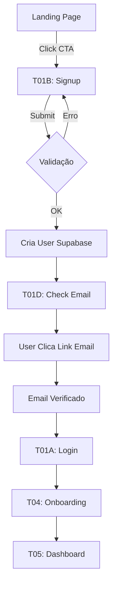
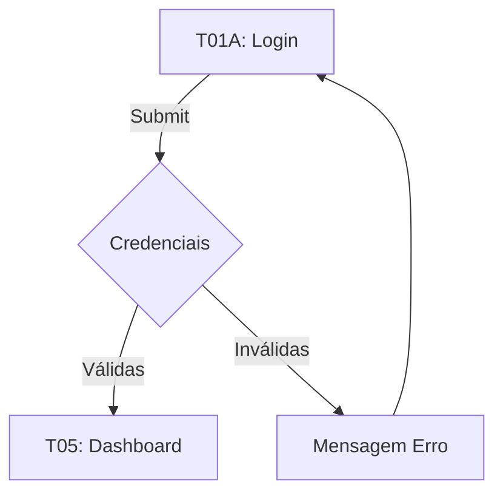
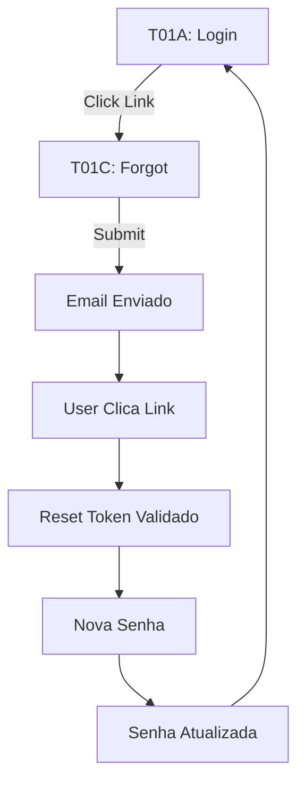

# PRP-01: Autenticação (Login, Signup, Password Reset)
## Automator Sales Engine | v1.0 | 24/01/2026

---

## 📋 ÍNDICE

1. [Visão Geral](#1-visão-geral)
2. [T01A: Login](#2-t01a-login)
3. [T01B: Signup](#3-t01b-signup)
4. [T01C: Forgot Password](#4-t01c-forgot-password)
5. [Fluxos de Interação](#5-fluxos-de-interação)
6. [Validações & Regras](#6-validações--regras)
7. [Estados & Feedback](#7-estados--feedback)
8. [Critérios de Aceite](#8-critérios-de-aceite)

---

## 1. VISÃO GERAL

### Objetivo
Fornecer experiência de autenticação fluida e segura para consultores acessarem a plataforma.

### User Stories

**US-AUTH-01:** Como consultor novo, quero criar uma conta rapidamente para começar a usar a ferramenta.
**US-AUTH-02:** Como consultor existente, quero fazer login de forma segura para acessar meus diagnósticos.
**US-AUTH-03:** Como usuário que esqueceu a senha, quero resetá-la por email para recuperar acesso.
**US-AUTH-04:** Como usuário, quero login social (Google) para acessar mais rápido sem criar senha.

### Telas Incluídas
- **T01A:** Login
- **T01B:** Signup
- **T01C:** Forgot Password
- **T01D:** Email Verification (pós-signup)

### Stack Técnico
- **Auth:** Supabase Auth
- **Social:** Google OAuth
- **Forms:** React Hook Form + Zod
- **UI:** ShadCN/UI components

---

## 2. T01A: LOGIN

### 2.1 Layout & Wireframe

```
┌────────────────────────────────────────────────────────────────┐
│                                                                │
│  ┌─────────────────┐          ┌──────────────────────────┐    │
│  │                 │          │                          │    │
│  │   [LOGO ASE]    │          │   Bem-vindo de volta!    │    │
│  │                 │          │                          │    │
│  │   [Ilustração]  │          │   Faça login para        │    │
│  │   Consultor     │          │   continuar              │    │
│  │   + Dashboard   │          │                          │    │
│  │                 │          │   ┌──────────────────┐   │    │
│  │                 │          │   │ Email            │   │    │
│  │                 │          │   │ ▼                │   │    │
│  │                 │          │   └──────────────────┘   │    │
│  │                 │          │                          │    │
│  │                 │          │   ┌──────────────────┐   │    │
│  │                 │          │   │ Senha     [👁]   │   │    │
│  │                 │          │   │ ▼                │   │    │
│  │                 │          │   └──────────────────┘   │    │
│  │                 │          │                          │    │
│  │                 │          │   ☑ Lembrar de mim       │    │
│  │                 │          │                          │    │
│  │                 │          │   [Esqueci minha senha]  │    │
│  │                 │          │                          │    │
│  │                 │          │   ┌──────────────────┐   │    │
│  │                 │          │   │  Entrar          │   │    │
│  │                 │          │   └──────────────────┘   │    │
│  │                 │          │                          │    │
│  │                 │          │   ──── ou ────           │    │
│  │                 │          │                          │    │
│  │                 │          │   ┌──────────────────┐   │    │
│  │                 │          │   │ 🔵 Google        │   │    │
│  │                 │          │   └──────────────────┘   │    │
│  │                 │          │                          │    │
│  │                 │          │   Não tem conta?         │    │
│  │                 │          │   [Criar conta grátis]   │    │
│  │                 │          │                          │    │
│  └─────────────────┘          └──────────────────────────┘    │
│                                                                │
│  [Footer: Termos • Privacidade • Contato]                     │
│                                                                │
└────────────────────────────────────────────────────────────────┘
```

### 2.2 Elementos UI

| Elemento | Tipo | Props/Validação |
|:---------|:-----|:----------------|
| **Email** | Input text | type="email", required, validação format |
| **Senha** | Input password | type="password", required, min 8 chars |
| **Toggle Ver Senha** | Icon button | Alterna type text/password |
| **Lembrar-me** | Checkbox | Default: unchecked |
| **Link Esqueci Senha** | Link | Navega para T01C |
| **Botão Entrar** | Button primary | Submit form |
| **Botão Google** | Button secondary | OAuth flow |
| **Link Criar Conta** | Link | Navega para T01B |

### 2.3 Comportamento

**Estado Inicial:**
- Campos vazios
- Botão "Entrar" habilitado mas não ativo
- Focus automático no campo Email

**Ao Preencher:**
- Validação on-blur em cada campo
- Mostrar erros inline (abaixo do campo)
- Habilitar botão "Entrar" apenas se form válido

**Ao Submeter:**
1. Desabilitar botão (loading state)
2. Chamar Supabase Auth
3. **Sucesso:** Redirecionar para Dashboard (T05)
4. **Erro:** Mostrar toast error + mensagem específica

**Login Social (Google):**
1. Abrir popup OAuth
2. Usuário autoriza
3. **Sucesso:** Criar/logar user → Dashboard
4. **Erro:** Toast error "Falha no login com Google"

### 2.4 Mensagens de Erro

| Situação | Mensagem |
|:---------|:---------|
| Email inválido | "Digite um email válido" |
| Email não cadastrado | "Email não encontrado. Deseja criar uma conta?" |
| Senha incorreta | "Senha incorreta. Tente novamente ou redefina sua senha." |
| Conta não verificada | "Verifique seu email para ativar sua conta." |
| Muitas tentativas | "Muitas tentativas. Tente novamente em 5 minutos." |
| Erro de rede | "Erro de conexão. Verifique sua internet." |

---

## 3. T01B: SIGNUP

### 3.1 Layout & Wireframe

```
┌────────────────────────────────────────────────────────────────┐
│                                                                │
│  ┌─────────────────┐          ┌──────────────────────────┐    │
│  │                 │          │                          │    │
│  │   [LOGO ASE]    │          │   Crie sua conta         │    │
│  │                 │          │                          │    │
│  │   [Ilustração]  │          │   Comece grátis          │    │
│  │   Checklist     │          │                          │    │
│  │   + Success     │          │   ┌──────────────────┐   │    │
│  │                 │          │   │ Nome completo    │   │    │
│  │   ✓ 60h → 3h   │          │   │ ▼                │   │    │
│  │   ✓ ROI Auto   │          │   └──────────────────┘   │    │
│  │   ✓ Pricing    │          │                          │    │
│  │                 │          │   ┌──────────────────┐   │    │
│  │                 │          │   │ Email            │   │    │
│  │                 │          │   │ ▼                │   │    │
│  │                 │          │   └──────────────────┘   │    │
│  │                 │          │                          │    │
│  │                 │          │   ┌──────────────────┐   │    │
│  │                 │          │   │ Senha     [👁]   │   │    │
│  │                 │          │   │ ▼                │   │    │
│  │                 │          │   └──────────────────┘   │    │
│  │                 │          │   ℹ Mín. 8 caracteres   │    │
│  │                 │          │                          │    │
│  │                 │          │   ┌──────────────────┐   │    │
│  │                 │          │   │ Confirmar senha  │   │    │
│  │                 │          │   │ ▼                │   │    │
│  │                 │          │   └──────────────────┘   │    │
│  │                 │          │                          │    │
│  │                 │          │   ☑ Aceito os Termos     │    │
│  │                 │          │      e Política          │    │
│  │                 │          │                          │    │
│  │                 │          │   ┌──────────────────┐   │    │
│  │                 │          │   │  Criar conta     │   │    │
│  │                 │          │   └──────────────────┘   │    │
│  │                 │          │                          │    │
│  │                 │          │   ──── ou ────           │    │
│  │                 │          │                          │    │
│  │                 │          │   ┌──────────────────┐   │    │
│  │                 │          │   │ 🔵 Google        │   │    │
│  │                 │          │   └──────────────────┘   │    │
│  │                 │          │                          │    │
│  │                 │          │   Já tem conta?          │    │
│  │                 │          │   [Fazer login]          │    │
│  │                 │          │                          │    │
│  └─────────────────┘          └──────────────────────────┘    │
│                                                                │
└────────────────────────────────────────────────────────────────┘
```

### 3.2 Elementos UI

| Elemento | Tipo | Props/Validação |
|:---------|:-----|:----------------|
| **Nome Completo** | Input text | required, min 3 chars |
| **Email** | Input email | required, format, unique check |
| **Senha** | Input password | required, min 8, força validada |
| **Confirmar Senha** | Input password | required, match senha |
| **Aceitar Termos** | Checkbox | required |
| **Botão Criar Conta** | Button primary | Submit form |
| **Botão Google** | Button secondary | OAuth flow |
| **Link Login** | Link | Navega para T01A |

### 3.3 Validações

**Nome:**
- Mínimo 3 caracteres
- Máximo 50 caracteres
- Apenas letras e espaços

**Email:**
- Formato válido (regex)
- Check unicidade (debounced)
- Mostrar ✓ se disponível

**Senha:**
- Mínimo 8 caracteres
- Pelo menos 1 letra maiúscula
- Pelo menos 1 número
- Indicador de força: Fraca/Média/Forte

**Confirmar Senha:**
- Deve ser igual à senha
- Validação on-change

**Termos:**
- Obrigatório marcar
- Link para modal com termos completos

### 3.4 Fluxo de Signup

```
1. Usuário preenche form
2. Validação em tempo real
3. Submete form
   │
   ├──> Supabase cria user
   │    │
   │    ├──> Sucesso:
   │    │    - Envia email verificação
   │    │    - Redireciona para T01D (check email)
   │    │
   │    └──> Erro:
   │         - Email já existe → "Email já cadastrado. [Fazer login]"
   │         - Outro erro → Toast error genérico
   │
4. Usuário verifica email
5. Click no link de verificação
6. Redireciona para Login (T01A) com toast success
```

### 3.5 Signup Social (Google)

**Fluxo:**
1. Click "Continuar com Google"
2. Popup OAuth Google
3. Usuário autoriza
4. **Primeira vez:**
   - Criar user no Supabase
   - Preencher nome do Google
   - Marcar email como verificado
   - Redirecionar para Onboarding (T04)
5. **Já existe:**
   - Login automático
   - Redirecionar para Dashboard (T05)

---

## 4. T01C: FORGOT PASSWORD

### 4.1 Layout & Wireframe

```
┌────────────────────────────────────────────────────────────────┐
│                                                                │
│                    ┌──────────────────────────┐                │
│                    │                          │                │
│                    │   Esqueceu sua senha?    │                │
│                    │                          │                │
│                    │   Sem problemas! Digite  │                │
│                    │   seu email e enviaremos │                │
│                    │   um link de reset.      │                │
│                    │                          │                │
│                    │   ┌──────────────────┐   │                │
│                    │   │ Email            │   │                │
│                    │   │ ▼                │   │                │
│                    │   └──────────────────┘   │                │
│                    │                          │                │
│                    │   ┌──────────────────┐   │                │
│                    │   │  Enviar link     │   │                │
│                    │   └──────────────────┘   │                │
│                    │                          │                │
│                    │   [← Voltar para login]  │                │
│                    │                          │                │
│                    └──────────────────────────┘                │
│                                                                │
└────────────────────────────────────────────────────────────────┘
```

### 4.2 Estados

**Estado Inicial:**
- Campo email vazio
- Botão habilitado

**Após Submeter (Sucesso):**
```
┌──────────────────────────┐
│   ✅ Email enviado!      │
│                          │
│   Enviamos um link para  │
│   reset de senha para:   │
│                          │
│   user@example.com       │
│                          │
│   Verifique sua caixa    │
│   de entrada e spam.     │
│                          │
│   [Voltar para login]    │
│                          │
│   Não recebeu?           │
│   [Reenviar email]       │
│                          │
└──────────────────────────┘
```

**Após Submeter (Email não existe):**
- Não revelar que email não existe (segurança)
- Mostrar mesma mensagem de sucesso
- Apenas não envia email de fato

### 4.3 Fluxo Reset Senha

```
1. Usuário digita email → Submete
2. Sistema envia email com link mágico
3. Usuário clica no link do email
4. Redireciona para tela "Criar Nova Senha"
5. Usuário digita nova senha (2x)
6. Submete → Senha atualizada
7. Redireciona para Login com toast "Senha atualizada com sucesso!"
```

### 4.4 Tela "Criar Nova Senha" (Reset Token)

```
┌──────────────────────────┐
│  Criar nova senha        │
│                          │
│  ┌──────────────────┐    │
│  │ Nova senha [👁]  │    │
│  │ ▼                │    │
│  └──────────────────┘    │
│  ℹ Mín. 8 caracteres     │
│                          │
│  ┌──────────────────┐    │
│  │ Confirmar senha  │    │
│  │ ▼                │    │
│  └──────────────────┘    │
│                          │
│  ┌──────────────────┐    │
│  │  Atualizar senha │    │
│  └──────────────────┘    │
│                          │
└──────────────────────────┘
```

---

## 5. FLUXOS DE INTERAÇÃO

### 5.1 Fluxo Completo: Novo Usuário



### 5.2 Fluxo: Usuário Existente



### 5.3 Fluxo: Esqueceu Senha



---

## 6. VALIDAÇÕES & REGRAS

### 6.1 Regras de Validação

| Campo | Regra | Mensagem Erro |
|:------|:------|:--------------|
| Email | Format RFC 5322 | "Digite um email válido" |
| Email | Único (signup) | "Este email já está em uso" |
| Nome | Min 3 chars | "Nome deve ter pelo menos 3 caracteres" |
| Nome | Max 50 chars | "Nome muito longo (máx. 50 caracteres)" |
| Senha | Min 8 chars | "Senha deve ter pelo menos 8 caracteres" |
| Senha | 1 maiúscula | "Senha deve ter pelo menos 1 letra maiúscula" |
| Senha | 1 número | "Senha deve ter pelo menos 1 número" |
| Confirmar | Match senha | "As senhas não conferem" |
| Termos | Checked | "Você deve aceitar os termos para continuar" |

### 6.2 Segurança

**Rate Limiting:**
- Login: Máx 5 tentativas/5min por IP
- Signup: Máx 3 cadastros/hora por IP
- Reset senha: Máx 3 emails/hora por email

**Token Expiration:**
- Email verification: 24 horas
- Password reset: 1 hora
- Session: 7 dias (com "lembrar-me")

**Proteções:**
- CSRF token em forms
- Captcha após 3 falhas (futuro)
- Não revelar se email existe (forgot password)
- Hash bcrypt para senhas

---

## 7. ESTADOS & FEEDBACK

### 7.1 Estados de Loading

**Botão Login/Signup durante submit:**
```
┌──────────────────┐
│ ⏳ Entrando...   │ ← Spinner + texto
└──────────────────┘
```

**Verificação Email (debounced):**
```
Email: ▼ user@example.com  ⏳  ← Checking...
Email: ▼ user@example.com  ✓  ← Disponível
Email: ▼ user@example.com  ✗  ← Já cadastrado
```

### 7.2 Toast Notifications

| Ação | Tipo | Mensagem |
|:-----|:-----|:---------|
| Login sucesso | Success | "Bem-vindo de volta, [Nome]!" |
| Signup sucesso | Success | "Conta criada! Verifique seu email." |
| Login erro | Error | "Email ou senha incorretos" |
| Reset enviado | Info | "Email de reset enviado para [email]" |
| Senha atualizada | Success | "Senha atualizada com sucesso!" |
| Erro rede | Error | "Erro de conexão. Tente novamente." |

### 7.3 Empty States

**T01D: Check Email (Pós-Signup)**
```
┌────────────────────────────┐
│   📧                       │
│                            │
│   Verifique seu email!     │
│                            │
│   Enviamos um link de      │
│   verificação para:        │
│                            │
│   user@example.com         │
│                            │
│   [Reenviar email]         │
│                            │
│   Email errado?            │
│   [Alterar email]          │
│                            │
└────────────────────────────┘
```

---

## 8. CRITÉRIOS DE ACEITE

### AC-AUTH-01: Login
- [ ] Usuário consegue fazer login com email/senha válidos
- [ ] Redireciona para Dashboard após login sucesso
- [ ] Mostra erro se credenciais inválidas
- [ ] Botão desabilitado durante submit
- [ ] "Lembrar-me" persiste sessão por 7 dias
- [ ] Logout limpa sessão completamente

### AC-AUTH-02: Signup
- [ ] Usuário consegue criar conta com dados válidos
- [ ] Email de verificação é enviado
- [ ] Não permite email duplicado
- [ ] Validação de força de senha funciona
- [ ] Termos são obrigatórios
- [ ] Redireciona para "Check Email" após signup

### AC-AUTH-03: Social Login (Google)
- [ ] Popup OAuth abre corretamente
- [ ] Usuário novo é criado e vai para Onboarding
- [ ] Usuário existente vai direto para Dashboard
- [ ] Email do Google é marcado como verificado
- [ ] Nome é preenchido automaticamente

### AC-AUTH-04: Forgot Password
- [ ] Email de reset é enviado
- [ ] Link mágico tem expiração de 1h
- [ ] Usuário consegue criar nova senha
- [ ] Senha antiga não funciona mais após reset
- [ ] Não revela se email existe (segurança)

### AC-AUTH-05: Validações
- [ ] Todos os campos obrigatórios são validados
- [ ] Erros inline aparecem on-blur
- [ ] Botão submit só habilitado se form válido
- [ ] Mensagens de erro são claras e específicas

### AC-AUTH-06: Segurança
- [ ] Rate limiting funciona (5 tentativas/5min)
- [ ] Sessão expira após 7 dias
- [ ] CSRF token presente em forms
- [ ] Senhas hasheadas com bcrypt
- [ ] Reset token expira após 1h

### AC-AUTH-07: Responsividade
- [ ] Layout mobile funciona (< 640px)
- [ ] Layout tablet funciona (640-1024px)
- [ ] Layout desktop funciona (> 1024px)
- [ ] Ilustração oculta em mobile
- [ ] Forms centralizados e legíveis

### AC-AUTH-08: Acessibilidade
- [ ] Focus order correto (tab navigation)
- [ ] Labels associados a inputs
- [ ] Erros anunciados por screen readers
- [ ] Contraste WCAG AA (4.5:1)
- [ ] Botões têm estados hover/focus/active

---

## 9. ESPECIFICAÇÕES TÉCNICAS

### 9.1 Schema Supabase

```sql
-- Tabela users (gerenciada pelo Supabase Auth)
CREATE TABLE auth.users (
  id UUID PRIMARY KEY DEFAULT uuid_generate_v4(),
  email VARCHAR(255) UNIQUE NOT NULL,
  encrypted_password VARCHAR(255),
  email_confirmed_at TIMESTAMP WITH TIME ZONE,
  created_at TIMESTAMP WITH TIME ZONE DEFAULT NOW(),
  updated_at TIMESTAMP WITH TIME ZONE DEFAULT NOW()
);

-- Tabela profiles (dados adicionais)
CREATE TABLE public.profiles (
  id UUID PRIMARY KEY REFERENCES auth.users(id) ON DELETE CASCADE,
  full_name VARCHAR(100),
  avatar_url TEXT,
  onboarding_completed BOOLEAN DEFAULT false,
  created_at TIMESTAMP WITH TIME ZONE DEFAULT NOW(),
  updated_at TIMESTAMP WITH TIME ZONE DEFAULT NOW()
);

-- RLS Policies
ALTER TABLE public.profiles ENABLE ROW LEVEL SECURITY;

CREATE POLICY "Users can view own profile"
  ON public.profiles FOR SELECT
  USING (auth.uid() = id);

CREATE POLICY "Users can update own profile"
  ON public.profiles FOR UPDATE
  USING (auth.uid() = id);
```

### 9.2 Zod Schemas

```typescript
// schemas/auth.ts
import { z } from 'zod';

export const loginSchema = z.object({
  email: z.string().email('Email inválido'),
  password: z.string().min(8, 'Senha deve ter pelo menos 8 caracteres'),
  rememberMe: z.boolean().optional(),
});

export const signupSchema = z.object({
  fullName: z.string()
    .min(3, 'Nome deve ter pelo menos 3 caracteres')
    .max(50, 'Nome muito longo'),
  email: z.string().email('Email inválido'),
  password: z.string()
    .min(8, 'Mínimo 8 caracteres')
    .regex(/[A-Z]/, 'Pelo menos 1 maiúscula')
    .regex(/[0-9]/, 'Pelo menos 1 número'),
  confirmPassword: z.string(),
  acceptTerms: z.boolean().refine(val => val === true, {
    message: 'Você deve aceitar os termos',
  }),
}).refine(data => data.password === data.confirmPassword, {
  message: 'As senhas não conferem',
  path: ['confirmPassword'],
});

export const forgotPasswordSchema = z.object({
  email: z.string().email('Email inválido'),
});

export const resetPasswordSchema = z.object({
  password: z.string()
    .min(8, 'Mínimo 8 caracteres')
    .regex(/[A-Z]/, 'Pelo menos 1 maiúscula')
    .regex(/[0-9]/, 'Pelo menos 1 número'),
  confirmPassword: z.string(),
}).refine(data => data.password === data.confirmPassword, {
  message: 'As senhas não conferem',
  path: ['confirmPassword'],
});
```

### 9.3 Supabase Functions

```typescript
// lib/auth.ts
import { supabase } from './supabase';

export async function signUp(email: string, password: string, fullName: string) {
  const { data, error } = await supabase.auth.signUp({
    email,
    password,
    options: {
      data: {
        full_name: fullName,
      },
      emailRedirectTo: `${window.location.origin}/auth/callback`,
    },
  });

  if (error) throw error;
  return data;
}

export async function signIn(email: string, password: string, rememberMe: boolean = false) {
  const { data, error } = await supabase.auth.signInWithPassword({
    email,
    password,
  });

  if (error) throw error;

  if (rememberMe) {
    await supabase.auth.setSession(data.session);
  }

  return data;
}

export async function signInWithGoogle() {
  const { data, error } = await supabase.auth.signInWithOAuth({
    provider: 'google',
    options: {
      redirectTo: `${window.location.origin}/auth/callback`,
    },
  });

  if (error) throw error;
  return data;
}

export async function sendPasswordResetEmail(email: string) {
  const { error } = await supabase.auth.resetPasswordForEmail(email, {
    redirectTo: `${window.location.origin}/auth/reset-password`,
  });

  if (error) throw error;
}

export async function updatePassword(newPassword: string) {
  const { error } = await supabase.auth.updateUser({
    password: newPassword,
  });

  if (error) throw error;
}

export async function signOut() {
  const { error } = await supabase.auth.signOut();
  if (error) throw error;
}
```

---

## 10. ASSETS NECESSÁRIOS

### 10.1 Ilustrações
- Login: Consultor + Dashboard (hero image)
- Signup: Checklist + Success icons
- Forgot Password: Envelope + Lock
- Email Sent: Mailbox illustration

**Estilo:** Flat design, cores brand (azul/verde), minimalista

### 10.2 Icons (Lucide React)
- `Mail` - Email input
- `Lock` - Password input
- `Eye` / `EyeOff` - Toggle password
- `User` - Profile/name
- `Check` - Success states
- `AlertCircle` - Error states
- `Info` - Info messages

### 10.3 Logos
- Logo ASE (horizontal) - Header
- Logo ASE (icon) - Favicon
- Google logo - Social login button

---

## 11. MÉTRICAS & TRACKING

### 11.1 Eventos Analytics

```typescript
// Login
analytics.track('login_attempted', { method: 'email' });
analytics.track('login_success', { method: 'email', userId });
analytics.track('login_failed', { error: errorType });

// Signup
analytics.track('signup_started');
analytics.track('signup_completed', { method: 'email' });
analytics.track('signup_failed', { error: errorType });

// Social
analytics.track('social_login_clicked', { provider: 'google' });
analytics.track('social_login_success', { provider: 'google' });

// Password Reset
analytics.track('password_reset_requested');
analytics.track('password_reset_completed');
```

### 11.2 KPIs

| Métrica | Target | Como Medir |
|:--------|:-------|:-----------|
| Signup conversion | >40% | Visitors → Signups |
| Email verification rate | >80% | Emails sent → Verified |
| Login success rate | >95% | Attempts → Success |
| Social login adoption | >30% | Social / Total logins |
| Password reset completion | >60% | Emails sent → Password changed |
| Time to signup | <2min | Timestamp first click → Submit |

---

**Status:** ✅ PRP-01 Completo
**Próximo:** PRP-02 (Onboarding)
