# PRP-01: Onboarding Flow
## Agenda Cheia - Fluxo de Configuração Inicial

> **Módulo:** Onboarding
> **Complexidade:** Alta
> **Prioridade:** P0 (MVP Critical)
> **Estimativa:** 5 dias

---

## Objetivo

Criar um fluxo de onboarding intuitivo e rápido (<10 minutos) que leve o dono do salão do cadastro até o primeiro recall enviado, minimizando fricção e maximizando conversão.

---

## Princípios de Design

1. **Mobile-First:** 80% dos usuários acessam via smartphone
2. **Progressão Visual:** Barra de progresso em todas as telas
3. **Validação Inline:** Feedback imediato em cada campo
4. **Skip Opcional:** Permitir pular etapas não-críticas
5. **Zero Jargão:** Linguagem ultra-simples, sem termos técnicos

---

## Tela 1: Welcome / Landing

### Wireframe

```
┌─────────────────────────────────────────┐
│                                         │
│              [LOGO]                     │
│          💰 Agenda Cheia                │
│                                         │
│     ┌───────────────────────────┐      │
│     │                           │      │
│     │   [Ilustração: Dinheiro   │      │
│     │    caindo no celular]     │      │
│     │                           │      │
│     └───────────────────────────┘      │
│                                         │
│   Recupere clientes que sumiram        │
│      com um robô no WhatsApp           │
│                                         │
│   ✓ 5 clientes de graça                │
│   ✓ Setup em 5 minutos                 │
│   ✓ Não precisa trocar de sistema      │
│                                         │
│   ┌───────────────────────────────┐    │
│   │    Começar Grátis     →       │    │
│   └───────────────────────────────┘    │
│                                         │
│   Já tem conta? [Entrar]               │
│                                         │
└─────────────────────────────────────────┘
```

### Especificações Técnicas

**Componente:** `WelcomeScreen.tsx`

```tsx
interface WelcomeScreenProps {
  onStart: () => void;
  onLogin: () => void;
}

export function WelcomeScreen({ onStart, onLogin }: WelcomeScreenProps) {
  return (
    <div className="flex flex-col items-center justify-center min-h-screen bg-gradient-to-b from-purple-50 to-white px-6">
      {/* Logo */}
      

      {/* Ilustração Hero */}
      <div className="w-full max-w-sm mb-8">
        
      </div>

      {/* Headline */}
      <h1 className="text-2xl font-bold text-center text-gray-900 mb-2">
        Recupere clientes que sumiram
      </h1>
      <p className="text-lg text-center text-gray-600 mb-8">
        com um robô no WhatsApp
      </p>

      {/* Benefícios */}
      <ul className="space-y-3 mb-10 w-full max-w-sm">
        <li className="flex items-center text-gray-700">
          <CheckCircle className="w-5 h-5 text-green-500 mr-3" />
          5 clientes de graça
        </li>
        <li className="flex items-center text-gray-700">
          <CheckCircle className="w-5 h-5 text-green-500 mr-3" />
          Setup em 5 minutos
        </li>
        <li className="flex items-center text-gray-700">
          <CheckCircle className="w-5 h-5 text-green-500 mr-3" />
          Não precisa trocar de sistema
        </li>
      </ul>

      {/* CTA Principal */}
      <button
        onClick={onStart}
        className="w-full max-w-sm bg-purple-600 text-white py-4 rounded-xl font-semibold text-lg shadow-lg hover:bg-purple-700 transition mb-4"
      >
        Começar Grátis →
      </button>

      {/* Login Link */}
      <button onClick={onLogin} className="text-gray-600 text-sm">
        Já tem conta? <span className="text-purple-600 font-semibold">Entrar</span>
      </button>
    </div>
  );
}
```

**Comportamentos:**
- Botão "Começar Grátis" → Navega para Tela 2 (Dados Básicos)
- Link "Entrar" → Abre modal de login (fora do escopo deste PRP)
- Animação suave de fade-in ao carregar (300ms)

**Analytics:**
```typescript
trackEvent('onboarding_welcome_viewed', {
  referrer: document.referrer,
  timestamp: Date.now()
});

// Ao clicar em "Começar Grátis"
trackEvent('onboarding_started', {
  source: 'welcome_screen'
});
```

---

## Tela 2: Dados Básicos

### Wireframe

```
┌─────────────────────────────────────────┐
│  ←  Cadastro                [⚊⚊⚊⚊⚊⚊⚊] │  ← Progress: 1/7
├─────────────────────────────────────────┤
│                                         │
│   👋 Vamos começar!                     │
│                                         │
│   Nome do Salão *                       │
│   ┌───────────────────────────────┐    │
│   │ Ex: Salão da Maria            │    │
│   └───────────────────────────────┘    │
│                                         │
│   Seu Nome *                            │
│   ┌───────────────────────────────┐    │
│   │ Ex: Maria Silva               │    │
│   └───────────────────────────────┘    │
│                                         │
│   Seu WhatsApp *                        │
│   ┌───────────────────────────────┐    │
│   │ (11) 99999-9999               │    │
│   └───────────────────────────────┘    │
│   💡 Será usado para login             │
│                                         │
│   E-mail (opcional)                     │
│   ┌───────────────────────────────┐    │
│   │ maria@email.com               │    │
│   └───────────────────────────────┘    │
│                                         │
│                                         │
│   ┌───────────────────────────────┐    │
│   │      Continuar      →         │    │
│   └───────────────────────────────┘    │
│                                         │
└─────────────────────────────────────────┘
```

### Especificações Técnicas

**Componente:** `BasicInfoStep.tsx`

```tsx
import { useForm } from 'react-hook-form';
import { zodResolver } from '@hookform/resolvers/zod';
import { z } from 'zod';
import InputMask from 'react-input-mask';

const schema = z.object({
  businessName: z.string()
    .min(3, 'Nome do salão deve ter pelo menos 3 caracteres')
    .max(50, 'Nome muito longo'),
  ownerName: z.string()
    .min(3, 'Seu nome deve ter pelo menos 3 caracteres')
    .max(50, 'Nome muito longo'),
  phone: z.string()
    .regex(/^\(\d{2}\) \d{5}-\d{4}$/, 'Telefone inválido'),
  email: z.string()
    .email('E-mail inválido')
    .optional()
    .or(z.literal(''))
});

type FormData = z.infer<typeof schema>;

export function BasicInfoStep({ onNext }: { onNext: (data: FormData) => void }) {
  const { register, handleSubmit, formState: { errors, isValid } } = useForm<FormData>({
    resolver: zodResolver(schema),
    mode: 'onChange' // Validação em tempo real
  });

  return (
    <div className="min-h-screen bg-white px-6 py-4">
      {/* Header */}
      <div className="flex items-center justify-between mb-6">
        <button onClick={() => window.history.back()}>
          <ChevronLeft className="w-6 h-6 text-gray-700" />
        </button>
        <ProgressBar current={1} total={7} />
      </div>

      {/* Título */}
      <h2 className="text-2xl font-bold text-gray-900 mb-8">
        👋 Vamos começar!
      </h2>

      {/* Formulário */}
      <form onSubmit={handleSubmit(onNext)} className="space-y-6">
        {/* Nome do Salão */}
        <div>
          <label className="block text-sm font-medium text-gray-700 mb-2">
            Nome do Salão <span className="text-red-500">*</span>
          </label>
          <input
            {...register('businessName')}
            placeholder="Ex: Salão da Maria"
            className={`w-full px-4 py-3 border rounded-lg focus:ring-2 focus:ring-purple-500 ${
              errors.businessName ? 'border-red-500' : 'border-gray-300'
            }`}
          />
          {errors.businessName && (
            <p className="text-red-500 text-sm mt-1">{errors.businessName.message}</p>
          )}
        </div>

        {/* Seu Nome */}
        <div>
          <label className="block text-sm font-medium text-gray-700 mb-2">
            Seu Nome <span className="text-red-500">*</span>
          </label>
          <input
            {...register('ownerName')}
            placeholder="Ex: Maria Silva"
            className={`w-full px-4 py-3 border rounded-lg focus:ring-2 focus:ring-purple-500 ${
              errors.ownerName ? 'border-red-500' : 'border-gray-300'
            }`}
          />
          {errors.ownerName && (
            <p className="text-red-500 text-sm mt-1">{errors.ownerName.message}</p>
          )}
        </div>

        {/* WhatsApp */}
        <div>
          <label className="block text-sm font-medium text-gray-700 mb-2">
            Seu WhatsApp <span className="text-red-500">*</span>
          </label>
          <InputMask
            mask="(99) 99999-9999"
            {...register('phone')}
            placeholder="(11) 99999-9999"
            className={`w-full px-4 py-3 border rounded-lg focus:ring-2 focus:ring-purple-500 ${
              errors.phone ? 'border-red-500' : 'border-gray-300'
            }`}
          />
          {errors.phone && (
            <p className="text-red-500 text-sm mt-1">{errors.phone.message}</p>
          )}
          <p className="text-gray-500 text-sm mt-1 flex items-center">
            <Info className="w-4 h-4 mr-1" />
            Será usado para login
          </p>
        </div>

        {/* E-mail (Opcional) */}
        <div>
          <label className="block text-sm font-medium text-gray-700 mb-2">
            E-mail (opcional)
          </label>
          <input
            {...register('email')}
            type="email"
            placeholder="maria@email.com"
            className="w-full px-4 py-3 border border-gray-300 rounded-lg focus:ring-2 focus:ring-purple-500"
          />
        </div>

        {/* Botão Continuar */}
        <button
          type="submit"
          disabled={!isValid}
          className={`w-full py-4 rounded-xl font-semibold text-lg transition ${
            isValid
              ? 'bg-purple-600 text-white hover:bg-purple-700'
              : 'bg-gray-200 text-gray-400 cursor-not-allowed'
          }`}
        >
          Continuar →
        </button>
      </form>
    </div>
  );
}
```

**Validações:**
- Nome do salão: 3-50 caracteres
- Seu nome: 3-50 caracteres
- WhatsApp: Formato brasileiro (11) 99999-9999
- E-mail: Formato válido (opcional)
- Botão desabilitado até todos campos obrigatórios válidos

**Comportamentos:**
- Máscara automática no campo de telefone
- Validação em tempo real (onChange)
- Botão "Continuar" desabilitado se inválido
- Voltar: Retorna para Tela 1

---

## Tela 3: Conectar WhatsApp

### Wireframe

```
┌─────────────────────────────────────────┐
│  ←  WhatsApp                [⚊⚊⚊⚊⚊⚊⚊] │  ← Progress: 2/7
├─────────────────────────────────────────┤
│                                         │
│   📱 Conectar WhatsApp                  │
│                                         │
│   Abra o WhatsApp no seu celular e      │
│   escaneie o código abaixo:             │
│                                         │
│   ┌─────────────────────────────────┐  │
│   │                                 │  │
│   │   ████████████████████████      │  │
│   │   ██  QR CODE AQUI      ██      │  │
│   │   ████████████████████████      │  │
│   │                                 │  │
│   │   [Animação de Loading...]      │  │
│   │                                 │  │
│   └─────────────────────────────────┘  │
│                                         │
│   ⏱ Aguardando conexão...              │
│                                         │
│   Como escanear:                        │
│   1. Abra WhatsApp → Mais Opções (⋮)   │
│   2. Toque em "Aparelhos conectados"   │
│   3. Toque em "Conectar aparelho"      │
│   4. Aponte a câmera para o código     │
│                                         │
│   [❓ Precisa de ajuda?]                │
│                                         │
│   ┌───────────────────────────────┐    │
│   │     Gerar Novo Código         │    │ ← Se expirar (2min)
│   └───────────────────────────────┘    │
│                                         │
└─────────────────────────────────────────┘

// Estado: Conectado ✅
┌─────────────────────────────────────────┐
│                                         │
│   ✅ WhatsApp Conectado!                │
│                                         │
│   ┌─────────────────────────────────┐  │
│   │                                 │  │
│   │   [Ícone de Check Grande]       │  │
│   │                                 │  │
│   │   (11) 99999-9999               │  │
│   │   Salão da Maria                │  │
│   │                                 │  │
│   └─────────────────────────────────┘  │
│                                         │
│   ┌───────────────────────────────┐    │
│   │      Continuar      →         │    │
│   └───────────────────────────────┘    │
│                                         │
└─────────────────────────────────────────┘
```

### Especificações Técnicas

**Componente:** `WhatsAppConnectionStep.tsx`

```tsx
import { useState, useEffect } from 'react';
import QRCode from 'qrcode.react';
import { useWebSocket } from '@/hooks/useWebSocket';

enum ConnectionStatus {
  LOADING = 'loading',
  WAITING = 'waiting',
  CONNECTED = 'connected',
  EXPIRED = 'expired',
  ERROR = 'error'
}

export function WhatsAppConnectionStep({ onNext }: { onNext: () => void }) {
  const [status, setStatus] = useState<ConnectionStatus>(ConnectionStatus.LOADING);
  const [qrCode, setQrCode] = useState<string>('');
  const [expiresAt, setExpiresAt] = useState<number>(0);

  // WebSocket para receber eventos de conexão em tempo real
  const { sendMessage, lastMessage } = useWebSocket('wss://api.agendacheia.com/ws');

  useEffect(() => {
    // Solicitar QR Code ao backend
    generateQRCode();
  }, []);

  useEffect(() => {
    // Escutar eventos do WebSocket
    if (lastMessage) {
      const event = JSON.parse(lastMessage.data);

      if (event.type === 'qr_code_ready') {
        setQrCode(event.qrCode);
        setExpiresAt(Date.now() + 120000); // 2 minutos
        setStatus(ConnectionStatus.WAITING);
        startExpirationTimer();
      }

      if (event.type === 'whatsapp_connected') {
        setStatus(ConnectionStatus.CONNECTED);
        // Auto-avançar após 2 segundos
        setTimeout(() => onNext(), 2000);
      }
    }
  }, [lastMessage]);

  const generateQRCode = async () => {
    setStatus(ConnectionStatus.LOADING);

    try {
      const response = await fetch('/api/v1/whatsapp/qr-code', {
        method: 'POST',
        headers: { 'Content-Type': 'application/json' },
        body: JSON.stringify({ tenantId: getCurrentTenantId() })
      });

      const data = await response.json();
      setQrCode(data.qrCode);
      setExpiresAt(Date.now() + 120000); // 2 minutos
      setStatus(ConnectionStatus.WAITING);
    } catch (error) {
      setStatus(ConnectionStatus.ERROR);
    }
  };

  const startExpirationTimer = () => {
    setTimeout(() => {
      if (status === ConnectionStatus.WAITING) {
        setStatus(ConnectionStatus.EXPIRED);
      }
    }, 120000); // 2 minutos
  };

  // Renderização condicional baseada no status
  if (status === ConnectionStatus.CONNECTED) {
    return (
      <div className="min-h-screen bg-white px-6 py-4 flex flex-col items-center justify-center">
        <div className="text-center">
          <CheckCircle className="w-24 h-24 text-green-500 mx-auto mb-4 animate-bounce" />
          <h2 className="text-2xl font-bold text-gray-900 mb-2">
            ✅ WhatsApp Conectado!
          </h2>
          <p className="text-gray-600 mb-8">
            (11) 99999-9999<br />
            Salão da Maria
          </p>
          <button
            onClick={onNext}
            className="w-full max-w-sm bg-purple-600 text-white py-4 rounded-xl font-semibold"
          >
            Continuar →
          </button>
        </div>
      </div>
    );
  }

  return (
    <div className="min-h-screen bg-white px-6 py-4">
      {/* Header */}
      <div className="flex items-center justify-between mb-6">
        <button onClick={() => window.history.back()}>
          <ChevronLeft className="w-6 h-6 text-gray-700" />
        </button>
        <ProgressBar current={2} total={7} />
      </div>

      {/* Título */}
      <h2 className="text-2xl font-bold text-gray-900 mb-2">
        📱 Conectar WhatsApp
      </h2>
      <p className="text-gray-600 mb-8">
        Abra o WhatsApp no seu celular e escaneie o código abaixo:
      </p>

      {/* QR Code */}
      <div className="flex justify-center mb-6">
        <div className="bg-white p-6 rounded-2xl shadow-lg border border-gray-200">
          {status === ConnectionStatus.LOADING && (
            <div className="w-64 h-64 flex items-center justify-center">
              <Loader className="w-12 h-12 text-purple-600 animate-spin" />
            </div>
          )}

          {status === ConnectionStatus.WAITING && (
            <QRCode value={qrCode} size={256} />
          )}

          {status === ConnectionStatus.EXPIRED && (
            <div className="w-64 h-64 flex items-center justify-center text-center">
              <div>
                <AlertCircle className="w-12 h-12 text-orange-500 mx-auto mb-2" />
                <p className="text-gray-600">Código expirado</p>
              </div>
            </div>
          )}
        </div>
      </div>

      {/* Status */}
      {status === ConnectionStatus.WAITING && (
        <p className="text-center text-gray-600 mb-6 flex items-center justify-center">
          <Clock className="w-4 h-4 mr-2 animate-pulse" />
          Aguardando conexão...
        </p>
      )}

      {/* Instruções */}
      <div className="bg-blue-50 border border-blue-200 rounded-lg p-4 mb-6">
        <p className="font-semibold text-gray-900 mb-2">Como escanear:</p>
        <ol className="space-y-1 text-sm text-gray-700">
          <li>1. Abra WhatsApp → Mais Opções (⋮)</li>
          <li>2. Toque em "Aparelhos conectados"</li>
          <li>3. Toque em "Conectar aparelho"</li>
          <li>4. Aponte a câmera para o código</li>
        </ol>
      </div>

      {/* Botão de Ajuda */}
      <button className="w-full text-purple-600 font-semibold mb-4">
        ❓ Precisa de ajuda?
      </button>

      {/* Gerar Novo Código */}
      {(status === ConnectionStatus.EXPIRED || status === ConnectionStatus.ERROR) && (
        <button
          onClick={generateQRCode}
          className="w-full bg-gray-100 text-gray-700 py-3 rounded-lg font-semibold"
        >
          Gerar Novo Código
        </button>
      )}
    </div>
  );
}
```

**Fluxo de Dados:**

```mermaid
sequenceDiagram
    Frontend->>Backend: POST /api/v1/whatsapp/qr-code
    Backend->>Z-API: Solicitar QR Code
    Z-API-->>Backend: QR Code string
    Backend-->>Frontend: {qrCode, instanceId}
    Frontend->>Frontend: Renderizar QRCode

    Note over Z-API: Usuário escaneia

    Z-API->>Backend: Webhook: connection_status = connected
    Backend->>WebSocket: Broadcast evento
    WebSocket-->>Frontend: {type: 'whatsapp_connected'}
    Frontend->>Frontend: Mostrar "Conectado ✅"
    Frontend->>Frontend: Auto-avançar (2s)
```



**Estados:**
- `loading`: Gerando QR Code
- `waiting`: Aguardando scan (timer 2min)
- `connected`: Sucesso ✅
- `expired`: QR Code expirou
- `error`: Erro ao gerar

**Comportamentos:**
- QR Code expira em 2 minutos
- WebSocket para updates em tempo real
- Auto-avança para próxima tela após conexão
- Botão "Gerar Novo Código" se expirar

---

## Tela 4: Importar Clientes

### Wireframe

```
┌─────────────────────────────────────────┐
│  ←  Clientes                [⚊⚊⚊⚊⚊⚊⚊] │  ← Progress: 3/7
├─────────────────────────────────────────┤
│                                         │
│   👥 Adicionar Clientes                 │
│                                         │
│   Escolha como importar:                │
│                                         │
│   ┌───────────────────────────────┐    │
│   │   📄 Importar Planilha (CSV)  │    │
│   │                               │    │
│   │   Arraste aqui ou clique      │    │
│   │   para selecionar             │    │
│   └───────────────────────────────┘    │
│                                         │
│          ─────── ou ───────             │
│                                         │
│   ┌───────────────────────────────┐    │
│   │   ✏️ Adicionar Manualmente    │    │
│   └───────────────────────────────┘    │
│                                         │
│   💡 Dica: Exporte do seu sistema       │
│      atual (Trinks, Avec, etc)          │
│                                         │
│   [📥 Baixar modelo CSV]                │
│                                         │
└─────────────────────────────────────────┘

// Estado: Arquivo Selecionado
┌─────────────────────────────────────────┐
│  ←  Clientes                [⚊⚊⚊⚊⚊⚊⚊] │
├─────────────────────────────────────────┤
│                                         │
│   📄 clientes.csv                       │
│   153 linhas · 12 KB                    │
│                                         │
│   ⏳ Processando...                     │
│   [████████████░░░░░] 75%               │
│                                         │
└─────────────────────────────────────────┘

// Estado: Preview de Dados
┌─────────────────────────────────────────┐
│  ←  Preview                 [⚊⚊⚊⚊⚊⚊⚊] │
├─────────────────────────────────────────┤
│                                         │
│   ✅ 150 clientes encontrados           │
│   ⚠️  3 com erros (ver abaixo)          │
│                                         │
│   Preview (primeiras 5 linhas):         │
│                                         │
│   ┌─────────────────────────────────┐  │
│   │ Maria Silva                     │  │
│   │ (11) 99999-9999                 │  │
│   │ Última visita: 10/12/2025       │  │
│   │ Serviço: Manicure               │  │
│   ├─────────────────────────────────┤  │
│   │ João Santos                     │  │
│   │ (11) 98888-8888                 │  │
│   │ Última visita: 15/11/2025       │  │
│   │ Serviço: Barba                  │  │
│   └─────────────────────────────────┘  │
│   ...e mais 148                         │
│                                         │
│   ⚠️ Erros encontrados (3):             │
│   • Linha 12: Telefone inválido         │
│   • Linha 45: Data inválida             │
│   • Linha 78: Nome vazio                │
│                                         │
│   [ ] Importar mesmo com erros          │
│       (3 clientes serão ignorados)      │
│                                         │
│   ┌───────────────────────────────┐    │
│   │   Corrigir Erros              │    │
│   └───────────────────────────────┘    │
│                                         │
│   ┌───────────────────────────────┐    │
│   │   Importar 150 Clientes  →    │    │
│   └───────────────────────────────┘    │
│                                         │
└─────────────────────────────────────────┘
```

### Especificações Técnicas

**Componente:** `ImportClientsStep.tsx`

```tsx
import { useState } from 'react';
import { useDropzone } from 'react-dropzone';
import Papa from 'papaparse';

interface CSVRow {
  nome: string;
  telefone: string;
  ultima_visita: string;
  servico: string;
  profissional?: string;
}

interface ValidationError {
  line: number;
  field: string;
  message: string;
}

export function ImportClientsStep({ onNext }: { onNext: (clients: any[]) => void }) {
  const [uploadState, setUploadState] = useState<'idle' | 'uploading' | 'preview'>('idle');
  const [clients, setClients] = useState<CSVRow[]>([]);
  const [errors, setErrors] = useState<ValidationError[]>([]);
  const [ignoreErrors, setIgnoreErrors] = useState(false);

  const { getRootProps, getInputProps, isDragActive } = useDropzone({
    accept: {
      'text/csv': ['.csv'],
      'application/vnd.ms-excel': ['.csv']
    },
    maxFiles: 1,
    onDrop: handleFileDrop
  });

  async function handleFileDrop(files: File[]) {
    const file = files[0];
    if (!file) return;

    setUploadState('uploading');

    Papa.parse(file, {
      header: true,
      skipEmptyLines: true,
      complete: (results) => {
        const validatedData = validateCSV(results.data as CSVRow[]);
        setClients(validatedData.valid);
        setErrors(validatedData.errors);
        setUploadState('preview');
      },
      error: (error) => {
        alert('Erro ao processar arquivo: ' + error.message);
        setUploadState('idle');
      }
    });
  }

  function validateCSV(data: CSVRow[]) {
    const valid: CSVRow[] = [];
    const errors: ValidationError[] = [];

    data.forEach((row, index) => {
      const lineNumber = index + 2; // +2 porque index começa em 0 e tem header
      let hasError = false;

      // Validar nome
      if (!row.nome || row.nome.trim().length < 3) {
        errors.push({
          line: lineNumber,
          field: 'nome',
          message: 'Nome inválido ou vazio'
        });
        hasError = true;
      }

      // Validar telefone
      const phoneRegex = /^\d{10,11}$/; // Aceita com ou sem DDD
      const cleanPhone = row.telefone?.replace(/\D/g, '');
      if (!cleanPhone || !phoneRegex.test(cleanPhone)) {
        errors.push({
          line: lineNumber,
          field: 'telefone',
          message: 'Telefone inválido'
        });
        hasError = true;
      }

      // Validar data
      const dateRegex = /^\d{2}\/\d{2}\/\d{4}$/;
      if (row.ultima_visita && !dateRegex.test(row.ultima_visita)) {
        errors.push({
          line: lineNumber,
          field: 'ultima_visita',
          message: 'Data inválida (use DD/MM/AAAA)'
        });
        hasError = true;
      }

      if (!hasError) {
        valid.push(row);
      }
    });

    return { valid, errors };
  }

  function handleImport() {
    const dataToImport = ignoreErrors
      ? clients
      : clients; // Se não ignorar erros, só importa os válidos

    onNext(dataToImport);
  }

  // Estado: Upload inicial
  if (uploadState === 'idle') {
    return (
      <div className="min-h-screen bg-white px-6 py-4">
        <div className="flex items-center justify-between mb-6">
          <button onClick={() => window.history.back()}>
            <ChevronLeft className="w-6 h-6 text-gray-700" />
          </button>
          <ProgressBar current={3} total={7} />
        </div>

        <h2 className="text-2xl font-bold text-gray-900 mb-8">
          👥 Adicionar Clientes
        </h2>

        <p className="text-gray-600 mb-6">Escolha como importar:</p>

        {/* Dropzone */}
        <div
          {...getRootProps()}
          className={`border-2 border-dashed rounded-xl p-8 text-center cursor-pointer transition mb-6 ${
            isDragActive
              ? 'border-purple-500 bg-purple-50'
              : 'border-gray-300 hover:border-purple-400'
          }`}
        >
          <input {...getInputProps()} />
          <Upload className="w-12 h-12 text-gray-400 mx-auto mb-3" />
          <p className="font-semibold text-gray-700 mb-1">
            📄 Importar Planilha (CSV)
          </p>
          <p className="text-sm text-gray-500">
            {isDragActive ? 'Solte o arquivo aqui' : 'Arraste aqui ou clique para selecionar'}
          </p>
        </div>

        {/* Divisor */}
        <div className="flex items-center gap-4 mb-6">
          <div className="flex-1 h-px bg-gray-300" />
          <span className="text-gray-500 text-sm">ou</span>
          <div className="flex-1 h-px bg-gray-300" />
        </div>

        {/* Adicionar Manual */}
        <button
          onClick={() => {/* Navegar para tela de adição manual */}}
          className="w-full border-2 border-gray-300 rounded-xl py-4 font-semibold text-gray-700 hover:border-purple-400 transition"
        >
          ✏️ Adicionar Manualmente
        </button>

        {/* Dica */}
        <div className="bg-blue-50 border border-blue-200 rounded-lg p-4 mt-6 mb-4">
          <p className="text-sm text-gray-700 flex items-start">
            <Info className="w-4 h-4 mr-2 mt-0.5 flex-shrink-0 text-blue-600" />
            Dica: Exporte do seu sistema atual (Trinks, Avec, etc)
          </p>
        </div>

        {/* Download Template */}
        <button
          onClick={() => window.open('/templates/clientes.csv')}
          className="w-full text-purple-600 font-semibold text-sm"
        >
          📥 Baixar modelo CSV
        </button>
      </div>
    );
  }

  // Estado: Uploading
  if (uploadState === 'uploading') {
    return (
      <div className="min-h-screen bg-white px-6 py-4 flex items-center justify-center">
        <div className="text-center">
          <Loader className="w-12 h-12 text-purple-600 animate-spin mx-auto mb-4" />
          <p className="text-gray-700 font-semibold">Processando arquivo...</p>
          <p className="text-gray-500 text-sm mt-2">Aguarde alguns segundos</p>
        </div>
      </div>
    );
  }

  // Estado: Preview
  return (
    <div className="min-h-screen bg-white px-6 py-4">
      <div className="flex items-center justify-between mb-6">
        <button onClick={() => setUploadState('idle')}>
          <ChevronLeft className="w-6 h-6 text-gray-700" />
        </button>
        <ProgressBar current={3} total={7} />
      </div>

      <h2 className="text-2xl font-bold text-gray-900 mb-6">Preview</h2>

      {/* Status */}
      <div className="space-y-2 mb-6">
        <div className="flex items-center text-green-600">
          <CheckCircle className="w-5 h-5 mr-2" />
          <span className="font-semibold">{clients.length} clientes encontrados</span>
        </div>
        {errors.length > 0 && (
          <div className="flex items-center text-orange-600">
            <AlertCircle className="w-5 h-5 mr-2" />
            <span className="font-semibold">{errors.length} com erros</span>
          </div>
        )}
      </div>

      {/* Preview Cards */}
      <p className="text-gray-600 mb-3">Preview (primeiras 5 linhas):</p>
      <div className="space-y-3 mb-6">
        {clients.slice(0, 5).map((client, i) => (
          <div key={i} className="border border-gray-200 rounded-lg p-4">
            <p className="font-semibold text-gray-900">{client.nome}</p>
            <p className="text-sm text-gray-600">{client.telefone}</p>
            <p className="text-sm text-gray-600">Última visita: {client.ultima_visita}</p>
            <p className="text-sm text-gray-600">Serviço: {client.servico}</p>
          </div>
        ))}
      </div>
      {clients.length > 5 && (
        <p className="text-gray-500 text-sm mb-6">...e mais {clients.length - 5}</p>
      )}

      {/* Erros */}
      {errors.length > 0 && (
        <div className="bg-orange-50 border border-orange-200 rounded-lg p-4 mb-6">
          <p className="font-semibold text-gray-900 mb-2">
            ⚠️ Erros encontrados ({errors.length}):
          </p>
          <ul className="space-y-1 text-sm text-gray-700">
            {errors.slice(0, 5).map((error, i) => (
              <li key={i}>• Linha {error.line}: {error.message}</li>
            ))}
          </ul>
          {errors.length > 5 && (
            <p className="text-xs text-gray-500 mt-2">...e mais {errors.length - 5}</p>
          )}

          <label className="flex items-center mt-4">
            <input
              type="checkbox"
              checked={ignoreErrors}
              onChange={(e) => setIgnoreErrors(e.target.checked)}
              className="w-4 h-4 text-purple-600 mr-2"
            />
            <span className="text-sm">
              Importar mesmo com erros ({errors.length} clientes serão ignorados)
            </span>
          </label>
        </div>
      )}

      {/* Botões */}
      {errors.length > 0 && !ignoreErrors && (
        <button
          onClick={() => setUploadState('idle')}
          className="w-full bg-gray-100 text-gray-700 py-3 rounded-lg font-semibold mb-3"
        >
          Corrigir Erros
        </button>
      )}

      <button
        onClick={handleImport}
        className="w-full bg-purple-600 text-white py-4 rounded-xl font-semibold"
      >
        Importar {clients.length} Clientes →
      </button>
    </div>
  );
}
```

**Formato CSV Esperado:**
```csv
nome,telefone,ultima_visita,servico,profissional
Maria Silva,11999999999,10/12/2025,Manicure,Carol
João Santos,11988888888,15/11/2025,Barba,Rafael
```

**Validações:**
- Nome: Min 3 caracteres
- Telefone: 10-11 dígitos (limpar não-numéricos)
- Data: DD/MM/AAAA (opcional)
- Serviço: String (opcional)

---

## Tela 5: Definir Ciclos de Serviço

### Wireframe

```
┌─────────────────────────────────────────┐
│  ←  Ciclos                  [⚊⚊⚊⚊⚊⚊⚊] │  ← Progress: 4/7
├─────────────────────────────────────────┤
│                                         │
│   ⏰ Ciclo dos Serviços                 │
│                                         │
│   Quando seus clientes devem retornar?  │
│                                         │
│   ┌───────────────────────────────┐    │
│   │ Manicure/Pedicure             │    │
│   │ ┌───┐ dias                    │    │
│   │ │21 │ [- +]                   │    │
│   │ └───┘                         │    │
│   └───────────────────────────────┘    │
│                                         │
│   ┌───────────────────────────────┐    │
│   │ Cabelo Feminino               │    │
│   │ ┌───┐ dias                    │    │
│   │ │35 │ [- +]                   │    │
│   │ └───┘                         │    │
│   └───────────────────────────────┘    │
│                                         │
│   ┌───────────────────────────────┐    │
│   │ Barba                         │    │
│   │ ┌───┐ dias                    │    │
│   │ │15 │ [- +]                   │    │
│   │ └───┘                         │    │
│   └───────────────────────────────┘    │
│                                         │
│   [+ Adicionar Outro Serviço]           │
│                                         │
│   💡 Não sabe o ciclo? Deixe padrão     │
│                                         │
│   ┌───────────────────────────────┐    │
│   │      Continuar      →         │    │
│   └───────────────────────────────┘    │
│                                         │
│   [Pular esta etapa]                    │
│                                         │
└─────────────────────────────────────────┘
```

### Especificações Técnicas

**Componente:** `ServiceCyclesStep.tsx`

```tsx
import { useState } from 'react';
import { Plus, Minus, X } from 'lucide-react';

interface ServiceCycle {
  id: string;
  name: string;
  days: number;
}

const DEFAULT_CYCLES: ServiceCycle[] = [
  { id: '1', name: 'Manicure/Pedicure', days: 21 },
  { id: '2', name: 'Cabelo Feminino', days: 35 },
  { id: '3', name: 'Barba', days: 15 }
];

export function ServiceCyclesStep({ onNext, onSkip }: {
  onNext: (cycles: ServiceCycle[]) => void;
  onSkip: () => void;
}) {
  const [cycles, setCycles] = useState<ServiceCycle[]>(DEFAULT_CYCLES);
  const [newServiceName, setNewServiceName] = useState('');
  const [showAddForm, setShowAddForm] = useState(false);

  const updateCycleDays = (id: string, delta: number) => {
    setCycles(prev => prev.map(cycle => {
      if (cycle.id === id) {
        const newDays = Math.max(1, Math.min(365, cycle.days + delta));
        return { ...cycle, days: newDays };
      }
      return cycle;
    }));
  };

  const addNewService = () => {
    if (!newServiceName.trim()) return;

    const newCycle: ServiceCycle = {
      id: Date.now().toString(),
      name: newServiceName,
      days: 30
    };

    setCycles(prev => [...prev, newCycle]);
    setNewServiceName('');
    setShowAddForm(false);
  };

  const removeService = (id: string) => {
    setCycles(prev => prev.filter(c => c.id !== id));
  };

  return (
    <div className="min-h-screen bg-white px-6 py-4">
      <div className="flex items-center justify-between mb-6">
        <button onClick={() => window.history.back()}>
          <ChevronLeft className="w-6 h-6 text-gray-700" />
        </button>
        <ProgressBar current={4} total={7} />
      </div>

      <h2 className="text-2xl font-bold text-gray-900 mb-2">
        ⏰ Ciclo dos Serviços
      </h2>
      <p className="text-gray-600 mb-8">
        Quando seus clientes devem retornar?
      </p>

      {/* Lista de Ciclos */}
      <div className="space-y-4 mb-6">
        {cycles.map(cycle => (
          <div key={cycle.id} className="border border-gray-200 rounded-lg p-4">
            <div className="flex items-center justify-between mb-3">
              <span className="font-semibold text-gray-900">{cycle.name}</span>
              {cycles.length > 1 && (
                <button onClick={() => removeService(cycle.id)}>
                  <X className="w-5 h-5 text-gray-400 hover:text-red-500" />
                </button>
              )}
            </div>

            <div className="flex items-center gap-3">
              <button
                onClick={() => updateCycleDays(cycle.id, -1)}
                className="w-10 h-10 bg-gray-100 rounded-lg flex items-center justify-center hover:bg-gray-200"
              >
                <Minus className="w-4 h-4" />
              </button>

              <div className="flex-1">
                <input
                  type="number"
                  value={cycle.days}
                  onChange={(e) => {
                    const value = parseInt(e.target.value) || 1;
                    setCycles(prev => prev.map(c =>
                      c.id === cycle.id ? { ...c, days: value } : c
                    ));
                  }}
                  className="w-20 text-center text-2xl font-bold text-gray-900 border-0 focus:ring-0"
                />
                <span className="text-gray-600 ml-2">dias</span>
              </div>

              <button
                onClick={() => updateCycleDays(cycle.id, 1)}
                className="w-10 h-10 bg-gray-100 rounded-lg flex items-center justify-center hover:bg-gray-200"
              >
                <Plus className="w-4 h-4" />
              </button>
            </div>
          </div>
        ))}
      </div>

      {/* Adicionar Novo Serviço */}
      {!showAddForm ? (
        <button
          onClick={() => setShowAddForm(true)}
          className="w-full border-2 border-dashed border-gray-300 rounded-lg py-3 text-purple-600 font-semibold hover:border-purple-400"
        >
          + Adicionar Outro Serviço
        </button>
      ) : (
        <div className="border-2 border-purple-400 rounded-lg p-4 mb-6">
          <input
            autoFocus
            type="text"
            value={newServiceName}
            onChange={(e) => setNewServiceName(e.target.value)}
            onKeyPress={(e) => e.key === 'Enter' && addNewService()}
            placeholder="Nome do serviço (ex: Progressiva)"
            className="w-full border-0 focus:ring-0 text-lg mb-3"
          />
          <div className="flex gap-2">
            <button
              onClick={addNewService}
              className="flex-1 bg-purple-600 text-white py-2 rounded-lg font-semibold"
            >
              Adicionar
            </button>
            <button
              onClick={() => {
                setShowAddForm(false);
                setNewServiceName('');
              }}
              className="px-4 bg-gray-100 text-gray-700 py-2 rounded-lg font-semibold"
            >
              Cancelar
            </button>
          </div>
        </div>
      )}

      {/* Dica */}
      <div className="bg-blue-50 border border-blue-200 rounded-lg p-4 my-6">
        <p className="text-sm text-gray-700 flex items-start">
          <Info className="w-4 h-4 mr-2 mt-0.5 flex-shrink-0 text-blue-600" />
          Não sabe o ciclo? Deixe padrão. Você pode ajustar depois.
        </p>
      </div>

      {/* Botão Continuar */}
      <button
        onClick={() => onNext(cycles)}
        className="w-full bg-purple-600 text-white py-4 rounded-xl font-semibold mb-3"
      >
        Continuar →
      </button>

      {/* Pular */}
      <button
        onClick={onSkip}
        className="w-full text-gray-600 text-sm font-semibold"
      >
        Pular esta etapa
      </button>
    </div>
  );
}
```

**Comportamentos:**
- Botões +/- ajustam ciclo em 1 dia
- Input direto permite digitar valor
- Min: 1 dia, Max: 365 dias
- Adicionar novo serviço: Enter ou botão
- Remover serviço: X (mínimo 1 serviço)
- "Pular" → Usa ciclos padrão

---

## Tela 6: Termo LGPD

### Wireframe

```
┌─────────────────────────────────────────┐
│  ←  Termos                  [⚊⚊⚊⚊⚊⚊⚊] │  ← Progress: 5/7
├─────────────────────────────────────────┤
│                                         │
│   📋 Termo de Responsabilidade          │
│                                         │
│   ┌─────────────────────────────────┐  │
│   │ (Área de Scroll)                │  │
│   │                                 │  │
│   │ Declaro que:                    │  │
│   │                                 │  │
│   │ 1. Tenho autorização legal      │  │
│   │    (Consentimento ou Legítimo   │  │
│   │    Interesse) para contatar     │  │
│   │    estes clientes via WhatsApp. │  │
│   │                                 │  │
│   │ 2. Estou ciente dos riscos de   │  │
│   │    uso de automação no WhatsApp │  │
│    e isento a Agenda Cheia de      │  │
│   │    responsabilidade sobre       │  │
│   │    eventuais bloqueios.         │  │
│   │                                 │  │
│   │ 3. Os dados dos clientes serão  │  │
│   │    usados apenas para envio de  │  │
│   │    lembretes de retorno.        │  │
│   │                                 │  │
│   │ 4. Comprometome a respeitar     │  │
│   │    pedidos de opt-out imediato. │  │
│   │                                 │  │
│   │ Lei 13.709/2018 (LGPD)          │  │
│   │ Versão: 1.0 - 06/01/2026        │  │
│   │                                 │  │
│   └─────────────────────────────────┘  │
│                                         │
│   [Ver termo completo]                  │
│                                         │
│   ┌─────────────────────────────────┐  │
│   │ [ ] Li e aceito os termos acima │  │
│   └─────────────────────────────────┘  │
│                                         │
│   ┌───────────────────────────────┐    │
│   │   Aceitar e Continuar  →      │    │ ← Disabled se não marcar
│   └───────────────────────────────┘    │
│                                         │
└─────────────────────────────────────────┘
```

### Especificações Técnicas

**Componente:** `LGPDConsentStep.tsx`

```tsx
import { useState } from 'react';

const TERM_TEXT = `
TERMO DE RESPONSABILIDADE E CONSENTIMENTO

Ao aceitar este termo, DECLARO que:

1. AUTORIZAÇÃO LEGAL
   Possuo autorização legal (Consentimento expresso ou Legítimo Interesse comercial)
   para contatar os clientes importados via WhatsApp, conforme Art. 7º da Lei 13.709/2018 (LGPD).

2. CIÊNCIA DE RISCOS
   Estou ciente de que o uso de automação no WhatsApp pode resultar em bloqueio
   temporário ou permanente do número, conforme Termos de Serviço do WhatsApp Business API.
   ISENTO a Agenda Cheia de qualquer responsabilidade sobre bloqueios, penalidades
   ou consequências decorrentes do uso da plataforma.

3. FINALIDADE DE PROCESSAMENTO
   Os dados pessoais (nome e telefone) dos clientes serão processados exclusivamente
   para envio de lembretes de retorno e agendamento de serviços.

4. DIREITOS DOS TITULARES
   Comprometome a:
   - Respeitar pedidos de opt-out (cancelamento de envios) de forma imediata
   - Atender requisições de acesso, retificação e exclusão de dados em até 15 dias
   - Não utilizar os dados para finalidades não autorizadas

5. MINIMIZAÇÃO DE DADOS
   Reconheço que a Agenda Cheia aplicará política de minimização, deletando
   automaticamente dados de clientes inativos após 30 dias sem interação.

Data: ${new Date().toLocaleDateString('pt-BR')}
IP: ${window.location.hostname}
Versão do Termo: 1.0

Base Legal: Lei 13.709/2018 (LGPD)
`;

export function LGPDConsentStep({ onNext }: { onNext: () => void }) {
  const [accepted, setAccepted] = useState(false);
  const [showFullTerm, setShowFullTerm] = useState(false);

  const handleAccept = async () => {
    // Salvar consentimento no backend
    await fetch('/api/v1/tenants/consent', {
      method: 'POST',
      headers: { 'Content-Type': 'application/json' },
      body: JSON.stringify({
        consentedAt: new Date().toISOString(),
        ipAddress: await fetch('https://api.ipify.org?format=json')
          .then(res => res.json())
          .then(data => data.ip),
        termVersion: '1.0',
        userAgent: navigator.userAgent
      })
    });

    onNext();
  };

  return (
    <div className="min-h-screen bg-white px-6 py-4">
      <div className="flex items-center justify-between mb-6">
        <button onClick={() => window.history.back()}>
          <ChevronLeft className="w-6 h-6 text-gray-700" />
        </button>
        <ProgressBar current={5} total={7} />
      </div>

      <h2 className="text-2xl font-bold text-gray-900 mb-6">
        📋 Termo de Responsabilidade
      </h2>

      {/* Resumo do Termo (Scrollable) */}
      <div className="border border-gray-300 rounded-lg p-4 h-80 overflow-y-auto mb-4 bg-gray-50">
        <div className="text-sm text-gray-700 space-y-4">
          <p className="font-semibold">Declaro que:</p>

          <div>
            <p className="font-semibold">1. Tenho autorização legal</p>
            <p className="text-xs text-gray-600">
              (Consentimento ou Legítimo Interesse) para contatar estes clientes via WhatsApp.
            </p>
          </div>

          <div>
            <p className="font-semibold">2. Estou ciente dos riscos</p>
            <p className="text-xs text-gray-600">
              Uso de automação no WhatsApp pode resultar em bloqueio de número.
              Isento a Agenda Cheia de responsabilidade sobre eventuais bloqueios.
            </p>
          </div>

          <div>
            <p className="font-semibold">3. Finalidade de uso</p>
            <p className="text-xs text-gray-600">
              Os dados serão usados apenas para envio de lembretes de retorno.
            </p>
          </div>

          <div>
            <p className="font-semibold">4. Respeito a opt-outs</p>
            <p className="text-xs text-gray-600">
              Comprometome a respeitar pedidos de cancelamento imediatamente.
            </p>
          </div>

          <div className="text-xs text-gray-500 pt-4 border-t">
            <p>Lei 13.709/2018 (LGPD)</p>
            <p>Versão: 1.0 - 06/01/2026</p>
          </div>
        </div>
      </div>

      {/* Link Termo Completo */}
      <button
        onClick={() => setShowFullTerm(true)}
        className="text-purple-600 text-sm font-semibold mb-6"
      >
        Ver termo completo
      </button>

      {/* Checkbox */}
      <label className="flex items-start gap-3 p-4 border-2 border-gray-300 rounded-lg cursor-pointer hover:border-purple-400 transition mb-6">
        <input
          type="checkbox"
          checked={accepted}
          onChange={(e) => setAccepted(e.target.checked)}
          className="w-5 h-5 text-purple-600 mt-0.5 flex-shrink-0"
        />
        <span className="text-sm text-gray-700">
          Li e aceito os termos acima, declarando ter autorização legal para
          contatar os clientes importados.
        </span>
      </label>

      {/* Botão Continuar */}
      <button
        onClick={handleAccept}
        disabled={!accepted}
        className={`w-full py-4 rounded-xl font-semibold text-lg transition ${
          accepted
            ? 'bg-purple-600 text-white hover:bg-purple-700'
            : 'bg-gray-200 text-gray-400 cursor-not-allowed'
        }`}
      >
        Aceitar e Continuar →
      </button>

      {/* Modal Termo Completo */}
      {showFullTerm && (
        <div className="fixed inset-0 bg-black bg-opacity-50 flex items-center justify-center p-4 z-50">
          <div className="bg-white rounded-2xl max-w-2xl w-full max-h-[80vh] overflow-y-auto p-6">
            <div className="flex items-center justify-between mb-4">
              <h3 className="text-xl font-bold">Termo Completo</h3>
              <button onClick={() => setShowFullTerm(false)}>
                <X className="w-6 h-6" />
              </button>
            </div>
            <pre className="text-xs text-gray-700 whitespace-pre-wrap font-sans">
              {TERM_TEXT}
            </pre>
            <button
              onClick={() => setShowFullTerm(false)}
              className="w-full bg-purple-600 text-white py-3 rounded-lg font-semibold mt-4"
            >
              Fechar
            </button>
          </div>
        </div>
      )}
    </div>
  );
}
```

**Comportamentos:**
- Área de scroll obrigatória (ler conteúdo)
- Checkbox não pode estar pré-marcado (LGPD)
- Botão desabilitado até marcar
- Salvar timestamp + IP + user-agent no backend
- Modal "Ver termo completo" com texto integral

---

## Tela 7: Tudo Pronto! (Final)

### Wireframe

```
┌─────────────────────────────────────────┐
│  ←  Pronto!                 [⚊⚊⚊⚊⚊⚊⚊] │  ← Progress: 6/7
├─────────────────────────────────────────┤
│                                         │
│         🎉 Tudo Pronto!                 │
│                                         │
│   ┌─────────────────────────────────┐  │
│   │                                 │  │
│   │   [Ilustração: Foguete          │  │
│   │    Decolando]                   │  │
│   │                                 │  │
│   └─────────────────────────────────┘  │
│                                         │
│   Identifiquei 12 clientes que         │
│   devem retornar essa semana.           │
│                                         │
│   ┌─────────────────────────────────┐  │
│   │ 📊 Resumo                       │  │
│   │                                 │  │
│   │ • 150 clientes importados       │  │
│   │ • 12 recalls prontos            │  │
│   │ • 3 serviços configurados       │  │
│   │ • WhatsApp conectado ✅         │  │
│   └─────────────────────────────────┘  │
│                                         │
│   Posso começar a enviar recalls?       │
│                                         │
│   ┌───────────────────────────────┐    │
│   │   Sim, Pode Enviar!    →      │    │
│   └───────────────────────────────┘    │
│                                         │
│   ┌───────────────────────────────┐    │
│   │   Deixa Eu Revisar Antes      │    │
│   └───────────────────────────────┘    │
│                                         │
└─────────────────────────────────────────┘

// Estado: Enviando
┌─────────────────────────────────────────┐
│                                         │
│   🚀 Enviando recalls...                │
│                                         │
│   [████████████░░░░░] 8/12              │
│                                         │
│   Enviado para Maria Silva ✅           │
│   Enviado para João Santos ✅           │
│   Enviando para Ana Costa...            │
│                                         │
└─────────────────────────────────────────┘

// Estado: Concluído
┌─────────────────────────────────────────┐
│                                         │
│   ✅ Recalls Enviados!                  │
│                                         │
│   12 mensagens enviadas com sucesso.    │
│                                         │
│   Agora é só aguardar os clientes       │
│   responderem. Você receberá            │
│   notificações de cada resposta.        │
│                                         │
│   ┌───────────────────────────────┐    │
│   │   Ir para Dashboard    →      │    │
│   └───────────────────────────────┘    │
│                                         │
└─────────────────────────────────────────┘
```

### Especificações Técnicas

**Componente:** `ReadyToLaunchStep.tsx`

```tsx
import { useState } from 'react';
import { Rocket, CheckCircle, Send } from 'lucide-react';

interface OnboardingSummary {
  totalClients: number;
  readyToRecall: number;
  servicesConfigured: number;
  whatsappConnected: boolean;
}

export function ReadyToLaunchStep({
  summary,
  onLaunch,
  onReview
}: {
  summary: OnboardingSummary;
  onLaunch: () => void;
  onReview: () => void;
}) {
  const [status, setStatus] = useState<'ready' | 'sending' | 'complete'>('ready');
  const [sentCount, setSentCount] = useState(0);
  const [sentTo, setSentTo] = useState<string[]>([]);

  const handleLaunch = async () => {
    setStatus('sending');

    // Simular envio progressivo
    for (let i = 0; i < summary.readyToRecall; i++) {
      await new Promise(resolve => setTimeout(resolve, 1000));
      setSentCount(i + 1);
      setSentTo(prev => [...prev, `Cliente ${i + 1}`]);
    }

    setStatus('complete');
  };

  // Estado: Pronto
  if (status === 'ready') {
    return (
      <div className="min-h-screen bg-white px-6 py-4">
        <div className="flex items-center justify-between mb-6">
          <button onClick={() => window.history.back()}>
            <ChevronLeft className="w-6 h-6 text-gray-700" />
          </button>
          <ProgressBar current={6} total={7} />
        </div>

        {/* Título */}
        <div className="text-center mb-8">
          <h2 className="text-3xl font-bold text-gray-900 mb-2">
            🎉 Tudo Pronto!
          </h2>
          <Rocket className="w-24 h-24 text-purple-600 mx-auto my-6" />
          <p className="text-gray-600 text-lg">
            Identifiquei <span className="font-bold text-purple-600">{summary.readyToRecall} clientes</span> que
            devem retornar essa semana.
          </p>
        </div>

        {/* Resumo */}
        <div className="bg-gradient-to-br from-purple-50 to-blue-50 border border-purple-200 rounded-2xl p-6 mb-8">
          <p className="font-semibold text-gray-900 mb-4">📊 Resumo</p>
          <ul className="space-y-3">
            <li className="flex items-center text-gray-700">
              <CheckCircle className="w-5 h-5 text-green-500 mr-3 flex-shrink-0" />
              {summary.totalClients} clientes importados
            </li>
            <li className="flex items-center text-gray-700">
              <CheckCircle className="w-5 h-5 text-green-500 mr-3 flex-shrink-0" />
              {summary.readyToRecall} recalls prontos
            </li>
            <li className="flex items-center text-gray-700">
              <CheckCircle className="w-5 h-5 text-green-500 mr-3 flex-shrink-0" />
              {summary.servicesConfigured} serviços configurados
            </li>
            <li className="flex items-center text-gray-700">
              <CheckCircle className="w-5 h-5 text-green-500 mr-3 flex-shrink-0" />
              WhatsApp conectado ✅
            </li>
          </ul>
        </div>

        {/* Pergunta */}
        <p className="text-center text-gray-700 text-lg mb-6">
          Posso começar a enviar recalls?
        </p>

        {/* Botão Principal */}
        <button
          onClick={handleLaunch}
          className="w-full bg-purple-600 text-white py-4 rounded-xl font-semibold text-lg mb-3 shadow-lg hover:bg-purple-700 transition"
        >
          Sim, Pode Enviar! →
        </button>

        {/* Botão Secundário */}
        <button
          onClick={onReview}
          className="w-full border-2 border-gray-300 text-gray-700 py-3 rounded-xl font-semibold hover:border-purple-400"
        >
          Deixa Eu Revisar Antes
        </button>
      </div>
    );
  }

  // Estado: Enviando
  if (status === 'sending') {
    return (
      <div className="min-h-screen bg-white px-6 py-4 flex flex-col items-center justify-center">
        <Send className="w-16 h-16 text-purple-600 animate-bounce mb-6" />

        <h2 className="text-2xl font-bold text-gray-900 mb-6">
          🚀 Enviando recalls...
        </h2>

        {/* Progress Bar */}
        <div className="w-full max-w-sm mb-6">
          <div className="w-full bg-gray-200 rounded-full h-3 mb-2">
            <div
              className="bg-purple-600 h-3 rounded-full transition-all duration-500"
              style={{ width: `${(sentCount / summary.readyToRecall) * 100}%` }}
            />
          </div>
          <p className="text-center text-gray-600 text-sm">
            {sentCount}/{summary.readyToRecall}
          </p>
        </div>

        {/* Lista de Enviados */}
        <div className="w-full max-w-sm space-y-2">
          {sentTo.slice(-3).map((name, i) => (
            <div key={i} className="flex items-center text-gray-700 text-sm">
              <CheckCircle className="w-4 h-4 text-green-500 mr-2" />
              Enviado para {name}
            </div>
          ))}
        </div>
      </div>
    );
  }

  // Estado: Concluído
  return (
    <div className="min-h-screen bg-white px-6 py-4 flex flex-col items-center justify-center">
      <CheckCircle className="w-24 h-24 text-green-500 animate-bounce mb-6" />

      <h2 className="text-3xl font-bold text-gray-900 mb-4">
        ✅ Recalls Enviados!
      </h2>

      <p className="text-gray-600 text-center text-lg mb-2">
        <span className="font-bold text-green-600">{summary.readyToRecall} mensagens</span> enviadas com sucesso.
      </p>

      <p className="text-gray-600 text-center mb-8">
        Agora é só aguardar os clientes responderem.
        Você receberá notificações de cada resposta.
      </p>

      <button
        onClick={() => window.location.href = '/dashboard'}
        className="w-full max-w-sm bg-purple-600 text-white py-4 rounded-xl font-semibold text-lg shadow-lg"
      >
        Ir para Dashboard →
      </button>
    </div>
  );
}
```

**Comportamentos:**
- Calcular automaticamente clientes prontos para recall
- Botão "Sim, Pode Enviar!" → Inicia envio progressivo
- Botão "Revisar Antes" → Volta para dashboard (sem enviar)
- Animação de progresso durante envio
- Auto-redirecionar para dashboard ao concluir

---

## Componente Auxiliar: Progress Bar

```tsx
export function ProgressBar({ current, total }: { current: number; total: number }) {
  const percentage = (current / total) * 100;

  return (
    <div className="flex items-center gap-1">
      {Array.from({ length: total }).map((_, i) => (
        <div
          key={i}
          className={`h-1 w-6 rounded-full transition-colors ${
            i < current ? 'bg-purple-600' : 'bg-gray-200'
          }`}
        />
      ))}
    </div>
  );
}
```

---

## Analytics & Tracking

Implementar tracking em cada etapa:

```typescript
// utils/analytics.ts
export function trackOnboardingStep(step: number, stepName: string, data?: any) {
  window.gtag?.('event', 'onboarding_step_completed', {
    step_number: step,
    step_name: stepName,
    ...data
  });
}

// Uso em cada tela:
useEffect(() => {
  trackOnboardingStep(1, 'basic_info');
}, []);
```

**Eventos a Trackear:**
- `onboarding_started`
- `onboarding_step_completed` (1-7)
- `onboarding_abandoned` (se sair no meio)
- `onboarding_completed`
- `first_recalls_sent`

---

## Validações Finais (Checklist)

Antes de marcar onboarding como completo:

```typescript
async function validateOnboarding(): Promise<boolean> {
  const checks = [
    { name: 'whatsapp_connected', valid: await isWhatsAppConnected() },
    { name: 'clients_imported', valid: await hasMinimumClients(1) },
    { name: 'lgpd_consent', valid: await hasLGPDConsent() },
    { name: 'service_cycles', valid: await hasServiceCycles() }
  ];

  const allValid = checks.every(c => c.valid);

  if (!allValid) {
    const failed = checks.filter(c => !c.valid);
    console.error('Onboarding validation failed:', failed);
  }

  return allValid;
}
```

---

## Success Criteria

**Onboarding é considerado bem-sucedido se:**
1. ✅ Usuário completa todas 7 telas
2. ✅ WhatsApp conectado e verificado
3. ✅ Pelo menos 1 cliente importado
4. ✅ Termo LGPD aceito (timestamp salvo)
5. ✅ Primeiro recall enviado
6. ✅ Time-to-First-Value < 10 minutos

**Métricas de Monitoramento:**
- Taxa de completude por tela (funil)
- Tempo médio em cada tela
- Taxa de abandono (qual tela desistem mais)
- Tempo total de onboarding
- Taxa de envio do primeiro recall

---

**FIM DO PRP-01: ONBOARDING FLOW**
