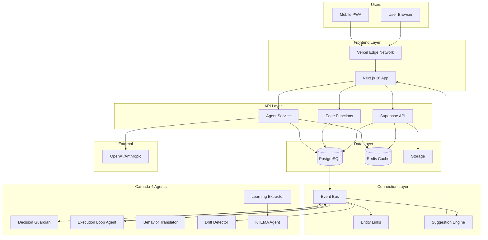
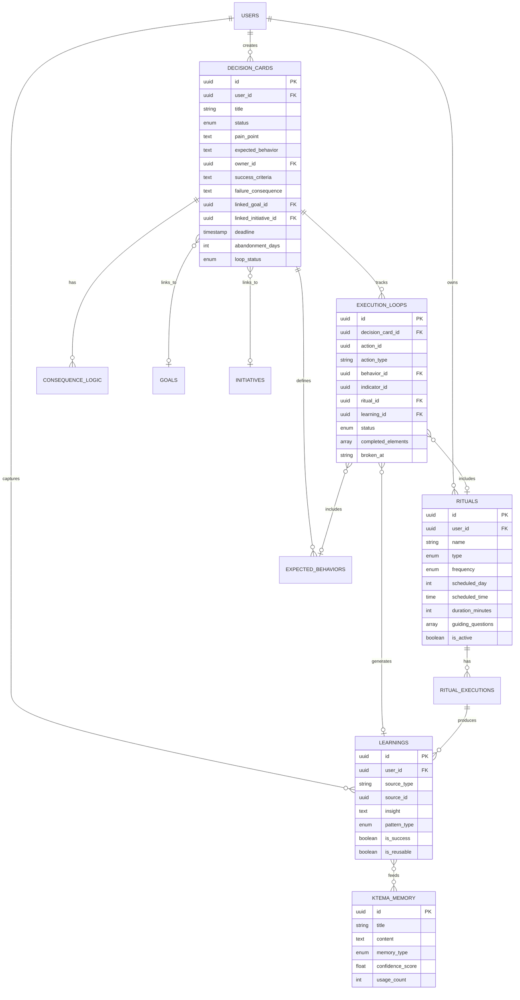

# ExímIA OS — Fullstack Architecture Document
## Camada 4: Execution Intelligence Integration

**Version:** 1.0.0
**Date:** 2026-01-28
**Author:** Aria (Architect Agent)
**Status:** Draft (YOLO Generated)

---

## Change Log

| Date | Version | Description | Author |
|------|---------|-------------|--------|
| 2026-01-28 | 1.0.0 | Initial architecture for Camada 4 integration | @architect (Aria) |

---

## 1. Introduction

This document outlines the complete fullstack architecture for **ExímIA OS with Camada 4 (Execution Intelligence)** integration. It covers backend systems, frontend implementation, agent infrastructure, and their integration points.

### 1.1 Starter Template

**Base:** Existing ExímIA APP project (brownfield)

**Pre-configured Choices:**
- Next.js 16 + React 19 (App Router)
- Supabase (PostgreSQL + Auth + Realtime)
- Tailwind CSS 4.x
- TypeScript (strict mode)

**Constraints:**
- Must extend existing Connection Layer architecture
- Must integrate with existing module structure (Journey, Academy, Strategy, etc.)
- Must follow "Soft Business" design system philosophy

### 1.2 Scope of This Document

This architecture specifically covers the **Camada 4 (Execution Intelligence)** addition:

1. **Decision Cards** (NCE - Núcleo de Consciência Executiva)
2. **Execution Loops** (6-element tracking)
3. **Agent System** (6 execution intelligence agents)
4. **Rituals** (Intelligent scheduled events)
5. **KTEMA** (Organizational memory)

---

## 2. High Level Architecture

### 2.1 Technical Summary

ExímIA OS with Camada 4 follows a **serverless-first, event-driven architecture** deployed on Vercel (frontend) and Supabase (backend-as-a-service), with a Python-based agent service for AI orchestration.

The frontend is built with Next.js 16 using React Server Components for optimal performance. The backend leverages Supabase for database, authentication, real-time subscriptions, and edge functions. The agent service (Python FastAPI) handles LLM orchestration and the 6 Camada 4 execution intelligence agents.

The Connection Layer (Event Bus + Entity Links + Suggestion Engine) serves as the integration backbone, enabling cross-module communication and agent-driven automation. Camada 4 extends this foundation with decision governance, loop tracking, and organizational learning capabilities.

### 2.2 Platform and Infrastructure

**Platform:** Vercel + Supabase + Railway

| Service | Provider | Purpose |
|---------|----------|---------|
| Frontend Hosting | Vercel | Next.js deployment, Edge Functions, CDN |
| Database | Supabase | PostgreSQL with Row-Level Security |
| Authentication | Supabase Auth | OAuth, magic links, session management |
| Real-time | Supabase Realtime | Event streaming, live updates |
| File Storage | Supabase Storage | User uploads, assets |
| Agent Service | Railway | Python FastAPI for Camada 4 agents |
| Cache | Upstash Redis | Event Bus queue, session cache |
| Cron Jobs | Railway Cron | Agent scheduled tasks |

**Regions:**
- Primary: `us-east-1` (Vercel) / `us-east-1` (Supabase)
- Edge: Global (Vercel Edge Network)

### 2.3 Repository Structure

**Structure:** Monorepo (npm workspaces)

```
eximia-app/
├── app/                          # Next.js frontend
├── agent-service/                # Python FastAPI (Camada 4 agents)
├── supabase/                     # Database migrations, edge functions
├── packages/
│   ├── shared/                   # Shared TypeScript types
│   └── design-system/            # UI components (future extraction)
└── docs/                         # Documentation
```

### 2.4 High Level Architecture Diagram



### 2.5 Architectural Patterns

| Pattern | Description | Rationale |
|---------|-------------|-----------|
| **Event-Driven Architecture** | All significant actions emit events consumed by agents and modules | Enables loose coupling, agent automation, audit trail |
| **Serverless-First** | Supabase Edge Functions + Vercel Functions | Cost-effective, auto-scaling, no server management |
| **Repository Pattern** | Abstract data access in service layer | Testability, future migration flexibility |
| **Component-Based UI** | Atomic Design with React Server Components | Reusability, performance, maintainability |
| **CQRS (Light)** | Separate read/write paths for complex queries | Performance optimization for dashboards |
| **Agent Pattern** | Autonomous agents with specific responsibilities | Scalable AI governance, single responsibility |
| **Entity Links** | Bidirectional graph connections between entities | Cross-module navigation, relationship tracking |

---

## 3. Tech Stack

| Category | Technology | Version | Purpose | Rationale |
|----------|------------|---------|---------|-----------|
| **Frontend Language** | TypeScript | 5.x | Type-safe development | Industry standard, excellent DX |
| **Frontend Framework** | Next.js | 16.x | SSR, RSC, routing | Best React framework, Vercel integration |
| **UI Library** | React | 19.x | Component library | Latest with RSC support |
| **CSS Framework** | Tailwind CSS | 4.x | Utility-first styling | Rapid development, consistent design |
| **State Management** | Zustand | 5.x | Client state | Lightweight, TypeScript-first |
| **Form Handling** | React Hook Form | 7.x | Form state | Performance, validation integration |
| **Validation** | Zod | 3.x | Schema validation | TypeScript inference, shared schemas |
| **Backend Language** | Python | 3.11+ | Agent service | LLM ecosystem, async support |
| **Backend Framework** | FastAPI | 0.110+ | REST API | Async, auto-docs, type hints |
| **API Style** | REST + Realtime | - | Client-server communication | Supabase native, proven patterns |
| **Database** | PostgreSQL | 15.x | Primary data store | Supabase native, robust, extensible |
| **Cache** | Redis (Upstash) | 7.x | Event queue, sessions | Fast, serverless-compatible |
| **Authentication** | Supabase Auth | - | User auth | Built-in, RLS integration |
| **Frontend Testing** | Vitest | 1.x | Unit/integration tests | Fast, Vite-native |
| **Backend Testing** | Pytest | 8.x | Python tests | Standard, async support |
| **E2E Testing** | Playwright | 1.x | End-to-end tests | Cross-browser, reliable |
| **Build Tool** | Turbo | 2.x | Monorepo builds | Fast, caching, incremental |
| **CI/CD** | GitHub Actions | - | Automation | Native, free tier |
| **Monitoring** | Vercel Analytics | - | Frontend metrics | Built-in, Core Web Vitals |
| **Logging** | Axiom | - | Centralized logs | Vercel integration |
| **Icons** | Lucide React | - | Icon library | Consistent, tree-shakeable |

---

## 4. Data Models

### 4.1 Core Camada 4 Models

#### Decision Card

**Purpose:** The atomic unit of execution intelligence — a decision with 5 mandatory questions that ensures accountability and traceability.

```typescript
// packages/shared/src/types/camada4.ts

export interface DecisionCard {
  id: string;
  user_id: string;

  // Basic Info
  title: string;
  description?: string;
  status: DecisionStatus;

  // NCE - 5 Mandatory Questions
  pain_point: string;           // "Qual dor real ela resolve?"
  expected_behavior: string;    // "Qual comportamento precisa mudar?"
  owner_id: string;             // "Quem sustenta no tempo?"
  success_criteria: string;     // "Como sabemos se funcionou?"
  failure_consequence: string;  // "O que acontece se não acontecer?"

  // Links
  linked_goal_id?: string;
  linked_initiative_id?: string;

  // Lifecycle
  created_at: string;
  activated_at?: string;
  deadline?: string;
  closed_at?: string;
  last_activity_at: string;

  // Config
  abandonment_days: number;
  loop_status: LoopStatus;
}

export type DecisionStatus = 'draft' | 'active' | 'closed' | 'abandoned';
export type LoopStatus = 'incomplete' | 'partial' | 'complete';
```

**Relationships:**
- `user_id` → `auth.users` (owner)
- `owner_id` → `auth.users` (responsible person)
- `linked_goal_id` → `goals` (Journey module)
- `linked_initiative_id` → `initiatives` (Strategy module)

#### Execution Loop

**Purpose:** Tracks the 6-element execution cycle: Decision → Action → Behavior → Indicator → Ritual → Learning

```typescript
export interface ExecutionLoop {
  id: string;
  decision_card_id: string;

  // Loop Elements
  decision_id: string;
  action_id?: string;
  action_type?: 'goal' | 'habit' | 'task';
  behavior_id?: string;
  indicator_id?: string;
  ritual_id?: string;
  learning_id?: string;

  // State
  status: LoopElementStatus;
  completed_elements: string[];
  broken_at?: string;

  // Timestamps
  started_at: string;
  completed_at?: string;
  last_activity_at: string;
}

export type LoopElementStatus =
  | 'decision'
  | 'action'
  | 'behavior'
  | 'indicator'
  | 'ritual'
  | 'learning'
  | 'complete';
```

**Relationships:**
- `decision_card_id` → `decision_cards`
- `action_id` → `goals` | `habits` | `tasks` (polymorphic)
- `behavior_id` → `expected_behaviors`
- `ritual_id` → `rituals`
- `learning_id` → `learnings`

#### Expected Behavior

**Purpose:** Observable, measurable behaviors that indicate decision execution.

```typescript
export interface ExpectedBehavior {
  id: string;
  decision_card_id: string;

  description: string;
  observable_indicator: string;  // "O que veríamos no chão?"
  frequency: FrequencyType;
  target_metric?: string;

  created_at: string;
}

export type FrequencyType = 'daily' | 'weekly' | 'monthly' | 'on_event';
```

#### Ritual

**Purpose:** Intelligent scheduled events for decision closure, tracking, learning, and alignment.

```typescript
export interface Ritual {
  id: string;
  user_id: string;

  // Definition
  name: string;
  type: RitualType;
  description?: string;

  // Schedule
  frequency: RitualFrequency;
  scheduled_day?: number;
  scheduled_time?: string;
  duration_minutes: number;

  // Content
  guiding_questions: string[];
  mandatory_outputs: string[];

  // Links
  linked_decision_ids: string[];

  // Status
  is_active: boolean;
  created_at: string;
}

export type RitualType = 'decision' | 'tracking' | 'learning' | 'alignment';
export type RitualFrequency = 'daily' | 'weekly' | 'biweekly' | 'monthly' | 'quarterly';

export interface RitualExecution {
  id: string;
  ritual_id: string;

  scheduled_at: string;
  executed_at?: string;

  status: RitualExecutionStatus;
  responses?: Record<string, any>;
  learnings?: string;

  facilitator_id?: string;
  participants: string[];
}

export type RitualExecutionStatus =
  | 'scheduled'
  | 'in_progress'
  | 'completed'
  | 'skipped'
  | 'rescheduled';
```

#### Learning & KTEMA

**Purpose:** Organizational memory — patterns, insights, and institutional knowledge.

```typescript
export interface Learning {
  id: string;
  user_id: string;

  // Source
  source_type: 'decision' | 'ritual' | 'loop' | 'manual';
  source_id?: string;

  // Content
  insight: string;
  pattern_type?: PatternType;
  context?: string;

  // Classification
  is_success?: boolean;
  is_reusable: boolean;

  created_at: string;
}

export type PatternType =
  | 'success_pattern'
  | 'failure_pattern'
  | 'process_pattern'
  | 'behavior_pattern'
  | 'timing_pattern';

export interface KTEMAMemory {
  id: string;

  title: string;
  content: string;
  memory_type: KTEMAType;

  related_decisions: string[];
  related_learnings: string[];

  confidence_score: number;
  usage_count: number;
  last_accessed_at?: string;

  created_at: string;
  updated_at: string;
}

export type KTEMAType =
  | 'principle'
  | 'best_practice'
  | 'anti_pattern'
  | 'template'
  | 'case_study';
```

### 4.2 Entity Relationship Diagram



---

## 5. API Specification

### 5.1 REST API Endpoints

```yaml
openapi: 3.0.0
info:
  title: ExímIA OS - Camada 4 API
  version: 1.0.0
  description: Execution Intelligence Operating System API

servers:
  - url: https://api.eximia.app/v1
    description: Production
  - url: http://localhost:3000/api
    description: Development

paths:
  # Decision Cards
  /decisions:
    get:
      summary: List user's decisions
      parameters:
        - name: status
          in: query
          schema:
            type: string
            enum: [draft, active, closed, abandoned]
        - name: limit
          in: query
          schema:
            type: integer
            default: 20
      responses:
        200:
          description: List of decisions
          content:
            application/json:
              schema:
                type: object
                properties:
                  data:
                    type: array
                    items:
                      $ref: '#/components/schemas/DecisionCard'
                  pagination:
                    $ref: '#/components/schemas/Pagination'
    post:
      summary: Create decision
      requestBody:
        required: true
        content:
          application/json:
            schema:
              $ref: '#/components/schemas/CreateDecisionInput'
      responses:
        201:
          description: Decision created
          content:
            application/json:
              schema:
                $ref: '#/components/schemas/DecisionCard'

  /decisions/{id}:
    get:
      summary: Get decision by ID
      parameters:
        - name: id
          in: path
          required: true
          schema:
            type: string
            format: uuid
      responses:
        200:
          description: Decision details
          content:
            application/json:
              schema:
                $ref: '#/components/schemas/DecisionCard'
    patch:
      summary: Update decision
      parameters:
        - name: id
          in: path
          required: true
          schema:
            type: string
            format: uuid
      requestBody:
        required: true
        content:
          application/json:
            schema:
              $ref: '#/components/schemas/UpdateDecisionInput'
      responses:
        200:
          description: Decision updated

  /decisions/{id}/activate:
    post:
      summary: Activate a draft decision
      parameters:
        - name: id
          in: path
          required: true
          schema:
            type: string
            format: uuid
      responses:
        200:
          description: Decision activated

  /decisions/{id}/close:
    post:
      summary: Close a decision
      parameters:
        - name: id
          in: path
          required: true
          schema:
            type: string
            format: uuid
      requestBody:
        content:
          application/json:
            schema:
              type: object
              properties:
                learning:
                  type: string
                  description: Learning extracted from this decision
      responses:
        200:
          description: Decision closed

  # Execution Loops
  /loops:
    get:
      summary: List user's execution loops
      responses:
        200:
          description: List of loops

  /loops/{id}:
    get:
      summary: Get loop details
      responses:
        200:
          description: Loop with all elements

  /loops/{id}/advance:
    post:
      summary: Advance loop to next element
      requestBody:
        content:
          application/json:
            schema:
              type: object
              properties:
                element:
                  type: string
                  enum: [action, behavior, indicator, ritual, learning]
                data:
                  type: object
      responses:
        200:
          description: Loop advanced

  # Rituals
  /rituals:
    get:
      summary: List user's rituals
      responses:
        200:
          description: List of rituals
    post:
      summary: Create ritual
      responses:
        201:
          description: Ritual created

  /rituals/{id}/execute:
    post:
      summary: Execute a ritual
      requestBody:
        content:
          application/json:
            schema:
              type: object
              properties:
                responses:
                  type: object
                  description: Answers to guiding questions
      responses:
        200:
          description: Ritual executed

  # Learnings
  /learnings:
    get:
      summary: List learnings
      responses:
        200:
          description: List of learnings
    post:
      summary: Create learning
      responses:
        201:
          description: Learning created

  # KTEMA
  /ktema:
    get:
      summary: Query KTEMA memory
      parameters:
        - name: query
          in: query
          schema:
            type: string
        - name: type
          in: query
          schema:
            type: string
            enum: [principle, best_practice, anti_pattern, template, case_study]
      responses:
        200:
          description: Relevant memories

  # Agent Endpoints
  /agents/decision-guardian/check:
    post:
      summary: Manually trigger decision guardian check
      responses:
        200:
          description: Check results with abandoned decisions

  /agents/suggestions:
    get:
      summary: Get agent suggestions for user
      responses:
        200:
          description: List of suggestions

components:
  schemas:
    DecisionCard:
      type: object
      properties:
        id:
          type: string
          format: uuid
        title:
          type: string
        status:
          type: string
          enum: [draft, active, closed, abandoned]
        pain_point:
          type: string
        expected_behavior:
          type: string
        owner_id:
          type: string
          format: uuid
        success_criteria:
          type: string
        failure_consequence:
          type: string
        loop_status:
          type: string
          enum: [incomplete, partial, complete]
        created_at:
          type: string
          format: date-time

    CreateDecisionInput:
      type: object
      required:
        - title
        - pain_point
        - expected_behavior
        - success_criteria
        - failure_consequence
      properties:
        title:
          type: string
          minLength: 1
        pain_point:
          type: string
          minLength: 10
        expected_behavior:
          type: string
          minLength: 10
        owner_id:
          type: string
          format: uuid
        success_criteria:
          type: string
          minLength: 10
        failure_consequence:
          type: string
          minLength: 10
        deadline:
          type: string
          format: date-time
        linked_goal_id:
          type: string
          format: uuid
        linked_initiative_id:
          type: string
          format: uuid

    Pagination:
      type: object
      properties:
        total:
          type: integer
        page:
          type: integer
        limit:
          type: integer
        has_more:
          type: boolean
```

---

## 6. Components

### 6.1 Frontend Components

#### Decision Module Components

| Component | Type | Responsibility |
|-----------|------|----------------|
| `DecisionCardForm` | Organism | Form with 5 mandatory NCE questions |
| `DecisionCardView` | Organism | Display decision with loop status and links |
| `DecisionList` | Organism | Paginated list of decisions with filters |
| `DecisionStatusBadge` | Atom | Visual status indicator |
| `LoopStatusBadge` | Atom | Visual loop completion indicator |

#### Loop Components

| Component | Type | Responsibility |
|-----------|------|----------------|
| `ExecutionLoopTracker` | Organism | Visual 6-element loop progress |
| `LoopElementCard` | Molecule | Individual loop element with actions |
| `LoopTimeline` | Organism | Chronological view of loop progress |

#### Ritual Components

| Component | Type | Responsibility |
|-----------|------|----------------|
| `RitualScheduler` | Organism | Calendar view of rituals |
| `RitualExecutor` | Page | Guided ritual execution flow |
| `RitualCard` | Molecule | Ritual summary with next execution |

#### Agent Components

| Component | Type | Responsibility |
|-----------|------|----------------|
| `AgentAlertPanel` | Organism | Floating panel for agent notifications |
| `SuggestionCard` | Molecule | Actionable suggestion from agent |
| `AgentConversation` | Organism | Chat interface with agent |

### 6.2 Backend Components

#### Agent Service Architecture

```
agent-service/
├── app/
│   ├── main.py                 # FastAPI application entry
│   ├── config.py               # Configuration management
│   │
│   ├── agents/
│   │   ├── __init__.py
│   │   ├── base.py             # Base agent class
│   │   └── camada4/
│   │       ├── __init__.py
│   │       ├── decision_guardian.py
│   │       ├── execution_loop_agent.py
│   │       ├── behavior_translator.py
│   │       ├── drift_detector.py
│   │       ├── learning_extractor.py
│   │       └── ktema_agent.py
│   │
│   ├── services/
│   │   ├── __init__.py
│   │   ├── supabase.py         # Database client
│   │   ├── llm.py              # LLM orchestration
│   │   ├── event_bus.py        # Event publishing
│   │   └── camada4_service.py  # Camada 4 orchestration
│   │
│   ├── api/
│   │   ├── __init__.py
│   │   └── v1/
│   │       ├── __init__.py
│   │       ├── router.py
│   │       ├── decisions.py
│   │       ├── loops.py
│   │       ├── rituals.py
│   │       └── agents.py
│   │
│   ├── models/
│   │   ├── __init__.py
│   │   └── camada4.py          # Pydantic models
│   │
│   └── scheduler/
│       ├── __init__.py
│       └── jobs.py             # Cron job definitions
│
├── tests/
│   ├── __init__.py
│   ├── test_agents/
│   └── test_api/
│
├── requirements.txt
├── Dockerfile
└── pyproject.toml
```

### 6.3 Component Diagram

```mermaid
graph TB
    subgraph "Frontend (Next.js)"
        subgraph "Pages"
            DP[/decisions/page.tsx]
            DNP[/decisions/new/page.tsx]
            DDP[/decisions/[id]/page.tsx]
            LP[/loops/page.tsx]
            RP[/rituals/page.tsx]
            REP[/rituals/execute/[id]/page.tsx]
        end

        subgraph "Components"
            DCF[DecisionCardForm]
            DCV[DecisionCardView]
            ELT[ExecutionLoopTracker]
            RS[RitualScheduler]
            AAP[AgentAlertPanel]
        end

        subgraph "Hooks"
            UD[useDecisions]
            UL[useLoops]
            UR[useRituals]
            UA[useAgentSuggestions]
        end

        subgraph "Services"
            API[API Client]
            RT[Realtime Client]
        end
    end

    subgraph "Backend (Agent Service)"
        subgraph "API Layer"
            DECAPI[Decisions API]
            LOOPAPI[Loops API]
            RITAPI[Rituals API]
            AGAPI[Agents API]
        end

        subgraph "Service Layer"
            C4S[Camada4 Service]
            EBS[Event Bus Service]
            LLMS[LLM Service]
        end

        subgraph "Agent Layer"
            DG[Decision Guardian]
            ELA[Execution Loop Agent]
            DD[Drift Detector]
            LE[Learning Extractor]
        end

        subgraph "Scheduler"
            CRON[APScheduler Jobs]
        end
    end

    subgraph "Data Layer"
        DB[(Supabase PostgreSQL)]
        REDIS[(Redis)]
    end

    DP --> UD
    DNP --> DCF
    DDP --> DCV
    DDP --> ELT
    LP --> UL
    RP --> RS
    REP --> UR

    UD --> API
    UL --> API
    UR --> API
    UA --> RT

    API --> DECAPI
    API --> LOOPAPI
    API --> RITAPI

    DECAPI --> C4S
    LOOPAPI --> C4S
    RITAPI --> C4S

    C4S --> EBS
    C4S --> DB

    EBS --> DG
    EBS --> ELA
    EBS --> DD

    DG --> LLMS
    ELA --> DB
    LE --> DB

    CRON --> DG
    CRON --> DD

    LLMS --> LLM[External LLM]
```

---

## 7. Database Schema

### 7.1 Camada 4 Tables

```sql
-- ================================================
-- CAMADA 4: DATABASE SCHEMA
-- Migration: 005_camada4_decisions.sql
-- ================================================

-- Enums
CREATE TYPE decision_status AS ENUM ('draft', 'active', 'closed', 'abandoned');
CREATE TYPE loop_status AS ENUM ('incomplete', 'partial', 'complete');
CREATE TYPE loop_element_status AS ENUM (
  'decision', 'action', 'behavior', 'indicator', 'ritual', 'learning', 'complete'
);
CREATE TYPE frequency_type AS ENUM ('daily', 'weekly', 'monthly', 'on_event');
CREATE TYPE consequence_condition AS ENUM (
  'no_action_days', 'behavior_missed', 'loop_broken',
  'deadline_approaching', 'deadline_passed'
);
CREATE TYPE ritual_type AS ENUM ('decision', 'tracking', 'learning', 'alignment');
CREATE TYPE ritual_frequency AS ENUM ('daily', 'weekly', 'biweekly', 'monthly', 'quarterly');
CREATE TYPE ritual_execution_status AS ENUM (
  'scheduled', 'in_progress', 'completed', 'skipped', 'rescheduled'
);
CREATE TYPE pattern_type AS ENUM (
  'success_pattern', 'failure_pattern', 'process_pattern',
  'behavior_pattern', 'timing_pattern'
);
CREATE TYPE ktema_type AS ENUM (
  'principle', 'best_practice', 'anti_pattern', 'template', 'case_study'
);

-- ================================================
-- Decision Cards
-- ================================================
CREATE TABLE decision_cards (
  id UUID PRIMARY KEY DEFAULT gen_random_uuid(),
  user_id UUID NOT NULL REFERENCES auth.users(id) ON DELETE CASCADE,

  -- Basic Info
  title TEXT NOT NULL CHECK (char_length(title) >= 1),
  description TEXT,
  status decision_status NOT NULL DEFAULT 'draft',

  -- NCE - 5 Mandatory Questions
  pain_point TEXT NOT NULL CHECK (char_length(pain_point) >= 10),
  expected_behavior TEXT NOT NULL CHECK (char_length(expected_behavior) >= 10),
  owner_id UUID REFERENCES auth.users(id),
  success_criteria TEXT NOT NULL CHECK (char_length(success_criteria) >= 10),
  failure_consequence TEXT NOT NULL CHECK (char_length(failure_consequence) >= 10),

  -- Links (soft references for flexibility)
  linked_goal_id UUID,
  linked_initiative_id UUID,

  -- Lifecycle
  created_at TIMESTAMPTZ NOT NULL DEFAULT NOW(),
  activated_at TIMESTAMPTZ,
  deadline TIMESTAMPTZ,
  closed_at TIMESTAMPTZ,
  last_activity_at TIMESTAMPTZ NOT NULL DEFAULT NOW(),

  -- Config
  abandonment_days INTEGER NOT NULL DEFAULT 7,
  loop_status loop_status NOT NULL DEFAULT 'incomplete'
);

-- Indexes
CREATE INDEX idx_decision_cards_user_id ON decision_cards(user_id);
CREATE INDEX idx_decision_cards_status ON decision_cards(status);
CREATE INDEX idx_decision_cards_activity ON decision_cards(last_activity_at);
CREATE INDEX idx_decision_cards_owner ON decision_cards(owner_id);

-- RLS
ALTER TABLE decision_cards ENABLE ROW LEVEL SECURITY;

CREATE POLICY "Users can view own decisions"
  ON decision_cards FOR SELECT
  USING (auth.uid() = user_id);

CREATE POLICY "Users can create own decisions"
  ON decision_cards FOR INSERT
  WITH CHECK (auth.uid() = user_id);

CREATE POLICY "Users can update own decisions"
  ON decision_cards FOR UPDATE
  USING (auth.uid() = user_id);

CREATE POLICY "Users can delete own decisions"
  ON decision_cards FOR DELETE
  USING (auth.uid() = user_id);

-- ================================================
-- Expected Behaviors
-- ================================================
CREATE TABLE expected_behaviors (
  id UUID PRIMARY KEY DEFAULT gen_random_uuid(),
  decision_card_id UUID NOT NULL REFERENCES decision_cards(id) ON DELETE CASCADE,

  description TEXT NOT NULL,
  observable_indicator TEXT NOT NULL,
  frequency frequency_type NOT NULL DEFAULT 'weekly',
  target_metric TEXT,

  created_at TIMESTAMPTZ NOT NULL DEFAULT NOW()
);

CREATE INDEX idx_expected_behaviors_decision ON expected_behaviors(decision_card_id);

ALTER TABLE expected_behaviors ENABLE ROW LEVEL SECURITY;

CREATE POLICY "Users can manage behaviors via decision"
  ON expected_behaviors FOR ALL
  USING (
    EXISTS (
      SELECT 1 FROM decision_cards
      WHERE id = expected_behaviors.decision_card_id
      AND user_id = auth.uid()
    )
  );

-- ================================================
-- Execution Loops
-- ================================================
CREATE TABLE execution_loops (
  id UUID PRIMARY KEY DEFAULT gen_random_uuid(),
  decision_card_id UUID NOT NULL REFERENCES decision_cards(id) ON DELETE CASCADE,

  -- Loop Elements (polymorphic references)
  action_id UUID,
  action_type TEXT CHECK (action_type IN ('goal', 'habit', 'task')),
  behavior_id UUID REFERENCES expected_behaviors(id),
  indicator_id UUID,
  ritual_id UUID,
  learning_id UUID,

  -- State
  status loop_element_status NOT NULL DEFAULT 'decision',
  completed_elements TEXT[] NOT NULL DEFAULT '{}',
  broken_at TEXT,

  -- Timestamps
  started_at TIMESTAMPTZ NOT NULL DEFAULT NOW(),
  completed_at TIMESTAMPTZ,
  last_activity_at TIMESTAMPTZ NOT NULL DEFAULT NOW()
);

CREATE INDEX idx_execution_loops_decision ON execution_loops(decision_card_id);
CREATE INDEX idx_execution_loops_status ON execution_loops(status);

ALTER TABLE execution_loops ENABLE ROW LEVEL SECURITY;

CREATE POLICY "Users can manage loops via decision"
  ON execution_loops FOR ALL
  USING (
    EXISTS (
      SELECT 1 FROM decision_cards
      WHERE id = execution_loops.decision_card_id
      AND user_id = auth.uid()
    )
  );

-- ================================================
-- Rituals
-- ================================================
CREATE TABLE rituals (
  id UUID PRIMARY KEY DEFAULT gen_random_uuid(),
  user_id UUID NOT NULL REFERENCES auth.users(id) ON DELETE CASCADE,

  name TEXT NOT NULL,
  type ritual_type NOT NULL,
  description TEXT,

  frequency ritual_frequency NOT NULL DEFAULT 'weekly',
  scheduled_day INTEGER CHECK (scheduled_day >= 0 AND scheduled_day <= 31),
  scheduled_time TIME,
  duration_minutes INTEGER NOT NULL DEFAULT 30,

  guiding_questions TEXT[] NOT NULL DEFAULT '{}',
  mandatory_outputs TEXT[] NOT NULL DEFAULT '{}',

  linked_decision_ids UUID[] NOT NULL DEFAULT '{}',

  is_active BOOLEAN NOT NULL DEFAULT true,
  created_at TIMESTAMPTZ NOT NULL DEFAULT NOW()
);

CREATE INDEX idx_rituals_user ON rituals(user_id);
CREATE INDEX idx_rituals_active ON rituals(is_active) WHERE is_active = true;

ALTER TABLE rituals ENABLE ROW LEVEL SECURITY;

CREATE POLICY "Users can manage own rituals"
  ON rituals FOR ALL
  USING (auth.uid() = user_id);

-- ================================================
-- Ritual Executions
-- ================================================
CREATE TABLE ritual_executions (
  id UUID PRIMARY KEY DEFAULT gen_random_uuid(),
  ritual_id UUID NOT NULL REFERENCES rituals(id) ON DELETE CASCADE,

  scheduled_at TIMESTAMPTZ NOT NULL,
  executed_at TIMESTAMPTZ,

  status ritual_execution_status NOT NULL DEFAULT 'scheduled',
  responses JSONB,
  learnings TEXT,

  facilitator_id UUID REFERENCES auth.users(id),
  participants UUID[] NOT NULL DEFAULT '{}'
);

CREATE INDEX idx_ritual_executions_ritual ON ritual_executions(ritual_id);
CREATE INDEX idx_ritual_executions_scheduled ON ritual_executions(scheduled_at);
CREATE INDEX idx_ritual_executions_status ON ritual_executions(status);

ALTER TABLE ritual_executions ENABLE ROW LEVEL SECURITY;

CREATE POLICY "Users can manage executions via ritual"
  ON ritual_executions FOR ALL
  USING (
    EXISTS (
      SELECT 1 FROM rituals
      WHERE id = ritual_executions.ritual_id
      AND user_id = auth.uid()
    )
  );

-- ================================================
-- Learnings
-- ================================================
CREATE TABLE learnings (
  id UUID PRIMARY KEY DEFAULT gen_random_uuid(),
  user_id UUID NOT NULL REFERENCES auth.users(id) ON DELETE CASCADE,

  source_type TEXT NOT NULL CHECK (source_type IN ('decision', 'ritual', 'loop', 'manual')),
  source_id UUID,

  insight TEXT NOT NULL,
  pattern_type pattern_type,
  context TEXT,

  is_success BOOLEAN,
  is_reusable BOOLEAN NOT NULL DEFAULT false,

  created_at TIMESTAMPTZ NOT NULL DEFAULT NOW()
);

CREATE INDEX idx_learnings_user ON learnings(user_id);
CREATE INDEX idx_learnings_source ON learnings(source_type, source_id);
CREATE INDEX idx_learnings_pattern ON learnings(pattern_type);

ALTER TABLE learnings ENABLE ROW LEVEL SECURITY;

CREATE POLICY "Users can manage own learnings"
  ON learnings FOR ALL
  USING (auth.uid() = user_id);

-- ================================================
-- KTEMA Memory
-- ================================================
CREATE TABLE ktema_memory (
  id UUID PRIMARY KEY DEFAULT gen_random_uuid(),

  title TEXT NOT NULL,
  content TEXT NOT NULL,
  memory_type ktema_type NOT NULL,

  related_decisions UUID[] NOT NULL DEFAULT '{}',
  related_learnings UUID[] NOT NULL DEFAULT '{}',

  confidence_score FLOAT NOT NULL DEFAULT 0.5 CHECK (confidence_score >= 0 AND confidence_score <= 1),
  usage_count INTEGER NOT NULL DEFAULT 0,
  last_accessed_at TIMESTAMPTZ,

  created_at TIMESTAMPTZ NOT NULL DEFAULT NOW(),
  updated_at TIMESTAMPTZ NOT NULL DEFAULT NOW()
);

CREATE INDEX idx_ktema_type ON ktema_memory(memory_type);
CREATE INDEX idx_ktema_confidence ON ktema_memory(confidence_score DESC);

-- KTEMA is shared organizational memory (no RLS for now)
-- In multi-tenant version, add organization_id

-- ================================================
-- Functions
-- ================================================

-- Update last_activity_at on decision changes
CREATE OR REPLACE FUNCTION update_decision_activity()
RETURNS TRIGGER AS $$
BEGIN
  NEW.last_activity_at = NOW();
  RETURN NEW;
END;
$$ LANGUAGE plpgsql;

CREATE TRIGGER trigger_decision_activity
  BEFORE UPDATE ON decision_cards
  FOR EACH ROW
  EXECUTE FUNCTION update_decision_activity();

-- Update loop status when elements complete
CREATE OR REPLACE FUNCTION update_loop_status()
RETURNS TRIGGER AS $$
BEGIN
  IF array_length(NEW.completed_elements, 1) = 6 THEN
    NEW.status = 'complete';
    NEW.completed_at = NOW();

    -- Update parent decision loop_status
    UPDATE decision_cards
    SET loop_status = 'complete'
    WHERE id = NEW.decision_card_id;
  ELSIF array_length(NEW.completed_elements, 1) >= 1 THEN
    -- Update parent decision to partial
    UPDATE decision_cards
    SET loop_status = 'partial'
    WHERE id = NEW.decision_card_id
    AND loop_status = 'incomplete';
  END IF;

  NEW.last_activity_at = NOW();
  RETURN NEW;
END;
$$ LANGUAGE plpgsql;

CREATE TRIGGER trigger_loop_status
  BEFORE UPDATE ON execution_loops
  FOR EACH ROW
  EXECUTE FUNCTION update_loop_status();
```

---

## 8. Frontend Architecture

### 8.1 Component Organization

```
app/src/
├── app/
│   ├── (dashboard)/
│   │   ├── decisions/
│   │   │   ├── page.tsx              # List decisions
│   │   │   ├── new/page.tsx          # Create decision
│   │   │   ├── [id]/page.tsx         # View/edit decision
│   │   │   └── [id]/loop/page.tsx    # Loop detail view
│   │   ├── rituals/
│   │   │   ├── page.tsx              # Ritual calendar
│   │   │   └── execute/[id]/page.tsx # Execute ritual
│   │   └── learnings/
│   │       └── page.tsx              # Learning library
│   │
│   └── layout.tsx                    # Dashboard layout
│
├── components/
│   ├── ui/                           # Atoms (Button, Input, etc.)
│   ├── decisions/                    # Decision components
│   │   ├── decision-card-form.tsx
│   │   ├── decision-card-view.tsx
│   │   ├── decision-list.tsx
│   │   ├── decision-status-badge.tsx
│   │   └── nce-questions-form.tsx
│   ├── loops/                        # Loop components
│   │   ├── execution-loop-tracker.tsx
│   │   ├── loop-element-card.tsx
│   │   └── loop-timeline.tsx
│   ├── rituals/                      # Ritual components
│   │   ├── ritual-scheduler.tsx
│   │   ├── ritual-card.tsx
│   │   └── ritual-executor.tsx
│   └── agents/                       # Agent UI components
│       ├── agent-alert-panel.tsx
│       ├── suggestion-card.tsx
│       └── agent-conversation.tsx
│
├── hooks/
│   ├── use-decisions.ts
│   ├── use-loops.ts
│   ├── use-rituals.ts
│   ├── use-learnings.ts
│   └── use-agent-suggestions.ts
│
├── lib/
│   ├── api/
│   │   ├── decisions.ts
│   │   ├── loops.ts
│   │   ├── rituals.ts
│   │   └── agents.ts
│   └── validations/
│       └── decision-schema.ts
│
└── types/
    └── camada4.ts
```

### 8.2 State Management

```typescript
// stores/decision-store.ts
import { create } from 'zustand';
import { devtools } from 'zustand/middleware';
import type { DecisionCard, ExecutionLoop } from '@/types/camada4';

interface DecisionState {
  decisions: DecisionCard[];
  currentDecision: DecisionCard | null;
  currentLoop: ExecutionLoop | null;
  isLoading: boolean;
  error: string | null;

  // Actions
  setDecisions: (decisions: DecisionCard[]) => void;
  setCurrentDecision: (decision: DecisionCard | null) => void;
  setCurrentLoop: (loop: ExecutionLoop | null) => void;
  addDecision: (decision: DecisionCard) => void;
  updateDecision: (id: string, updates: Partial<DecisionCard>) => void;
  setLoading: (loading: boolean) => void;
  setError: (error: string | null) => void;
}

export const useDecisionStore = create<DecisionState>()(
  devtools(
    (set) => ({
      decisions: [],
      currentDecision: null,
      currentLoop: null,
      isLoading: false,
      error: null,

      setDecisions: (decisions) => set({ decisions }),
      setCurrentDecision: (decision) => set({ currentDecision: decision }),
      setCurrentLoop: (loop) => set({ currentLoop: loop }),
      addDecision: (decision) =>
        set((state) => ({ decisions: [decision, ...state.decisions] })),
      updateDecision: (id, updates) =>
        set((state) => ({
          decisions: state.decisions.map((d) =>
            d.id === id ? { ...d, ...updates } : d
          ),
          currentDecision:
            state.currentDecision?.id === id
              ? { ...state.currentDecision, ...updates }
              : state.currentDecision,
        })),
      setLoading: (isLoading) => set({ isLoading }),
      setError: (error) => set({ error }),
    }),
    { name: 'decision-store' }
  )
);
```

### 8.3 Routing Architecture

```typescript
// Route organization for Camada 4

const routes = {
  decisions: {
    list: '/decisions',
    new: '/decisions/new',
    view: (id: string) => `/decisions/${id}`,
    loop: (id: string) => `/decisions/${id}/loop`,
  },
  rituals: {
    list: '/rituals',
    execute: (id: string) => `/rituals/execute/${id}`,
  },
  learnings: {
    list: '/learnings',
  },
  ktema: {
    search: '/ktema',
  },
};

// Protected route middleware (existing)
// All Camada 4 routes require authentication
```

### 8.4 API Client

```typescript
// lib/api/decisions.ts
import { createClient } from '@/lib/supabase/client';
import type {
  DecisionCard,
  CreateDecisionInput,
  UpdateDecisionInput
} from '@/types/camada4';

const supabase = createClient();

export const decisionsApi = {
  async list(filters?: { status?: string; limit?: number }) {
    let query = supabase
      .from('decision_cards')
      .select('*')
      .order('created_at', { ascending: false });

    if (filters?.status) {
      query = query.eq('status', filters.status);
    }
    if (filters?.limit) {
      query = query.limit(filters.limit);
    }

    const { data, error } = await query;
    if (error) throw error;
    return data as DecisionCard[];
  },

  async get(id: string) {
    const { data, error } = await supabase
      .from('decision_cards')
      .select(`
        *,
        expected_behaviors (*),
        execution_loops (*)
      `)
      .eq('id', id)
      .single();

    if (error) throw error;
    return data;
  },

  async create(input: CreateDecisionInput) {
    const { data, error } = await supabase
      .from('decision_cards')
      .insert(input)
      .select()
      .single();

    if (error) throw error;
    return data as DecisionCard;
  },

  async update(id: string, input: UpdateDecisionInput) {
    const { data, error } = await supabase
      .from('decision_cards')
      .update(input)
      .eq('id', id)
      .select()
      .single();

    if (error) throw error;
    return data as DecisionCard;
  },

  async activate(id: string) {
    const { data, error } = await supabase
      .from('decision_cards')
      .update({
        status: 'active',
        activated_at: new Date().toISOString()
      })
      .eq('id', id)
      .select()
      .single();

    if (error) throw error;
    return data as DecisionCard;
  },

  async close(id: string, learning?: string) {
    const { data, error } = await supabase
      .from('decision_cards')
      .update({
        status: 'closed',
        closed_at: new Date().toISOString()
      })
      .eq('id', id)
      .select()
      .single();

    if (error) throw error;

    // Create learning if provided
    if (learning) {
      await supabase.from('learnings').insert({
        source_type: 'decision',
        source_id: id,
        insight: learning,
      });
    }

    return data as DecisionCard;
  },
};
```

---

## 9. Backend Architecture

### 9.1 Agent Service Structure

```python
# agent-service/app/main.py

from fastapi import FastAPI
from fastapi.middleware.cors import CORSMiddleware
from contextlib import asynccontextmanager

from app.config import settings
from app.api.v1.router import api_router
from app.scheduler.jobs import start_scheduler, shutdown_scheduler

@asynccontextmanager
async def lifespan(app: FastAPI):
    # Startup
    start_scheduler()
    yield
    # Shutdown
    shutdown_scheduler()

app = FastAPI(
    title="ExímIA OS Agent Service",
    version="1.0.0",
    description="Camada 4 Execution Intelligence Agents",
    lifespan=lifespan,
)

# CORS
app.add_middleware(
    CORSMiddleware,
    allow_origins=settings.CORS_ORIGINS,
    allow_credentials=True,
    allow_methods=["*"],
    allow_headers=["*"],
)

# Routes
app.include_router(api_router, prefix="/api/v1")

@app.get("/health")
async def health():
    return {"status": "healthy", "version": "1.0.0"}
```

### 9.2 Base Agent Class

```python
# agent-service/app/agents/base.py

from abc import ABC, abstractmethod
from typing import Any, Dict, Optional
from dataclasses import dataclass
from datetime import datetime

from app.services.supabase import SupabaseClient
from app.services.llm import LLMService
from app.services.event_bus import EventBus

@dataclass
class AgentContext:
    user_id: str
    timestamp: datetime
    metadata: Dict[str, Any]

class BaseAgent(ABC):
    """Base class for all Camada 4 agents."""

    def __init__(
        self,
        supabase: SupabaseClient,
        llm: LLMService,
        event_bus: EventBus,
    ):
        self.supabase = supabase
        self.llm = llm
        self.event_bus = event_bus

    @property
    @abstractmethod
    def name(self) -> str:
        """Agent name for logging and identification."""
        pass

    @property
    @abstractmethod
    def key_question(self) -> str:
        """The key question this agent asks."""
        pass

    @abstractmethod
    async def process(self, context: AgentContext, data: Dict[str, Any]) -> Dict[str, Any]:
        """Main processing logic."""
        pass

    async def emit_event(self, event_type: str, data: Dict[str, Any]):
        """Emit event to Event Bus."""
        await self.event_bus.publish({
            "type": event_type,
            "source_module": "camada4",
            "source_agent": self.name,
            "data": data,
            "timestamp": datetime.utcnow().isoformat(),
        })

    async def create_notification(
        self,
        user_id: str,
        type: str,
        title: str,
        body: str,
        priority: str = "normal",
        action_url: Optional[str] = None,
    ):
        """Create user notification."""
        await self.supabase.table("notifications").insert({
            "user_id": user_id,
            "type": type,
            "title": title,
            "body": body,
            "priority": priority,
            "action_url": action_url,
            "channels": ["in_app", "push"],
        })
```

### 9.3 Decision Guardian Implementation

```python
# agent-service/app/agents/camada4/decision_guardian.py

from typing import List, Dict, Any
from datetime import datetime, timedelta
from dataclasses import dataclass

from app.agents.base import BaseAgent, AgentContext

@dataclass
class AbandonedDecision:
    id: str
    title: str
    owner_id: str
    days_inactive: int
    last_activity_at: datetime

class DecisionGuardianAgent(BaseAgent):
    """
    Agente Guardião da Decisão

    Função: Vigiar decisões abertas, detectar abandono, disparar tensão saudável.
    Pergunta-chave: "Essa decisão ainda está viva?"
    """

    @property
    def name(self) -> str:
        return "decision-guardian"

    @property
    def key_question(self) -> str:
        return "Essa decisão ainda está viva?"

    async def process(self, context: AgentContext, data: Dict[str, Any]) -> Dict[str, Any]:
        """Process based on event type or scheduled check."""
        event_type = data.get("event_type")

        if event_type == "scheduled_check":
            return await self._scheduled_check(context)
        elif event_type == "decision.created":
            return await self._on_decision_created(context, data)

        return {"status": "unknown_event"}

    async def _scheduled_check(self, context: AgentContext) -> Dict[str, Any]:
        """Daily check for abandoned decisions."""
        abandoned = await self._find_abandoned_decisions()

        results = {
            "checked_at": datetime.utcnow().isoformat(),
            "abandoned_count": len(abandoned),
            "processed": [],
        }

        for decision in abandoned:
            await self._process_abandoned(decision)
            results["processed"].append({
                "id": decision.id,
                "title": decision.title,
                "days_inactive": decision.days_inactive,
            })

        return results

    async def _find_abandoned_decisions(
        self,
        threshold_days: int = 7
    ) -> List[AbandonedDecision]:
        """Find decisions without activity for threshold days."""
        threshold = datetime.utcnow() - timedelta(days=threshold_days)

        result = await self.supabase.table("decision_cards") \
            .select("id, title, owner_id, last_activity_at, abandonment_days") \
            .eq("status", "active") \
            .lt("last_activity_at", threshold.isoformat()) \
            .execute()

        abandoned = []
        for row in result.data:
            days_inactive = (
                datetime.utcnow() -
                datetime.fromisoformat(row["last_activity_at"].replace("Z", "+00:00"))
            ).days

            # Use custom threshold if set
            custom_threshold = row.get("abandonment_days", threshold_days)
            if days_inactive >= custom_threshold:
                abandoned.append(AbandonedDecision(
                    id=row["id"],
                    title=row["title"],
                    owner_id=row["owner_id"],
                    days_inactive=days_inactive,
                    last_activity_at=row["last_activity_at"],
                ))

        return abandoned

    async def _process_abandoned(self, decision: AbandonedDecision):
        """Process an abandoned decision."""
        # Emit event
        await self.emit_event("decision.abandoned", {
            "decision_id": decision.id,
            "title": decision.title,
            "owner_id": decision.owner_id,
            "days_inactive": decision.days_inactive,
        })

        # Create notification
        await self.create_notification(
            user_id=decision.owner_id,
            type="alert",
            title=f"Decisão abandonada: {decision.title}",
            body=f"Esta decisão não tem atividade há {decision.days_inactive} dias. "
                 f"Ela ainda está viva?",
            priority="high",
            action_url=f"/decisions/{decision.id}",
        )

        # If very inactive, mark as abandoned
        if decision.days_inactive > 14:
            await self.supabase.table("decision_cards") \
                .update({"status": "abandoned"}) \
                .eq("id", decision.id) \
                .execute()

    async def _on_decision_created(
        self,
        context: AgentContext,
        data: Dict[str, Any]
    ) -> Dict[str, Any]:
        """Handle new decision creation."""
        decision_id = data.get("decision_id")

        # Schedule first reminder
        reminder_date = datetime.utcnow() + timedelta(days=3)

        # Could create a scheduled reminder here
        # For now, the daily check handles this

        return {
            "status": "registered",
            "decision_id": decision_id,
            "first_check": reminder_date.isoformat(),
        }

    async def ask_alive(self, decision_id: str) -> Dict[str, Any]:
        """
        Generate the key question interaction for a decision.

        Returns prompt data for user interaction.
        """
        result = await self.supabase.table("decision_cards") \
            .select("*") \
            .eq("id", decision_id) \
            .single() \
            .execute()

        decision = result.data

        # Use LLM to generate contextual prompt
        prompt = await self.llm.generate(
            system="""Você é o Guardião da Decisão, um agente que ajuda
            a manter decisões vivas. Sua pergunta-chave é:
            "Essa decisão ainda está viva?"

            Gere uma mensagem curta e empática perguntando sobre o status
            da decisão, oferecendo opções claras.""",
            user=f"""Decisão: {decision['title']}
            Criada em: {decision['created_at']}
            Última atividade: {decision['last_activity_at']}
            Status do loop: {decision['loop_status']}""",
        )

        return {
            "decision_id": decision_id,
            "title": decision["title"],
            "message": prompt,
            "options": [
                {"id": "alive", "label": "✅ Sim, está ativa", "action": "register_progress"},
                {"id": "adjust", "label": "🔄 Precisa de ajustes", "action": "edit"},
                {"id": "archive", "label": "❌ Não é mais relevante", "action": "close"},
                {"id": "snooze", "label": "⏰ Verificar depois", "action": "snooze"},
            ],
        }
```

### 9.4 Scheduler Jobs

```python
# agent-service/app/scheduler/jobs.py

from apscheduler.schedulers.asyncio import AsyncIOScheduler
from apscheduler.triggers.cron import CronTrigger
from datetime import datetime

from app.agents.camada4.decision_guardian import DecisionGuardianAgent
from app.agents.camada4.drift_detector import DriftDetectorAgent
from app.services.supabase import get_supabase_client
from app.services.llm import get_llm_service
from app.services.event_bus import get_event_bus

scheduler = AsyncIOScheduler()

async def run_decision_guardian():
    """Daily decision guardian check."""
    supabase = get_supabase_client()
    llm = get_llm_service()
    event_bus = get_event_bus()

    agent = DecisionGuardianAgent(supabase, llm, event_bus)

    from app.agents.base import AgentContext
    context = AgentContext(
        user_id="system",
        timestamp=datetime.utcnow(),
        metadata={"job": "scheduled_check"},
    )

    result = await agent.process(context, {"event_type": "scheduled_check"})
    print(f"[Decision Guardian] Checked: {result}")

async def run_drift_detector():
    """Daily drift detection."""
    # Similar implementation for drift detector
    pass

def start_scheduler():
    """Start the APScheduler."""
    # Decision Guardian - Daily at 9 AM
    scheduler.add_job(
        run_decision_guardian,
        CronTrigger(hour=9, minute=0),
        id="decision_guardian_daily",
        name="Daily Decision Guardian Check",
        replace_existing=True,
    )

    # Drift Detector - Daily at 10 AM
    scheduler.add_job(
        run_drift_detector,
        CronTrigger(hour=10, minute=0),
        id="drift_detector_daily",
        name="Daily Drift Detection",
        replace_existing=True,
    )

    scheduler.start()
    print("[Scheduler] Started with jobs:", scheduler.get_jobs())

def shutdown_scheduler():
    """Shutdown the scheduler."""
    scheduler.shutdown()
    print("[Scheduler] Shutdown complete")
```

---

## 10. Unified Project Structure

```
eximia-app/
├── .github/
│   └── workflows/
│       ├── ci.yaml                    # Lint, test, typecheck
│       ├── deploy-frontend.yaml       # Vercel deploy
│       └── deploy-agents.yaml         # Railway deploy
│
├── app/                               # Next.js Frontend
│   ├── src/
│   │   ├── app/
│   │   │   ├── (auth)/
│   │   │   ├── (dashboard)/
│   │   │   │   ├── decisions/         # 🆕 Camada 4
│   │   │   │   ├── loops/             # 🆕 Camada 4
│   │   │   │   ├── rituals/           # 🆕 Camada 4
│   │   │   │   ├── learnings/         # 🆕 Camada 4
│   │   │   │   ├── journey/           # Existing
│   │   │   │   ├── academy/           # Existing
│   │   │   │   ├── strategy/          # Existing
│   │   │   │   └── inbox/             # Existing
│   │   │   ├── layout.tsx
│   │   │   └── page.tsx
│   │   ├── components/
│   │   │   ├── ui/                    # Atoms
│   │   │   ├── decisions/             # 🆕 Camada 4
│   │   │   ├── loops/                 # 🆕 Camada 4
│   │   │   ├── rituals/               # 🆕 Camada 4
│   │   │   ├── agents/                # 🆕 Camada 4
│   │   │   ├── journey/               # Existing
│   │   │   └── inbox/                 # Existing
│   │   ├── hooks/
│   │   ├── lib/
│   │   ├── stores/
│   │   └── types/
│   ├── public/
│   ├── package.json
│   ├── next.config.ts
│   ├── tailwind.config.ts
│   └── tsconfig.json
│
├── agent-service/                     # 🆕 Python Agent Service
│   ├── app/
│   │   ├── main.py
│   │   ├── config.py
│   │   ├── agents/
│   │   │   ├── base.py
│   │   │   └── camada4/
│   │   │       ├── decision_guardian.py
│   │   │       ├── execution_loop_agent.py
│   │   │       ├── behavior_translator.py
│   │   │       ├── drift_detector.py
│   │   │       ├── learning_extractor.py
│   │   │       └── ktema_agent.py
│   │   ├── services/
│   │   ├── api/
│   │   ├── models/
│   │   └── scheduler/
│   ├── tests/
│   ├── requirements.txt
│   ├── Dockerfile
│   └── pyproject.toml
│
├── supabase/
│   ├── migrations/
│   │   ├── 001_connection_layer.sql
│   │   ├── 002_journey.sql
│   │   ├── 003_academy.sql
│   │   ├── 004_strategy.sql
│   │   ├── 005_camada4_decisions.sql  # 🆕
│   │   ├── 006_camada4_loops.sql      # 🆕
│   │   ├── 007_camada4_rituals.sql    # 🆕
│   │   └── 008_camada4_ktema.sql      # 🆕
│   ├── functions/
│   │   └── event-handler/             # Edge function for events
│   └── seed/
│
├── packages/
│   └── shared/
│       ├── src/
│       │   ├── types/
│       │   │   ├── index.ts
│       │   │   ├── connection-layer.ts
│       │   │   └── camada4.ts         # 🆕
│       │   ├── constants/
│       │   └── utils/
│       └── package.json
│
├── docs/
│   ├── architecture/
│   │   ├── system-architecture.md
│   │   ├── project-analysis-camada4.md
│   │   ├── recommended-approach-camada4.md
│   │   └── fullstack-architecture-camada4.md  # This document
│   ├── prd/
│   └── stories/
│
├── .env.example
├── package.json                       # Root package.json
├── turbo.json                         # Turborepo config
└── README.md
```

---

## 11. Development Workflow

### 11.1 Prerequisites

```bash
# Required
node >= 20.0.0
npm >= 10.0.0
python >= 3.11

# Tools
pnpm install -g turbo
pip install poetry
```

### 11.2 Initial Setup

```bash
# Clone and install
git clone <repo>
cd eximia-app

# Install all dependencies
npm install

# Setup environment
cp .env.example .env.local
cp agent-service/.env.example agent-service/.env

# Run database migrations
npx supabase db push

# Start development
npm run dev
```

### 11.3 Development Commands

```bash
# Start all services
npm run dev

# Start frontend only
npm run dev:web

# Start agent service only
cd agent-service && poetry run uvicorn app.main:app --reload

# Run tests
npm run test              # All tests
npm run test:web          # Frontend tests
npm run test:agents       # Agent tests

# Lint and typecheck
npm run lint
npm run typecheck

# Build for production
npm run build
```

### 11.4 Environment Variables

```bash
# .env.local (Frontend)
NEXT_PUBLIC_SUPABASE_URL=https://xxx.supabase.co
NEXT_PUBLIC_SUPABASE_ANON_KEY=xxx
NEXT_PUBLIC_AGENT_SERVICE_URL=http://localhost:8000

# agent-service/.env
SUPABASE_URL=https://xxx.supabase.co
SUPABASE_SERVICE_KEY=xxx
OPENAI_API_KEY=xxx
ANTHROPIC_API_KEY=xxx
REDIS_URL=redis://localhost:6379
```

---

## 12. Deployment Architecture

### 12.1 Deployment Strategy

**Frontend:**
- Platform: Vercel
- Build: `npm run build`
- Output: `.next/`
- CDN: Vercel Edge Network (global)

**Agent Service:**
- Platform: Railway
- Build: Docker
- Deployment: Auto-deploy on push to main

**Database:**
- Platform: Supabase
- Migrations: CI/CD automated

### 12.2 Environments

| Environment | Frontend URL | Agent Service URL | Purpose |
|-------------|--------------|-------------------|---------|
| Development | localhost:3000 | localhost:8000 | Local dev |
| Preview | pr-xxx.vercel.app | preview.railway.app | PR previews |
| Production | app.eximia.app | api.eximia.app | Live |

### 12.3 CI/CD Pipeline

```yaml
# .github/workflows/ci.yaml
name: CI

on:
  push:
    branches: [main, develop]
  pull_request:
    branches: [main]

jobs:
  lint-and-test:
    runs-on: ubuntu-latest
    steps:
      - uses: actions/checkout@v4

      - uses: actions/setup-node@v4
        with:
          node-version: 20
          cache: 'npm'

      - run: npm ci
      - run: npm run lint
      - run: npm run typecheck
      - run: npm run test

  test-agents:
    runs-on: ubuntu-latest
    steps:
      - uses: actions/checkout@v4

      - uses: actions/setup-python@v5
        with:
          python-version: '3.11'

      - run: pip install poetry
      - run: cd agent-service && poetry install
      - run: cd agent-service && poetry run pytest

  deploy-preview:
    needs: [lint-and-test, test-agents]
    if: github.event_name == 'pull_request'
    runs-on: ubuntu-latest
    steps:
      - uses: actions/checkout@v4
      - uses: amondnet/vercel-action@v25
        with:
          vercel-token: ${{ secrets.VERCEL_TOKEN }}
          vercel-org-id: ${{ secrets.VERCEL_ORG_ID }}
          vercel-project-id: ${{ secrets.VERCEL_PROJECT_ID }}
```

---

## 13. Security and Performance

### 13.1 Security Requirements

**Frontend Security:**
- CSP Headers: Strict (script-src 'self')
- XSS Prevention: React auto-escaping + DOMPurify for user content
- Secure Storage: HttpOnly cookies for tokens

**Backend Security:**
- Input Validation: Zod (frontend), Pydantic (backend)
- Rate Limiting: 100 req/min per user
- CORS: Whitelist production domains only

**Authentication Security:**
- Token Storage: HttpOnly cookies (Supabase default)
- Session Management: Supabase Auth (auto-refresh)
- RLS: Row-Level Security on all tables

### 13.2 Performance Optimization

**Frontend:**
- Bundle Size Target: <200KB initial JS
- Loading: React Suspense + Streaming SSR
- Caching: SWR for data fetching

**Backend:**
- Response Time Target: P95 < 200ms
- Database: Indexes on all query columns
- Caching: Redis for agent state, event dedup

---

## 14. Testing Strategy

### 14.1 Test Organization

```
Frontend Tests (Vitest):
├── components/
│   └── decisions/
│       ├── decision-card-form.test.tsx
│       └── execution-loop-tracker.test.tsx
├── hooks/
│   └── use-decisions.test.ts
└── lib/
    └── api/decisions.test.ts

Agent Tests (Pytest):
├── test_agents/
│   ├── test_decision_guardian.py
│   └── test_execution_loop_agent.py
└── test_api/
    └── test_decisions_api.py

E2E Tests (Playwright):
└── e2e/
    ├── decision-flow.spec.ts
    └── ritual-execution.spec.ts
```

### 14.2 Test Examples

**Frontend Component Test:**
```typescript
// components/decisions/decision-card-form.test.tsx
import { render, screen, fireEvent } from '@testing-library/react';
import { DecisionCardForm } from './decision-card-form';

describe('DecisionCardForm', () => {
  it('requires all 5 NCE questions', async () => {
    render(<DecisionCardForm />);

    const submitButton = screen.getByRole('button', { name: /ativar/i });
    fireEvent.click(submitButton);

    // Should show validation errors for required fields
    expect(await screen.findByText(/título obrigatório/i)).toBeInTheDocument();
    expect(await screen.findByText(/descreva a dor real/i)).toBeInTheDocument();
  });
});
```

**Agent Unit Test:**
```python
# test_agents/test_decision_guardian.py
import pytest
from datetime import datetime, timedelta
from unittest.mock import AsyncMock

from app.agents.camada4.decision_guardian import DecisionGuardianAgent

@pytest.fixture
def guardian_agent(mock_supabase, mock_llm, mock_event_bus):
    return DecisionGuardianAgent(mock_supabase, mock_llm, mock_event_bus)

@pytest.mark.asyncio
async def test_finds_abandoned_decisions(guardian_agent, mock_supabase):
    # Setup: decision inactive for 10 days
    mock_supabase.table.return_value.select.return_value.eq.return_value.lt.return_value.execute.return_value.data = [
        {
            "id": "dec-123",
            "title": "Test Decision",
            "owner_id": "user-456",
            "last_activity_at": (datetime.utcnow() - timedelta(days=10)).isoformat(),
            "abandonment_days": 7,
        }
    ]

    abandoned = await guardian_agent._find_abandoned_decisions()

    assert len(abandoned) == 1
    assert abandoned[0].days_inactive >= 10
```

---

## 15. Coding Standards

### 15.1 Critical Rules

| Rule | Description |
|------|-------------|
| **Type Sharing** | All shared types in `packages/shared/src/types/` |
| **API Calls** | Frontend uses service layer, never direct Supabase in components |
| **Environment** | Access via config objects, never `process.env` directly |
| **Error Handling** | All API routes use standard error handler |
| **Events** | All significant actions emit events via Event Bus |
| **RLS** | All tables have Row-Level Security policies |
| **Agent Pattern** | Agents are stateless, all state in database |

### 15.2 Naming Conventions

| Element | Frontend | Backend | Example |
|---------|----------|---------|---------|
| Components | PascalCase | - | `DecisionCardForm.tsx` |
| Hooks | camelCase `use*` | - | `useDecisions.ts` |
| API Routes | - | kebab-case | `/api/decision-cards` |
| Database Tables | - | snake_case | `decision_cards` |
| Events | - | dot.notation | `decision.created` |
| Agents | - | snake_case | `decision_guardian` |

---

## 16. Error Handling

### 16.1 Error Response Format

```typescript
interface ApiError {
  error: {
    code: string;          // 'DECISION_NOT_FOUND'
    message: string;       // User-friendly message
    details?: Record<string, any>;
    timestamp: string;
    requestId: string;
  };
}
```

### 16.2 Frontend Error Handler

```typescript
// lib/error-handler.ts
export function handleApiError(error: unknown): ApiError {
  if (error instanceof ApiError) {
    return error;
  }

  // Supabase error
  if (error?.code) {
    return {
      error: {
        code: error.code,
        message: getErrorMessage(error.code),
        timestamp: new Date().toISOString(),
        requestId: crypto.randomUUID(),
      },
    };
  }

  // Unknown error
  return {
    error: {
      code: 'UNKNOWN_ERROR',
      message: 'An unexpected error occurred',
      timestamp: new Date().toISOString(),
      requestId: crypto.randomUUID(),
    },
  };
}
```

---

## 17. Monitoring and Observability

### 17.1 Monitoring Stack

| Tool | Purpose |
|------|---------|
| Vercel Analytics | Frontend performance, Core Web Vitals |
| Axiom | Centralized logging |
| Sentry | Error tracking (frontend + backend) |
| Supabase Dashboard | Database metrics |

### 17.2 Key Metrics

**Frontend:**
- Core Web Vitals (LCP, FID, CLS)
- API response times
- JavaScript errors

**Backend:**
- Agent execution time
- Event processing rate
- Decision lifecycle metrics

**Business (Camada 4):**
- Decisions created per user
- Loop completion rate
- Ritual compliance rate
- Abandonment detection accuracy

---

## 18. Appendix: Camada 4 Event Catalog

```yaml
# Camada 4 Events

decision:
  - decision.created
  - decision.activated
  - decision.updated
  - decision.abandoned
  - decision.closed

loop:
  - loop.started
  - loop.element_completed
  - loop.broken
  - loop.completed

ritual:
  - ritual.created
  - ritual.scheduled
  - ritual.due
  - ritual.started
  - ritual.completed
  - ritual.skipped

learning:
  - learning.created
  - learning.promoted_to_ktema

ktema:
  - ktema.pattern_detected
  - ktema.memory_created
  - ktema.memory_accessed

agent:
  - agent.suggestion_created
  - agent.suggestion_accepted
  - agent.suggestion_dismissed
  - agent.alert_created
```

---

**Document End**

**Generated by:** Aria (Architect Agent)
**Date:** 2026-01-28
**Version:** 1.0.0
**Status:** Draft — Ready for Review

— Aria, arquitetando o futuro 🏗️
