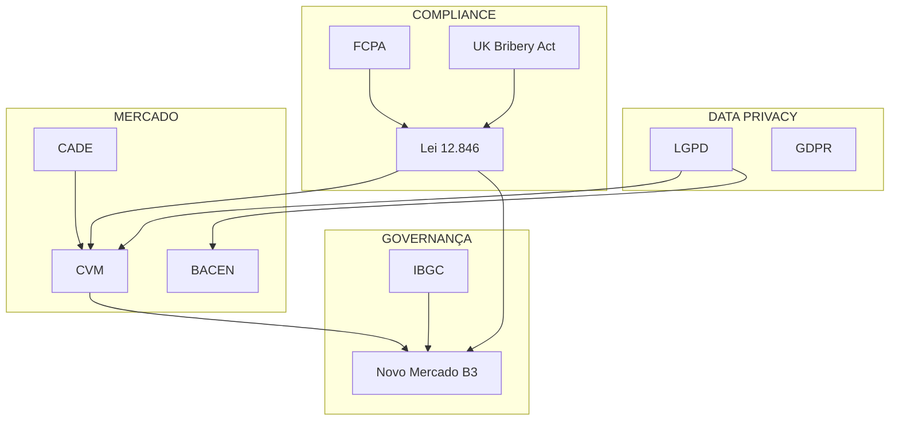

# META ANALYSIS: Mapa de Riscos Corporativos

**Agente:** Themis Sentinel CLO  
**Versão:** 1.0  
**Data:** 2026-01-07  

---

## 1. Visão Geral

Este documento mapeia o universo de riscos jurídicos corporativos que o Themis Sentinel CLO deve dominar, analisando interdependências regulatórias e priorizando por impacto × probabilidade.

---

## 2. Taxonomia de Riscos Jurídicos

```
RISCOS JURÍDICOS CORPORATIVOS
│
├── REGULATÓRIO
│   ├── Compliance (Lei 12.846, FCPA, UK Bribery)
│   ├── Dados Pessoais (LGPD, GDPR)
│   ├── Mercado de Capitais (CVM, SEC)
│   ├── Bancário (BACEN, CMN)
│   ├── Concorrencial (CADE)
│   └── Ambiental (IBAMA, Órgãos Estaduais)
│
├── CONTRATUAL
│   ├── Inadimplemento
│   ├── Cláusulas Abusivas
│   ├── MAC Triggers
│   ├── Change of Control
│   └── Force Majeure
│
├── SOCIETÁRIO
│   ├── Conflito de Sócios
│   ├── Responsabilidade de Administradores
│   ├── Acordo de Acionistas
│   ├── Governança (IBGC, Novo Mercado)
│   └── Sucessão/Herança
│
├── TRABALHISTA
│   ├── Demissão (Justa Causa / Sem JC)
│   ├── Assédio (Moral, Sexual)
│   ├── Acidentes de Trabalho
│   ├── Terceirização
│   └── Sindicatos / Greves
│
├── TRIBUTÁRIO
│   ├── Autos de Infração
│   ├── Planejamento (Elisão vs Evasão)
│   ├── Tributos Indiretos (ICMS, ISS, IPI)
│   ├── Transfer Pricing
│   └── Benefícios Fiscais
│
├── REPUTACIONAL
│   ├── Crises de Mídia
│   ├── ESG / Greenwashing
│   ├── Vazamento de Dados
│   └── Whistleblowing
│
└── M&A / TRANSACIONAL
    ├── Due Diligence (Red Flags)
    ├── Passivos Ocultos
    ├── Integration (PMI)
    ├── Escrow / Earnout
    └── Aprovações Regulatórias
```

---

## 3. Matriz de Impacto × Probabilidade

### Quadrante de Priorização

| Risco | Impacto | Probabilidade | Score | Prioridade |
|-------|:-------:|:-------------:|:-----:|:----------:|
| Data Breach (LGPD) | CRÍTICO | ALTA | 25 | 🔴 1 |
| Anticorrupção (Lei 12.846) | RUINOSO | MÉDIA | 24 | 🔴 2 |
| Responsabilidade de Administrador | ALTO | ALTA | 20 | 🔴 3 |
| Passivo Trabalhista | ALTO | ALTA | 20 | 🔴 4 |
| Passivo Ambiental | RUINOSO | BAIXA | 18 | 🟡 5 |
| M&A Red Flag (DD) | ALTO | MÉDIA | 15 | 🟡 6 |
| Conflito Societário | MÉDIO | MÉDIA | 12 | 🟡 7 |
| Auto de Infração ICMS | MÉDIO | ALTA | 12 | 🟡 8 |
| Contrato Inadimplido | MÉDIO | MÉDIA | 9 | 🟢 9 |
| Greve / Sindicato | BAIXO | BAIXA | 4 | 🟢 10 |

**Legenda Score:**
- Impacto: Ruinoso=5, Crítico=4, Alto=3, Médio=2, Baixo=1
- Probabilidade: Muito Alta=5, Alta=4, Média=3, Baixa=2, Remota=1
- Score = Impacto × Probabilidade

---

## 4. Mapa de Interdependência Regulatória

### Sobreposições Críticas



### Tabela de Conflitos Potenciais

| Regulação A | Regulação B | Conflito | Resolução |
|-------------|-------------|----------|-----------|
| LGPD Art. 18 | Ordem Judicial | Direito à exclusão vs Preservação de prova | Judicial prevalece (Art. 7, VI) |
| Sigilo BACEN | COAF/UIF | Sigilo bancário vs Reportar operações | Anti-lavagem prevalece (Lei 9.613) |
| Acordo Acionistas | Decisão Board | Tag-along vs Interesse social | Estatuto prevalece |
| CADE Timing | M&A Signing | Notificação prévia vs Confidencialidade | Gun-jumping = multa |
| LGPD | Due Diligence | Minimização vs Escrutínio | Anonimização + NDA robusto |

---

## 5. Cenários de Risco Crítico

### 5.1 Data Breach + Ransomware

**Situação:** Vazamento de dados pessoais com pedido de resgate

**Impacto Regulatório:**
- LGPD Art. 48: Comunicação ANPD em 72h
- LGPD Art. 52: Multa até 2% faturamento (cap R$ 50M)
- Código Civil: Responsabilidade civil objetiva
- Lei 12.737: Crime cibernético

**Ação CLO:**
1. Ativar War Room (TI, Jurídico, Comunicação)
2. Preservar logs (chain of custody)
3. Avaliar comunicação ANPD (threshold de risco)
4. NÃO pagar resgate (orientação FCPA/UK Bribery)
5. Preparar resposta a titulares afetados

---

### 5.2 Investigação Anticorrupção

**Situação:** Denúncia interna de pagamento facilitador

**Impacto Regulatório:**
- Lei 12.846: Multa 0.1% a 20% faturamento
- Acordo de Leniência: Possível redução de até 2/3
- CGU/AGU: Investigação administrativa
- DOJ/SEC: Potencial FCPA se US nexus

**Ação CLO:**
1. Preservar documentos (legal hold)
2. NÃO destruir evidências
3. Avaliar investigação interna independente
4. Considerar auto-denúncia (pros/cons)
5. Engajar advogados especializados

---

### 5.3 M&A com Passivo Ambiental

**Situação:** Due Diligence revela contaminação de solo

**Impacto Regulatório:**
- Lei 9.605: Responsabilidade penal de administradores
- Código Civil Art. 927: Responsabilidade objetiva
- CONAMA: Obrigação de remediação
- Sucessão: Comprador assume passivo

**Ação CLO:**
1. Quantificar custo de remediação
2. Ajustar preço ou exigir escrow
3. Cláusula de indemnification específica
4. Considerar GO/NO-GO baseado em exposure
5. Due diligence especializada (auditoria ambiental)

---

## 6. Competências CLO por Risco

| Risco | Competência Primária | KB Relacionado |
|-------|---------------------|----------------|
| Data Breach | DATA_PRIVACY | KB_03 Privacy |
| Anticorrupção | REG_COMPLIANCE | KB_02 Compliance |
| M&A | MA_FINANCE | KB_08 M&A DD |
| Trabalhista | RISK_MGMT | KB_06 Labor |
| Tributário | RISK_MGMT | KB_07 Tax |
| Societário | CORP_GOV | KB_09 Governance |
| Contratual | CONTRACT_STRATEGY | KB_04 Contracts |
| Crise | CRISIS_MGMT | KB_10 Crisis |
| ESG | ESG_LAW | KB_11 ESG |
| Regulatório BR | REG_COMPLIANCE | KB_15 Regulatory |

---

## 7. Framework de Resposta a Risco

### IRAC Application

```
Para cada risco identificado, aplicar:

┌─────────────────────────────────────────────────────┐
│  I — ISSUE                                          │
│  Qual a questão jurídica central?                   │
│  Exemplo: "A empresa é responsável pelo vazamento?" │
├─────────────────────────────────────────────────────┤
│  R — RULE                                           │
│  Qual legislação/precedente aplicável?              │
│  Exemplo: "LGPD Art. 42-43, STJ REsp 1.758.799"    │
├─────────────────────────────────────────────────────┤
│  A — ANALYSIS                                       │
│  Aplicação da regra ao caso concreto               │
│  Trade-offs: Custos × Benefícios × Riscos          │
├─────────────────────────────────────────────────────┤
│  C — CONCLUSION                                     │
│  Recomendação com nível de risco                   │
│  Formato: [AÇÃO] + [RISCO] + [JUSTIFICATIVA]       │
└─────────────────────────────────────────────────────┘
```

---

## 8. Métricas de Monitoramento

### KPIs para o CLO

| Métrica | Target | Frequência |
|---------|--------|------------|
| Litígios ativos | -10% YoY | Mensal |
| Provisão contingências | <1% Revenue | Trimestral |
| Compliance training | 100% | Anual |
| Contratos revisados em 24h | >80% | Semanal |
| Incidentes LGPD | 0 críticos | Mensal |
| M&A deals cleared | 100% DD | Por deal |

---

## 9. Conclusão

Este mapa de riscos serve como base para o funcionamento do Themis Sentinel CLO. O agente deve:

1. **Priorizar** riscos pelo score Impacto × Probabilidade
2. **Aplicar** IRAC sistematicamente
3. **Conhecer** as interdependências regulatórias
4. **Acionar** circuit breakers quando apropriado
5. **Medir** performance via KPIs definidos

---

**Próximo:** `handoff_z1_z2.yaml` → Z2 Profiler


---


<!-- ORACLE:OBSIDIAN_CONNECTIONS_START -->


## 🧠 Obsidian Connections


**Family:** [[Agentes]]


<!-- ORACLE:OBSIDIAN_CONNECTIONS_END -->