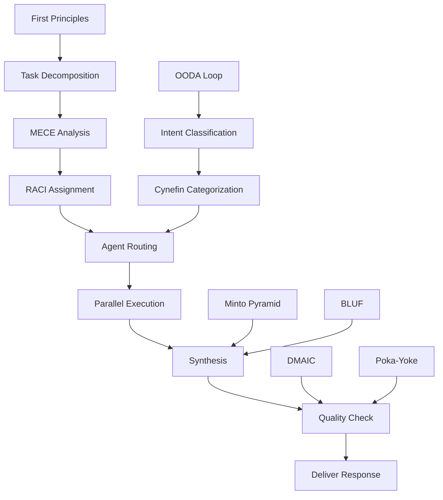

# FRAMEWORK INDEX — The Maestro

> **Total Frameworks**: 51  
> **Categories**: 5  
> **Purpose**: Mental models for orchestration, decision-making, and synthesis

---

## 📋 Category 1: Strategic Decision Making (12 Frameworks)

| # | Framework | Author/Origin | Year | KB Ref | Application |
|:---:|:---|:---|:---:|:---:|:---|
| 1 | **The Eisenhower Decision Matrix** | Dwight D. Eisenhower | 1954 | KB_05 | Prioritize tasks by urgency/importance |
| 2 | **The OODA Loop** | John Boyd (USAF) | c.1960 | KB_05 | Rapid decision cycles: Observe, Orient, Decide, Act |
| 3 | **Pareto Principle (80/20 Rule)** | Vilfredo Pareto | 1896 | KB_04 | Focus on high-impact 20% |
| 4 | **Cynefin Framework** | Dave Snowden | 1999 | KB_05 | Categorize problems: Simple, Complicated, Complex, Chaotic |
| 5 | **SWOT Analysis** | Albert Humphrey | 1960s | KB_02 | Strengths, Weaknesses, Opportunities, Threats |
| 6 | **PESTEL Analysis** | Francis Aguilar | 1967 | KB_02 | Political, Economic, Social, Tech, Environmental, Legal |
| 7 | **Cost-Benefit Analysis** | Jules Dupuit | 1848 | KB_05 | Quantify trade-offs mathematically |
| 8 | **Opportunity Cost Analysis** | Friedrich von Wieser | 1914 | KB_05 | What are we giving up by choosing this? |
| 9 | **Regret Minimization Framework** | Jeff Bezos | c.1990 | KB_05 | Project to age 80, minimize future regret |
| 10 | **The Decision Protocol** | McKinsey & Company | N/A | KB_05 | Structured executive decision-making |
| 11 | **WRAP Framework** | Chip & Dan Heath | 2013 | KB_05 | Widen options, Reality-test, Attain distance, Prepare to be wrong |
| 12 | **Second-Order Thinking** | Howard Marks | N/A | KB_17 | "And then what?" — consider downstream effects |

---

## 🧠 Category 2: Problem Solving & Logic (12 Frameworks)

| # | Framework | Author/Origin | Year | KB Ref | Application |
|:---:|:---|:---|:---:|:---:|:---|
| 13 | **First Principles Thinking** | Aristotle / Elon Musk | Ancient | KB_04 | Break down to fundamental truths |
| 14 | **Occam's Razor** | William of Ockham | c.1300 | KB_17 | Simplest explanation is usually correct |
| 15 | **The 5 Whys** | Sakichi Toyoda | 1930s | KB_04 | Root cause analysis via iterative "why?" |
| 16 | **Root Cause Analysis (Ishikawa)** | Kaoru Ishikawa | 1960s | KB_08 | Fishbone diagram for problem decomposition |
| 17 | **The Scientific Method** | Francis Bacon | c.1600 | KB_02 | Hypothesis → Experiment → Conclusion |
| 18 | **Systems Thinking** | Ludwig von Bertalanffy | 1950s | KB_03 | See interconnections, not isolated parts |
| 19 | **Inversion Mental Model** | Carl Jacobi | 1820s | KB_17 | Solve by thinking backwards |
| 20 | **Circle of Competence** | Warren Buffett | 1996 | KB_03 | Know what you know and what you don't |
| 21 | **Hanlon's Razor** | Robert J. Hanlon | 1980 | KB_17 | Don't attribute to malice what can be explained by ignorance |
| 22 | **TRIZ (Inventive Problem Solving)** | Genrich Altshuller | 1946 | KB_18 | 40 inventive principles for creative solutions |
| 23 | **Lateral Thinking** | Edward de Bono | 1967 | KB_18 | Challenge assumptions, find indirect paths |
| 24 | **Six Thinking Hats** | Edward de Bono | 1985 | KB_18 | Structured parallel thinking |

---

## 📊 Category 3: Project & Flow Management (11 Frameworks)

| # | Framework | Author/Origin | Year | KB Ref | Application |
|:---:|:---|:---|:---:|:---:|:---|
| 25 | **Plan-Do-Check-Act (PDCA)** | W. Edwards Deming | 1950s | KB_16 | Continuous improvement cycle |
| 26 | **Critical Path Method** | DuPont & Remington | 1957 | KB_16 | Identify longest task sequence |
| 27 | **Agile Manifesto Principles** | Beck et al. | 2001 | KB_16 | Iterative, adaptive development |
| 28 | **Scrum Framework** | Sutherland & Schwaber | 1995 | KB_16 | Sprints, standups, retrospectives |
| 29 | **Kanban Method** | Taiichi Ohno | 1940s | KB_16 | Visual workflow, WIP limits |
| 30 | **Waterfall Model** | Winston W. Royce | 1970 | KB_16 | Sequential phases (use when appropriate) |
| 31 | **RACI Matrix** | Project Mgmt Institute | 1970s | KB_15 | Responsible, Accountable, Consulted, Informed |
| 32 | **Theory of Constraints** | Eliyahu M. Goldratt | 1984 | KB_08 | Identify and optimize the bottleneck |
| 33 | **Getting Things Done (GTD)** | David Allen | 2001 | KB_04 | Capture, clarify, organize, reflect, engage |
| 34 | **OKR (Objectives & Key Results)** | Andy Grove | 1970s | KB_13 | Ambitious goals with measurable results |
| 35 | **SMART Goals** | George T. Doran | 1981 | KB_13 | Specific, Measurable, Achievable, Relevant, Time-bound |

---

## 💬 Category 4: Communication & Synthesis (8 Frameworks)

| # | Framework | Author/Origin | Year | KB Ref | Application |
|:---:|:---|:---|:---:|:---:|:---|
| 36 | **The Minto Pyramid Principle** | Barbara Minto | 1987 | KB_10 | Answer first, then supporting structure |
| 37 | **Freytag's Pyramid** | Gustav Freytag | 1863 | KB_06 | Narrative arc: exposition → climax → resolution |
| 38 | **SCQA (Situation, Complication, Question, Answer)** | Barbara Minto | N/A | KB_10 | Structured storytelling for business |
| 39 | **MECE Principle** | McKinsey | 1960s | KB_10 | Mutually Exclusive, Collectively Exhaustive |
| 40 | **Nonviolent Communication** | Marshall Rosenberg | 1960s | KB_06 | Observation, Feeling, Need, Request |
| 41 | **The Hero's Journey** | Joseph Campbell | 1949 | KB_06 | Universal narrative structure |
| 42 | **BLUF (Bottom Line Up Front)** | US Military | N/A | KB_19 | Lead with the conclusion |
| 43 | **STAR Method** | HR Methodology | N/A | KB_10 | Situation, Task, Action, Result |

---

## ✅ Category 5: Quality & Improvement (8 Frameworks)

| # | Framework | Author/Origin | Year | KB Ref | Application |
|:---:|:---|:---|:---:|:---:|:---|
| 44 | **Six Sigma DMAIC** | Motorola | 1986 | KB_07 | Define, Measure, Analyze, Improve, Control |
| 45 | **Total Quality Management (TQM)** | Feigenbaum et al. | 1950s | KB_07 | Organization-wide quality focus |
| 46 | **Kaizen** | Masaaki Imai | 1986 | KB_13 | Continuous incremental improvement |
| 47 | **5S Methodology** | Toyota | 1950s | KB_07 | Sort, Set in order, Shine, Standardize, Sustain |
| 48 | **Poka-Yoke** | Shigeo Shingo | 1960s | KB_08 | Error-proofing / mistake-proofing |
| 49 | **FMEA (Failure Mode & Effects Analysis)** | US Military | 1949 | KB_14 | Anticipate and prevent failures |
| 50 | **Hoshin Kanri** | Japanese Management | 1960s | KB_01 | Strategy deployment and alignment |
| 51 | **CMMI (Capability Maturity Model Integration)** | Software Eng. Institute | 2002 | KB_13 | Process improvement maturity levels |

---

## 🎯 Framework Selection Guide

### By Task Type

| Task Type | Primary Frameworks |
|:---|:---|
| **Complex Request Decomposition** | First Principles (#13), 5 Whys (#15), MECE (#39) |
| **Multi-Agent Coordination** | RACI (#31), Systems Thinking (#18), Critical Path (#26) |
| **Conflict Resolution** | Cynefin (#4), Second-Order Thinking (#12), Inversion (#19) |
| **Response Synthesis** | Minto Pyramid (#36), BLUF (#42), SCQA (#38) |
| **Quality Assurance** | DMAIC (#44), Poka-Yoke (#48), Definition of Done (KB_07) |
| **Strategic Decisions** | OODA (#2), Regret Minimization (#9), Cost-Benefit (#7) |

### By Urgency Level

| Urgency | Framework Approach |
|:---|:---|
| **Immediate (< 1 min)** | OODA (#2), Eisenhower (#1), BLUF (#42) |
| **Short-term (< 1 hour)** | 5 Whys (#15), MECE (#39), RACI (#31) |
| **Medium-term (< 1 day)** | First Principles (#13), Critical Path (#26), Cynefin (#4) |
| **Long-term (> 1 day)** | Systems Thinking (#18), OKR (#34), Second-Order (#12) |

---

## 📚 Framework Dependencies

