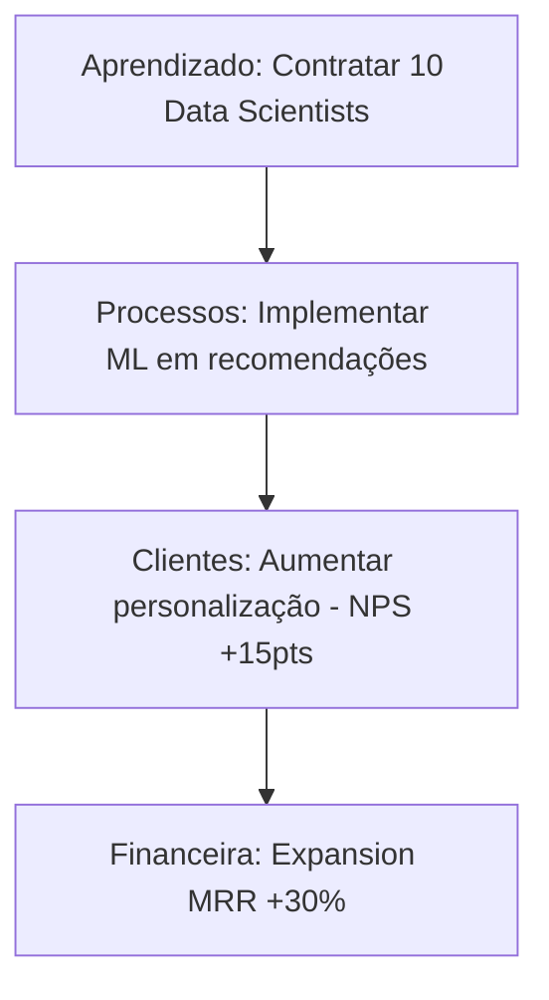

# KB_03: Balanced Scorecard (BSC)

## 📖 Origem
Desenvolvido por Robert Kaplan e David Norton (Harvard Business School) nos anos 90. Popularizado por empresas que precisavam balancear métricas financeiras e não-financeiras.

## 🎯 Estrutura Core: As 4 Perspectivas

O BSC organiza a estratégia em **4 dimensões interconectadas:**

```
┌─────────────────────┐
│ 1. FINANCEIRA       │  → "Como aparecemos para os shareholders?"
└─────────────────────┘
         ↑
┌─────────────────────┐
│ 2. CLIENTES         │  → "Como os clientes nos veem?"
└─────────────────────┘
         ↑
┌─────────────────────┐
│ 3. PROCESSOS        │  → "Em que devemos ser excelentes?"
└─────────────────────┘
         ↑
┌─────────────────────┐
│ 4. APRENDIZADO &    │  → "Como sustentar a capacidade de mudar?"
│    CRESCIMENTO      │
└─────────────────────┘
```

**Princípio Central:** Se você investe em **Aprendizado**, melhora **Processos**, que gera **Satisfação do Cliente**, que resulta em **Performance Financeira**.

## 📊 Detalhamento das 4 Perspectivas

### 1️⃣ Perspectiva Financeira

**Objetivo:** Medir a saúde financeira e retorno aos investidores.

**Métricas Típicas:**
- **Crescimento:** Receita, ARR, MRR, CAGR
- **Lucratividade:** EBITDA, Margem Líquida, Margem de Contribuição
- **Eficiência de Capital:** ROI, ROE, ROIC
- **SaaS Específico:** LTV, CAC Payback, Rule of 40

**Exemplo de Objetivo BSC:**
```markdown
**Objetivo:** Aumentar lucratividade mantendo crescimento
- **KPI:** EBITDA Margin de 12% → 18%
- **Iniciativa:** Otimizar custos de infraestrutura (migração cloud)
- **Target:** Q4/2026
```

---

### 2️⃣ Perspectiva de Clientes

**Objetivo:** Entender como o mercado percebe valor.

**Métricas Típicas:**
- **Satisfação:** NPS, CSAT, Customer Effort Score
- **Retenção:** Churn Rate, Retention Rate, GRR/NRR
- **Aquisição:** CAC, Conversion Rate, Time to Value
- **Share of Wallet:** Expansion MRR, Upsell Rate

**Exemplo de Objetivo BSC:**
```markdown
**Objetivo:** Tornar-se a escolha preferida no segmento PME
- **KPI:** NPS de 45 → 65
- **KPI:** Churn de 7% → 4%
- **Iniciativa:** Lançar programa de Customer Success proativo
- **Iniciativa:** Reduzir time-to-value de 30d → 7d
```

---

### 3️⃣ Perspectiva de Processos Internos

**Objetivo:** Identificar processos críticos que geram vantagem competitiva.

**Categorias:**
1. **Processos de Inovação:** Time-to-market, Feature Adoption
2. **Processos Operacionais:** Lead Response Time, Cycle Time
3. **Processos Pós-Venda:** Resolution Time, CSAT de Suporte

**Métricas Típicas:**
- **Eficiência:** Cycle Time, Throughput, Utilization Rate
- **Qualidade:** Defect Rate, First Call Resolution
- **Inovação:** % Receita de produtos novos (<2 anos)

**Exemplo de Objetivo BSC:**
```markdown
**Objetivo:** Acelerar inovação de produto
- **KPI:** Time-to-market de features core de 90d → 45d
- **KPI:** Feature adoption em 60% da base no primeiro mês
- **Iniciativa:** Implementar Continuous Deployment
- **Iniciativa:** Squad model com autonomia end-to-end
```

---

### 4️⃣ Perspectiva de Aprendizado & Crescimento

**Objetivo:** Construir capacidade organizacional para o futuro.

**Dimensões:**
1. **Capital Humano:** Skill gaps, Treinamento, Retenção
2. **Capital de Informação:** Data literacy, Sistemas, Dashboards
3. **Cultura Organizacional:** Engagement, Valores, Inovação

**Métricas Típicas:**
- **People:** Turnover voluntário, Engagement Score, Diversity %
- **Skills:** % com certificação relevante, avg horas de treinamento
- **Cultura:** Employee NPS (eNPS), Glassdoor Rating

**Exemplo de Objetivo BSC:**
```markdown
**Objetivo:** Construir time world-class em AI/ML
- **KPI:** 100% dos engenheiros com certificação em ML até Dez/2026
- **KPI:** Turnover < 10% (mercado = 20%)
- **Iniciativa:** Academia Interna + budget $100k para cursos
- **Iniciativa:** Tech Talks semanais internos
```

## 🔗 Strategy Map (Conexão das 4 Perspectivas)

O **Strategy Map** visualiza a relação de causa-efeito entre perspectivas.



**Como construir:**
1. Comece pela **Financeira** (resultado final desejado)
2. Pergunte: "Para isso acontecer, o que os **Clientes** precisam experienciar?"
3. Pergunte: "Para entregar isso aos clientes, qual **Processo** precisa funcionar bem?"
4. Pergunte: "Para esse processo funcionar, qual **Capacidade Organizacional** preciso construir?"

## 🧠 Regras de Ouro BSC

### 1. Balanceamento é a Lei
Não adianta ter 10 KPIs financeiros e 1 de aprendizado. O BSC força equilíbrio:
- **Ideal:** 4-6 KPIs por perspectiva (total ~20 KPIs)
- **Errado:** 15 KPIs financeiros, 2 de cliente, 0 de aprendizado

### 2. Leading vs Lagging
- **Lagging (Resultado):** NPS, Receita, EBITDA
- **Leading (Causa):** Horas de treinamento, Time-to-market, Feature adoption

**Regra:** Cada lagging indicator precisa de 1-2 leading indicators que o causam.

### 3. Strategy Map é Obrigatório
BSC sem Strategy Map = coleção de KPIs aleatórios. O valor está em **visualizar as conexões causais**.

## 🚫 Anti-Patterns (Erros Comuns)

### ❌ BSC como KPI Dumping Ground
**Problema:** Colocar todos os KPIs possíveis no BSC (50+ métricas).  
**Solução:** Foque apenas nos KPIs **estratégicos** (não operacionais). Operacionais vão para dashboards táticos.

### ❌ Ignorar Aprendizado & Crescimento
**Problema:** Focar só em Financeiro + Cliente.  
**Consequência:** Sucesso de curto prazo, colapso de longo prazo (burnout, skill gap).  
**Solução:** Force distribuição balanceada.

### ❌ BSC Estático
**Problema:** Criar BSC bonito e nunca revisar.  
**Solução:** Quarterly reviews obrigatórios. Se o contexto muda, o BSC muda.

## 🛠️ Template Prático: BSC Completo

```markdown
# Balanced Scorecard 2026 — [Nome da Empresa]

## 🎯 Visão Estratégica
Tornar-se líder em [nicho] com crescimento rentável e cultura de excelência.

---

## 💰 PERSPECTIVA FINANCEIRA

### Objetivo 1: Crescimento Sustentável
| KPI | Baseline | Target 2026 | Q1 | Q2 | Q3 | Q4 | Owner |
|-----|----------|-------------|----|----|----|----|-------|
| ARR | $10M | $18M | - | - | - | - | CFO |
| Rule of 40 | 35% | 45% | - | - | - | - | CFO |

**Iniciativas:**
- [ ] Expandir Enterprise Sales (investimento: $500k)
- [ ] Otimizar CAC via inbound marketing

---

### Objetivo 2: Eficiência Operacional
| KPI | Baseline | Target 2026 | Q1 | Q2 | Q3 | Q4 | Owner |
|-----|----------|-------------|----|----|----|----|-------|
| EBITDA Margin | 12% | 20% | - | - | - | - | CFO |
| Server Costs/Customer | $15 | $8 | - | - | - | - | CTO |

**Iniciativas:**
- [ ] Cloud optimization program
- [ ] Renegociar top 5 fornecedores

---

## 👥 PERSPECTIVA DE CLIENTES

### Objetivo 3: Excelência em Customer Experience
| KPI | Baseline | Target 2026 | Q1 | Q2 | Q3 | Q4 | Owner |
|-----|----------|-------------|----|----|----|----|-------|
| NPS | 45 | 65 | - | - | - | - | Head of CX |
| Net Churn | 5% | 2% | - | - | - | - | Head of CX |

**Iniciativas:**
- [ ] Implementar CS proativo para ARR > $10k
- [ ] Reduzir time-to-value de 21d → 7d

---

## ⚙️ PERSPECTIVA DE PROCESSOS INTERNOS

### Objetivo 4: Acelerar Inovação
| KPI | Baseline | Target 2026 | Q1 | Q2 | Q3 | Q4 | Owner |
|-----|----------|-------------|----|----|----|----|-------|
| Time-to-Market | 90d | 45d | - | - | - | - | CPO |
| Feature Adoption (D30) | 40% | 70% | - | - | - | - | CPO |

**Iniciativas:**
- [ ] Continuous Deployment pipeline
- [ ] Product Analytics embedded

---

### Objetivo 5: Eficiência de Vendas
| KPI | Baseline | Target 2026 | Q1 | Q2 | Q3 | Q4 | Owner |
|-----|----------|-------------|----|----|----|----|-------|
| Sales Cycle (days) | 60d | 35d | - | - | - | - | CRO |
| Win Rate | 25% | 40% | - | - | - | - | CRO |

**Iniciativas:**
- [ ] Sales automation (CRM + Outreach)
- [ ] Battle Cards para top 3 competidores

---

## 📚 PERSPECTIVA DE APRENDIZADO & CRESCIMENTO

### Objetivo 6: Construir Culture of Excellence
| KPI | Baseline | Target 2026 | Q1 | Q2 | Q3 | Q4 | Owner |
|-----|----------|-------------|----|----|----|----|-------|
| Engagement Score | 7.0 | 8.5 | - | - | - | - | People Lead |
| Turnover (Voluntary) | 18% | <12% | - | - | - | - | People Lead |

**Iniciativas:**
- [ ] Carreira em Y implementada
- [ ] Transparência salarial (bandas públicas)

---

### Objetivo 7: Upskilling em AI/Data
| KPI | Baseline | Target 2026 | Q1 | Q2 | Q3 | Q4 | Owner |
|-----|----------|-------------|----|----|----|----|-------|
| % com cert. relevante | 30% | 80% | - | - | - | - | CTO |
| Avg Training Hours/Year | 20h | 50h | - | - | - | - | People Lead |

**Iniciativas:**
- [ ] Academia Interna (budget: $80k)
- [ ] Partnership com instituição de ensino

---

## 🗺️ Strategy Map

[Inserir diagrama de causa-efeito]

---

## 📅 Governance

**Mensal:** Review de todos os KPIs (dashboard automático)  
**Trimestral:** Deep dive em iniciativas off-track  
**Anual:** Revisão completa do BSC (ajustes estratégicos)
```

## 🎓 Quando Usar BSC (vs outros frameworks)

✅ **Use BSC se:**
- Necessidade de visão holística (não só financeira)
- Organização madura com múltiplas áreas funcionais
- Querem balancear short-term (financeiro) e long-term (aprendizado)
- Board/Investidores pedem visão balanceada

❌ **Evite BSC se:**
- Startup muito early (< 20 pessoas) - overhead demais
- Ambiente ultra-ágil onde BSC trimestral é rígido demais
- Não há disciplina para tracking de ~20 KPIs

---

**Fontes:**
- "The Balanced Scorecard" (Kaplan & Norton)
- "The Strategy-Focused Organization" (Kaplan & Norton)
- Harvard Business Review - Balanced Scorecard 2024 Update
- BSC Institute Best Practices
