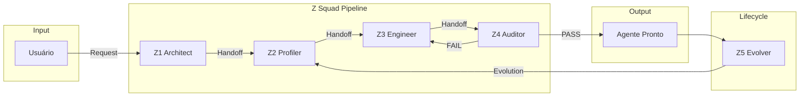

# Z SQUAD — Elite Agent Factory

**Versão:** 2.0 (Framework-Integrated)
**Data:** 2026-01-06
**Status:** 🚀 Ativo

---

## 🎯 Missão
O **Z Squad** é o sistema multiagente de elite da ExímIA.AI, responsável pela **criação, validação e evolução** de agentes especializados de alta qualidade.

> *"Um agente bem construído não é um script, é uma entidade cognitiva."*

---

## 🏗️ Fundamentos

O Z Squad é construído sobre o **Framework Multiagentes ExímIA**, incorporando:

| Conceito | Implementação |
| :--- | :--- |
| **MCP Protocol** | Comunicação padronizada entre módulos |
| **Handoff Structured** | Passagem de contexto sem perda |
| **Shared State** | Estado único do pipeline |
| **Anti-patterns Awareness** | Prevenção de erros comuns |

---

## 🧬 Arquitetura (Os 5 Módulos)

| Módulo | Nome | Função | Analogia |
| :---: | :--- | :--- | :--- |
| **Z1** | The Architect | Especificação técnica | Product Manager |
| **Z2** | The Profiler | DNA Mental e personalidade | Psicólogo Org. |
| **Z3** | The Engineer | Prompts e schemas | Full Stack Dev |
| **Z4** | The Auditor | Validação adversarial | QA Hacker |
| **Z5** | The Evolver | Melhoria contínua | SRE |

---

## 📁 Estrutura de Diretórios

```
Z_Squad/
├── README.md                     # Este arquivo
├── shared_protocols/             # ⚡ NOVO: Protocolos compartilhados
│   ├── handoff_protocol.md       # Como módulos passam informações
│   ├── shared_state_schema.json  # Schema do estado do pipeline
│   ├── mcp_integration.md        # Integração com MCP
│   └── antipatterns.md           # Erros comuns a evitar
│
├── Z1_Architect/
│   ├── agente_core.md            # 4 Fases: Decomposition → Success
│   ├── knowledge_base/
│   │   ├── KB_01_decomposition_frameworks.md
│   │   └── KB_02_competency_mapping.md
│   └── templates/
│       └── spec_tecnica_template.json
│
├── Z2_Profiler/
│   ├── agente_core.md            # 5 Fases: Ingestion → Style
│   ├── knowledge_base/
│   │   ├── KB_01_dna_mental_guide.md
│   │   └── KB_02_clone_catalog.md
│   └── templates/
│       └── dna_mental_template.md
│
├── Z3_Engineer/
│   ├── agente_core.md            # 5 Fases: Input → Tooling
│   ├── knowledge_base/
│   │   ├── KB_01_prompt_patterns.md
│   │   └── KB_02_schema_design.md
│   └── templates/
│       └── system_prompt_template.md
│
├── Z4_Auditor/
│   ├── agente_core.md            # 4 Fases: Collection → Report
│   ├── knowledge_base/
│   │   ├── KB_01_test_methodologies.md
│   │   └── KB_02_failure_modes.md
│   └── templates/
│       └── validation_report_template.md
│
├── Z5_Evolver/
│   ├── agente_core.md            # 4 Domínios: Monitoring → Lifecycle
│   ├── knowledge_base/
│   │   ├── KB_01_monitoring_metrics.md
│   │   └── KB_02_evolution_patterns.md
│   └── templates/
│       └── evolution_ticket_template.yaml
│
└── outputs/                      # Agentes gerados pelo Squad
    └── [agent_name]/
```

---

## 🔄 Pipeline de Criação



---

## 📜 Protocolos Obrigatórios

### 1. Handoff Protocol
Cada transição entre módulos **deve** incluir:
- Summary do trabalho feito
- Key decisions tomadas
- Constraints para o próximo módulo
- Open questions pendentes

👉 Ver [shared_protocols/handoff_protocol.md](./shared_protocols/handoff_protocol.md)

### 2. Shared State
O estado do pipeline **deve** seguir o schema oficial:
- pipeline_id, status, current_module
- objectives, plan, artifacts
- handoffs history

👉 Ver [shared_protocols/shared_state_schema.json](./shared_protocols/shared_state_schema.json)

### 3. Anti-patterns Check
Antes de cada entrega, verificar o checklist de antipadrões:
- God Agent? Micro-Management? Context Overload?

👉 Ver [shared_protocols/antipatterns.md](./shared_protocols/antipatterns.md)

---

## 📚 Referências

| Documento | Descrição |
| :--- | :--- |
| [Plano Estratégico v2.1](../Conteudo_sintetizado/Plano_Estrategico_Agentes_Z_v2.md) | Visão e justificativa |
| [Framework Multiagentes](../Conteudo_sintetizado/Framework_Multiagentes_EximIA/) | Base teórica |
| [@The_Cloner](../The_Cloner/) | Base de clones mentores |
| [@The_Recruiter (Legacy)](../The_Recruiter/) | Sistema anterior |

---

## ⚡ Quick Start

Para criar um novo agente:

1. **Definir objetivo** → Acionar Z1 Architect
2. **Gerar perfil** → Z1 passa para Z2 Profiler via Handoff
3. **Implementar** → Z2 passa para Z3 Engineer via Handoff
4. **Validar** → Z3 passa para Z4 Auditor via Handoff
5. **Entregar** → Z4 aprova ou rejeita (loop com Z3 se necessário)
6. **Monitorar** → Z5 Evolver acompanha em produção

---
**Mantido por:** ExímIA.AI | Z Squad v2.0
