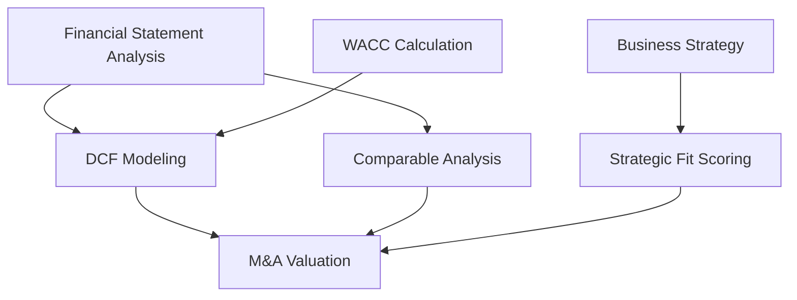

# KB_02 — Competency Mapping

## 🎯 Propósito
Este documento contém os frameworks de mapeamento de competências usados pelo Z1 Architect para definir as skills técnicas de um agente.

---

## 1. Competency Matrix

### Estrutura
Para cada competência, definir:

```yaml
- skill: "[Nome da Skill]"
  nivel: "[Beginner | Intermediate | Advanced | Expert]"
  descricao: "[O que essa skill permite fazer]"
  ferramentas: ["[Tool 1]", "[Tool 2]"]
  validacao: "[Como testar se o agente tem essa skill]"
  dependencias: ["[Skill que precisa existir antes]"]
```

### Níveis de Proficiência

| Nível | Descrição | Benchmark |
| :--- | :--- | :--- |
| **Beginner** | Conhece conceitos básicos | Top 50% |
| **Intermediate** | Aplica com supervisão | Top 30% |
| **Advanced** | Aplica de forma autônoma | Top 10% |
| **Expert** | Ensina e inova | Top 1% |

### Exemplo: CFO Agent

```yaml
competencias:
  - skill: "DCF Modeling"
    nivel: Expert
    descricao: "Construir modelos de Discounted Cash Flow completos"
    ferramentas: ["Excel", "Capital IQ", "Bloomberg"]
    validacao: "Modelo DCF 5Y com TV, sensibilidade e cenários"
    dependencias: ["WACC Calculation", "Financial Statement Analysis"]

  - skill: "Comparable Companies Analysis"
    nivel: Advanced
    descricao: "Selecionar peers e calcular múltiplos"
    ferramentas: ["Capital IQ", "Yahoo Finance"]
    validacao: "Análise com 8-12 peers e múltiplos EV/EBITDA"
    dependencias: []

  - skill: "Strategic Fit Scoring"
    nivel: Advanced
    descricao: "Avaliar fit estratégico de M&A"
    ferramentas: []
    validacao: "Framework 5 critérios × 10 pts, threshold ≥35"
    dependencias: ["Business Strategy Literacy"]
```

---

## 2. RACI Matrix (Responsabilidades)

### O Que É?
Framework para definir quem faz o quê em relação ao agente.

| Letra | Significado | Descrição |
| :---: | :--- | :--- |
| R | **Responsible** | Quem executa a tarefa |
| A | **Accountable** | Quem responde pelo resultado |
| C | **Consulted** | Quem é consultado (input) |
| I | **Informed** | Quem é informado (output) |

### Exemplo: CFO Agent

| Tarefa | Agente CFO | CEO | Board | Controller |
| :--- | :---: | :---: | :---: | :---: |
| Calcular Valuation | **R** | A | I | C |
| Aprovar M&A | I | **R/A** | C | I |
| Fornecer Dados | C | I | I | **R** |

---

## 3. Skill Dependency Graph

### Conceito
Algumas skills dependem de outras. Mapear esta hierarquia evita gaps.

### Visualização (Mermaid)


---

## 4. Competency Validation Criteria

### Como Testar Cada Nível?

| Nível | Tipo de Teste | Exemplo |
| :--- | :--- | :--- |
| Beginner | Definição | "O que é WACC?" |
| Intermediate | Aplicação guiada | "Calcule WACC dado estes inputs" |
| Advanced | Aplicação autônoma | "Calcule WACC para empresa X" |
| Expert | Edge cases + Ensino | "WACC para startup pre-revenue? Explique." |

---

## 📚 Referências
- [Spencer & Spencer: Competency at Work](https://www.amazon.com/)
- [PMI: RACI Matrix](https://www.pmi.org/)
- [Damodaran: Valuation Skills](https://pages.stern.nyu.edu/~adamodar/)


---


<!-- ORACLE:OBSIDIAN_CONNECTIONS_START -->


## 🧠 Obsidian Connections


**Family:** [[Agentes]]


<!-- ORACLE:OBSIDIAN_CONNECTIONS_END -->