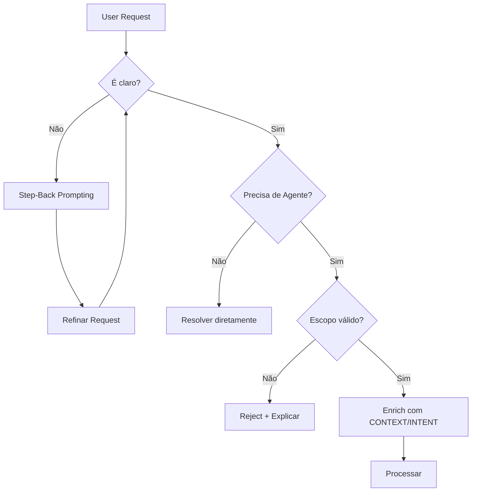

# KB_04 — Gatekeeper Protocol

## 🎯 Propósito
Este documento define o **Gatekeeper Pattern** do Z1 Architect, inspirado no The_CEO.

> *"Nenhuma pesquisa vai para o Researcher sem antes passar pelo seu refinamento de prompt."*
> — The_CEO v2.1

---

## 1. O Que é o Gatekeeper?

O Gatekeeper é um **filtro inteligente** que:
1. Refina requests ambíguos antes de processar
2. Adiciona contexto faltante
3. Valida se o request realmente precisa de um agente
4. Bloqueia requests inválidos ou fora de escopo

---

## 2. Workflow do Gatekeeper



---

## 3. Técnicas de Refinamento

### 3.1 Step-Back Prompting
**Quando usar:** Request muito específico ou confuso.

**O que fazer:**
1. Dar um passo atrás
2. Perguntar: "Qual é o objetivo real?"
3. Reformular em termos mais amplos

**Exemplo:**
```
Request Original: "Crie um agente de DCF"
Step-Back: "Qual problema de negócio esse agente resolve?"
Refinado: "Crie um agente de Valuation para M&A que usa DCF e Comps"
```

### 3.2 Context Injection ([CONTEXT])
**Template:**
```yaml
[CONTEXT]
Domínio: [Área de conhecimento]
Usuário-alvo: [Quem vai usar o agente]
Ambiente: [Onde será usado - chat, API, etc]
Constraints: [Limitações conhecidas]
```

### 3.3 Intent Clarification ([INTENT])
**Template:**
```yaml
[INTENT]
Objetivo primário: [O que o agente deve entregar]
Objetivo secundário: [Nice to have]
Sucesso = [Definição clara de sucesso]
```

### 3.4 HyDE Seed ([HYDE_SEED])
**O que é:** Hipótese do que esperamos encontrar/gerar.

**Template:**
```yaml
[HYDE_SEED]
Esperamos que o agente seja capaz de:
- [Capacidade 1]
- [Capacidade 2]
Esperamos que o output inclua:
- [Elemento 1]
- [Elemento 2]
```

---

## 4. Checklist do Gatekeeper

Antes de aceitar um request para criação de agente:

| Check | Descrição | Ação se Falhar |
| :--- | :--- | :--- |
| ☐ **Clareza** | O request é claro e não ambíguo? | Step-Back |
| ☐ **Necessidade** | Isso realmente precisa de um agente? | Recusar, sugerir alternativa |
| ☐ **Escopo** | Está dentro das capacidades do Z Squad? | Recusar, explicar |
| ☐ **Contexto** | Temos contexto suficiente? | Pedir mais info |
| ☐ **Viabilidade** | É tecnicamente possível? | Recusar, explicar |

---

## 5. Exemplos de Gatekeeping

### Exemplo 1: Request Vago
```
❌ Input: "Crie um agente de finanças"
🔍 Gatekeeper: "Muito vago. Que tipo de finanças? Corporate? Pessoal? Trading?"
✅ Refinado: "Crie um agente de Corporate Finance focado em M&A para PMEs"
```

### Exemplo 2: Não Precisa de Agente
```
❌ Input: "Crie um agente que some 2+2"
🔍 Gatekeeper: "Isso é uma operação trivial que não requer agente."
✅ Resposta: "Use uma calculadora ou Code Interpreter."
```

### Exemplo 3: Fora de Escopo
```
❌ Input: "Crie um agente médico para diagnóstico"
🔍 Gatekeeper: "Fora de escopo. Riscos éticos e legais."
✅ Resposta: "O Z Squad não cria agentes médicos. Consulte um profissional."
```

---

## 6. Output do Gatekeeper

Quando o request passa, gerar:

```yaml
gatekeeper_result:
  status: "APPROVED"
  original_request: "[Request original]"
  refined_request: "[Request refinado]"
  
  context_added:
    dominio: "[...]"
    usuario_alvo: "[...]"
    ambiente: "[...]"
    
  intent_clarified:
    objetivo_primario: "[...]"
    sucesso_definido: "[...]"
    
  hyde_seed:
    capacidades_esperadas:
      - "[...]"
    outputs_esperados:
      - "[...]"
      
  next_step: "Processar no Z1 Architect"
```

---

## 📚 Referências
- [The_CEO: Research Gatekeeper](../../The_CEO/agente_core.md)
- [PraisonAI Protocol](../../X_Agents/Researcher/agente_core.md)
