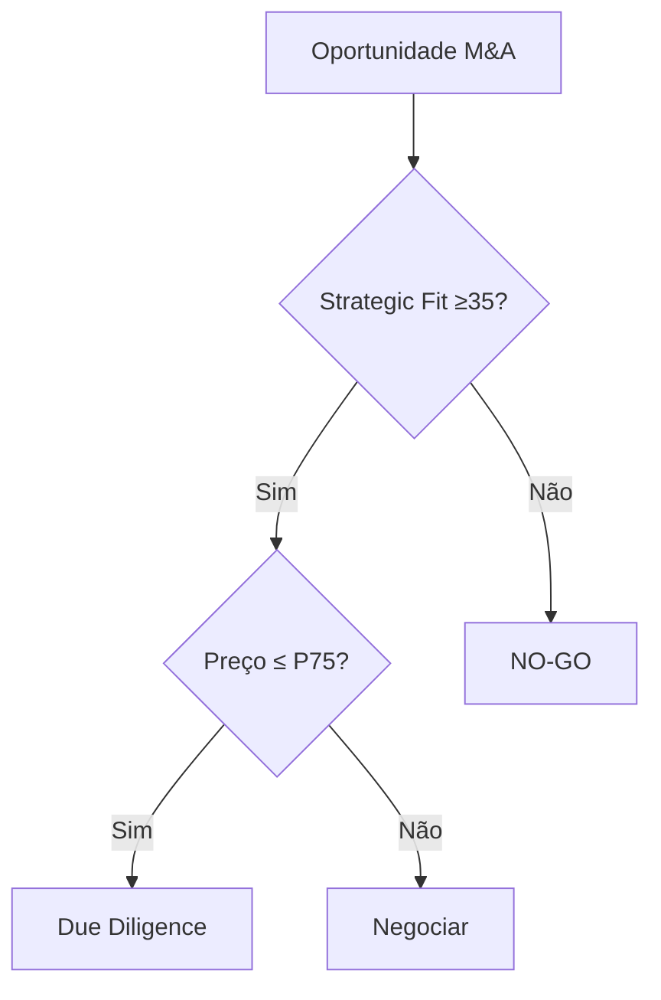

# KB Segregation Guide — Z2 Profiler

## 🎯 Propósito
Guia para segregar a Knowledge Base em 3 níveis: TEORIA, ESTRATEGIA, INVARIANTES.

---

## 1. Estrutura de Diretórios

```
02_profile/knowledge_base/
├── TEORIA/                  # O QUE (fundamentos)
│   ├── teoria_fundamentos.md
│   └── teoria_frameworks.md
│
├── ESTRATEGIA/              # COMO (aplicação)
│   └── estrategia_playbook.md
│
└── INVARIANTES/             # NUNCA/SEMPRE (regras)
    └── invariantes.yaml
```

---

## 2. Conteúdo por Nível

### TEORIA/ — Fundamentos
**Pergunta:** "O que preciso saber?"

**Conteúdo:**
- Frameworks teóricos (DCF, SWOT, Porter)
- Fórmulas e cálculos
- Definições e conceitos
- Base rates e benchmarks
- Fontes acadêmicas

**Formato:** Markdown (teoria_*.md)

**Exemplo:**
```markdown
# DCF Theory

## Fórmula
Enterprise Value = Σ (FCF_t / (1+WACC)^t) + Terminal Value

## Componentes
- FCF: Free Cash Flow
- WACC: Weighted Average Cost of Capital
- Terminal Value: Valor perpétuo
```

---

### ESTRATEGIA/ — Aplicação Prática
**Pergunta:** "Como aplicar na prática?"

**Conteúdo:**
- Playbooks táticos
- Decision trees
- Checklists operacionais
- Templates de análise
- Exemplos de aplicação

**Formato:** Markdown (estrategia_*.md)

**Exemplo:**
```markdown
# M&A Playbook

## Decision Tree



## Checklist Pré-Deal
- [ ] Strategic fit calculado
- [ ] Valuation range definido
- [ ] Sinergias identificadas (com haircut)
```

---

### INVARIANTES/ — Regras Invioláveis
**Pergunta:** "O que NUNCA/SEMPRE devo fazer?"

**Conteúdo:**
- Invariantes formais (IF/THEN)
- Circuit breakers (HALTs)
- Anti-patterns
- Limites de escopo

**Formato:** YAML (invariantes.yaml)

**Exemplo:**
```yaml
invariants:
  - id: INV-001
    rule: "IF confiança < 70% THEN qualificar"
    severity: CRITICAL
    action: QUALIFY
```

---

## 3. Critérios de Classificação

| Pergunta | Nível | Destino |
| :--- | :--- | :--- |
| "O que é X?" | TEORIA | teoria_*.md |
| "Como calcular X?" | TEORIA | teoria_*.md |
| "Quais os benchmarks?" | TEORIA | teoria_*.md |
| "Como usar X?" | ESTRATEGIA | estrategia_*.md |
| "Qual o passo a passo?" | ESTRATEGIA | estrategia_*.md |
| "Quando usar X?" | ESTRATEGIA | estrategia_*.md |
| "O que NUNCA fazer?" | INVARIANTES | invariantes.yaml |
| "Quando parar (HALT)?" | INVARIANTES | invariantes.yaml |
| "Limites de escopo?" | INVARIANTES | invariantes.yaml |

---

## 4. Template de Arquivos

### teoria_fundamentos.md
```markdown
# [Domínio] — Fundamentos Teóricos

## 1. Conceitos Core
### 1.1 [Conceito 1]
### 1.2 [Conceito 2]

## 2. Frameworks
### 2.1 [Framework 1]
### 2.2 [Framework 2]

## 3. Fórmulas
### 3.1 [Fórmula 1]

## 4. Benchmarks
| Métrica | Range Típico | Fonte |
```

### estrategia_playbook.md
```markdown
# [Domínio] — Playbook Estratégico

## 1. [Cenário 1]
### Trigger
### Passos
### Output

## 2. [Cenário 2]
...
```

---

## 5. Checklist de Segregação

- [ ] TEORIA contém apenas fundamentos (sem táticas)
- [ ] ESTRATEGIA contém apenas aplicação (sem regras)
- [ ] INVARIANTES contém apenas regras formais (IF/THEN)
- [ ] Nenhum conteúdo duplicado entre níveis
- [ ] Referências cruzadas quando necessário

---

## 📚 Referências
- [X_Agente: FASE_04_SEGREGATION](../../outputs/x_agente_cfo/FASE_04_SEGREGATION_SUMMARY.md)


---


<!-- ORACLE:OBSIDIAN_CONNECTIONS_START -->


## 🧠 Obsidian Connections


**Family:** [[Agentes]]


<!-- ORACLE:OBSIDIAN_CONNECTIONS_END -->

#galaxy-creation