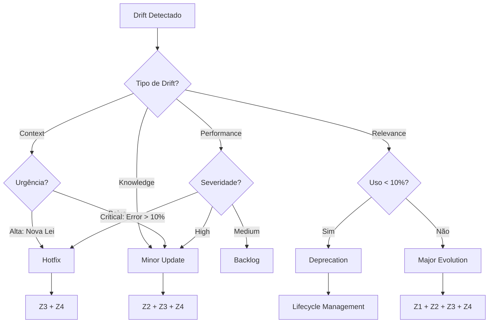

# KB_02 — Evolution Patterns

## 🎯 Propósito
Este documento cataloga os padrões de evolução de agentes e quando aplicar cada um.

---

## 1. Tipos de Drift

### 1.1 Context Drift
**O que é:** O mundo externo mudou, mas o agente não foi atualizado.

| Sinal | Exemplo | Solução |
| :--- | :--- | :--- |
| Nova legislação | LGPD, IFRS 17 | Update KB |
| Novo framework | GPT-5 released | Update prompt patterns |
| Mudança de mercado | Novo concorrente | Update estratégia |

**Detecção:** Revisão periódica (mensal) + alertas de notícias.

---

### 1.2 Performance Drift
**O que é:** Métricas de qualidade degradando ao longo do tempo.

| Sinal | Causa Provável | Solução |
| :--- | :--- | :--- |
| Error rate subindo | Inputs mais complexos | Expand guardrails |
| Hallucination rate subindo | KB desatualizado | Update KB |
| Response time subindo | Prompt muito longo | Otimizar prompt |

**Detecção:** Monitoramento contínuo (ver KB_01).

---

### 1.3 Relevance Drift
**O que é:** O agente não é mais relevante para os usuários.

| Sinal | Causa Provável | Solução |
| :--- | :--- | :--- |
| Uso caindo > 50% | Necessidade mudou | Rethink scope |
| Feedback negativo | Não atende expectativas | Major evolution |
| Substituído por outro | Redundância | Deprecate |

**Detecção:** Métricas de uso + feedback qualitativo.

---

### 1.4 Knowledge Drift
**O que é:** O conhecimento do agente ficou desatualizado.

| Sinal | Causa Provável | Solução |
| :--- | :--- | :--- |
| Dados antigos | KB não atualizado | Refresh KB |
| Frameworks obsoletos | Best practices mudaram | Update frameworks |
| Exemplos irrelevantes | Contexto mudou | New examples |

**Detecção:** Age of KB files + revisão manual.

---

## 2. Padrões de Evolução

### 2.1 Hotfix Pattern
**Quando usar:** Problema crítico em produção.
**Velocidade:** Horas.
**Escopo:** Minimal (1 arquivo).

```yaml
tipo: HOTFIX
urgencia: CRITICA
modulos_acionados:
  - Z3 (patch mínimo no prompt)
  - Z4 (smoke test)
aprovacao: CEO (expedited)
```

---

### 2.2 Minor Update Pattern
**Quando usar:** Melhoria incremental, nova feature pequena.
**Velocidade:** Dias.
**Escopo:** Moderado (KB + prompt).

```yaml
tipo: MINOR
urgencia: NORMAL
modulos_acionados:
  - Z2 (update KB)
  - Z3 (adjust prompt)
  - Z4 (full test suite)
aprovacao: CEO/Owner
```

---

### 2.3 Major Evolution Pattern
**Quando usar:** Mudança significativa de escopo ou personalidade.
**Velocidade:** Semanas.
**Escopo:** Amplo (DNA + KB + prompt + schemas).

```yaml
tipo: MAJOR
urgencia: PLANEJADA
modulos_acionados:
  - Z1 (new spec)
  - Z2 (new DNA)
  - Z3 (new prompt)
  - Z4 (full validation)
aprovacao: CEO + Stakeholders
```

---

### 2.4 Deprecation Pattern
**Quando usar:** Agente não é mais relevante.
**Velocidade:** Semanas (communication).
**Escopo:** Lifecycle management.

```yaml
tipo: DEPRECATION
passos:
  1. Anunciar deprecation (2 semanas notice)
  2. Redirecionar usuários para alternativa
  3. Manter em read-only por 30 dias
  4. Arquivar
```

---

## 3. Decision Tree



---

## 4. Evolution Ticket Structure

```yaml
# evolution_ticket.yaml

ticket_id: "EVO-2026-001"
created_at: "2026-01-06T23:00:00Z"
created_by: "Z5 Evolver"

agente:
  nome: "CFO Agent"
  versao_atual: "1.0.0"
  
drift:
  tipo: "Performance"
  descricao: "Error rate subiu de 2% para 7% nos últimos 7 dias"
  evidencias:
    - "Logs de erro: 42 ocorrências"
    - "User feedback: 3 reclamações"
    
causa_raiz: "Input de empresas com estrutura não-standard"

proposta:
  tipo: "Minor Update"
  mudancas:
    - modulo: Z2
      acao: "Adicionar casos de empresas não-standard ao KB"
    - modulo: Z3
      acao: "Expandir guardrails para inputs atípicos"
  versao_proposta: "1.1.0"
  
aprovacao:
  requer: true
  aprovadores: ["CEO"]
  deadline: "2026-01-08T23:00:00Z"
  
status: "PENDING_APPROVAL"
```

---

## 5. Evolution History Template

```yaml
# evolution_history.yaml

agente: "CFO Agent"

versoes:
  - versao: "1.0.0"
    data: "2026-01-01"
    tipo: "Initial Release"
    notas: "First production version"
    
  - versao: "1.1.0"
    data: "2026-01-08"
    tipo: "Minor Update"
    ticket: "EVO-2026-001"
    notas: "Fixed edge cases for non-standard companies"
    
  - versao: "2.0.0"
    data: "2026-03-01"
    tipo: "Major Evolution"
    ticket: "EVO-2026-015"
    notas: "Added IFRS 17 support, new accounting frameworks"
```

---

## 📚 Referências
- [Google SRE: Managing Incidents](https://sre.google/)
- [Continuous Delivery: Release Engineering](https://continuousdelivery.com/)


---


<!-- ORACLE:OBSIDIAN_CONNECTIONS_START -->


## 🧠 Obsidian Connections


**Family:** [[Agentes]]


<!-- ORACLE:OBSIDIAN_CONNECTIONS_END -->