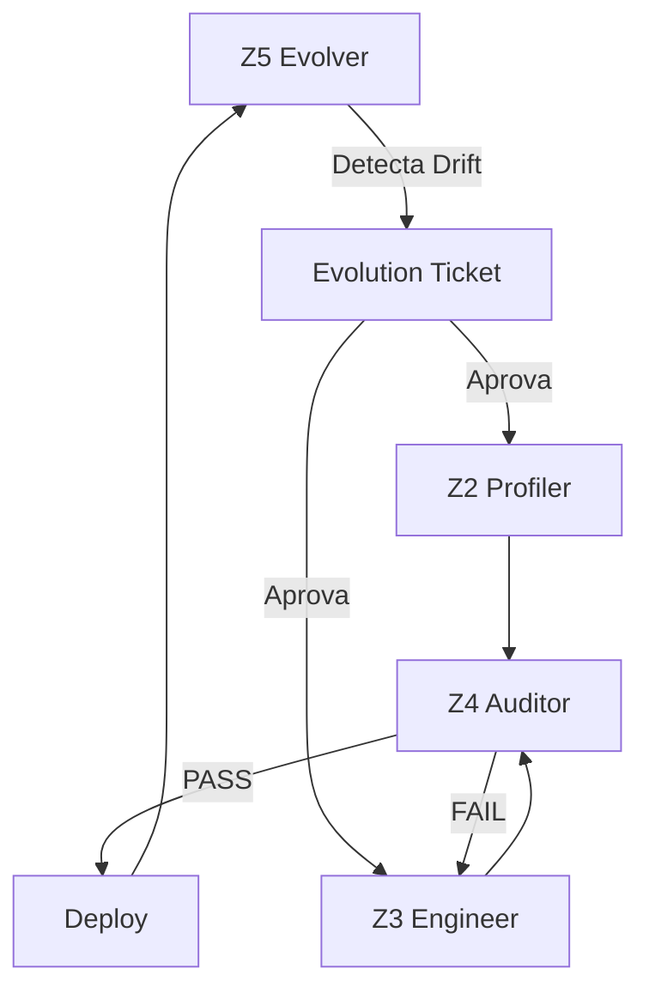

# KB_03 — Multi-Agent Framework Principles

## 🎯 Propósito
Este documento conecta o Z5 Evolver aos princípios do Framework Multiagentes ExímIA.

---

## 1. Orquestração de Evolução

> *"O Manager agrega tudo e entrega ao usuário."*
> — Framework Multiagentes ExímIA

O Z5 atua como **orquestrador** do loop de evolução, não como executor:



### Responsabilidades
- **Z5 FAZ:** Detectar, propor, orquestrar, versionar
- **Z5 NÃO FAZ:** Editar prompts, alterar DNA, testar

---

## 2. State Management

> *"O estado deve conter: user_objective, plan, current_step, artifacts."*

### Shared State para Evolução
O Z5 mantém um estado adicional para agentes em produção:

```yaml
production_state:
  agent_name: "CFO Agent"
  current_version: "1.2.0"
  deployed_at: "2026-01-01T00:00:00Z"
  
  health_metrics:
    error_rate: 0.03
    user_satisfaction: 4.5
    hallucination_rate: 0.01
    
  evolution_history:
    - version: "1.0.0"
      date: "2025-11-01"
      type: "Initial"
    - version: "1.1.0"
      date: "2025-12-15"
      type: "Minor"
      ticket: "EVO-2025-042"
    - version: "1.2.0"
      date: "2026-01-01"
      type: "Minor"
      ticket: "EVO-2025-089"
      
  next_scheduled_review: "2026-03-01"
```

---

## 3. Handoff em Evolução

Quando Z5 aciona evolução, deve usar o Handoff Protocol:

```yaml
evolution_handoff:
  handoff_id: "EVO-HO-20260106-001"
  from_module: "Z5_Evolver"
  to_module: "Z2_Profiler"
  
  context:
    agent: "CFO Agent"
    current_version: "1.2.0"
    proposed_version: "1.3.0"
    
  summary: |
    Drift detectado: Knowledge obsoleto (IFRS 17 não coberto).
    Proposta: Atualizar KB com novo framework contábil.
    
  artifacts_to_modify:
    - path: "outputs/CFO_Agent/knowledge_base/KB_02_frameworks.md"
      action: "UPDATE"
      reason: "Adicionar seção IFRS 17"
      
  constraints:
    - "Manter compatibilidade com outputs existentes"
    - "Não alterar DNA Mental (apenas KB)"
    
  validation_criteria:
    - "KB menciona IFRS 17"
    - "Prompt referencia novo framework"
    - "Testes de IFRS 17 passam"
```

---

## 4. Routing de Evolução

> *"Um Router Agent decide quem deve tratar."*

O Z5 age como router, decidindo qual módulo acionar:

| Tipo de Drift | Módulo Primário | Módulo Secundário |
| :--- | :--- | :--- |
| Knowledge Drift | Z2 (Update KB) | Z3 (Patch Prompt) |
| Performance Drift | Z3 (Optimize Prompt) | Z4 (Re-validate) |
| Context Drift | Z1 (Re-scope) | Z2 + Z3 + Z4 |
| Behavior Drift | Z2 (Adjust DNA) | Z3 + Z4 |

### Decision Tree
```python
if drift_type == "knowledge":
    route_to = "Z2_Profiler"
    action = "update_kb"
elif drift_type == "performance":
    route_to = "Z3_Engineer"
    action = "optimize_prompt"
elif drift_type == "context":
    route_to = "Z1_Architect"
    action = "re_scope"
    # Major evolution: full pipeline
elif drift_type == "behavior":
    route_to = "Z2_Profiler"
    action = "adjust_dna"
```

---

## 5. Governance: Human in the Loop

> *"Para ações críticas, sempre coloque uma etapa de aprovação humana."*

### Níveis de Aprovação
| Tipo de Evolução | Aprovador | SLA |
| :--- | :--- | :--- |
| HOTFIX | CEO (expedited) | 4h |
| MINOR | Owner | 48h |
| MAJOR | CEO + Stakeholders | 1 semana |
| DEPRECATION | CEO + Stakeholders + Usuários | 2 semanas |

### Checklist de Aprovação
Antes de deploy:
- [ ] Evolution Ticket aprovado?
- [ ] Pipeline Z2→Z3→Z4 executado?
- [ ] Z4 aprovou nova versão?
- [ ] Rollback plan documentado?
- [ ] Notificação para usuários (se breaking change)?

---

## 6. Anti-Pattern Prevention

O Z5 monitora ativamente por antipadrões em produção:

| Antipadrão | Detecção | Ação |
| :--- | :--- | :--- |
| Set and Forget | Última revisão > 90 dias | Evolution Ticket obrigatório |
| Scope Creep | Funcionalidades não na spec original | Alert + Review |
| Hallucination Tolerance | Hallucination rate > 3% | Evolution Ticket urgente |
| Context Overload | Prompt growing > 20%/quarter | Optimization Ticket |

---

## 📚 Referências
- [Framework: 06_Processos_de_Orquestracao.md](../../Conteudo_sintetizado/Framework_Multiagentes_EximIA/06_Processos_de_Orquestracao.md)
- [Framework: 08_Boas_Praticas_e_Antipadroes.md](../../Conteudo_sintetizado/Framework_Multiagentes_EximIA/08_Boas_Praticas_e_Antipadroes.md)
- [Shared Protocols: handoff_protocol.md](../shared_protocols/handoff_protocol.md)


---


<!-- ORACLE:OBSIDIAN_CONNECTIONS_START -->


## 🧠 Obsidian Connections


**Family:** [[Agentes]]


<!-- ORACLE:OBSIDIAN_CONNECTIONS_END -->