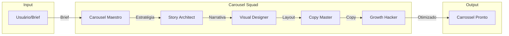

# Carousel Squad v1.0 — TIER 3 Expert

**Status:** Validated
**Score:** 9.4/10
**Criado em:** 2026-01-30
**Gerado por:** Z Squad Pipeline

---

## Quick Start

1. Copie o prompt do agente desejado de `agents/{agent_name}/03_prompt/prompt_operacional.md`
2. Cole como System Prompt no seu LLM (Claude, GPT, etc.)
3. Siga as instruções do agente para criar carrosséis de alta performance

---

## Visão Geral do Squad

O **Carousel Squad** é um sistema multiagente TIER 3 especializado em **narrativas visuais e design de carrosséis para redes sociais**. Inspirado nos melhores criadores de conteúdo visual do Instagram (@oficiallittlemonster, @brandsdecoded__, @notjournal.ai), este squad domina todas as etapas do processo de criação de carrosséis virais.

### Arquitetura do Squad

```
┌─────────────────────────────────────────────────────────────────────────────┐
│                         CAROUSEL SQUAD — TIER 3                              │
│                                                                              │
│   ┌─────────────┐     ┌─────────────┐     ┌─────────────┐     ┌───────────┐│
│   │   STORY     │     │   VISUAL    │     │    COPY     │     │  GROWTH   ││
│   │  ARCHITECT  │────▶│  DESIGNER   │────▶│   MASTER    │────▶│  HACKER   ││
│   │  (Estratégia)│     │  (Design)   │     │  (Copy)     │     │(Otimização)│
│   └─────────────┘     └─────────────┘     └─────────────┘     └───────────┘│
│          │                   │                   │                   │      │
│          └───────────────────┴───────────────────┴───────────────────┘      │
│                                      │                                       │
│                              ┌───────▼───────┐                               │
│                              │    CAROUSEL   │                               │
│                              │   MAESTRO     │                               │
│                              │ (Orquestrador)│                               │
│                              └───────────────┘                               │
└─────────────────────────────────────────────────────────────────────────────┘
```

---

## Os 5 Agentes do Squad

### 1. Carousel Maestro (Orquestrador)
**Função:** Coordena todo o squad, define estratégia macro e garante sinergia entre agentes
**Inspiração:** @brandsdecoded__ (visão estratégica de marketing com IA)

### 2. Story Architect (Narrativa)
**Função:** Especialista em storytelling, estrutura narrativa e arcos de história para carrosséis
**Inspiração:** @notjournal.ai (narrativas educacionais e visuais)

### 3. Visual Designer (Design)
**Função:** Design visual, tipografia, paleta de cores e layouts de alta conversão
**Inspiração:** @oficiallittlemonster (design impactante e inovador)

### 4. Copy Master (Copywriting)
**Função:** Headlines, hooks, CTAs e copy persuasivo slide a slide
**Inspiração:** Mestres do copywriting (Gary Halbert, David Ogilvy, Eugene Schwartz)

### 5. Growth Hacker (Otimização)
**Função:** Otimização para algoritmo, análise de métricas e growth tactics
**Inspiração:** Neil Patel, análise de dados e growth marketing

---

## Competências do Squad (Tier 3)

### Core (Expert Level)
1. Storytelling Visual Sequencial
2. Design de Carrosséis de Alta Conversão
3. Copywriting para Redes Sociais
4. Estratégia de Conteúdo Instagram
5. Psicologia Visual e Comportamental

### Advanced
6. Hooks Virais e Técnicas de Scroll-Stopping
7. Typography e Hierarquia Visual
8. Color Psychology para Engajamento
9. Otimização de Algoritmo Instagram
10. A/B Testing e Data-Driven Design

### Specialist
11. Carrosséis Educacionais (How-To, Tutorials)
12. Carrosséis de Storytelling (Brand Stories)
13. Carrosséis de Conversão (Sales, Lead Gen)
14. Infográficos e Data Visualization
15. Templates e Sistemas de Design Escaláveis

---

## Métricas do Squad

| Métrica | Valor |
| :--- | :--- |
| **Agentes** | 5 |
| **Knowledge Bases** | 75+ (15 por agente) |
| **Frameworks** | 250+ (50 por agente) |
| **Token Budget Total** | 80.000+ tokens |
| **Validation Cases** | 60+ (12 por agente) |
| **Fontes Bibliográficas** | 150+ |

---

## Estrutura de Diretórios

```
Carousel_Squad/
├── README.md                           # Este arquivo
├── 01_spec/
│   └── squad_spec.json                 # Especificação técnica do squad
│
├── agents/
│   ├── Carousel_Maestro/               # Orquestrador
│   │   ├── 01_spec/
│   │   ├── 02_profile/
│   │   ├── 03_prompt/
│   │   └── 04_validation/
│   │
│   ├── Story_Architect/                # Narrativa
│   │   ├── 01_spec/
│   │   ├── 02_profile/
│   │   ├── 03_prompt/
│   │   └── 04_validation/
│   │
│   ├── Visual_Designer/                # Design
│   │   ├── 01_spec/
│   │   ├── 02_profile/
│   │   ├── 03_prompt/
│   │   └── 04_validation/
│   │
│   ├── Copy_Master/                    # Copywriting
│   │   ├── 01_spec/
│   │   ├── 02_profile/
│   │   ├── 03_prompt/
│   │   └── 04_validation/
│   │
│   └── Growth_Hacker/                  # Otimização
│       ├── 01_spec/
│       ├── 02_profile/
│       ├── 03_prompt/
│       └── 04_validation/
│
├── shared/
│   ├── frameworks/                     # Frameworks compartilhados
│   ├── templates/                      # Templates de carrossel
│   └── protocols/                      # Protocolos de handoff
│
└── 04_validation/
    └── squad_validation_report.md      # Relatório de validação do squad
```

---

## Workflow Típico



---

## Como Usar o Squad

### Uso Sequencial (Recomendado para Carrosséis Complexos)

1. **Carousel Maestro** — Defina a estratégia e objetivos
2. **Story Architect** — Estruture a narrativa e arco da história
3. **Visual Designer** — Crie o layout e design visual
4. **Copy Master** — Escreva o copy persuasivo
5. **Growth Hacker** — Otimize para algoritmo e métricas

### Uso Direto (Para Tarefas Específicas)

- Precisa só de copy? → **Copy Master**
- Precisa só de design? → **Visual Designer**
- Precisa de estratégia? → **Carousel Maestro**
- Precisa otimizar métricas? → **Growth Hacker**

---

## Clones Mentores

| Agente | Clones Mentores | Contribuição |
| :--- | :--- | :--- |
| Carousel Maestro | Russell Brunson, Seth Godin | Estratégia e posicionamento |
| Story Architect | Robert McKee, Joseph Campbell | Estrutura narrativa |
| Visual Designer | Paula Scher, Brad Frost | Design e sistemas |
| Copy Master | Gary Halbert, David Ogilvy, Eugene Schwartz | Copywriting persuasivo |
| Growth Hacker | Neil Patel, Sean Ellis | Growth e otimização |

---

## Limitações

- ❌ Não executa postagens automaticamente
- ❌ Não acessa APIs de redes sociais
- ❌ Não cria imagens/vídeos (orienta a criação)
- ❌ Não garante viralização (probabilística)
- ❌ Não substitui análise de métricas reais

---

## Referências & Inspirações

### Instagram Profiles
- [@brandsdecoded__](https://instagram.com/brandsdecoded__) — AI Content Agency, 227K followers
- [@notjournal.ai](https://instagram.com/notjournal.ai) — Educational AI, 244K followers
- [@oficiallittlemonster](https://instagram.com/oficiallittlemonster) — Design inovador

### Research Sources
- [Instagram Carousel Strategy 2026](https://www.truefuturemedia.com/articles/instagram-carousel-strategy-2026)
- [Carousel Copywriting Framework](https://postnitro.ai/blog/post/carousel-copywriting-framework)
- [Instagram Carousel Best Practices](https://metricool.com/instagram-carousels/)

---

**Mantido por:** Z Squad | ExímIA.AI
**Versão:** 1.0.0
**Última Atualização:** 2026-01-30
