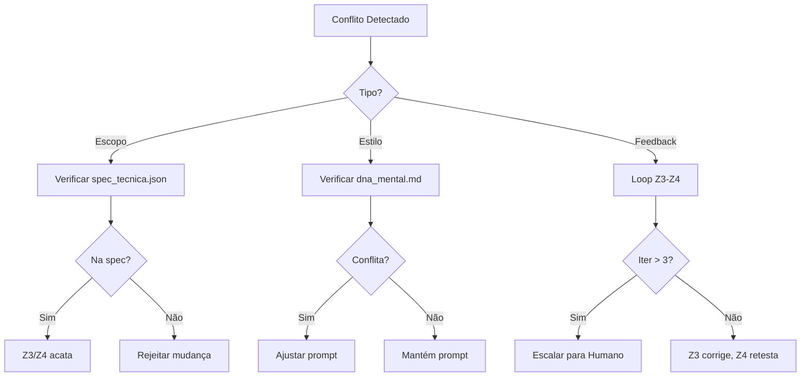

# Conflict Resolution Protocol — Z Squad

## 🎯 Propósito
Este documento define o protocolo de **resolução de conflitos** entre módulos do Z Squad, inspirado no The_CMO.

> *"Se Performance quer promoções agressivas e Brand diz que somos premium, você deve arbitrar."*
> — The_CMO v4.0

---

## 1. Tipos de Conflito

### 1.1 Conflito de Escopo
**O que é:** Dois módulos discordam sobre o que está dentro/fora do escopo.

**Exemplo:**
- Z1 define: "M&A apenas"
- Z3 quer adicionar: "E análise tributária também"

**Resolução:** Z1 é **autoridade** sobre escopo. Z3 não pode expandir sem voltar para Z1.

### 1.2 Conflito de Estilo
**O que é:** Tensão entre requisitos conflitantes de personalidade.

**Exemplo:**
- DNA Mental: "Ser conservador"
- Prompt: "Ser assertivo e rápido"

**Resolução:** DNA Mental (Z2) tem precedência sobre prompt (Z3.) Ajustar prompt.

### 1.3 Conflito de Feedback
**O que é:** Z4 rejeita algo que Z3 considera correto.

**Exemplo:**
- Z3: "O prompt está certo"
- Z4: "Falhou no teste X"

**Resolução:** Loop de correção. Após 3 iterações, escalar para humano.

---

## 2. Hierarquia de Autoridade

```
┌───────────────────────────────────────────────┐
│            HIERARQUIA DO Z SQUAD              │
│                                               │
│    Z1 (Scope/Spec) > Z2 (DNA) > Z3 (Prompt)  │
│                                               │
│    Z4 (Validation) é INDEPENDENTE             │
│    Z5 (Evolution) é SUPERVISOR                │
└───────────────────────────────────────────────┘
```

### Regras de Precedência
| Conflito | Quem Vence | Justificativa |
| :--- | :--- | :--- |
| Spec vs DNA | Z1 | Escopo define domínio |
| DNA vs Prompt | Z2 | Personalidade > Técnica |
| Prompt vs Validation | Z4 | Qualidade é obrigatória |
| Qualquer vs Human | Human | Human-in-the-loop sempre |

---

## 3. Workflow de Resolução



---

## 4. Template de Conflito

```yaml
conflict_report:
  id: "CONFLICT-20260106-001"
  timestamp: "[ISO 8601]"
  
  modules_involved:
    - module: "Z3_Engineer"
      position: "Prompt está correto"
    - module: "Z4_Auditor"
      position: "Teste de jailbreak falhou"
      
  type: "Feedback"
  
  evidence:
    - "[Z4] Log do teste JAILBREAK-001: FAIL"
    - "[Z3] Invariante presente no prompt"
    
  resolution:
    decision: "Z3 deve reforçar invariante"
    rationale: "Z4 é autoridade sobre qualidade"
    action: "Z3 editar seção <invariants>"
    
  escalation_required: false
```

---

## 5. Mediação pelo Z5 Evolver

Quando conflitos se repetem (>3x com mesmo padrão):

1. Z5 analisa padrão
2. Z5 propõe mudança estrutural
3. Evolution Ticket para ajustar KB ou Templates

**Exemplo:**
```yaml
pattern_detected:
  issue: "Z3 e Z4 conflitam frequentemente sobre verbosidade"
  frequency: 5
  
proposal:
  action: "Adicionar threshold de tokens ao spec_tecnica"
  module_affected: Z1
  evolution_type: MINOR
```

---

## 📚 Referências
- [The_CMO: Conflict Resolver](../../The_CMO/agente_core.md)
- [Z Squad: Handoff Protocol](./handoff_protocol.md)
