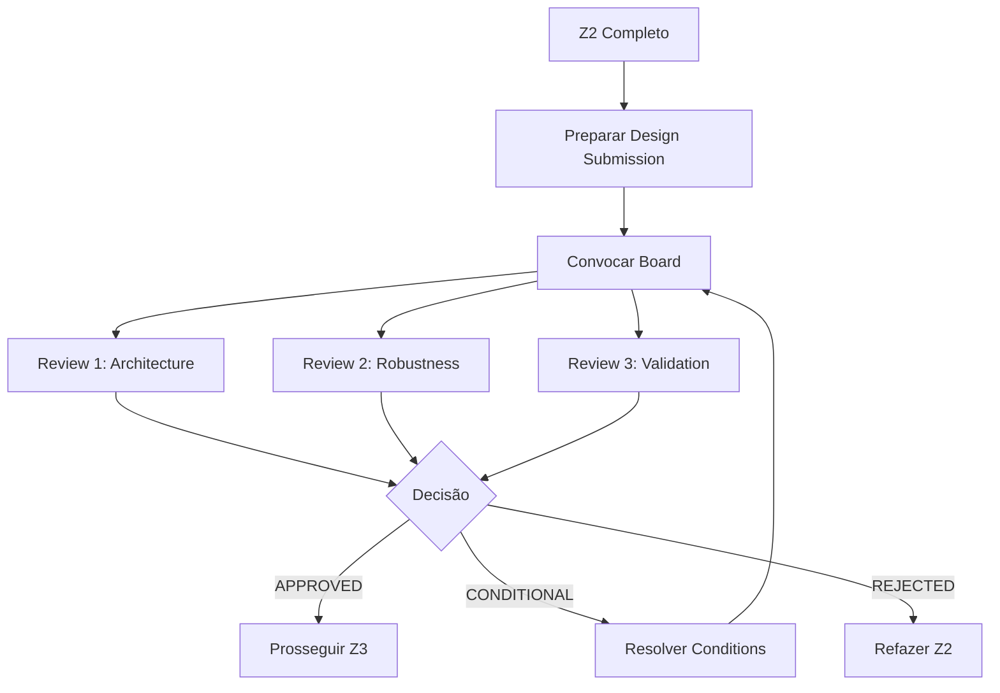

# Design Review Board — Z Squad Protocol

## 🎯 Propósito
Define o processo de **Design Review** onde os clones mentores revisam o design do agente antes de Z3.

> *"Aprovação mínima: 2/3 reviewers"*
> — X_Agente FASE_03

---

## 1. O Que é o Design Review Board?

É um **comitê virtual** de 3 clones mentores que revisa e aprova o design do agente após Z2 Profiler, antes de prosseguir para Z3 Engineer.

**Objetivo:** Garantir que o design está correto antes de investir tempo em prompt engineering.

---

## 2. Composição do Board

O board é composto pelos **3 clones mentores** selecionados em Z2, cada um com um papel específico:

| Role | Foco | Pergunta Central |
| :--- | :--- | :--- |
| **Architecture Reviewer** | Effectiveness | "Estamos resolvendo o problema certo?" |
| **Robustness Reviewer** | Stress Testing | "O sistema sobrevive edge cases?" |
| **Validation Reviewer** | Probabilistic | "Os outputs serão confiáveis?" |

---

## 3. Processo



---

## 4. Critérios de Revisão por Role

### 4.1 Architecture Reviewer

| Check | Pergunta | PASS | FAIL |
| :--- | :--- | :--- | :--- |
| A1 | Effectiveness | Resolve problema real | Problema mal definido |
| A2 | Scope | Bem delimitado | Muito amplo/estreito |
| A3 | Competências | Coerentes com domínio | Incoerentes |
| A4 | MBO | Objetivos mensuráveis | Vagos |

### 4.2 Robustness Reviewer

| Check | Pergunta | PASS | FAIL |
| :--- | :--- | :--- | :--- |
| R1 | Stress Tests | Cenários identificados | Não pensados |
| R2 | Circuit Breakers | HALTs definidos | Ausentes |
| R3 | Edge Cases | Tratados | Ignorados |
| R4 | Fail Gracefully | Degradação planejada | Falha catastrófica |

### 4.3 Validation Reviewer

| Check | Pergunta | PASS | FAIL |
| :--- | :--- | :--- | :--- |
| V1 | Anti-Hallucination | Regras claras | Ausentes |
| V2 | Testabilidade | Outputs testáveis | Subjetivos |
| V3 | Invariantes | Formalizados | Implícitos |
| V4 | Calibração | Processo definido | Não planejado |

---

## 5. Decisões Possíveis

| Decisão | Critério | Ação |
| :--- | :--- | :--- |
| **APPROVED** | 3/3 aprovam sem conditions | Prosseguir Z3 |
| **APPROVED_WITH_CONDITIONS** | 2/3 aprovam, com conditions | Resolver conditions, depois Z3 |
| **REJECTED** | <2/3 aprovam | Refazer Z2 |

---

## 6. Template de Conditions

```yaml
conditions:
  - id: "C1"
    reviewer: "Architecture"
    description: "[O que precisa ser corrigido]"
    resolve_in: "Z2 ou Z3"
    
  - id: "C2"
    reviewer: "Robustness"
    description: "[...]"
    resolve_in: "[...]"
```

---

## 7. Output: Design Review Summary

```yaml
design_review:
  agent: "[Nome do Agente]"
  date: "[ISO 8601]"
  
  board:
    - role: "Architecture"
      clone: "[Nome do Clone]"
      decision: "APPROVED | CONDITIONAL | REJECTED"
      conditions: []
      
    - role: "Robustness"
      clone: "[Nome do Clone]"
      decision: "[...]"
      conditions: []
      
    - role: "Validation"
      clone: "[Nome do Clone]"
      decision: "[...]"
      conditions: []
      
  final_decision: "APPROVED | APPROVED_WITH_CONDITIONS | REJECTED"
  total_conditions: [N]
  
  next_step: "Z3_Engineer" | "Resolver Conditions" | "Refazer Z2"
```

---

## 📚 Referências
- [X_Agente: FASE_03_DESIGN_REVIEW_BOARD](../../outputs/x_agente_cfo/FASE_03_DESIGN_REVIEW_BOARD.md)


---


<!-- ORACLE:OBSIDIAN_CONNECTIONS_START -->


## 🧠 Obsidian Connections


**Family:** [[Agentes]]


<!-- ORACLE:OBSIDIAN_CONNECTIONS_END -->