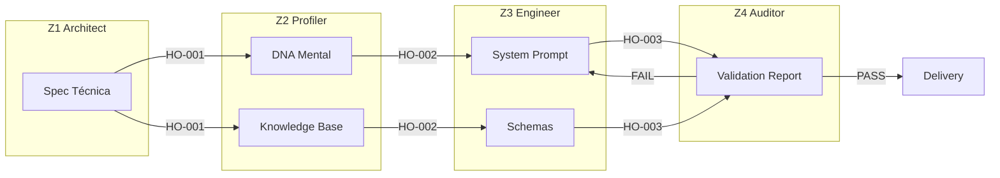

# Handoff Protocol — Z Squad

## 🎯 Propósito
Este documento define o **protocolo oficial de Handoff** (passagem de bastão) entre os módulos do Z Squad.

> *"Se não está escrito no shared_context, não aconteceu."*
> — Framework Multiagentes ExímIA

---

## 1. O Problema: Telephone Game

O maior risco em sistemas multiagente é a **perda de contexto** entre módulos. Se Z1 decide algo e Z3 não sabe, o resultado será inconsistente.

### Sintomas de Handoff Falho
- Z3 cria prompt que contradiz a spec do Z1
- Z4 testa cenários que não fazem sentido para o domínio
- Z5 propõe evolução que viola princípios do DNA Mental

---

## 2. Solução: Handoff Estruturado

Cada transição entre módulos deve seguir este protocolo:

### 2.1 Handoff Artifact Structure

```yaml
# handoff_payload.yaml

handoff_id: "HO-[YYYYMMDD]-[SEQ]"
timestamp: "[ISO 8601]"
from_module: "Z1_Architect"
to_module: "Z2_Profiler"

summary: |
  [Resumo executivo do que foi feito e decidido]

artifacts_produced:
  - path: "[caminho relativo ao arquivo produzido]"
    type: "[spec | dna | prompt | report]"
    status: "[complete | partial]"

key_decisions:
  - decision: "[Decisão tomada]"
    rationale: "[Por que foi decidido assim]"

open_questions:
  - "[Dúvida que o próximo módulo deve resolver]"

constraints_for_next:
  - "[Restrição que o próximo módulo deve respeitar]"

validation_criteria:
  - "[Como o próximo módulo deve validar seu trabalho]"
```

### 2.2 Exemplo de Handoff (Z1 → Z2)

```yaml
handoff_id: "HO-20260106-001"
timestamp: "2026-01-06T23:15:00Z"
from_module: "Z1_Architect"
to_module: "Z2_Profiler"

summary: |
  Especificação técnica do CFO Agent concluída. Domínio: Corporate Finance.
  3 competências core definidas (DCF, Comps, Risk Analysis).
  Clones sugeridos: Ray Dalio, Peter Drucker.

artifacts_produced:
  - path: "outputs/CFO_Agent/spec_tecnica.json"
    type: spec
    status: complete

key_decisions:
  - decision: "Focar em M&A, excluir Tax"
    rationale: "CEO quer agente especialista, não generalista"
  - decision: "Nível Expert para DCF"
    rationale: "Decisões de alto valor requerem máxima precisão"

open_questions:
  - "Qual o tom de comunicação preferido? (Técnico vs Acessível)"

constraints_for_next:
  - "Não incluir skills de Contabilidade operacional (out of scope)"
  - "Ray Dalio e Drucker são obrigatórios como mentores"

validation_criteria:
  - "DNA Mental deve cobrir os 3 domínios da spec"
  - "Knowledge Base deve incluir frameworks de Valuation"
```

---

## 3. Fluxo de Handoffs no Pipeline



---

## 4. Regras de Ouro

### DO's ✅
1. **Sempre escrever handoff_payload.yaml** antes de passar para o próximo módulo.
2. **Incluir key_decisions** — o próximo módulo não deve adivinhar.
3. **Listar constraints** — o que NÃO pode mudar.
4. **Ser explícito sobre open_questions** — melhor perguntar do que assumir.

### DON'Ts ❌
1. **Assumir que o próximo módulo "sabe"** — ele não sabe.
2. **Passar arquivos sem summary** — força o módulo a reler tudo.
3. **Omitir decisões controvérsas** — elas voltarão para assombrar.

---

## 5. Validação de Handoff

Antes de aceitar um handoff, o módulo receptor deve verificar:

| Checklist | Descrição |
| :--- | :--- |
| ☐ Artifacts existem? | Todos os arquivos listados estão no caminho indicado? |
| ☐ Summary faz sentido? | É possível entender o que foi feito sem ler os arquivos? |
| ☐ Constraints são claras? | O módulo sabe o que NÃO pode fazer? |
| ☐ Validation criteria existem? | O módulo sabe como validar seu próprio trabalho? |

**Se qualquer check falhar:** Devolver handoff para o módulo anterior com pedido de clarificação.

---

## 📚 Referência
- [Framework Multiagentes: 06_Processos_de_Orquestracao.md](../../Conteudo_sintetizado/Framework_Multiagentes_EximIA/06_Processos_de_Orquestracao.md)
- [Framework Multiagentes: 05_Fluxos_de_Comunicacao.md](../../Conteudo_sintetizado/Framework_Multiagentes_EximIA/05_Fluxos_de_Comunicacao.md)


---


<!-- ORACLE:OBSIDIAN_CONNECTIONS_START -->


## 🧠 Obsidian Connections


**Family:** [[Agentes]]


<!-- ORACLE:OBSIDIAN_CONNECTIONS_END -->

#galaxy-creation