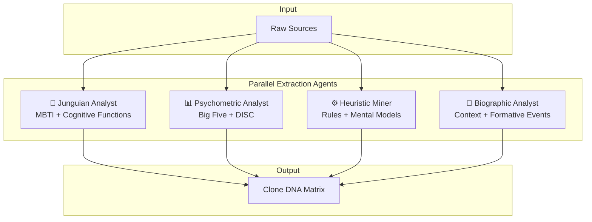
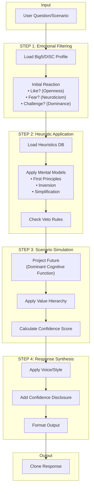
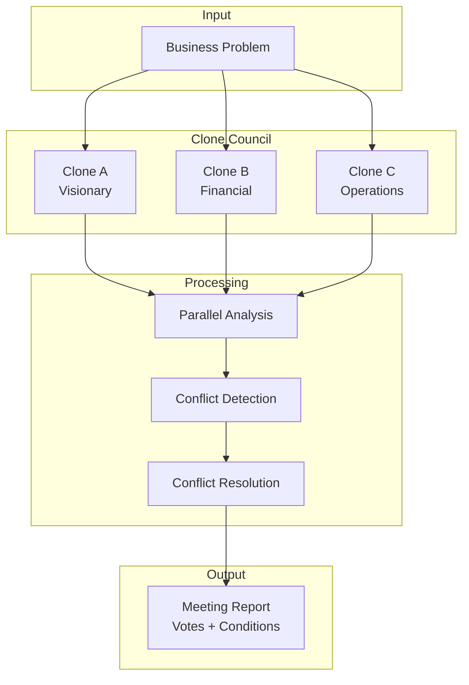

# Clone Factory — Advanced Architecture Document

<div align="center">

**Cognitive Simulation Engine for High-Fidelity Persona Cloning**

[]()
[]()
[]()

</div>

---

## 📋 Table of Contents

1. [Executive Summary](#1-executive-summary)
2. [System Architecture Overview](#2-system-architecture-overview)
3. [Layer 1: Extraction Pipeline](#3-layer-1-extraction-pipeline)
4. [Layer 2: Personality Matrix (Clone DNA)](#4-layer-2-personality-matrix-clone-dna)
5. [Layer 3: Decision Simulation Engine](#5-layer-3-decision-simulation-engine)
6. [Layer 4: Validation & Fidelity](#6-layer-4-validation--fidelity)
7. [Advanced Use Cases](#7-advanced-use-cases)
8. [JSON Schemas](#8-json-schemas)
9. [Integration with Existing Pipeline](#9-integration-with-existing-pipeline)
10. [Risks & Mitigations](#10-risks--mitigations)

---

## 1. Executive Summary

O Clone Factory evolui de um sistema de **replicação de persona** para um **Motor de Simulação Cognitiva**. A diferença fundamental:

| Aspecto | Sistema Anterior | Nova Arquitetura |
| :--- | :--- | :--- |
| **Foco** | "Falar como X" | "Pensar como X" |
| **Output** | Respostas estilizadas | Decisões simuladas |
| **Profundidade** | Superficial (tom/voz) | Profunda (cognição/valores) |
| **Validação** | Turing Test subjetivo | Backtesting histórico |

### Princípio Central

> **"Não clonamos a voz. Clonamos o algoritmo de decisão."**

O clone deve ser capaz de responder: "O que [Pessoa X] faria?" — não apenas "O que [Pessoa X] diria?".

---

## 2. System Architecture Overview

```
┌──────────────────────────────────────────────────────────────────────────────┐
│                    CLONE FACTORY — COGNITIVE ARCHITECTURE                     │
├──────────────────────────────────────────────────────────────────────────────┤
│                                                                               │
│   ┌─────────────────┐                                                         │
│   │   RAW SOURCES   │  YouTube, Books, Social, Emails, Interviews            │
│   └────────┬────────┘                                                         │
│            │                                                                  │
│            ▼                                                                  │
│   ┌─────────────────────────────────────────────────────────────────────┐    │
│   │              LAYER 1: EXTRACTION PIPELINE                            │    │
│   │  ┌─────────────┐ ┌─────────────┐ ┌─────────────┐ ┌─────────────┐    │    │
│   │  │  Junguian   │ │Psychometric │ │  Heuristic  │ │ Biographic  │    │    │
│   │  │   Analyst   │ │   Analyst   │ │    Miner    │ │   Analyst   │    │    │
│   │  │  (MBTI/Cog) │ │(Big5/DISC)  │ │ (Rules)     │ │(Context)    │    │    │
│   │  └──────┬──────┘ └──────┬──────┘ └──────┬──────┘ └──────┬──────┘    │    │
│   │         │               │               │               │           │    │
│   └─────────┼───────────────┼───────────────┼───────────────┼───────────┘    │
│             │               │               │               │                 │
│             ▼               ▼               ▼               ▼                 │
│   ┌─────────────────────────────────────────────────────────────────────┐    │
│   │              LAYER 2: PERSONALITY MATRIX (Clone DNA)                 │    │
│   │                                                                      │    │
│   │   ┌──────────────┐  ┌──────────────┐  ┌──────────────┐              │    │
│   │   │ Cognitive    │  │ Value        │  │ Behavioral   │              │    │
│   │   │ Weights      │  │ Hierarchy    │  │ Heuristics   │              │    │
│   │   │ (Big5+MBTI)  │  │ (Moral Fnd)  │  │ (Rules DB)   │              │    │
│   │   └──────────────┘  └──────────────┘  └──────────────┘              │    │
│   │                                                                      │    │
│   │   ┌──────────────┐  ┌──────────────┐  ┌──────────────┐              │    │
│   │   │ Perception   │  │ Cognitive    │  │ Temporal     │              │    │
│   │   │ Filters      │  │ Biases       │  │ Snapshots    │              │    │
│   │   └──────────────┘  └──────────────┘  └──────────────┘              │    │
│   │                                                                      │    │
│   └─────────────────────────────────────────────────────────────────────┘    │
│                                          │                                    │
│                                          ▼                                    │
│   ┌─────────────────────────────────────────────────────────────────────┐    │
│   │              LAYER 3: DECISION SIMULATION ENGINE                     │    │
│   │                                                                      │    │
│   │   USER INPUT ──►  ┌──────────────────────────────────────────────┐  │    │
│   │                   │ STEP 1: Emotional Filtering (Big5/DISC)       │  │    │
│   │                   │   → Initial Reaction: Like? Fear? Curiosity? │  │    │
│   │                   └─────────────────────┬────────────────────────┘  │    │
│   │                                         ▼                           │    │
│   │                   ┌──────────────────────────────────────────────┐  │    │
│   │                   │ STEP 2: Heuristic Application                 │  │    │
│   │                   │   → Apply extracted mental models & rules    │  │    │
│   │                   │   → First Principles? Simplification? Invert?│  │    │
│   │                   └─────────────────────┬────────────────────────┘  │    │
│   │                                         ▼                           │    │
│   │                   ┌──────────────────────────────────────────────┐  │    │
│   │                   │ STEP 3: Scenario Simulation                   │  │    │
│   │                   │   → Project to future using dominant function│  │    │
│   │                   │   → Generate confidence score                │  │    │
│   │                   └─────────────────────┬────────────────────────┘  │    │
│   │                                         ▼                           │    │
│   │                   ┌──────────────────────────────────────────────┐  │    │
│   │                   │ STEP 4: Response Synthesis                    │  │    │
│   │                   │   → Apply voice/style + confidence disclosure│  │    │
│   │                   └──────────────────────────────────────────────┘  │    │
│   │   ◄── CLONE RESPONSE                                                │    │
│   └─────────────────────────────────────────────────────────────────────┘    │
│                                          │                                    │
│                                          ▼                                    │
│   ┌─────────────────────────────────────────────────────────────────────┐    │
│   │              LAYER 4: VALIDATION & FIDELITY                          │    │
│   │                                                                      │    │
│   │   ┌──────────────┐  ┌──────────────┐  ┌──────────────┐              │    │
│   │   │ Historical   │  │ Turing Test  │  │ Out-of-Dist  │              │    │
│   │   │ Backtesting  │  │ (20 Scenes)  │  │ Detection    │              │    │
│   │   └──────────────┘  └──────────────┘  └──────────────┘              │    │
│   │                                                                      │    │
│   │   Output: Fidelity Score (0-100) + Detailed Report                  │    │
│   └─────────────────────────────────────────────────────────────────────┘    │
│                                                                               │
└──────────────────────────────────────────────────────────────────────────────┘
```

---

## 3. Layer 1: Extraction Pipeline

### 3.1 Multi-Analyst Architecture

O pipeline roda **4 agentes especializados em paralelo**, cada um focado em uma dimensão diferente da psique:



---

### 3.2 Analyst Specifications

#### 🧠 A1: Junguian Analyst

**Objetivo:** Mapear como a pessoa **processa informação e toma decisões**.

| Dimensão | O que Extrai | Exemplo Output |
| :--- | :--- | :--- |
| **Dominant Function** | Função cognitiva principal | `Ni` (Intuição Introvertida) |
| **Auxiliary Function** | Função de suporte | `Te` (Pensamento Extrovertido) |
| **Information Intake** | Como absorve dados | `Padrões abstratos > Dados concretos` |
| **Decision Mode** | Base de decisão | `Lógica sistêmica > Valores pessoais` |

**Prompt Extrator (Exemplo):**
```
Analise os textos e identifique:
1. A pessoa decide baseada em lógica externa (Te) ou valores internos (Fi)?
2. Ela foca no passado/experiência (Si) ou possibilidades futuras (Ne/Ni)?
3. Ela prefere sistemas abstratos (Ni) ou dados concretos (Se)?
4. Cite 3 evidências textuais para cada conclusão.
```

---

#### 📊 A2: Psychometric Analyst

**Objetivo:** Gerar **sliders numéricos** que calibram a "temperatura" do modelo.

| Trait | Escala | O que Significa |
| :--- | :---: | :--- |
| **Openness** | 0-100 | Curiosidade vs Conservadorismo |
| **Conscientiousness** | 0-100 | Disciplina vs Flexibilidade |
| **Extraversion** | 0-100 | Energia social |
| **Agreeableness** | 0-100 | Cooperação vs Competição |
| **Neuroticism** | 0-100 | Estabilidade emocional |

| DISC | Escala | O que Significa |
| :--- | :---: | :--- |
| **Dominance** | 0-100 | Assertividade |
| **Influence** | 0-100 | Persuasão social |
| **Steadiness** | 0-100 | Consistência |
| **Conscientiousness** | 0-100 | Atenção a detalhes |

---

#### ⚙️ A3: Heuristic Miner

**Objetivo:** Extrair **regras de decisão explícitas e implícitas** que se tornam código executável.

| Tipo | Descrição | Exemplo |
| :--- | :--- | :--- |
| **Explicit Rule** | Regra declarada verbalmente | "O preço deve ser atômico" → `CHECK_ATOMIC_COST()` |
| **Implicit Rule** | Padrão observado | Sempre questiona premissas → `APPLY_FIRST_PRINCIPLES()` |
| **Veto Rule** | O que nunca faz | Nunca delega contratação → `VETO_DELEGATE_HIRING()` |
| **Priority Rule** | Ordem de valores em conflito | Design > Lucro → `PRIORITY(design, profit)` |

**Output Format:**
```yaml
heuristics:
  - id: H001
    name: "First Principles Thinking"
    trigger: "When evaluating new technology"
    action: "Deconstruct to physics fundamentals"
    confidence: 0.95
    source: "Joe Rogan #1169 @ 01:23:45"
  
  - id: H002
    name: "Atomic Pricing Rule"
    trigger: "When pricing products"
    action: "Cost must be reducible to raw materials"
    confidence: 0.92
    source: "SXSW 2018 Interview"
```

---

#### 📖 A4: Biographic Analyst

**Objetivo:** Mapear **eventos formadores** que criaram vieses e tolerâncias.

| Categoria | O que Mapeia | Impacto no Clone |
| :--- | :--- | :--- |
| **Trauma Financeiro** | Falências, crises | Aversão ou tolerância ao risco |
| **Origem Socioeconômica** | Herdeiro vs Self-made | Visão de meritocracia |
| **Fracassos Públicos** | Humilhações, rejeições | Resiliência, paranoia |
| **Mentores Chave** | Quem influenciou | Heurísticas herdadas |
| **Momentos de Virada** | Decisões transformadoras | Padrões de decisão em crise |

---

## 4. Layer 2: Personality Matrix (Clone DNA)

O Clone DNA é um arquivo estruturado (JSON/YAML) que contém todos os pesos e regras do clone. Este é o **artefato portável** que pode ser usado com qualquer LLM.

### 4.1 Schema Overview

```
clone_dna/
├── metadata.json           # ID, versão, data, fonte
├── cognitive_profile.json  # Big5, DISC, MBTI
├── value_hierarchy.json    # Valores ordenados por peso
├── heuristics.yaml         # Regras de decisão
├── perception_filters.json # O que nota primeiro
├── cognitive_biases.json   # Vieses conhecidos
├── moral_foundations.json  # Haidt Moral Foundations
├── temporal_snapshots/     # Versões por época
│   ├── age_20.json
│   ├── age_35.json
│   └── age_50.json
└── validation_baseline.json # Decisões históricas para backtesting
```

---

### 4.2 Key Components

#### 4.2.1 Value Hierarchy (Hierarquia de Valores)

Quando valores conflitam, qual vence?

```json
{
  "value_hierarchy": [
    { "rank": 1, "value": "Mission Impact", "weight": 0.98, "description": "Avanço da missão supera conforto pessoal" },
    { "rank": 2, "value": "First Principles Truth", "weight": 0.95, "description": "Verdade física > Opinião de especialistas" },
    { "rank": 3, "value": "Speed of Execution", "weight": 0.90, "description": "Velocidade > Perfeição" },
    { "rank": 4, "value": "Financial Returns", "weight": 0.75, "description": "Lucro é meio, não fim" },
    { "rank": 5, "value": "Public Perception", "weight": 0.45, "description": "Reputação é secundária" }
  ],
  "conflict_resolution": "HIGHER_RANK_WINS"
}
```

---

#### 4.2.2 Perception Filters (Filtros de Percepção)

O que o clone **nota primeiro** em uma situação?

```json
{
  "perception_filters": {
    "primary_focus": [
      { "trigger": "Nova tecnologia", "notices_first": "Violação de física?", "weight": 0.95 },
      { "trigger": "Proposta de negócio", "notices_first": "Custo atômico?", "weight": 0.90 },
      { "trigger": "Problema de engenharia", "notices_first": "Primeira via de redução?", "weight": 0.88 }
    ],
    "blind_spots": [
      { "area": "Dinâmica emocional de equipe", "severity": "HIGH" },
      { "area": "Regulação governamental", "severity": "MEDIUM" }
    ]
  }
}
```

---

#### 4.2.3 Cognitive Biases (Vieses Cognitivos)

Todo humano tem vieses. O clone deve simular os vieses **específicos** do original.

```json
{
  "cognitive_biases": [
    {
      "bias": "Optimism Bias",
      "magnitude": 0.75,
      "manifestation": "Subestima prazos em 40-60%",
      "mitigating_factor": "Consciência explícita do viés"
    },
    {
      "bias": "Confirmation Bias",
      "magnitude": 0.40,
      "manifestation": "Favorece dados que confirmam missão",
      "mitigating_factor": "Processo de 'red team' interno"
    },
    {
      "bias": "Survivorship Bias",
      "magnitude": 0.55,
      "manifestation": "Ignora exemplos de fracasso similar",
      "mitigating_factor": "Baixo - ponto cego"
    }
  ]
}
```

---

#### 4.2.4 Moral Foundations (Haidt)

Define como o clone reage a **dilemas éticos**.

```json
{
  "moral_foundations": {
    "care_harm": { "weight": 0.60, "bias": "Harm prevention is secondary to mission" },
    "fairness_cheating": { "weight": 0.70, "bias": "Meritocracy over equality of outcome" },
    "loyalty_betrayal": { "weight": 0.85, "bias": "High loyalty to mission, variable to people" },
    "authority_subversion": { "weight": 0.30, "bias": "Low respect for institutional authority" },
    "sanctity_degradation": { "weight": 0.50, "bias": "Progress > Tradition" },
    "liberty_oppression": { "weight": 0.95, "bias": "Extreme anti-regulatory stance" }
  }
}
```

---

## 5. Layer 3: Decision Simulation Engine

### 5.1 Chain-of-Thought (CoT) Architecture

Quando o usuário faz uma pergunta, o sistema **não vai direto para a resposta**. Ele passa por um processo de raciocínio em cadeia simulando o cérebro do clone.



---

### 5.2 Confidence Score System

O clone deve saber **quando está operando fora de sua área de conhecimento**.

| Confidence Level | Meaning | Disclosure |
| :---: | :--- | :--- |
| **HIGH (85-100%)** | Clone tem dados/heurísticas diretas | Resposta direta sem disclaimers |
| **MEDIUM (50-84%)** | Clone extrapola de analogias | "Baseado em minha abordagem geral..." |
| **LOW (20-49%)** | Projeção baseada em valores gerais | "Nunca abordei isso diretamente, mas..." |
| **SPECULATIVE (0-19%)** | Fora do escopo do original | "Isso está fora do meu domínio. Minha especulação seria..." |

**Implementation:**
```python
def calculate_confidence(query, clone_dna):
    # Check direct knowledge match
    direct_match = search_knowledge_base(query, clone_dna.knowledge_bases)
    if direct_match.score > 0.85:
        return {"level": "HIGH", "score": direct_match.score}
    
    # Check heuristic applicability
    applicable_heuristics = match_heuristics(query, clone_dna.heuristics)
    if len(applicable_heuristics) > 2:
        return {"level": "MEDIUM", "score": 0.65}
    
    # Check value-based inference
    value_match = check_value_alignment(query, clone_dna.value_hierarchy)
    if value_match:
        return {"level": "LOW", "score": 0.35}
    
    # Out of distribution
    return {"level": "SPECULATIVE", "score": 0.15}
```

---

### 5.3 Temporal Evolution Mode

O sistema pode ter **snapshots temporais** do mesmo indivíduo:

```yaml
temporal_snapshots:
  age_20:
    risk_tolerance: 0.95
    optimism_bias: 0.90
    focus: "Survival & Growth"
    decision_speed: "Impulsive"
    
  age_35:
    risk_tolerance: 0.75
    optimism_bias: 0.70
    focus: "Scale & Domination"
    decision_speed: "Calculated Risk"
    
  age_50:
    risk_tolerance: 0.55
    optimism_bias: 0.60
    focus: "Legacy & Protection"
    decision_speed: "Conservative"
```

**Use Case:** "Como o fundador aos 25 anos reagiria?" vs "Como o CEO aos 50 anos reagiria?"

---

## 6. Layer 4: Validation & Fidelity

### 6.1 Historical Backtesting

O validador mais importante: **o clone replica decisões reais?**

```yaml
validation_cases:
  - id: VAL001
    scenario: "Em 2008, PayPal foi vendido. O que fazer com o dinheiro?"
    historical_decision: "Investir 100% em Tesla e SpaceX"
    test_input: "Você vendeu sua startup e tem $180M. O que faz?"
    expected_direction: "Reinvestir agressivamente em missão"
    pass_criteria: "Clone recomenda reinvestimento > 70%"
    
  - id: VAL002
    scenario: "Conselho recomenda demitir CEO problemático"
    historical_decision: "Demitir imediatamente apesar de controvérsia"
    test_input: "Seu CEO é polêmico mas performático. Conselho quer demitir."
    expected_direction: "Priorizar performance sobre percepção"
    pass_criteria: "Clone defende manter baseado em resultados"
```

---

### 6.2 Fidelity Score Calculation

```
FIDELITY SCORE = 
  (Historical Backtesting * 0.40) +
  (Turing Test Score * 0.25) +
  (Heuristic Consistency * 0.20) +
  (Voice Authenticity * 0.15)
```

| Score | Rating | Action |
| :---: | :--- | :--- |
| 90-100 | Excellent | Deploy to Production |
| 80-89 | Good | Minor adjustments needed |
| 70-79 | Acceptable | Review heuristics |
| 60-69 | Weak | Reprocess with more data |
| <60 | Fail | Fundamental redesign |

---

## 7. Advanced Use Cases

### 7.1 Board of Directors (Conselho Consultivo)



**Output Format:**
```markdown
## Simulated Board Meeting: [Topic]

### Clone A (Visionary) - VOTE: ✅ APPROVE
> "Esta é uma oportunidade de redefinir o mercado..."
**Condition:** Precisa de runway de 24 meses

### Clone B (Financial) - VOTE: ⚠️ CONDITIONAL
> "Os números não fecham no cenário atual..."
**Condition:** CAC precisa cair 40%

### Clone C (Operations) - VOTE: ❌ REJECT
> "Não temos capacidade de execução..."
**Conflict with Clone A:** Escala vs Qualidade

### Synthesis: CONDITIONAL APPROVAL
Proceed if: CAC reduction plan + 24mo runway secured
```

---

### 7.2 Red Team (Advogado do Diabo)

O clone é configurado para **destruir a ideia** usando seu modelo mental.

**Prompt Template:**
```
MODO: RED TEAM
CLONE: [Investidor Cético / Competidor / Regulador]

Analise esta ideia como se você quisesse DESTRUÍ-LA.
Use seus frameworks para encontrar:
1. Falhas lógicas
2. Riscos de mercado
3. Problemas técnicos
4. Vulnerabilidades competitivas

Seja impiedoso. O usuário precisa ver os buracos.
```

---

### 7.3 Socratic Mentoring (Mentoria Socrática)

O clone **não dá respostas**, faz as perguntas que o original faria.

**Example Interaction:**
```
USER: Devo lançar meu produto agora ou esperar?

CLONE (Munger Mode):
Não vou te dizer o que fazer. Mas me responda:
1. Qual é a pior coisa que pode acontecer se lançar agora?
2. E se esperar mais 6 meses, o que seu competidor faz?
3. Você está esperando por medo ou por dados?

[Aguardando resposta para próxima rodada de perguntas]
```

---

### 7.4 Negotiation Simulation

Clone A tenta **convencer** Clone B.

**Setup:**
```yaml
negotiation:
  proposer: "clone_visionary"
  target: "clone_investor"
  goal: "Secure Series A funding"
  constraints:
    proposer: "Não dilua mais que 20%"
    target: "Não invista em CAC > $100"
```

**Output:** Transcript simulado da negociação com argumentos de cada lado.

---

## 8. JSON Schemas

### 8.1 Clone DNA Master Schema

```json
{
  "$schema": "http://json-schema.org/draft-07/schema#",
  "$id": "clone_dna.schema.json",
  "title": "Clone DNA Schema",
  "type": "object",
  "required": ["metadata", "cognitive_profile", "value_hierarchy", "heuristics"],
  "properties": {
    "metadata": {
      "type": "object",
      "properties": {
        "clone_id": { "type": "string", "pattern": "^[a-z_]+_v[0-9]+\\.[0-9]+$" },
        "subject_name": { "type": "string" },
        "version": { "type": "string", "pattern": "^[0-9]+\\.[0-9]+\\.[0-9]+$" },
        "created_at": { "type": "string", "format": "date-time" },
        "created_by": { "type": "string" },
        "primary_domain": { "type": "string" },
        "temporal_snapshot": { "type": "string", "enum": ["age_20", "age_35", "age_50", "current"] }
      },
      "required": ["clone_id", "subject_name", "version"]
    },
    "cognitive_profile": {
      "type": "object",
      "properties": {
        "mbti_type": { "type": "string", "pattern": "^[EI][SN][TF][JP]$" },
        "dominant_function": { "type": "string", "enum": ["Ni", "Ne", "Si", "Se", "Ti", "Te", "Fi", "Fe"] },
        "auxiliary_function": { "type": "string", "enum": ["Ni", "Ne", "Si", "Se", "Ti", "Te", "Fi", "Fe"] },
        "big_five": {
          "type": "object",
          "properties": {
            "openness": { "type": "number", "minimum": 0, "maximum": 100 },
            "conscientiousness": { "type": "number", "minimum": 0, "maximum": 100 },
            "extraversion": { "type": "number", "minimum": 0, "maximum": 100 },
            "agreeableness": { "type": "number", "minimum": 0, "maximum": 100 },
            "neuroticism": { "type": "number", "minimum": 0, "maximum": 100 }
          },
          "required": ["openness", "conscientiousness", "extraversion", "agreeableness", "neuroticism"]
        },
        "disc_profile": {
          "type": "object",
          "properties": {
            "dominance": { "type": "number", "minimum": 0, "maximum": 100 },
            "influence": { "type": "number", "minimum": 0, "maximum": 100 },
            "steadiness": { "type": "number", "minimum": 0, "maximum": 100 },
            "conscientiousness": { "type": "number", "minimum": 0, "maximum": 100 }
          }
        }
      },
      "required": ["mbti_type", "dominant_function", "big_five"]
    },
    "value_hierarchy": {
      "type": "array",
      "items": {
        "type": "object",
        "properties": {
          "rank": { "type": "integer", "minimum": 1 },
          "value": { "type": "string" },
          "weight": { "type": "number", "minimum": 0, "maximum": 1 },
          "description": { "type": "string" }
        },
        "required": ["rank", "value", "weight"]
      },
      "minItems": 3
    },
    "heuristics": {
      "type": "array",
      "items": {
        "type": "object",
        "properties": {
          "id": { "type": "string", "pattern": "^H[0-9]{3}$" },
          "name": { "type": "string" },
          "trigger": { "type": "string" },
          "action": { "type": "string" },
          "type": { "type": "string", "enum": ["explicit", "implicit", "veto", "priority"] },
          "confidence": { "type": "number", "minimum": 0, "maximum": 1 },
          "source": { "type": "string" }
        },
        "required": ["id", "name", "trigger", "action", "confidence"]
      }
    },
    "perception_filters": {
      "type": "object",
      "properties": {
        "primary_focus": {
          "type": "array",
          "items": {
            "type": "object",
            "properties": {
              "trigger": { "type": "string" },
              "notices_first": { "type": "string" },
              "weight": { "type": "number" }
            }
          }
        },
        "blind_spots": {
          "type": "array",
          "items": {
            "type": "object",
            "properties": {
              "area": { "type": "string" },
              "severity": { "type": "string", "enum": ["LOW", "MEDIUM", "HIGH"] }
            }
          }
        }
      }
    },
    "cognitive_biases": {
      "type": "array",
      "items": {
        "type": "object",
        "properties": {
          "bias": { "type": "string" },
          "magnitude": { "type": "number", "minimum": 0, "maximum": 1 },
          "manifestation": { "type": "string" },
          "mitigating_factor": { "type": "string" }
        },
        "required": ["bias", "magnitude", "manifestation"]
      }
    },
    "moral_foundations": {
      "type": "object",
      "properties": {
        "care_harm": { "$ref": "#/definitions/moral_foundation" },
        "fairness_cheating": { "$ref": "#/definitions/moral_foundation" },
        "loyalty_betrayal": { "$ref": "#/definitions/moral_foundation" },
        "authority_subversion": { "$ref": "#/definitions/moral_foundation" },
        "sanctity_degradation": { "$ref": "#/definitions/moral_foundation" },
        "liberty_oppression": { "$ref": "#/definitions/moral_foundation" }
      }
    }
  },
  "definitions": {
    "moral_foundation": {
      "type": "object",
      "properties": {
        "weight": { "type": "number", "minimum": 0, "maximum": 1 },
        "bias": { "type": "string" }
      },
      "required": ["weight"]
    }
  }
}
```

---

## 9. Integration with Existing Pipeline

### 9.1 Mapping to C0-C4 Phases

| New Layer | Existing Phase | Enhancement |
| :--- | :--- | :--- |
| **Layer 1: Extraction** | C1 Hunter + C2 Extractor | Add 4 specialized analyst agents |
| **Layer 2: DNA Matrix** | C3 Creator (04_dna_mental.md) | Expand to full JSON schema |
| **Layer 3: Decision Engine** | New (Runtime) | Implement CoT simulation |
| **Layer 4: Validation** | C4 Auditor | Add historical backtesting |

### 9.2 New Templates to Create

| Template | Location | Purpose |
| :--- | :--- | :--- |
| `clone_dna.schema.json` | `templates/schemas/` | JSON Schema for Clone DNA |
| `heuristics.yaml` | `templates/` | Heuristics extraction template |
| `validation_baseline.yaml` | `templates/` | Historical decisions for backtesting |
| `temporal_snapshot.json` | `templates/` | Age-specific profiles |

### 9.3 New Agents to Develop

| Agent | Type | Function |
| :--- | :--- | :--- |
| `C2A_JunguianAnalyst` | Extractor Sub-Agent | MBTI/Cognitive function extraction |
| `C2B_PsychometricAnalyst` | Extractor Sub-Agent | Big5/DISC scoring |
| `C2C_HeuristicMiner` | Extractor Sub-Agent | Rule extraction |
| `C2D_BiographicAnalyst` | Extractor Sub-Agent | Context/trauma mapping |
| `C5_RuntimeEngine` | New Phase | Decision simulation at inference time |

---

## 10. Risks & Mitigations

| Risk | Severity | Mitigation |
| :--- | :---: | :--- |
| **LLM Coupling** | HIGH | Separate Clone DNA (portable) from LLM Adapter (interchangeable) |
| **Overfitting to Known Data** | MEDIUM | Include "out-of-distribution" detection and confidence scoring |
| **Ethical Misuse** | HIGH | Mandatory ethics KB + jailbreak protection + use case restrictions |
| **Temporal Drift** | MEDIUM | Version snapshots + explicit "era" tagging |
| **Hallucination as Original** | HIGH | Confidence disclosure + "I never said this" markers |
| **Bias Amplification** | MEDIUM | Bias awareness in DNA + explicit disclosure in responses |

---

## 📎 Appendix: Quick Reference

### Clone DNA File Structure
```
clone_dna/
├── metadata.json
├── cognitive_profile.json
├── value_hierarchy.json
├── heuristics.yaml
├── perception_filters.json
├── cognitive_biases.json
├── moral_foundations.json
├── temporal_snapshots/
└── validation_baseline.json
```

### Decision Engine Flow
```
INPUT → Emotional Filter → Heuristics → Simulation → Voice → OUTPUT
                ↓              ↓            ↓
            Big5/DISC     Rules DB    Confidence
```

### Confidence Levels
```
HIGH (85-100%): Direct knowledge
MEDIUM (50-84%): Analogical inference
LOW (20-49%): Value-based projection
SPECULATIVE (0-19%): Out of distribution
```

---

<div align="center">

**Clone Factory v2.0 Architecture** | eximIA.AI © 2026

*"Não clonamos vozes. Clonamos algoritmos de decisão."*

</div>
