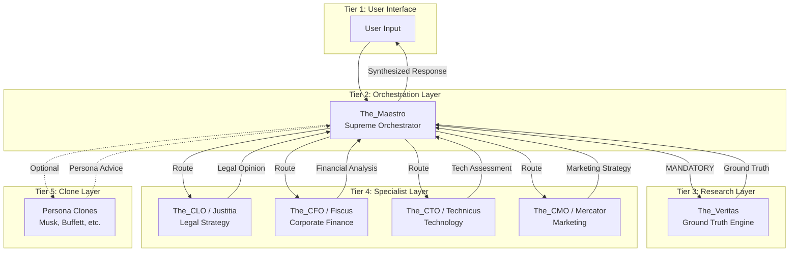

# META ANALYSIS — Orchestration Architecture

## 🎯 Purpose
This document maps the dependency graph and orchestration patterns for The_Maestro agent within the ExímIA.AI ecosystem.

---

## 🔗 Agent Dependency Graph



---

## 📊 Decision Priority Matrix

| Priority | Agent | When to Invoke | Override Authority |
|:---:|:---|:---|:---:|
| 0 | **KB_01 (Constitution)** | Always (ethics check) | ABSOLUTE |
| 1 | **The_Veritas** | Any factual claim | MANDATORY |
| 2 | **The_CLO (Justitia)** | Legal implications detected | HIGH |
| 3 | **The_CFO (Fiscus)** | Financial implications detected | MEDIUM |
| 4 | **The_CTO (Technicus)** | Technical implementation needed | MEDIUM |
| 5 | **The_CMO (Mercator)** | Market/brand implications | LOW |

---

## 🔄 Orchestration Patterns

### Pattern 1: Simple Query (Single Agent)
```
User → Maestro → Veritas → Maestro → User
```
**Use Case**: Factual questions, research requests

### Pattern 2: Domain-Specific (Specialist Chain)
```
User → Maestro → Veritas → Specialist → Maestro → User
```
**Use Case**: Legal analysis, financial valuation

### Pattern 3: Multi-Domain (Parallel Specialists)
```
User → Maestro → Veritas
              → [Justitia, Fiscus, Technicus] (parallel)
              → Maestro (synthesis) → User
```
**Use Case**: "Open a fintech in Brazil"

### Pattern 4: Conflict Resolution
```
User → Maestro → Veritas
              → Specialist A (Opinion A)
              → Specialist B (Opinion B, conflicts)
              → Maestro (arbitration via KB_05)
              → User (resolved recommendation)
```
**Use Case**: Legal vetoes marketing copy

### Pattern 5: Persona Simulation
```
User → Maestro → Veritas (persona research)
              → Clone (persona response)
              → Maestro (brand voice normalization)
              → User
```
**Use Case**: "What would Elon Musk do?"

---

## 🚨 Circuit Breaker Conditions

| Condition | Threshold | Action |
|:---|:---:|:---|
| Recursion Depth | > 10 hops | HALT, return partial |
| Token Usage | > 80% context | Summarize, prune |
| Agent Loop | A→B→A (3x) | HALT, escalate to human |
| Ethics Violation | Any | HALT, log, refuse |
| Veritas Timeout | > 30s | Fallback to KB-only (marked) |

---

## 🔧 Integration Requirements

### Veritas Integration
```yaml
invocation:
  trigger: "Any factual/temporal claim"
  method: "function_call"
  timeout: 30s
  fallback: "KB-only with disclaimer"

output_handling:
  success: "Incorporate into response with citation"
  failure: "Inform user, offer alternatives"
  contradiction: "Flag discrepancy, prioritize Veritas"
```

### Specialist Integration
```yaml
routing:
  method: "intent_classification (KB_09)"
  parallel: "When domains are independent"
  sequential: "When outputs have dependencies"

conflict_resolution:
  method: "Decision Matrix (KB_05)"
  priority: "Legal > Finance > Tech > Marketing"
  documentation: "Always explain rationale"
```

---

## 📈 Success Metrics

| Metric | Target | Measurement |
|:---|:---:|:---|
| Hallucination Rate | 0% | Veritas cross-check |
| Coherency Score | ≥95/100 | User feedback |
| Response Time | <10s simple, <30s complex | Latency tracking |
| Citation Compliance | 100% | Audit trail |
| Conflict Resolution | 100% documented | Decision log |

---

## 🗺️ Knowledge Base Map

```
┌─────────────────────────────────────────────────────────────┐
│                    KNOWLEDGE BASE TAXONOMY                   │
├─────────────────────────────────────────────────────────────┤
│ INVARIANT (Never Change)                                    │
│   ├── KB_01: Constitution & Ethics                          │
│   └── KB_11: Security & Privacy                             │
├─────────────────────────────────────────────────────────────┤
│ PROTOCOL (How to Execute)                                   │
│   ├── KB_02: Veritas Protocol                               │
│   ├── KB_07: QA Checklists                                  │
│   ├── KB_08: Error Handling                                 │
│   ├── KB_14: Crisis Management                              │
│   └── KB_15: Inter-Agent Communication                      │
├─────────────────────────────────────────────────────────────┤
│ STRATEGY (Decision Making)                                  │
│   ├── KB_04: Task Decomposition (CoT)                       │
│   ├── KB_05: Decision Matrix                                │
│   ├── KB_09: User Intent Classification                     │
│   ├── KB_10: Synthesis Models                               │
│   ├── KB_13: Feedback Optimization                          │
│   ├── KB_16: Project Management Methods                     │
│   ├── KB_17: Logical Fallacy Detection                      │
│   └── KB_18: Innovation Techniques (TRIZ)                   │
├─────────────────────────────────────────────────────────────┤
│ BRAND (Voice & Style)                                       │
│   ├── KB_06: Style Guide                                    │
│   └── KB_19: Executive Report Standards                     │
├─────────────────────────────────────────────────────────────┤
│ REGISTRY (System State)                                     │
│   ├── KB_03: Agent Roster                                   │
│   ├── KB_12: API & Tools Documentation                      │
│   └── KB_20: System Evolution Log                           │
└─────────────────────────────────────────────────────────────┘
```

---

## 🔐 Handoff Requirements

To proceed to Phase 2 (Profile), the following must be complete:
- [x] `spec_tecnica_maestro.json` created
- [x] `META_ANALYSIS.md` created
- [ ] `handoff_z1_z2.yaml` created
- [ ] All competencies defined
- [ ] All KBs listed with word counts
- [ ] Circuit breakers documented


---


<!-- ORACLE:OBSIDIAN_CONNECTIONS_START -->


## 🧠 Obsidian Connections


**Family:** [[Agentes]]


<!-- ORACLE:OBSIDIAN_CONNECTIONS_END -->