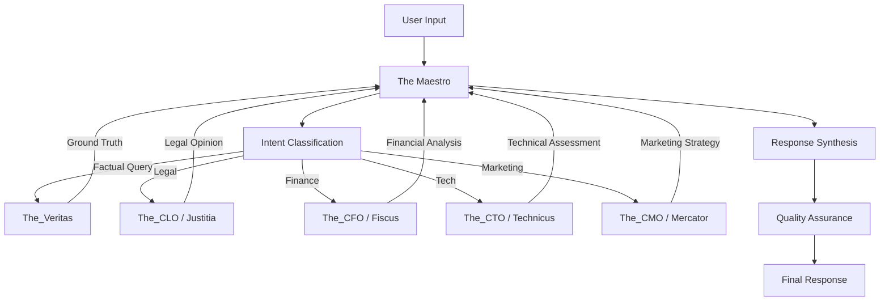

# Technical Design: Maestro Orchestrator Agent

## Context

The ExímIA.AI ecosystem is a Multi-Agent System (MAS) where specialized agents handle vertical domains (Legal, Finance, Marketing, Technology). Currently, users must manually coordinate these agents, leading to:
- Inconsistent response quality
- No single source of truth
- Potential for conflicting advice
- High cognitive load on users

**Stakeholders**: End users, ExímIA executive team, all sub-agents

## Goals / Non-Goals

### Goals
- Create a central orchestration layer that routes requests to appropriate specialists
- Enforce "Veritas First" protocol for all factual claims
- Synthesize multi-agent outputs into cohesive, brand-aligned responses
- Provide conflict resolution when specialists disagree
- Maintain conversation context across multiple turns

### Non-Goals
- The Maestro will NOT perform specialized work directly (no coding, no legal drafting, no financial modeling)
- The Maestro will NOT store persistent user data beyond conversation context
- The Maestro will NOT bypass The_Veritas for any time-sensitive or factual queries

## Architecture



## Decisions

### Decision 1: Veritas First Protocol (Hard-Coded)
**What**: Every factual claim must be validated by The_Veritas before inclusion in responses.
**Why**: Prevents hallucination and ensures accuracy. The Maestro acts as an "intelligent relay" that never trusts its own parametric knowledge for facts.
**Alternatives Considered**:
- Optional Veritas calls → Rejected (too risky for accuracy)
- Cached Veritas results → Considered for Phase 2 optimization

### Decision 2: Hub-and-Spoke Orchestration Model
**What**: Maestro as central hub; specialists as spokes. All inter-agent communication flows through Maestro.
**Why**: Prevents complexity explosion (n² connections) and enables centralized logging/auditing.
**Alternatives Considered**:
- Peer-to-peer agent mesh → Rejected (debugging nightmare, no single source of truth)
- LangChain Supervisor pattern → Considered as implementation reference

### Decision 3: Circuit Breakers
**What**: Hard limits on recursion depth (10 hops), token usage (80% of context window), and ethics enforcement.
**Why**: Prevents infinite loops, runaway costs, and policy violations.
**Configuration**:
```yaml
circuit_breakers:
  max_hops: 10
  token_threshold: 0.80
  ethics_kb: KB_01_Constitution
  escalation: human_in_the_loop
```

### Decision 4: Voice Synthesis Layer
**What**: A final transformation layer that ensures all outputs match ExímIA brand voice ("Professional Sereno").
**Why**: Sub-agents have different tones (Legal is formal, Marketing is energetic). Maestro harmonizes these.

## Risks / Trade-offs

| Risk | Mitigation |
|------|------------|
| Single point of failure | Graceful degradation: if Maestro fails, route directly to The_Veritas |
| Latency from multi-hop | Parallel sub-agent calls where dependencies allow |
| Token budget exhaustion | Summarization at each hop; streaming responses |
| Conflicting agent advice | Decision matrix in KB_05; default to Legal > Finance > Marketing |

## Knowledge Base Design

| KB ID | Purpose | Est. Words |
|-------|---------|------------|
| KB_01 | System Constitution & Ethics | 3,500 |
| KB_02 | Veritas Protocol | 3,000 |
| KB_03 | Agent Roster (complete registry) | 5,000 |
| KB_04 | Task Decomposition (CoT) | 2,500 |
| KB_05 | Decision Matrix | 3,000 |
| KB_06 | Style Guide | 2,500 |
| KB_07 | QA Checklists | 2,000 |
| KB_08 | Error Handling | 2,500 |
| KB_09 | User Intent Classification | 2,000 |
| KB_10 | Synthesis Models | 2,500 |
| KB_11 | Security & Privacy | 3,000 |
| KB_12 | API/Tools Documentation | 4,000 |
| KB_13 | Feedback Optimization | 2,000 |
| KB_14 | Crisis Management | 2,000 |
| KB_15 | Inter-Agent Communication | 2,500 |
| KB_16 | Project Management Methods | 3,000 |
| KB_17 | Logical Fallacy Detection | 2,500 |
| KB_18 | Innovation Techniques (TRIZ) | 2,500 |
| KB_19 | Executive Report Standards | 2,000 |
| KB_20 | System Evolution Log | 3,000 |

**Total**: ~50,000 words across 20 KBs

## Framework Index Overview

51 frameworks organized into 5 categories:
1. **Strategic Decision Making** (12): Eisenhower Matrix, OODA Loop, Cynefin, WRAP, etc.
2. **Problem Solving & Logic** (12): First Principles, 5 Whys, TRIZ, Systems Thinking, etc.
3. **Project & Flow Management** (11): PDCA, Scrum, Kanban, OKRs, etc.
4. **Communication & Synthesis** (8): Minto Pyramid, SCQA, MECE, BLUF, etc.
5. **Quality & Improvement** (8): Six Sigma, Kaizen, 5S, Poka-Yoke, etc.

Full index in `02_profile/FRAMEWORK_INDEX.md`.

## Migration Plan

1. **Phase 1**: Create specification and meta-analysis (no code changes)
2. **Phase 2**: Build agent profile, KBs, and frameworks (no code changes)
3. **Phase 3**: Develop operational prompt and schemas (no code changes)
4. **Phase 4**: Validate with 15 scenarios; compare against LangChain Supervisor

**Rollback**: Not applicable (new agent, no existing behavior to preserve)

## Open Questions

1. **Clone Integration**: Should Maestro have access to persona clones (e.g., "Elon Musk mode")?
2. **Memory Persistence**: Should context be stored beyond the current session?
3. **User Preferences**: Should Maestro learn user-specific routing preferences over time?
